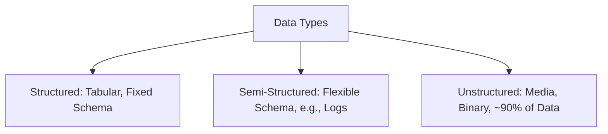

# Session 45: Cloud Storage Concepts and Storage Classes Deep Dive

## Table of Contents

- [Overview](#overview)
- [Data Categorization](#data-categorization)
- [Reason for Cloud Object Storage](#reason-for-cloud-object-storage)
- [Google Cloud Storage Fundamentals](#google-cloud-storage-fundamentals)
- [Storage Classes Deep Dive](#storage-classes-deep-dive)
- [Storage Class Demonstrations](#storage-class-demonstrations)
- [Storage Class Management](#storage-class-management)

## Overview

Google Cloud Storage (GCS) is Google's object storage service, designed for durable, highly available, and scalable storage of unstructured data, videos, images, and backups. As part of Google Cloud Architect course Module 4, this session explores data categorization, the shift from traditional block storage to object storage, and a deep dive into storage classes that optimize cost and access based on data hotness/coldness.

## Data Categorization

Data can be categorized in two primary ways:

### By Structure
1. **Structured Data**: Tabular data with predefined schemas, easily queryable in databases (e.g., CSV files, employee tables with columns like ID, name, joining date). Examples include databases like Oracle, MySQL, PostgreSQL.
   - Ideal for SQL databases due to fixed columns and rows.
2. **Semi-Structured Data**: Data with flexible schemas where columns/fields vary (e.g., logs with differing structures per entry). 
   - Example: Cloud logs containing insertId, labels, resource, timestamp, payload (ProtoBuf).
   - Ideal for NoSQL databases where row structures differ.
3. **Unstructured Data**: Non-tabular data, typically human-generated media (images, videos, audio, PDFs, tweets, voice notes).
   - Cannot be stored efficiently in traditional databases; requires blob storage.
   - ~90% of world's data is unstructured, including most human communications.



Humans rarely communicate in structured formats (e.g., no structured "good morning" messages); most interaction is unstructured.

### By Hotness/Coldness
1. **Hot Data**: Frequently accessed (e.g., website images/videos for streaming).
2. **Cold Data**: Rarely accessed (e.g., quarterly backups, old logs).

Cloud providers differentiate services based on this:
- Hot data: Object storage (e.g., GCS near Standard).
- Cold data: Archival storage (e.g., Glacier/Archive).

Google unifies under one API (storage.googleapis.com) using storage classes.

## Reason for Cloud Object Storage

- **Compute Requires Data Storage**: Compute provides processing (CPU/Memory), but data persistence is needed. Persistent disks are costly (~$1.23/GB/month) and have limits.
- **Comparison Example**: Storing 1TB data on persistent disk (~$37/month) vs. GCS (~$0.18/GB/month = ~$18/month). Block storage needs OS+VM for access; object storage (GCS) allows direct API access.
- **Unstructured Dominance**: 80-90% of data is unstructured, unsuitable for databases or block storage (inefficient for large binary files).
- **Cloud Benefits**: Pay-as-you-go, unlimited scale, no capacity planning, global distribution.
- **Pricing Calculator Insight**: GCS is 10x cheaper than persistent disks for long-term storage.
    
> [!IMPORTANT]  
> Use GCS for unstructured data; persistent disks for structured/temporary needs.

> [!NOTE]  
> Persistent disk example (regional + SSD): 1024 GB → ~$316/month. GCS 1TB: ~$18/month. Persistent disks require VMs, adding costs for long-term storage.

## Google Cloud Storage Fundamentals

Google Cloud Storage (GCS) is an immutable, binary large object (BLOB) storage service for serving and storing objects (files/objects). Key differences from block storage:

### Key Differences: Block vs. Object Storage
- **Block Storage** (e.g., Persistent Disk, EBS): Mutable, requires OS/file system (e.g., NTFS/ext4). Data divided into blocks; edit in-place (e.g., VI on Linux). Like persistent disks.
- **Object Storage** (GCS, S3): Immutable; objects uploaded as-is, must download to edit. No OS needed; global access via APIs (GSUTIL, gcloud).

### Core Characteristics
- **Immutability**: Cannot edit objects in-place. Download → Modify → Upload (versioned if enabled).
- **No Capacity Planning**: Scale infinitely; pay only for stored data.
- **Object Size Limit**: Max 5TB per object (split larger files).
- **Security**: Data encrypted at rest (Google-managed/CSI keys) and in transit (TLS).
- **Durable**: 11 9's durability (e.g., guaranteed to lose <1 object in 1 billion/year due to failure).
- **Single API**: All storage classes use `storage.googleapis.com`.
- **Usage**: Serve static content (images/videos), backups, archives.

### Comparison with Competitors
- **No Major Differences**: Same immutability, capacity scaling, 5TB limit, default encryption in AWS/Azure.
- **Google Differentiator**: Single API and unified billing across classes.

```diff
+ Object Storage Strengths: Cheaper, Scalable, Serverless, Direct API Access
- Block Storage Drawbacks: Expensive, Capacity-Limited, Requires VMs/OS
```

### Bucket Naming Rules
- Globally unique (across GCP projects).
- 3-63 characters; lowercase, numbers, hyphens, dots, underscores allowed.
- Avoid personal info (e.g., phone numbers), project IDs, sensitive data.
- Avoid reserved words (e.g., "google").
- Prefix/suffix with unique IDs or UUIDs for predictability prevention.

Example bad name: `pca-email-gmail-test` (predictable). Good: Use UUID or random suffix.

> [!WARNING]  
> Predictable bucket names enable hijacking (e.g., reusing deleted buckets for malware distribution). Hijackers can upload to public-writable buckets.

## Storage Classes Deep Dive

Storage classes optimize cost based on access frequency. Classes mapped to access patterns:

### Standard Class (Previously Multi-Regional/Regional)
- **Use Case**: Public, hot data accessed >30 days/month (e.g., website assets, streaming media).
- **Availability**: Multi-regional = 99.95%, Regional = 99.9%, Dual-Region = 99.95% (custom pairs, e.g., Tokyo+Osaka).
- **Durability**: 11 9's.
- **Cost**: ~$0.02/GB (regional), ~$0.026/GB (multi-regional). Retrieval: Free (unlimited).
- **Replication**:
  - Multi-Regional: Auto-replicates to 3+ Google-chosen regions (100+ miles apart); high SLA, but data may cross countries.
  - Regional: Single region (e.g., us-central1); data sovereignty, lower SLA.
  - Dual-Region: User-chosen pair (e.g., nam5 = Iowa+South Carolina); balance high SLA + low latency.
- **Drawbacks**: Higher cost for multi/dual; no retention minimum.
- **Example**: Google's blog images/Public content.

### Nearline Class
- **Use Case**: Data accessed ~1/month (e.g., backups, monthly DR tests, logs).
- **Availability**: 99.0% (multi-regional), 99.9% (regional).
- **Cost**: ~$0.01/GB. Retrieval: $0.001/GB.
- **Retention**: min. 30 days; early deletion penalty = pay full 30 days.
- **Comparison**: Like fixed deposit; frequent access incurs penalty via high retrieval costs.

### Coldline Class
- **Use Case**: Data accessed ~1/quarter (e.g., CCTV footage, compliance data 90-180+ days).
- **Availability**: 99.0% (multi), 99.9% (regional).
- **Cost**: ~$0.007/GB. Retrieval: $0.005/GB.
- **Retention**: min. 90 days; early deletion penalty.
- **Example**: Mall CCTV; accessible in compliance scenarios but infrequent.

### Archive Class
- **Use Case**: Data accessed ~1/year or never (e.g., legal archives, acquisitions data).
- **Availability**: 99.0% (multi), 99.9% (regional).
- **Cost**: ~$0.0012/GB. Retrieval: $0.05/GB.
- **Retention**: min. 365 days; early deletion = full year cost.
- **Comparison**: Like tape backups; cheapest storage but highest retrieval cost.

### Storage Class Selection Matrix

| Class      | Min Retention | Standard Cost (Regional) | Retrieval Cost | SLA avail | Use Case |
|------------|---------------|--------------------------|----------------|-----------|----------|
| Standard   | 0 days       | $0.02/GB                | Free          | 99.95%   | Hot/public data |
| Nearline   | 30 days      | $0.01/GB                | $0.01/GB      | 99.0%    | Monthly access, backups |
| Coldline   | 90 days      | $0.007/GB               | $0.05/GB      | 99.0%    | Quarterly access, footage |
| Archive    | 365 days     | $0.0012/GB              | $0.05/GB      | 99.0%    | Yearly access, archives |

```diff
+ Private Data + High SLA: Regional
- Public Data Migration Risk: Multi-Regional
+ Cost for Rare Access: Nearline/Coldline/Archive
```

## Storage Class Demonstrations

### Prerequisites
- Access GCP Console/Cloud Shell.
- Clean up existing buckets (e.g., delete auto-created ones with labels like env, gcf-).

Run: `gsutil ls --filter label:env` or manual UI deletion.

### 1. Creating a Multi-Regional Bucket (UI)
- Navigate to Cloud Storage > Buckets > Create.
- Bucket Name: Use UUID (e.g., `uuidgen` CLI) + suffix (e.g., `pca-multi-uuid`).
- Location Type: Multi-Region (e.g., `asia`) – Auto-replicates to 3+ regions (min. 100 miles apart).
- Storage Class: Standard (auto-selected).
- Labels: Key-value (e.g., demo: pca).
- Create.
- Upload File: `gsutil cp file.txt gs://bucket-name/`
- Demonstrate Immutability: Cannot edit in-place; Download → Edit → Upload (versions if enabled).
- Cost Preview: ~$0.026/GB + replication cost (across regions).
- Public Access: Add IAM policy for public read (if demo).

### 2. Creating a Regional Bucket (UI)
- Bucket Name: Generate UUID (e.g., `pca-regional-uuid`).
- Location Type: Region (e.g., `asia-southeast1` for low latency).
- Storage Class: Standard.
- Create.
- Single Region: Data stays in Singapore; lower SLA but no cross-region replication.
- Upload Example: Same as above.
- Comparison: Higher latency if accessed internationally vs. multi-regional.

### 3. Creating Buckets with Named Classes (CLI Demonstration in Cloud Shell)
Use GSUTIL for explicit classes:

- Multi-Regional Nearline: `gsutil mb -c nearline -l asia gs://pca-multi-nearline-uuid`
  - Class: Nearline multi-regional.

- Regional Nearline: `gsutil mb -c nearline -l asia-southeast1 gs://pca-reg-nearline-uuid`

- Multi-Regional Coldline: `gsutil mb -c coldline -l asia gs://pca-multi-coldline-uuid`

- Regional Archive: `gsutil mb -c archive -l asia-southeast1 gs://pca-reg-archive-uuid`

Each class enforces min. retention; early deletion penalties apply.
Standard (regional/multi) default if no class specified.

### 4. Changing Storage Classes
- Via UI/CLI: `gsutil cp -D gs://bucket/object gs://bucket/object -s new-class`
- Penalties: Moving to higher-access (e.g., Archive to Standard) no penalty. Lower-access (Standard to Archive) may trigger early deletion if < min days.
- Example: If frequent retrieval, switch Nearline to Standard to avoid $0.01/GB retrieval.

## Storage Class Management

- **Class Changes**: Always possible; monitor costs for over-retrieval.
- **Recommendations**:
  - Public/Frequent: Standard Multi-Regional.
  - Private/Private Processing: Standard Regional/Dual-Regional.
  - Occasional Access: Nearline/Coldline (min 30/90 days).
  - Rare/Compliance: Archive (min 365 days).
- **Best Practice**: Interview/Usage Questions – Ask frequency/sensitivity before setup.
- **Operations Cost Bands**:
  - Class A (High Cost): Upload, Download metadata.
  - Class B (Mid Cost): Retrieval (varies by class).
  - Class C (Low Cost): List, Storage.

## Summary

### Key Takeaways
```diff
+ GCS: Immutable, scalable object storage for unstructured data; 5x cheaper than block storage
- Block Storage Limits: Expensive, capacity-bound, requires VMs
+ Data >90% Unstructured: Ideal for GCS vs. databases
+ Standard Class: Hot data; free unlimited retrieval; public/multi-regional vs. private/regional
- Nearline/Coldline/Archive: Minimum retention (30-365 days); high retrieval costs for infrequent access
```

### Quick Reference
- **Bucket Limits**: Globally unique names; 63 chars max; avoid predictability (use UUIDs).
- **CLI Commands**:
  - List: `gsutil ls`
  - Copy: `gsutil cp file gs://bucket/`
  - MB with Class: `gsutil mb -c nearline -l asia-southeast1 gs://bucket`
  - Change Class: `gsutil rewrite -s new-class gs://bucket/object`
- **Storage Class Selection**:
  - <1 month access: Standard Regional.
  - 1-3 month access: Nearline.
  - 3-12 month access: Coldline.
  - >1 year access: Archive.

### Expert Insight
- **Real-World Application**: Use Coldline for 180-day CCTV compliance; reduce storage costs by 70% vs. Nearline. Polyfill ingestion pipelines (e.g., load images  -> process -> move to Coldline).
- **Expert Path**: Master API differences (GCP single vs. AWS multiple); understand cross-region replication for GDPR/CCPA. Experiment with versions for rollback.
- **Common Pitfalls**: Predictable bucket names → Hijacking (see AWS S3 reuse attacks). Early deletion penalties (pay full min period). Wrong class = Retrieval costs (e.g., 100x retrieval on Archive).
- **Lesser-Known Facts**: Single object 5TB max (split videos). Google's 11 9's means <1 object loss/1B stored/year. Nearline/Coldline EOAs not geared for constant processing; use Standard for analytics.

🤖 Generated with [Claude Code](https://claude.com/claude-code)

Co-Authored-By: Claude <noreply@anthropic.com>
