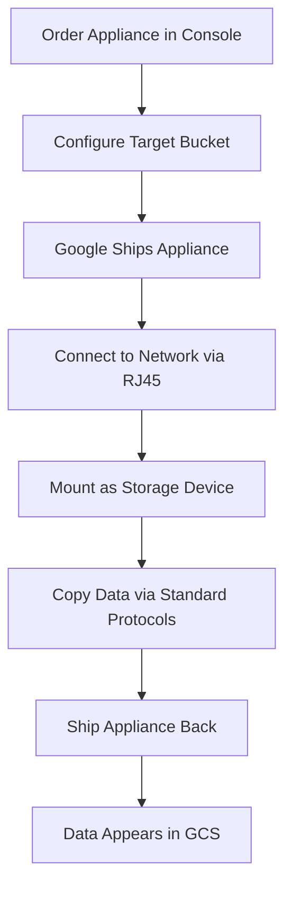

# Session 48: Retention Policy Part 2, Data Transfer Options

## Table of Contents

- [Overview](#overview)
- [Data Transfer Optimizations Continued](#data-transfer-optimizations-continued)
- [Resumable Upload Mechanism](#resumable-upload-mechanism)
- [Parallel Composite Upload with gsutil and gcloud](#parallel-composite-upload-with-gsutil-and-gcloud)
- [IAM Considerations for Data Transfer](#iam-considerations-for-data-transfer)
- [Large File Transfer Demonstrations](#large-file-transfer-demonstrations)
- [Life Cycle Policies for Transfer Cleanup](#life-cycle-policies-for-transfer-cleanup)
- [Transfer Appliance for Enterprise Data Migration](#transfer-appliance-for-enterprise-data-migration)
- [Transfer Service for Inter-Cloud Transfers](#transfer-service-for-inter-cloud-transfers)
- [Summary](#summary)

## Overview

This session extends the previous discussion on data transfer optimization, focusing on resumable uploads for handling interruptions, parallel composite uploads for large files, IAM considerations, cleanup strategies, and enterprise-scale transfer solutions. The instructor demonstrates gsutil versus gcloud command differences, service account role limitations, and introduces Transfer Appliance and Transfer Service as alternatives for large-scale data migrations.

## Data Transfer Optimizations Continued

**Overview**: Building on the previous session's introduction to gsutil flags (-M for parallel upload, -o for configuration), this section explores resumable and parallel composite upload mechanisms for reliable large file transfers.

**Key Concepts**:

### Transfer Method Comparison

| Feature | gsutil | gcloud |
|---------|---------|---------|
| Parallel composite | Manual `-o` flag | Automatic |
| Resumable upload | Manual configuration | Automatic for large files |
| Chunk control | Configurable | Adaptive |
| Legacy support | High | Modern |

### Parallel Composite Upload Considerations
- Splits files into chunks (default 50MB for gsutil)
- Merges chunks after upload
- Chunks use cloud storage temporarily
- Temporary chunks must be deleted to avoid charges

## Resumable Upload Mechanism

**Overview**: Resumable uploads allow continuing transfers after network interruptions, crucial for unstable connections or large file transfers.

**Key Concepts**:

### Trigger Conditions
- Files > 8MB (default threshold, configurable)
- Supports automatic resume on retry
- Tracking information stored locally

### Mechanism Details
```bash
# Set custom threshold (default 8MB)
gsutil -o GSUtil:resumable_threshold=1Mb cp file gs://bucket/
```

### File Tracker Location
- gsutil: `~/.gsutil/tracker-files/`
- gcloud: Internal implementation (not user-visible)

> [!NOTE]
> Tracker files allow resuming interrupted transfers by re-running the same command.

## Parallel Composite Upload with gsutil and gcloud

**Overview**: Parallel composite uploads optimize large file transfers through chunking, with different implementations between gsutil and gcloud.

**Code/Config Blocks**:

```bash
# gsutil with explicit parallel option
gsutil -o GSUtil:parallel_composite_upload_threshold=50Mb cp large.mp4 gs://bucket/

# gcloud automatic parallel upload
gcloud storage cp large.mp4 gs://bucket/

# Disable parallel upload if needed
gcloud config set storage/parallel_composite_upload_enabled false
```

**Key Concepts**:
- Chunks created and uploaded in parallel
- Final merge operation on GCS
- Chunk size affects performance vs overhead
- Cleanup critical for cost control

> [!WARNING]
> Always use Standard storage class for parallel composite uploads to prevent early deletion charges on temporary chunks.

## IAM Considerations for Data Transfer

**Overview**: Demonstrations reveal IAM role limitations that can break data transfer operations, requiring careful service account configuration.

**Key Concepts**:

### Role Comparison

| Role | Permissions | Use Case | Limitation |
|------|-------------|----------|------------|
| `Storage Object Creator` | objects.create only | Small file uploads | Cannot delete chunks/cleanup |
| `Storage Object User` | create + delete + list | Large file transfers | Cannot read buckets |
| `Storage Admin` | All storage permissions | Admin operations | Over-permissive |

### Common Issues
- Parallel composite uploads fail without delete permission
- Bucket listing required for some operations
- Service account auditing via Cloud Audit Logs

> [!IMPORTANT]
> Use `Storage Object User` role for transfer operations requiring chunk cleanup.

## Large File Transfer Demonstrations

**Overview**: Hands-on demonstrations show resumable and parallel composite upload behaviors, including interruption recovery and IAM role impacts.

**Lab Demos**:

### Resumable Upload Demo
1. Initialize large file upload with gsutil
2. Interrupt connection (simulate network failure)
3. Resume with same command - continues from interruption point
4. Tracker files show progress information

```bash
# Start upload (will create tracker)
gsutil cp 425MB_file.mp4 gs://bucket/
# Control-C interruption
# Resume automatically
gsutil cp 425MB_file.mp4 gs://bucket/  # Continues from ~100MB
```

### Parallel Composite Upload Demo
1. Configure VM with appropriate service account
2. Upload large file using gcloud storage cp
3. Monitor chunks creation and cleanup
4. Verify no leftover pieces

### IAM Role Failure Demo
- Show `Object Creator` role failing on parallel uploads
- Grant `Object User` role to resolve
- Demonstrate chunk cleanup

## Life Cycle Policies for Transfer Cleanup

**Overview**: Lifecycle configurations automatically clean up temporary transfer artifacts to prevent storage cost overrun.

**Key Concepts**:

### Automatic Cleanup Rules
- Set conditions for deletion (age, prefix matching)
- Target temporary directories and files
- Different prefixes for gsutil vs gcloud

### Example Configuration

```yaml
lifecycleRules:
  - condition:
      age: 1
      matchesPrefix:
        - "gsutil/.temp/"
        - ".temp/"
    action:
      type: delete
```

> [!TIP]
> Configure lifecycle policies immediately after setting up transfer environments to prevent orphaned chunks.

## Transfer Appliance for Enterprise Data Migration

**Overview**: Transfer Appliance provides physical hardware for offline data transfers, ideal for bandwidth-constrained or large-volume scenarios.

**Key Concepts**:

### When to Use Transfer Appliance
- Data volumes > 20 TB
- Transfer time estimates > 7 days
- Limited network bandwidth
- Cost sensitivity for large transfers

### Appliance Specifications

| Model | Capacity | Free Days | Extra Days Cost |
|-------|----------|-----------|-----------------|
| TA40 | 40 TB | 10 | $90/day |
| TA300 | 300 TB | 25 | $90/day |

### Process Flow



### Cost Optimization
- No network bandwidth charges
- Physical shipping costs only
- Rental fees if exceeding free period

> [!NOTE]
> Transfer Appliance data is automatically encrypted and tamper-resistant during transit.

## Transfer Service for Inter-Cloud Transfers

**Overview**: Google Cloud Transfer Service provides managed data transfers between different cloud providers and on-premises environments.

**Key Concepts**:

### Supported Sources
- Amazon S3 buckets
- Microsoft Azure Blob Storage
- On-premises files (via transfer agent)
- Google Cloud Storage (cross-project/region)

### Use Cases
- Migrating applications between clouds
- Scheduled data syncs
- Backup replication
- Compliance data movement

### Implementation Approach
- Install transfer agent for on-premises sources
- Configure authentication and permissions
- Set up transfer jobs with scheduling
- Monitor via Google Cloud Console

## Summary

### Key Takeaways
```diff
+ gcloud commands automatically optimize for large file transfers
+ Resumable uploads resume from interruption points without data loss
+ IAM roles require delete permissions for parallel composite uploads
- Storage Object Creator role insufficient for chunk cleanup
- Transfer Connector Driver option is not recommended for VMs
! Transfer Appliance ideal for >20TB or unstable network transfers
```

### Quick Reference
**Transfer Method Selection:**
```bash
# < 100 MB: Standard cp command
gsutil cp file gs://bucket/

# > 100 MB stable network: Parallel composite
gsutil -o 'GSUtil:parallel_composite_upload_threshold=50Mb' cp file gs://bucket/

# Large files or unstable network: gcloud with resume capability
gcloud storage cp file gs://bucket/

# Very large (>20TB) or >7 day transfers: Transfer Appliance
# Order via Console -> use RJ45 -> copy locally -> ship back
```

### Expert Insight

**Real-world Application**: Enterprise customers use Transfer Appliance for initial data migration (avoiding network saturation), then Transfer Service for ongoing incremental syncs between hybrid cloud environments.

**Expert Path**: Master bandwidth calculations (Google's rule of thumb: 1Gbps = ~30 hours for 10TB), service account scoping, and multi-cloud authentication setup.

**Common Pitfalls**:
- Using minimal IAM roles causing transfer failures mid-stream
- Forgetting to configure cleanup lifecycle policies
- Underestimating Transfer Appliance free rental periods
- Not testing resumable uploads in sandbox environments first

**Lesser-Known Facts**:
- Transfer Appliance uses NIST 800-88 compliant data wiping before reuse
- gcloud transfer service can schedule recurring syncs with include/exclude patterns
- Resumable threshold can be set below 1MB for testing purposes
- Service accounts used for transfers appear in audit logs as actors
