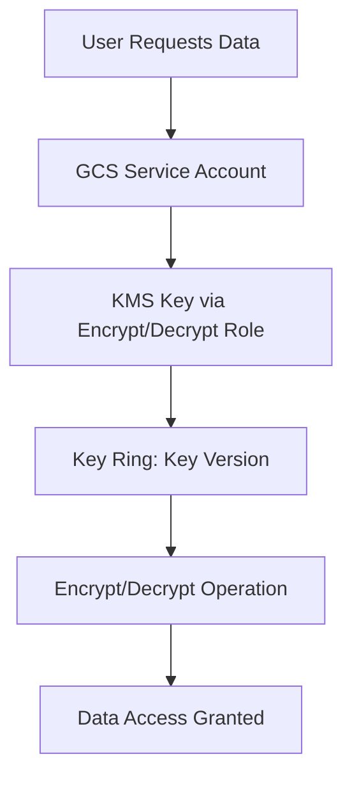

# Session 50: Data Encryption using Google Managed-GMEK, Customer Managed-CMEK, Customer Supplied - CSEK

## Table of Contents
- [Overview](#overview)
- [Key Concepts in Data Encryption at Rest](#key-concepts-in-data-encryption-at-rest)
  - [Google Managed Encryption Key (GMEK)](#google-managed-encryption-key-gmek)
  - [Customer Managed Encryption Key (CMEK)](#customer-managed-encryption-key-cmek)
  - [Customer Supplied Encryption Key (CSEK)](#customer-supplied-encryption-key-csek)
  - [Key Management Service (KMS) Details](#key-management-service-kms-details)
  - [Rotation and Key Security](#rotation-and-key-security)
- [Lab Demos](#lab-demos)
  - [Creating Buckets and Testing Encryption Types](#creating-buckets-and-testing-encryption-types)
  - [KMS Key Creation and Permission Granting](#kms-key-creation-and-permission-granting)
  - [Customer Supplied Encryption Key Files](#customer-supplied-encryption-key-files)
- [Additional Topics](#additional-topics)
  - [Sharing Data with External Auditors](#sharing-data-with-external-auditors)
  - [Signed URLs](#signed-urls)
  - [Signed Policy Documents](#signed-policy-documents)

## Overview
This session covers data encryption at rest in Google Cloud Storage (GCS) using three types of encryption keys: Google Managed Encryption Key (GMEK), Customer Managed Encryption Key (CMEK), and Customer Supplied Encryption Key (CSEK). It explains how Google Cloud encrypts data by default, the role of Key Management Service (KMS), and practical demonstrations for implementing these encryption methods. Key topics include key generation, rotation, security considerations, and advanced sharing mechanisms like signed URLs for accessing data without Google accounts.

## Key Concepts in Data Encryption at Rest
Data in Google Cloud is encrypted at rest using Advanced Encryption Standard (AES) with keys of various sizes. Google Cloud services break data into chunks (256 KB to 8 MB) and encrypt them. Encryption is automatic but can be customized for compliance and control.

### Google Managed Encryption Key (GMEK)
- **Explanation**: This is the default encryption where Google generates, manages, and rotates keys automatically. No user intervention required. Keys are rotated every 90 days, but details are not exposed to users.
- **When to Use**: For organizations needing basic encryption without managing keys. Applicable to nearly all Google Cloud services (Compute Engine, BigQuery, etc.).
- **Advantages**: 
  - Transparent and seamless.
  - Free and always enabled.
- **Disadvantages**: No control over key rotation or generation.
- **Example in GCS**: When creating a bucket without specifying encryption, GCS uses GMEK. Objects show "Google managed" in the UI.

> [!NOTE]
> Google Managed Encryption Key ensures data is encrypted at rest without any configuration, but traceability is limited.

### Customer Managed Encryption Key (CMEK)
- **Explanation**: Users manage keys via Google Cloud Key Management Service (KMS). Keys are created in key rings, which can be regional or multi-regional. CMEK allows defining protection levels (software or HSM), rotation periods, and integration with GCS.
- **Comparison Table**:
  | Feature | GMEK | CMEK |
  |---------|------|------|
  | Key Management | Google | User |
  | Rotation | 90 days auto | Custom (e.g., 30 days) |
  | Visibility | Hidden | Reference only |
  | Protection | Software (fixed) | Software or HSM |
  | Cost | Free | Rotations incur cost |

- **Protection Levels**:
  - Software: Keys generated on shared hardware (cheaper, no dedicated resources).
  - HSM (Hardware Security Module): Keys generated on dedicated hardware (more secure, higher cost, recommended for strict compliance).

- **Key Ring and Keys**:
  - Organize keys in key rings for logical grouping.
  - Symmetric keys (same key for encrypt/decrypt) or asymmetric (separate keys).
  - Primary use: Symmetric encrypt/decrypt.

- **Integration with GCS**: 
  - Use KMS key references in bucket creation or via CLI.
  - Service account needs Encrypt/Decrypt IAM role on the key for seamless access.
  - Users don't need encryption roles; the service account handles it.

> [!IMPORTANT]
> For CMEK, the GCS storage service account must have IAM permissions on the KMS key. Grant roles at key or project level for multi-bucket use.

### Customer Supplied Encryption Key (CSEK)
- **Explanation**: Users provide their own base64-encoded AES-256 keys. Keys are not stored in KMS; users manage them externally. Suitable for air-gapped environments or external key management.
- **When to Use**: Highest control, but requires secure key generation outside Google Cloud. Not recommended for production without secure systems.
- **Process**:
  - Generate a 32-byte key using scripts (e.g., Python code provided).
  - Use key via CLI flags; not supported in UI for buckets or objects.

- **Key Security Considerations**:
  - Generate on secure, patched systems.
  - Never store in Google Cloud services.
  - Symmetric: Same key for encrypt/decrypt.

- **Rotation**: Manual process; generate new key, decrypt with old key, encrypt with new, update objects.

- **Diff Highlight**:
  ```diff
  ! Key supplied externally, no Google Cloud involvement in key lifecycle
  + Full control over key security
  - Complex management, potential for human error
  ```

> [!WARNING]
> CSEK is the least "seamless" option. Ensure your laptop or system generating keys is secure and free from compromise. Avoid for shared environments.

### Key Management Service (KMS) Details
- **Purpose**: Manages cryptographic keys for encryption/decryption and signatures.
- **Key Versions**: Support rotation; each version represents a point-in-time key.
- **Other Uses**: Digital signatures, MAC (Message Authentication Code).
- **Enforcement Options**:
  - Import existing keys (not demonstrated here).
  - External keys if needed.
- **Diagram**: Process Flow



### Rotation and Key Security
- **Rotation Process**: Auto for GMEK/CMEK; manual for CSEK.
- **Destroy Keys**: Soft delete (30-day grace) after rotation or destruction.
- **Cost Control**: Disable KMS API if not using; destroy unused keys.
- **LESSER-KNOWN FACT**: KMS supports up to 100 decryption keys for CSEK to handle lost keys.

## Lab Demos
### Creating Buckets and Testing Encryption Types
1. Create three buckets: E.g., `pca-gmek`, `pca-cmek`, `pca-csek`.
   ```bash
   gsutil mb -p my-project -l europe-west2 pca-gmek
   gsutil mb -p my-project -l europe-west2 pca-cmek
   gsutil mb -p my-project -l europe-west2 pca-csek
   ```

2. Upload objects:
   - Use `gsutil copy` for GMEK object (inherits default).
   - For CMEK: Specify KMS key reference after adding permissions.
   - For CSEK: Use `--encryption-key` flag with base64-encoded key.

3. Verify encryption:
   ```bash
   gsutil stat gs://pca-gmek/object.txt  # No encryption info
   gsutil stat gs://pca-cmek/object.txt  # Shows KMS key reference
   ```

   Output shows key version for CMEK.
   
4. Observe in UI: GMEK and CMEK visible; CSEK shows "customer supplied" but decryption requires key.

### KMS Key Creation and Permission Granting
1. Create key ring:
   ```bash
   gcloud kms keyrings create pca-gcs-keyring --location europe-west2
   ```

2. Create key with software protection, 30-day rotation:
   ```bash
   gcloud kms keys create pca-gcs-key \
     --keyring pca-gcs-keyring --purpose encrypt-decrypt \
     --encryption-algorithm rsa-decrypt-oaep-2048-sha256 \
     --rotation-period 30d --next-rotation-time <time>
   ```

3. Grant IAM role to storage service account:
   ```bash
   gcloud kms keys add-iam-policy-binding pca-gcs-key \
     --keyring pca-gcs-keyring --location europe-west2 \
     --member serviceAccount:service-{PROJECT_NUMBER}@gs-project-accounts.iam.gserviceaccount.com \
     --role roles/cloudkms.cryptoKeyDecrypter
   ```

4. Use in GCS bucket:
   ```bash
   gsutil mb -p my-project -l europe-west2 --retention kms-key:///projects/my-project/locations/europe-west2/keyRings/pca-gcs-keyring/cryptoKeys/pca-gcs-key pca-cmek
   ```

5. Test upload/view: Seamless thanks to service account.

### Customer Supplied Encryption Key Files
1. Generate key: Run provided Python code to create base64 key in file.
   ```python
   import os
   import base64
   
   # Generate 32-byte key
   key = os.urandom(32)
   encoded_key = base64.b64encode(key).decode('utf-8')
   
   # Save to file or use directly
   print(encoded_key)
   ```

2. Encrypt object:
   ```bash
   gsutil cp -k gs://pca-csek/object.txt
   ```

3. Decrypt/view:
   ```bash
   gsutil cp gs://pca-csek/object.txt -k <key>
   ```

4. Rotation demo: Use `--decryption-keys` with multiple base64 keys to handle lost keys.

## Additional Topics
### Sharing Data with External Auditors
- **Problem**: Auditors without Google accounts need access without IAM.
- **Solutions**:
  1. **Workaround**: Create temporary Google account for auditor.
  2. **Access Control**: Use IAM conditions for expiry (e.g., 5 days).
  3. **Signed URLs**: Pre-authenticated URLs without account.

### Signed URLs
- **Use Case**: Share bucket/object access via email link for max 7 days.
- **Process**:
  1. Create service account with IAM on bucket.
  2. Generate signed URL:
     ```bash
     gsutil signurl -m GET -d 5d service-account.json gs://bucket/object.txt
     ```
  3. Share URL: Recipient can download via browser/app.
- **Security**: Links are time-bound; compromise handled by revoking service account key.

### Signed Policy Documents
- **Use Case**: Allow uploads via UI for technical auditors.
- **Example**: Generate policy for PUT method.
  ```bash
  gsutil signurl -m PUT -d 7d service-account.json gs://bucket/findings.txt
  ```
- **Benefits**: No command-line required; UI-based upload.

## Summary
### Key Takeaways
```diff
+ Encryption at rest is default in Google Cloud; GMEK requires no action.
+ CMEK provides control via KMS; CSEK offers external key management.
+ Key rotation: Auto for GMEK/CMEK; manual for CSEK.
+ Signed URLs enable secure sharing without Google accounts.
- CSEK is complex and risky; use only with secure key genesis.
! Multi-layered security: Data keys enveloped by KMS keys.
```

### Quick Reference
- **Commands**:
  - Create bucket with KMS: `gsutil mb --retention kms-key://<key-ref> <bucket>`
  - Encrypt with CSEK: `gsutil cp --encryption-key <key> <file> gs://bucket`
  - Signed URL: `gsutil signurl -d 7d <key-file> gs://bucket/object`
- **Key Sizes**: AES-256 (256 bits).
- **Max Signed URL Expiry**: 7 days.

### Expert Insight
**Real-world Application**: Use CMEK for regulated industries (e.g., GDPR in Europe) where auditability matters. For air-gapped setups, CSEK with secure key vaults allows compliance with zero Google trust for keys.

**Expert Path**: Master key hierarchies (data keys vs. key encryption keys). Explore KMS for non-encryption uses like digital signatures. Practice rotation scenarios; automate CSEK with scripts.

**Common Pitfalls**: Forgetting service account permissions leads to decryption failures. Using CSEK in cloud shells compromises security. Sharing signed URLs beyond intent breaches policy.

**LESSER-KNOWN FACTS**: KMS keys can't be viewed in plain text; only references. Up to 100 keys in CSEK for decryption resilience. Google rotates GMEK keys, but most users are unaware.

Advantages: Transparency (GMEK/CMEK), full control (CSEK), compliance options.  
Disadvantages: Cost (KMS operations), complexity (CSEK rotation), limited UI support.
