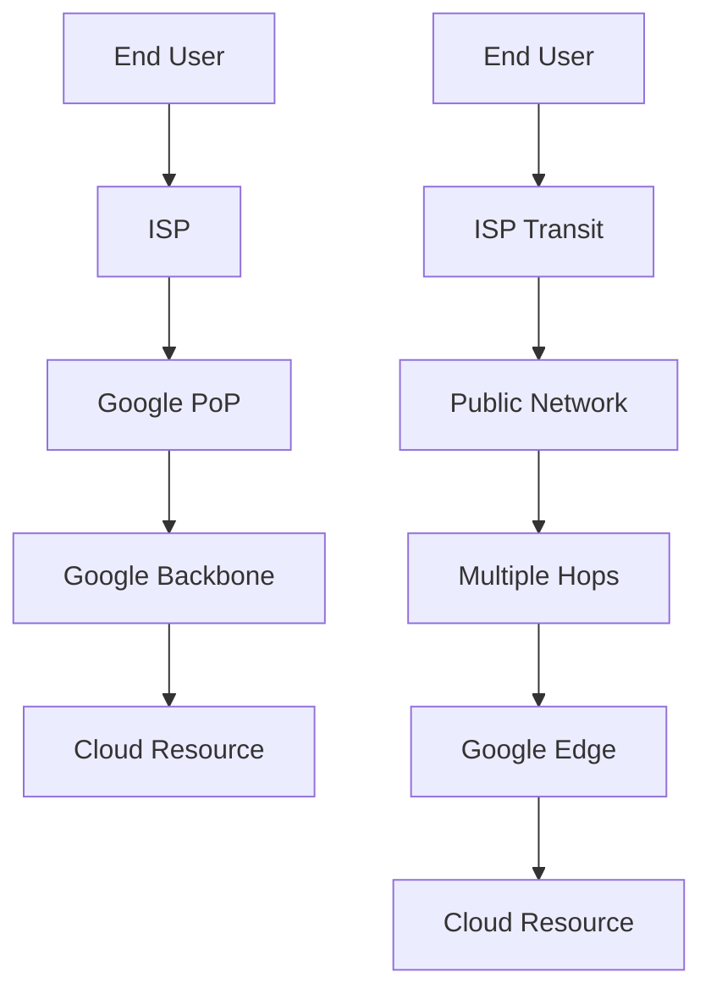

# Session 65: Network Service Tiers - Premium, Standard & Serverless VPC Access

## Table of Contents
- [Session Recap & Current Topics](#session-recap--current-topics)
- [Network Service Tier Overview](#network-service-tier-overview)
- [Premium vs Standard Tier Comparison](#premium-vs-standard-tier-comparison)
- [Network Service Tier Demo: Trace Route Analysis](#network-service-tier-demo-trace-route-analysis)
- [Serverless VPC Access Connector Overview](#serverless-vpc-access-connector-overview)
- [Cloud Run + Private SQL Integration Demo](#cloud-run--private-sql-integration-demo)
- [Summary](#summary)

## Session Recap & Current Topics
- Previous session covered VPC flow logs for network traffic monitoring
- Reviewed Cloud NAT concepts (both public and private NAT configurations still being finalized)
- Covered VPC peering (though overlaps still being resolved)

## Network Service Tier Overview
Network Service Tiers determine how internet traffic routes to and from Google Cloud resources. Google offers two tiers:

### Key Concepts
- **Premium Tier**: Default routing option using Google's global network backbone
- **Standard Tier**: Uses public transit networks (similar to other cloud providers)
- Tiers apply to external IP addresses and load balancers, not internal traffic

### When Network Service Tiers Matter
- Resources with external IP addresses (VMs with external IPs)
- External load balancers (HTTP/S load balancers create forwarding rules)
- Does NOT apply to:
  - VMs with only internal IPs
  - Internal load balancers
  - Private services within VPC networks

## Premium vs Standard Tier Comparison
Premium tier provides faster, more reliable connectivity at a higher cost, while standard tier offers more economical routing through public networks.

### Technical Comparison

| Aspect | Premium Tier | Standard Tier |
|--------|-------------|---------------|
| Routing Path | Traffic stays on Google's global backbone network | Uses public internet transit providers |
| Latency | Low latency due to optimized routing (~2-3 hops) | Higher latency (multiple hops through transit networks) |
| Cost | 25-33% more expensive | Lower cost baseline |
| Availability | High uptime | Standard availability |
| Geographic Coverage | Leverages Google's extensive network presence | Standard internet routing |
| Security | Traffic protected on Google's backbone | Protected until last mile |
| Use Cases | Low-latency applications, global services | Development, testing, cost-sensitive workloads |
| Supported Features | All Google Cloud networking features | All Google Cloud networking features |

### Architecture Comparison


| Tier | Visual Flow | Description |
|------|-------------|-------------|
| Premium | `End User → ISP → Google PoP → Google Backbone → Resource` | Direct routing through Google's optimized network |
| Standard | `End User → ISP → Transit Provider → Multiple Hops → Google → Resource` | Travels through public internet infrastructure |

## Network Service Tier Demo: Trace Route Analysis

### Demo Setup
- Created two VMs in us-central1 region:
  - "premium": Configured for Premium tier routing
  - "standard": Configured for Standard tier routing
- Used `traceroute` utility to analyze network paths from Bangalore, India
- Tested with both home WiFi and mobile hotspot connections

### Premium Tier Results (Home Connection)
```
# Route to US resource via Premium tier
1. 192.168.x.x (Local router)
2. 125.22.x.x (Local ISP - ACT Fiber)
3. 72.14.2xx.x (Google network - ASN 15169)
# Direct Google routing - minimal hops
```
**Latency Observation**: Consistent sub-50ms response times, direct routing through Google's backbone.

### Standard Tier Results (Mobile Hotspot)
```
# Route to US resource via Standard tier
1. 192.168.x.x (Local router)
2. Various transit providers
3. Singapore transit (AS 1239 - Sprint)
4. France transit (AS 12876 - Online.net)
5. Kenya transit (AS xxxxx - Safaricom)
6. Ohio, USA transit
7. New York, USA transit
8. Google Cloud edge
# 18-19 hops total through multiple countries
```
**Latency Observation**: 200-500ms response times due to multiple geographic hops.

### Key Findings
- Premium tier maintained 12 hops vs. Standard tier's 19 hops on mobile connection
- Standard tier routing took geographically complex paths (Bangalore → Singapore → France → Kenya → USA)
- ISP provider significantly impacts routing behavior
- Google optimizes Premium tier routes aggressively

## Serverless VPC Access Connector Overview

### The Problem Solved
Serverless products (Cloud Run, Cloud Functions, App Engine) cannot directly access private resources within VPC networks. This connector bridges the gap between fully-managed serverless and private VPC resources.

### What It Does
Creates a secure tunnel between serverless products and VPC-private resources using:
- Dedicated subnet allocation (/28 = 16 IPs)
- VM-based port forwarding proxies
- Automatic scaling (minimum 2 instances, up to specified limits)

### Applicable Services
- ✅ Cloud Run services
- ✅ Cloud Run functions
- ✅ App Engine Standard environment
- ❌ App Engine Flexible (native VPC access)
- ❌ Cloud Functions Gen 2 (direct VPC access available)

### Use Cases
- Cloud Run accessing Cloud SQL with private IP
- Serverless functions accessing Memorystore (Redis)
- App Engine accessing private VM-based databases
- Accessing on-premises resources via VPN/Interconnect

### Cost Considerations
- Base cost per hour + per GB data processed
- /28 subnet uses 16 IPs (8 usable)
- Small VMs (f1-micro recommended for cost optimization)
- Typically $40-70/month depending on traffic

## Cloud Run + Private SQL Integration Demo

### Demo Architecture
```
Cloud Run (Frontend) + Serverless VPC Connector → Private Cloud SQL (PostgreSQL)
```

### Implementation Steps

#### 1. Cloud SQL Setup (Project B - Backend)
```bash
# Create PostgreSQL instance with both public and private IPs
gcloud sql instances create poll-db \
  --database-version=POSTGRES_13 \
  --cpu=2 \
  --memory=7680MB \
  --region=us-central1 \
  --project=backend-project

# Enable private IP access (requires Private Service Connect setup)
gcloud compute addresses create google-managed-services-backend-project \
  --global \
  --purpose=VPC_PEERING \
  --prefix-length=16 \
  --network=projects/backend-project/global/networks/default \
  --project=backend-project
```

#### 2. Sample Application (Node.js polling app)
```javascript
// server.js - Express.js app with PostgreSQL
const express = require('express');
const { Pool } = require('pg');

const app = express();

// Database configuration (using private IP)
const pool = new Pool({
  host: process.env.DB_HOST,      // Private IP: 10.x.x.x
  port: process.env.DB_PORT,      // 5432
  database: process.env.DB_NAME,  // postgres
  user: process.env.DB_USER,      // postgres
  password: process.env.DB_PASS,  // (from Secret Manager)
});

app.post('/vote', async (req, res) => {
  try {
    const { choice } = req.body; // 'tabs' or 'spaces'
    await pool.query('INSERT INTO votes (choice) VALUES ($1)', [choice]);
    res.json({ success: true });
  } catch (error) {
    res.status(500).json({ error: error.message });
  }
});

app.listen(8080);
```

#### 3. Cloud Run Deployment (Project A - Frontend)
```bash
# Build and push container image
gcloud builds submit --tag gcr.io/frontend-project/poll-app:v1 .

# Deploy to Cloud Run
gcloud run deploy poll-app \
  --image gcr.io/frontend-project/poll-app:v1 \
  --platform managed \
  --region us-central1 \
  --allow-unauthenticated \
  --vpc-connector projects/frontend-project/locations/us-central1/connectors/poll-connector \
  --set-env-vars DB_HOST=10.x.x.x,DB_PORT=5432,DB_NAME=postgres,DB_USER=postgres \
  --set-secrets DB_PASS=projects/frontend-project/secrets/db-password:latest \
  --project=frontend-project
```

#### 4. Serverless VPC Connector Configuration
```bash
# Create VPC connector for connectivity
gcloud compute networks vpc-access connectors create poll-connector \
  --region=us-central1 \
  --subnet=projects/frontend-project/regions/us-central1/subnetworks/vpc-connector-subnet \
  --subnet-project=frontend-project \
  --min-instances=2 \
  --max-instances=5 \
  --machine-type=f1-micro \
  --project=frontend-project

# Subnet requirements (/28 minimum)
# Range: 10.0.0.0/28 (16 IPs, 8 usable)
```

#### 5. Service Agent Permissions (Shared VPC)
For shared VPC configurations, grant Cloud Run service account subnet access:

```bash
# In the host project (where shared VPC resides)
gcloud projects add-iam-policy-binding HOST_PROJECT_ID \
  --member=serviceAccount:service-PROJECT_NUMBER@serverless-robot-prod.iam.gserviceaccount.com \
  --role=roles/compute.networkUser \
  --project=HOST_PROJECT_ID
```

### Alternative: Direct VPC Integration
Google provides a simpler method for direct VPC access (no connector required):

```bash
# Grant Cloud Run direct VPC access
gcloud run services update poll-app \
  --vpc-egress=all-traffic \
  --vpc-connector=VPC_NAME \
  --project=frontend-project
```

**Cost Comparison:**
- Serverless VPC Connector: Predictable cost (~$40-67/month)
- Direct VPC access: Variable cost based on usage
- Direct method: Lower latency, higher throughput

## Summary

### Key Takeaways
```diff
+ Premium tier reduces latency through Google's optimized backbone (12-15 hops vs 18-25 hops)
+ Standard tier offers 25-33% cost savings but with increased latency and varied reliability
+ Network Service Tiers apply ONLY to external-facing resources (VMs with external IPs, load balancers)
+ Serverless VPC Access Connector enables Cloud Run/Functions to reach private VPC resources
+ Two implementation approaches: Serverless VPC Connector (cost-predictable) or Direct VPC access (latency-optimized)
```

### Quick Reference
| Command | Purpose |
|---------|---------|
| `traceroute <IP>` | Analyze network routing hops to destination |
| `gcloud compute networks vpc-access connectors create` | Create connector for serverless VPC access |
| `gcloud run deploy --vpc-connector` | Deploy Cloud Run with VPC connectivity |

### Expert Insight
#### Real-world Application
In production environments, use Premium tier for user-facing applications requiring consistent low latency (e-commerce, real-time applications). Reserve Standard tier for internal tools, batch processing, or development environments where latency fluctuations are tolerable.

#### Expert Path
Master shared VPC configurations for multi-project architectures. Understand Cloud Router BGP configurations for advanced networking scenarios. Learn to optimize costs by combining On-Demand VPC access for development with Serverless VPC Connectors for predictable production workloads.

#### Common Pitfalls
- Attempting to change Network Service Tiers on existing resources (requires recreation)
- Forgetting to configure service account permissions in shared VPC scenarios
- Exposing databases publicly when private connectivity is available
- Not monitoring VPC connector utilization leading to unexpected costs

#### Lesser-Known Facts
- Google charges for external IPs even when VMs are stopped (Standard tier slightly cheaper)
- Premium tier leverages Google's private submarine cables for truly global optimization
- Serverless VPC connectors can route ALL traffic or just private IP traffic
- Regional load balancers in GCP can be configured for Standard tier (unlike global ones)
