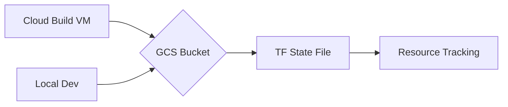

# Session 79: Terraform Concepts - CI/CD on Infra, Terraform Modules

## Table of Contents
- [Overview](#overview)
- [Issues with Project ID in Cloud Build](#issues-with-project-id-in-cloud-build)
- [Built-in Variables in Cloud Build](#built-in-variables-in-cloud-build)
- [Local Testing of Terraform](#local-testing-of-terraform)
- [Git Ignore for Terraform](#git-ignore-for-terraform)
- [Centralized Backend with GCS](#centralized-backend-with-gcs)
- [Parameterization with Variables](#parameterization-with-variables)
- [Terraform Modules](#terraform-modules)
- [Dependencies in Terraform](#dependencies-in-terraform)
- [Modularizing Resources](#modularizing-resources)
- [Summary](#summary)
  - [Key Takeaways](#key-takeaways)
  - [Quick Reference](#quick-reference)
  - [Expert Insight](#expert-insight)

## Overview
This session covers key Terraform concepts, including integrating CI/CD pipelines for infrastructure deployment using Cloud Build, and introducing Terraform modules for organizing and reusing infrastructure code. It demonstrates resolving common issues like project ID configuration, using built-in variables, local testing, Git ignore setups, centralized state backends, parameterization, modularization, and managing dependencies for efficient and scalable infrastructure as code (IaC) management.

## Issues with Project ID in Cloud Build
When deploying infrastructure via Cloud Build, users may encounter errors like "project not defined" because the Terraform configuration lacks a project ID provider block. This can be resolved by explicitly adding a `project` field in the Google Cloud provider block within your Terraform files.

```hcl
provider "google" {
  project = var.project_id  # Use a variable for parameterization
}
```

This ensures Terraform can authenticate and deploy resources to the correct GCP project.

## Built-in Variables in Cloud Build
Cloud Build provides built-in substitutions (e.g., `$PROJECT_ID`, `$COMMIT_SHA`, `$BRANCH_NAME`) that can be used directly in your Cloud Build YAML or Terraform files. These avoid hardcoding values and leverage pipeline metadata.

Examples of built-in substitutions:
- `$PROJECT_ID`: The GCP project ID.
- `$SHORT_SHA`: Short commit SHA.
- `$TAG_NAME`: Git tag name.

In Terraform, reference them via environment variables or cloudbuild.yaml steps:

```yaml
steps:
  - name: 'hashicorp/terraform:1.5.4'
    args: ['apply', '-auto-approve']
    env:
      - 'TF_VAR_project_id=$PROJECT_ID'
```

This simplifies configurations and enhances security by not exposing sensitive data.

## Local Testing of Terraform
Before integrating with CI/CD, test Terraform code locally to mimic pipeline conditions. Use commands like `gcloud config unset project` to simulate missing configurations, then run `terraform plan` and `terraform apply`. This helps identify issues early, reducing build failures.

**Code Block for Simulation:**
```bash
gcloud config unset project
terraform plan  # Should fail if project is required
terraform apply  # Mimic Cloud Build execution
```

> [!IMPORTANT]
> Always test locally before pushing to CI/CD to catch errors like missing variables or provider configurations.

## Git Ignore for Terraform
Terraform generates temporary files (e.g., `.terraform/` directory, `terraform.tfstate`, `terraform.lock.hcl`) that should not be committed to Git. Create a `.gitignore` file in your repository root:

```
# .gitignore for Terraform repos
.terraform/
terraform.tfstate
terraform.tfstate.backup
*.lock.hcl
```

Use tools like ChatGPT or Terraform documentation to generate comprehensive `.gitignore` patterns. This prevents accidental commits of sensitive or large files, maintaining repository cleanliness.

## Centralized Backend with GCS
Store Terraform state centrally on Google Cloud Storage (GCS) for collaboration and persistence across environments. Configure a backend block in `backend.tf`:

```hcl
terraform {
  backend "gcs" {
    bucket = "terraform-state-dev"
    prefix = "terraform/state"
  }
}
```

Manually create the state bucket with versioning, object lifecycle policies (e.g., expire old versions after 7 days), and retention policies for data protection. This handles state locking, preventing concurrent modifications, and enables state restoration.

**Diagram: Centralized State Management**



## Parameterization with Variables
Avoid hardcoded values by using variables. Define in `variables.tf` and assign values in `.tfvars` files (e.g., `dev.tfvars`, `prod.tfvars`).

**variables.tf:**
```hcl
variable "project_id" {
  type        = string
  description = "GCP Project ID"
}

variable "bucket_name" {
  type        = string
}

variable "location" {
  type    = string
  default = "us-central1"
}
```

**dev.tfvars:**
```
project_id   = "my-dev-project"
bucket_name  = "tf-bucket-dev"
location     = "us-east1"
```

Use in `main.tf`:
```hcl
resource "google_storage_bucket" "example" {
  name     = var.bucket_name
  location = var.location
  project  = var.project_id
}
```

Specify files via `-var-file=dev.tfvars` in commands or Cloud Build.

## Terraform Modules
Organize reusable code into modules for better structure. Create a `modules/` folder with subfolders like `gcs/`, each containing `main.tf`, `variables.tf`, and optional `outputs.tf`.

**Example Module Structure:**
```
modules/
  gcs/
    main.tf
    variables.tf
    outputs.tf
```

Consume in root `main.tf`:
```hcl
module "gcs_bucket" {
  source      = "./modules/gcs"
  bucket_name = var.bucket_name
}
```

Run `terraform init` to download or initialize modules. Use versioning with Git sources if sharing across repos.

## Dependencies in Terraform
Manage resource creation order using explicit dependencies (e.g., `depends_on`) or implicit (reference resource attributes).

**Explicit Dependency:**
```hcl
resource "google_compute_subnetwork" "example" {
  depends_on = [google_compute_network.vpc]
  # ...
}
```

**Implicit Dependency:**
```hcl
resource "google_compute_subnetwork" "example" {
  network = google_compute_network.vpc.id
  # No explicit depends_on needed
}
```

This ensures VPC creates before subnet, preventing errors in parallel executions.

## Modularizing Resources
Extend modules to group related resources (e.g., VPC, subnet, firewall into one module). Pass inter-module dependencies via outputs.

**Outputs in Module:**
```hcl
output "vpc_id" {
  value = google_compute_network.vpc.id
}
```

**Consume in Main:**
```hcl
module "vpc" {
  source = "./modules/vpc"
}

resource "google_compute_subnetwork" "example" {
  network = module.vpc.vpc_id
}
```

Use `terraform format --recursive` for code organization.

## Summary

### Key Takeaways
```diff
+ CI/CD integration with Terraform requires provider configuration and built-in variables for dynamic environments.
- Avoid committing Terraform state files or sensitive variables to Git to prevent security risks.
! Leverage modules and parameterized variables for scalable, reusable infrastructure code.
- Test Terraform locally before CI/CD deployment to catch configuration errors early.
+ Centralized backends ensure state consistency and support locking for collaborative work.
```

### Quick Reference
- **Cloud Build Built-ins**: `$PROJECT_ID`, `$SHORT_SHA`, etc.
- **Backend Config**: `terraform { backend "gcs" { bucket = "state-bucket" prefix = "state" } }`
- **Module Usage**: `module "name" { source = "./modules/name" }`
- **Dependency**: `depends_on = [resource.name]` or implicit via resource references.
- **Commands**: `terraform init`, `terraform plan -var-file=env.tfvars`, `terraform apply`

### Expert Insight
**Real-world Application**: In enterprise CI/CD pipelines, use Terraform Workspaces and Sentinel policies (via HashiCorp) to enforce governance and multi-environment deployments, integrating with tools like GitOps for continuous delivery.

**Expert Path**: Master advanced Terraform features like remote execution, data sources, and provisioners. Study HashiCorp's official documentation and certifications. Experiment with Terraform Cloud for remote runs, collaboration features, and cost estimation.

**Common Pitfalls**: Forgetting to initialize modules post-changes leads to apply errors; misuse of explicit dependencies can slow deployments due to serialization; neglecting state locking causes overrides in team environments. Always validate plans in CI before applying.

**Lesser-Known Facts**: Terraform supports multi-cloud providers in a single config; the `for_each` meta-argument enables dynamic resource loops, ideal for multiple similar resources; state drift detection via `terraform plan` can identify manual changes to mitigate configuration drift.

🤖 Generated with [Claude Code](https://claude.com/claude-code) 🤖 Generated with [Claude Code](https://claude.com/claude-code)

Co-Authored-By: Claude <noreply@anthropic.com> Co-Authored-By: Claude <noreply@anthropic.com>
