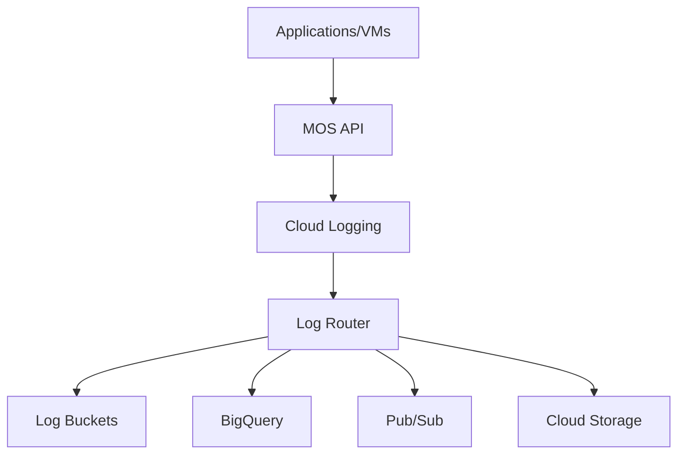

# Session 80: Terraform Concepts Part 2 and Cloud Monitoring Concepts

## Terraform Concepts Part 2

## Advanced Terraform Module Development

### Module Outputs and State Propagation

Output definitions allow passing computed values between modules, enabling infrastructure state sharing.

**Key Output Concepts:**

- **Module Scope**: Outputs defined in modules propagate to parent configuration via module block references
- **Multiple References**: Same output can be referenced across multiple modules based on their hierarchy
- **State Access**: Outputs provide access to dynamically generated resource attributes like VM IPs

**Output Propagation Structure:**

```hcl
# modules/gce/outputs.tf
output "vm_name" {
  value = google_compute_instance.vm.name
}

output "vm_zone" {
  value = google_compute_instance.vm.zone
}

output "machine_type" {
  value = google_compute_instance.vm.machine_type
}

output "network_info" {
  value = google_compute_instance.vm.network_interface[0].network
}

# main.tf - Parent Module
module "compute" {
  source = "./modules/gce"
  # ... other variables
}

# outputs.tf - Root Level
output "vm_details" {
  value = {
    name         = module.compute.vm_name
    zone         = module.compute.vm_zone
    machine_type = module.compute.machine_type
    network      = module.compute.network_info
  }
}
```

> [!IMPORTANT]
> Module outputs must explicitly reference the module instance (e.g., `module.compute.vm_name`) to access values from child modules.

### Terraform Plan Analysis and Debugging

**Plan Command Output Analysis:**

The `terraform plan` command provides detailed insight into proposed infrastructure changes:

- **Known Values**: Displays computed values available before deploy (e.g., VM machine type, zone)
- **Unknown Values**: Shows `(known after apply)` for runtime-generated values (e.g., VM external IP)
- **Error Detection**: Identifies syntax errors, resource conflicts, and configuration issues

**Output Fix Strategies:**

```diff
# Before - Incorrect attribute reference
- network_interface.interface.network

# After - Correct attribute reference
+ network_interface[0].network
```

✅ **Plan checks configuration validity before deployment**
❌ **Plan cannot catch runtime permission/availability errors**

### CI/CD Integration with Cloud Build

**Automated Terraform Execution:**

Cloud Build provides seamless infrastructure deployment through:

- **Build Triggers**: Automatic execution on GitHub pushes/commits
- **Cloud Storage Backend**: State file centralized in GCS with versioning
- **Service Account Management**: Dedicated SA with necessary IAM roles for resource creation

**Build Workflow:**
1. Code commit triggers Cloud Build
2. Terraform initialization downloads modules and configures backend
3. Plan stage shows proposed changes
4. Apply stage deploys infrastructure
5. State file updated in GCS
6. Git-based change tracking

**Key Build Stages:**
- **Init**: Downloads providers, modules; configures state backend
- **Plan**: Validates configuration, shows changes
- **Apply**: Deploys infrastructure changes

### Terraform Module Best Practices

**Module Organization Patterns:**

```
terraform-project/
├── main.tf (root configuration)
├── variables.tf
├── outputs.tf
├── terraform.tf (providers, backend)
├── modules/
│   ├── gce/ (Compute Engine resources)
│   ├── storage/ (Cloud Storage resources)
│   ├── networking/ (VPC, firewalls)
│   ├── spanner/ (Cloud Spanner resources)
│   └── kubernetes/ (GKE resources)
└── environments/
    ├── dev/
    ├── staging/
    └── prod/
```

**Parameterized Module Design:**

```hcl
# modules/gce/variables.tf - Flexible input handling
variable "project_id" {
  type        = string
  description = "GCP Project ID"
}

variable "environment" {
  type        = string
  description = "Deployment environment"
  validation {
    condition     = contains(["dev", "staging", "prod"], var.environment)
    error_message = "Environment must be dev, staging, or prod."
  }
}
```

### Infrastructure Documentation with AI Assistance

**Gemini CLI for Automated Documentation:**

```bash
# Initialize Gemini CLI
gemini --auth-mode=google --completion-mode=inline-edit

# Generate comprehensive README
clone https://github.com/user/terraform-repo
generate readme for dev and prod environments

# Update specific sections
update prerequisites section with Node.js, TF versions
add CICD pipeline documentation
add troubleshooting section
```

**AI-Assisted Code Generation:**

```bash
# Generate complete resource blocks
generate firewall rule to open HTTP port 80
generate cloud spanner instance with regional config
generate kubernetes autoscaler configuration
```

**Benefits of AI Assistance:**
- Reduces manual documentation time
- Ensures consistency across projects
- Provides boilerplate code patterns
- Updates documentation with code changes

## Advanced Terraform Operations

### Reverse Engineering Existing Infrastructure

**Import Command Syntax:**

```bash
# General format
terraform import [options] ADDRESS ID

# Specific examples
terraform import google_compute_instance.vm projects/my-project/zones/us-central1-a/instances/my-vm
terraform import google_spanner_instance.database projects/my-project/instances/my-database
```

**Import Workflow:**
1. Define empty resource block matching existing infrastructure
2. Run `terraform plan` to verify structure
3. Execute import command with resource address and GCP resource ID
4. Generate state file configuration with `terraform show`
5. Clean up auto-generated fields from output

**Manual Terraform Snippet Creation:**

```hcl
# Empty resource block for import
resource "google_spanner_instance" "demo" {
  # Will be populated by import
}

# After terraform show > output.tf
resource "google_spanner_instance" "demo" {
  config       = "regional-us-central1"
  display_name = "demo"
  name         = "demo"
  project      = "my-project"
  labels       = {}  # Remove auto-generated labels
  # Remove state, id, and other system fields
}
```

### Terraform State Management Patterns

**Remote State with GCS:**

```hcl
# terraform.tf
terraform {
  backend "gcs" {
    bucket = "my-terraform-state-bucket"
    prefix = "terraform/state"
  }
}

# Version locking for team collaboration
terraform {
  required_version = ">=1.0.0"
  required_providers {
    google = {
      source  = "hashicorp/google"
      version = "~> 4.0"
    }
  }
}
```

**State File Security Considerations:**
- Versioning enabled on GCS bucket
- Access restricted to CI/CD service accounts
- Audit logging enabled for state changes

### Terraform Provider Configuration

**Google Cloud Provider Setup:**

```hcl
terraform {
  required_providers {
    google = {
      source  = "hashicorp/google"
      version = "~> 4.50.0"
    }
  }
}

provider "google" {
  project     = var.project_id
  region      = var.region
  zone        = "us-central1-a"

  # Optional but recommended configurations
  user_project_override = true
  request_timeout       = "60s"
}
```

### Blueprint-Based Development

**Terraform Google Blueprints:**

```hcl
# Clone official Google blueprints
git clone https://github.com/GoogleCloudPlatform/terraform-google-examples

# Example bucket creation using blueprint
module "gcs_bucket" {
  source  = "GoogleCloudPlatform/cloud-storage/google"
  version = "~> 4.0"

  name          = "my-bucket-suffix"
  project_id    = var.project_id
  location      = "us-central1"
  force_destroy = true

  lifecycle_rules = [{
    action = {
      type = "Delete"
    }
    condition = {
      age = 365
    }
  }]
}
```

**Blueprint Advantages:**
- Production-ready, tested configurations
- Follow Google Cloud best practices
- Regular updates for new features
- Extensive documentation and examples

## Cloud Monitoring Concepts

### Cloud Operations Suite Architecture

Google Cloud's monitoring and logging platform, providing:

- **Cloud Monitoring**: Metrics collection and alerting
- **Cloud Logging**: Log aggregation and analysis
- **Cloud Trace**: Application performance monitoring
- **Cloud Profiling**: Code performance optimization
- **Error Reporting**: Exception aggregation and alerting

**Previously known as**: Stackdriver (acquired by Google in 2014, renamed 2020)

### Metrics Collection Architecture

#### Virtual Machines (GCE)

**Agent Requirements:**

```yaml
# OS Config Management - Ops Agent Installation
osPolicies:
  - id: install-ops-agent
    mode: ENFORCEMENT
    resourceGroups:
      - resources:
          - id: ops-agent-package
            pkg:
              desiredState: INSTALLED
              apt:
                name: google-cloud-ops-agent
```

**Key Configurations:**
- **Service Account**: Requires `roles/monitoring.metricWriter` and `roles/logging.logWriter`
- **Ops Agent**: Single agent replacing legacy monitoring/logging agents
- **Network**: Uses VPC private Google access for metric/log transmission

**VM Metrics Categories:**

| Metric Type | Requires Agent | IAM Role Required |
|-------------|----------------|-------------------|
| CPU Utilization | ❌ No | Basic metrics only |
| Memory Utilization | ✅ Yes | monitoring.metricWriter |
| Disk Space | ✅ Yes | monitoring.metricWriter |
| Network I/O | ❌ No | Basic metrics only |

#### Kubernetes (GKE)

**Service Account Requirements:**

```yaml
# GKE Service Account IAM roles
roles:
  - roles/monitoring.metricWriter
  - roles/logging.logWriter
  - roles/monitoring.viewer  # For metric access
```

**No Agent Installation Required:** GKE nodes pre-configured with monitoring collection

#### Managed Services (Cloud Run, Cloud SQL, etc.)

**Configuration Requirements:**
- ✅ Service account with appropriate roles
- ❌ No agent installation needed
- ✅ Private Google access (for private IPs)

**Available Metrics:**
- Request count, latency, error rates
- Resource utilization (CPU, memory)
- Connection metrics (for databases)
- Custom application metrics

### Monitoring Dashboard Creation

**Custom Dashboard Configuration:**

```yaml
# Cloud Monitoring Dashboard JSON
{
  "displayName": "Infrastructure Overview",
  "gridLayout": {
    "columns": 2,
    "widgets": [
      {
        "title": "VM CPU Utilization",
        "xyChart": {
          "dataSets": [{
            "timeSeriesQuery": {
              "apiSource": "DEFAULT_CLOUD",
              "dataSets": [{
                "metric": {
                  "type": "compute.googleapis.com/instance/cpu/utilization"
                }
              }]
            }
          }]
        }
      }
    ]
  }
}
```

### Alerting Policies

**Alerting Policy Structure:**

```yaml
# Metric-based alerting
{
  "displayName": "High CPU Alert",
  "conditions": [{
    "displayName": "CPU > 80%",
    "condition": {
      "conditionThreshold": {
        "metricFilter": "metric.type=\"compute.googleapis.com/instance/cpu/utilization\"",
        "comparison": "COMPARISON_GT",
        "thresholdValue": 0.8,
        "duration": "300s"
      }
    }
  }],
  "notificationChannels": ["email-channel"]
}
```

### Logging and Error Reporting

**Cloud Logging Architecture:**



**Log Exports Configuration:**
- Filter logs by resource type, severity
- Route to BigQuery for analysis
- Archive to Cloud Storage
- Stream to Pub/Sub for real-time processing

### Performance Profiling

**Cloud Profiler Integration:**

```bash
# Application integration
export GOOGLE_CLOUD_PROJECT=my-project

# Python application
from google.cloud import profiler
profiler.start()

# Java application profiling
-javaagent:/opt/cprof/agent.jar \
-Dcprof.service=my-service \
-Dcprof.service.version=1.0.0
```

### Service Comparison: Terraform vs Deployment Manager

| Feature | Terraform | Deployment Manager | Recommendation |
|---------|-----------|-------------------|----------------|
| Language | HCL | Python/Jinja2 | Modern - Terraform |
| State Management | ✅ Local/Remote | ❌ Schemaless | Terraform |
| Provider Ecosystem | 1000+ | GCP Only | Terraform |
| Cost | Free | GCP Service | Terraform |
| Learning Curve | Moderate | Steep | Terraform |
| CI/CD Integration | Strong | Complex | Terraform |

### Cloud Spanner vs Deployment Manager Comparison

**Similarities with Terraform:**
- Both are infrastructure as code tools
- Both support version control
- Both enable declarative configuration

**Key Differences:**
- Terraform: Multi-cloud, stateful, community-driven
- Deployment Manager: GCP-native, stateless, Google-maintained

## Summary

### Key Takeaways
```diff
+ Terraform modules enable infrastructure reusability across environments
+ Cloud Monitoring requires service account roles and network access for VM metrics
+ Gemini CLI provides AI-assisted documentation and code generation
+ Reverse engineering imports existing infrastructure into Terraform state
+ Cloud Build enables automated Terraform pipeline execution
- Lack of IAM roles prevents metric collection despite agent installation
- Hardcoded configurations reduce infrastructure portability
- Without proper state management, concurrent deployments can cause conflicts
```

### Quick Reference

**Terraform Commands:**
```bash
terraform init          # Initialize working directory
terraform plan          # Preview infrastructure changes
terraform apply         # Deploy infrastructure changes
terraform import        # Import existing resources
terraform destroy       # Remove infrastructure
terraform show          # Display state file contents
```

**Service Account Roles for Monitoring:**

| Service | Required IAM Role |
|---------|-------------------|
| GCE VM | `roles/monitoring.metricWriter`, `roles/logging.logWriter` |
| GKE | `roles/monitoring.metricWriter`, `roles/logging.logWriter` |
| Cloud Run | Service account with project access |
| Cloud Storage | Basic metrics (no role required) |

**Ops Agent Installation:**
```bash
# Ubuntu/Debian
curl -sSO https://dl.google.com/cloudagents/add-google-cloud-ops-agent-repo.sh
sudo bash add-google-cloud-ops-agent-repo.sh --also-install

# After installation, restart agent
sudo systemctl restart google-cloud-ops-agent.target
```

### Expert Insight

#### Real-world Application
**Infrastructure as Code in Enterprise:**
- **Module Libraries**: Create reusable modules for common patterns (VPC, GKE clusters)
- **Parameterization**: Use variables extensively for environment-specific configurations
- **State Management**: Always use remote state (GCS) with proper access controls
- **CI/CD Integration**: Automate terraform execution through Cloud Build triggers
- **Documentation**: Use AI tools like Gemini CLI for maintaining up-to-date documentation

#### Expert Path
**Advanced Terraform Patterns:**
1. **Workspaces**: Manage multiple environments with shared configuration
2. **Remote State**: Centralize state management across teams
3. **Module Composition**: Build complex infrastructure from simple, tested modules
4. **Testing Frameworks**: Implement unit tests for Terraform modules using Terratest
5. **Provider Development**: Learn custom provider development for proprietary systems

**Monitoring Expertise:**
1. **Custom Metrics**: Implement application-specific monitoring with client libraries
2. **Service Level Objectives (SLOs)**: Define and track reliability targets
3. **Log Analytics**: Use BigQuery for advanced log analysis and anomaly detection
4. **Automated Remediation**: Integrate monitoring with Cloud Functions for self-healing infrastructure

#### Common Pitfalls
⚠️ **State File Corruption:** Lack of state locking can cause concurrent modification conflicts

⚠️ **Role Propagation Delay:** IAM role changes can take several minutes to become effective

⚠️ **Resource Dependencies:** Missing depends_on can cause resource creation timing issues

⚠️ **Network Isolation:** VMs without private Google access cannot send metrics to monitoring

#### Lesser-Known Facts
- **Cloud Monitoring Free Tier**: First 50GB logs and basic monitoring metrics are free
- **Prometheus Compatibility**: Cloud Monitoring can ingest Prometheus metrics natively
- **Ops Agent's Origins**: The agent combines Google's legacy monitoring and logging agents into one
- **Gemini CLI's Offline Mode**: Can work with local codebases without internet connectivity

**Advantages:**
- Comprehensive observability across the entire cloud stack
- Pre-configured metrics for most Google Cloud services
- Integration with enterprise alerting systems via webhooks
- Historical data retention up to 2 years for analysis

**Disadvantages:**
- Complex agent configuration for custom applications
- Role-based access can complicate multi-team monitoring setups
- Log volume can become expensive at scale</parameter>
