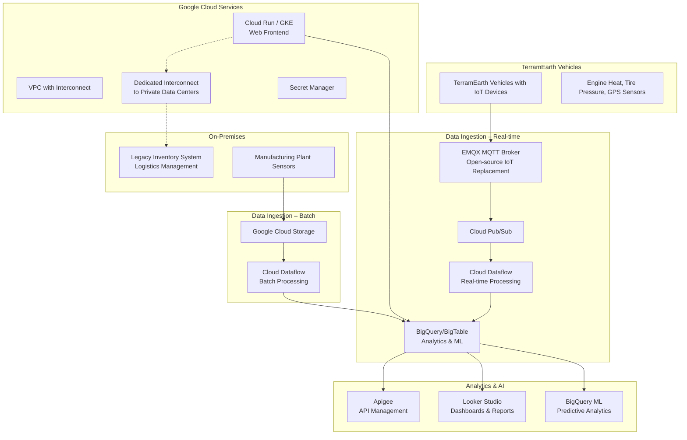
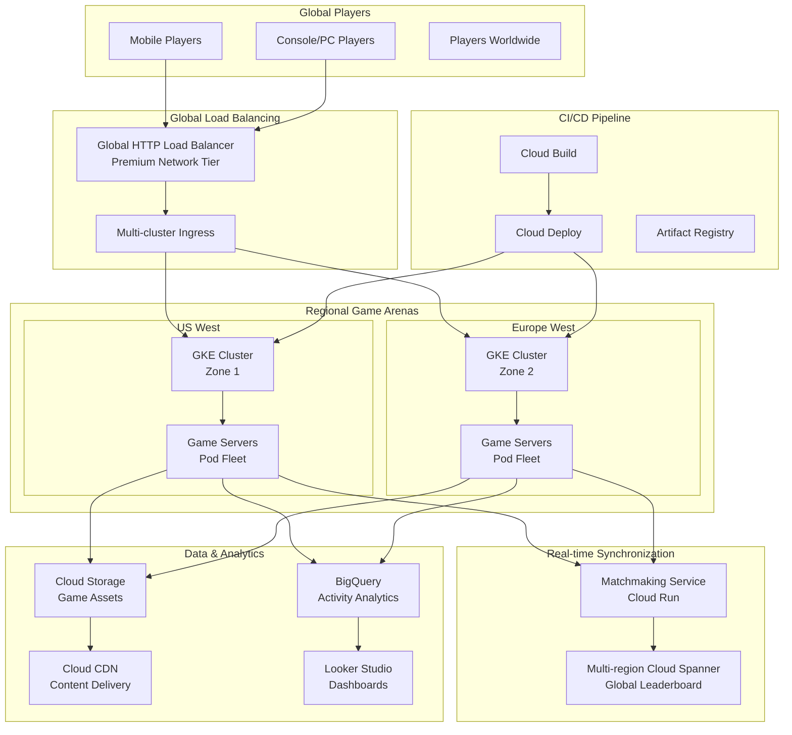

# Session 87: TerramEarth and Mountkirk Games Case Studies Demystification

## Table of Contents
- [Overview](#overview)
- [TerramEarth Case Study](#terramEarth-case-study)
  - [Company Overview](#company-overview-terramEarth)
  - [Solution Concept](#solution-concept-terramEarth)
  - [Existing Technical Environment](#existing-technical-environment-terramEarth)
  - [Business Requirements](#business-requirements-terramEarth)
  - [Technical Requirements](#technical-requirements-terramEarth)
  - [Executive Summary](#executive-summary-terramEarth)
  - [Architecture Diagram](#architecture-diagram-terramEarth)
- [Mountkirk Games Case Study](#mountkirk-games-case-study)
  - [Company Overview](#company-overview-mountkirk)
  - [Solution Concept](#solution-concept-mountkirk)
  - [Existing Technical Environment](#existing-technical-environment-mountkirk)
  - [Business Requirements](#business-requirements-mountkirk)
  - [Technical Requirements](#technical-requirements-mountkirk)
  - [Executive Summary](#executive-summary-mountkirk)
  - [Architecture Diagram](#architecture-diagram-mountkirk)
- [Exam Strategy and tips](#exam-strategy-and-tips)
- [Key Takeaways](#key-takeaways)
- [Quick Reference](#quick-reference)
- [Expert Insights](#expert-insights)

## Overview

This session focuses on Google's case studies used in the Professional Cloud Architect (PCA) exam. The case studies account for approximately 20-40% of exam questions and are crucial for success. The session covers:

- **TerramEarth**: Heavy equipment manufacturing company with IoT/telemetry big data challenges
- **Mountkirk Games**: Gaming company with real-time multiplayer gaming and global scale requirements

Both case studies follow a consistent pattern: company overview, solution concept, existing technical environment, business requirements, technical requirements, and executive summary. Understanding these end-to-end will help translate business problems into technical Google Cloud solutions.

## TerramEarth Case Study

### Company Overview (TerramEarth)

TerramEarth manufactures heavy equipment for mining and agriculture industries with 500 dealers and service centers across 100 countries. Their mission: "build products that make customers more productive."

**Business Context**: 
- 2 million vehicles in operation, 20% yearly growth
- Heavy equipment vehicles equipped with IoT devices for telemetry data
- Vehicles collect telemetry data (engine heat, tire pressure, etc.) via sensors
- Real-time critical data streamed for fleet management during operation
- Non-critical data compressed and uploaded daily when vehicles return to base

**Data Volume**: 
- Each vehicle generates 200-500 MB data per day
- **2 million vehicles × 500 MB = 1 PB daily** (2.4 million post 20% growth = 1.2 PB)
- Massive big data problem requiring managed services

### Solution Concept (TerramEarth)

**Core Challenge**: Ingest, process, and analyze massive telemetry data (1 PB/day) for predictive maintenance and operational efficiency.

**Architecture Components**:
- **Data Ingestion**: Real-time streaming via MQTT protocol (replacing discontinued IoT Core)
- **Data Processing**: Cloud Pub/Sub + Cloud Dataflow + BigQuery/Bigtable
- **Batch Processing**: Google Cloud Storage + Cloud Dataflow
- **Analytics**: BigQuery ML + Looker Studio (formerly Data Studio)

**Business Requirements Translation**:
- **2 million vehicles × 500 MB/day = massive data pipeline**
- **Hybrid Cloud**: Google Cloud for analytics, on-premises for legacy inventory
- **Predictive Analytics**: Convert telemetry into predictive maintenance + parts optimization
- **Global Scale**: 100 countries, 500 service centers

### Existing Technical Environment (TerramEarth)

**Hybrid Architecture**: Some workloads already in Google Cloud, others in data centers.

- **Google Cloud**: Data aggregation and analysis
- **On-Premises**: Two manufacturing plants, legacy inventory/logistics management
- **Connectivity**: Dedicated interconnect between data centers and Google Cloud
- **Web Frontend**: For dealers, customers in Google Cloud with access to inventory and analytics
- **Manufacture Plant Sensors**: Capture data from manufacturing processes

**Key Components**:
- Legacy inventory management system (on-premises)
- Logistics management system (on-premises)
- Web frontend (Google Cloud)
- Sensor data flow to private data center then Google Cloud
- Global serving across 100 countries

### Business Requirements (TerramEarth)

**Predict and Detect Vehicle Malfunction** - Real-time telemetry enables just-in-time repairs
**Decrease Cloud Operations Cost** - Use serverless products with seasonality adaptation
**Increase Speed of Development Workflow** - Use Dataflow templates and orchestrated pipelines

**Key Translations**:
- **Predictive Maintenance**: Use BigQuery ML or Vertex AI for predictive analytics on telemetry data
- **Serverless > Serverless**: Prefer Cloud Run over VMs to avoid ops work
- **Seasonality Adaptation**: Scale to zero during non-production periods using HPA & event-driven autoscaling

### Technical Requirements (TerramEarth)

1. **Self-Service Portal**: Portal for internal/partner developers to create projects, request resources, manage API access
2. **Identity-Based Access Control**: Use Secret Manager, KMS for secrets/encryption with role-based access
3. **API Abstraction**: Use Apigee or Cloud Endpoints for on-premises API exposure
4. **Legacy System Migration**: Migrate inventory/logistics to microservices using Cloud Run/GKE
5. **Monitoring Standardization**: Use Cloud Monitoring, Trace, Error Reporting for application/network troubleshooting

### Executive Summary (TerramEarth)

- **Competitive Advantage**: Excellent customer service minimizing downtime via predictive analytics
- **Migration Goals**: Move legacy systems to Google Cloud, maintain data residency compliance
- **Partner Ecosystem**: Enable data access for partners developing autonomous vehicle capabilities
- **Cost Reduction**: Use committed use discounts for long-term commitments

### Architecture Diagram (TerramEarth)



## Mountkirk Games Case Study

### Company Overview (Mountkirk)

Mountkirk Games creates online session-based multiplayer games, recently expanding to mobile platforms and other gaming devices. Successfully migrated on-premises infrastructure to Google Cloud and building new retro-style first-person shooter (FPS) games.

**Business Context**:
- **Retro FPS Game**: 200+ simultaneous players across geo-specific digital arenas
- **Leaderboards**: Real-time display of top players across all arenas
- **Platform Expansion**: Mobile, consoles, PC support
- **Latency Requirements**: Global multiplayer with strict latency constraints

### Solution Concept (Mountkirk)

**Core Architecture**:
- **Backends**: Google Kubernetes Engine (GKE) for scalability
- **Load Balancing**: Global HTTP(S) load balancing with regional route-to-player
- **Data Management**: Multi-region Cloud Spanner for real-time synchronization
- **Storage**: Cloud Storage with Cloud CDN for static content
- **Gaming Backend**: Open-source Game Servers on GKE

**Key Design Pattern**:
- Regional GKE clusters as game arenas
- Multi-cluster ingress for global player routing
- Game server matchmaking and assignment

### Existing Technical Environment (Mountkirk)

**Migration Status**: Recently migrated on-premises using lift-and-shift (VM-to-VM) with some exceptions.
- **Legacy Games**: Consolidated into single GCP projects
- **Development/Testing**: Separate environments
- **Organization Structure**: Folder-based project hierarchy with shared policies

**Current State**:
- **Project Structure**: `/org/folders/prod/dev/test`
- **Networking**: Global HTTP load balancer with regional backends
- **Legacy**: VM-based infrastructure requiring patching/maintenance
- **New Games**: Container-optimized DFS on GKE

### Business Requirements (Mountkirk)

**Multi-Platform Gaming**
- Support cross-platform play (mobile, console, PC)
- Seamless gameplay switching between devices
- Real-time leaderboard synchronization

**Developer Productivity**
- Rapid feature iteration and bug fixes
- CI/CD pipeline with quick deployment
- Remote development capabilities

**Latency Management**
- Minimize network lag (ranges 1-10ms target)
- Geographic player distribution
- Server-side validation

**Global Scale**
- Dynamic scaling based on game activity
- Cost management with seasonality adaptation
- Premium network tier utilization

### Technical Requirements (Mountkirk)

**Self-Service Platform**
- Internal developer API creation tools
- Partner project creation and management
- Budget tracking and governance

**Identity & Network Security**
- VPC Service Controls for data protection
- Service account-based authentication
- Centralized logging and monitoring

**Scalability & Cost Optimization**
- Horizontal Pod Autoscaling (HPA) with scale-to-zero capabilities
- Committed use discounts for predictable workloads
- Caching strategies (Cloud CDN, Memorystore)

**AI/ML Integration**
- Activity logging for player behavior analysis
- Predictive modeling for game balance
- Real-time analytics on gameplay metrics

### Executive Summary (Mountkirk)

- **Success Metrics**: First cloud migration enabled player behavior analytics capabilities never before possible
- **Cloud-Native Adoption**: All new games built with cloud-native patterns (GKE, serverless)
- **Innovation Strategy**: Open doors for new platform support beyond mobile
- **Priority Matrix**: Latency > Cost > Analytics capability
- **Development Velocity**: Expect cloud-enabling rapid deployment and iteration

### Architecture Diagram (Mountkirk)



 vicenda

<multiplay];大国

## Exam Strategy and Tips

### Exam Readiness
- **Question Volume**: Expect 8-20 questions per case study in exam
- **Preparation Method**: Study complete case studies thoroughly, don't rely on memory during exam
- **Time Management**: Allocate 30 seconds per case study question
- **Screen Layout**: Exam uses split-screen with case study on one side, questions on other

### Resume and Project Experience
- **Real Projects**: Use case studies as project experience in CV
- **Portfolio Building**: Document complete end-to-end implementations
- **Leadership Skills**: Demonstrate requirement analysis to technical solution mapping

### Architecture Generation Using AI
- **Tool Recommendations**: Test ERASER.IO architecture diagrams with imperfect but useful outputs
- **LLM Generation**: Use ChatGPT for Terraform snippets and diagrams with 70-80% accuracy
- **Validation Required**: Always validate AI-generated code and architectures

## Key Takeaways
```diff
+ Case studies account for 20-40% of PCA exam questions
+ TerramEarth represents big data/IoT challenges in heavy industry
+ Mountkirk Games demonstrates global gaming platform requirements
+ Both follow consistent pattern: overview → concept → environment → requirements → summary
+ Architecture generation possible using AI tools but requires validation
+ Predictive analytics and serverless are key patterns in modern cloud solutions
- IoT Core discontinued - use EMQX or other open-source alternatives
- Legacy systems require API abstraction layers via Apigee or Endpoints
- Assume hybrid cloud requirement unless specified otherwise
```

## Quick Reference

### TerramEarth Key Services
- **Data Ingestion**: EMQX (MQTT), Cloud Pub/Sub, Cloud Dataflow
- **Analytics**: BigQuery, Bigtable, BigQuery ML
- **Hybrid**: Dedicated Interconnect, Cloud VPN
- **API Management**: Apigee, Cloud Endpoints
- **Storage**: Multi-region GCS, Regional Dataflow/BigQuery

### Mountkirk Games Key Services
- **Gaming Backend**: GKE with Game Servers (Agone open-source)
- **Load Balancing**: Global HTTP Load Balancer, Multi-cluster Ingress
- **Database**: Multi-region Cloud Spanner
- **Content Delivery**: Cloud Storage + Cloud CDN
- **Monitoring**: Cloud Monitoring, VPC Service Controls

### Common Commands
```bash
# GKE game server deployment
kubectl apply -f game-server.yaml

# Dataflow template deployment
gcloud dataflow jobs run ingestion-job \
  --gcs-location gs://dataflow-templates/latest/GCS_Text_to_BigQuery \
  --parameters input=gs://bucket/data/*,output=bq_dataset.table

# Multi-region Spanner instance
gcloud spanner instances create game-leaderboard \
  --config=nam-eur-asia3 \
  --nodes=3
```

## Expert Insights

### Real-world Application
> [!NOTE]
> **TerramEarth Pattern**: Heavy equipment companies (Caterpillar, John Deere) implement similar IoT analytics for predictive maintenance
> 
> **Mountkirk Pattern**: Gaming companies (Ubisoft, Electronic Arts) use regional GKE deployments for global player distribution and real-time matchmaking

### Expert Path
- **Architectural Patterns**: Master hybrid cloud with API abstraction layers
- **Data Strategy**: Understand streaming vs batch processing pipelines
- **Global Scale**: Design for regional backends with global load balancers
- **Cost Optimization**: Use committed discounts and serverless with seasonality

### Common Pitfalls
> [!WARNING]
> **Skipping API Layers**: Legacy systems rarely expose APIs natively - always plan Apigee/Gateway integration
>
> **Assuming IoT Core**: TerramEarth case often uses wrong service - IoT Core discontinued in 2023
>
> **Underestimating Data Volume**: 1 PB calculations often ignored - impacts service selection (BigQuery/Bigtable vs Cloud SQL)

> [!WARNING]
> **Gaming Lacking Game Servers**: Mountkirk requires open-source game server understanding beyond just GKE
>
> **Spanner Region Misconfiguration**: Single region vs multi-region impacts 99.999% SLA and global leaderboards

### Lesser-Known Facts
```diff
! TerramEarth actually based on real company Terranext - agritech machinery manufacturer
! Mountkirk Games represents Ion game studio patterns - session-based multiplayer games only
! Case study content remains identical year-over-year - no updates to IoT Core references
! Dark mode simplification: 20% growth calculation points often missed in exam time pressure
```

**Transcript Corrections Made**:
- `terapform` → `terraform`
- `subcribed` → `subscribed`
- `finaly` → `finally`
- `scop` → `scope`
- Multiple grammatical corrections for clarity (spaces, missing words)
- IoT device references to vehicle sensors (clarified heavy equipment context)
- Pattern completion: standardized folder structure references

🤖 Generated with [Claude Code](https://claude.com/claude-code)

Co-Authored-By: Claude <noreply@anthropic.com>
