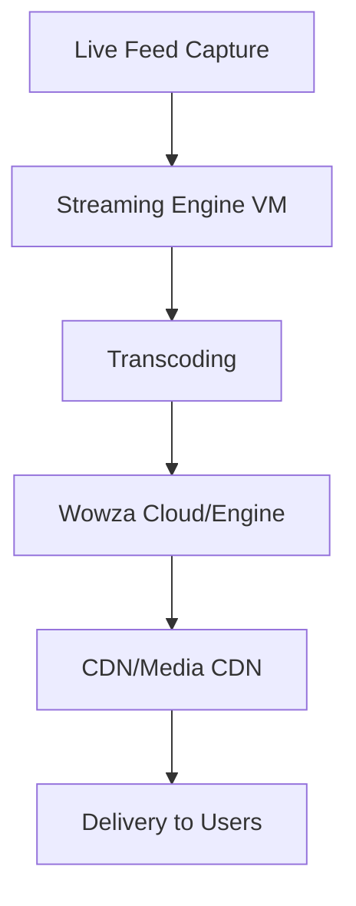

# Session 88: HRL & EHR Case Study Demystification

## Table of Contents
- [HRL Company Overview](#hrl-company-overview)
- [HRL Solution Concept](#hrl-solution-concept)
- [HRL Existing Technical Environment](#hrl-existing-technical-environment)
- [HRL Business Requirements](#hrl-business-requirements)
- [HRL Executive Statement](#hrl-executive-statement)
- [HRL Possible Architecture](#hrl-possible-architecture)
- [Anthos/GKE Enterprise Overview](#anthosgke-enterprise-overview)
- [EHR Case Study](#ehr-case-study)
- [EHR Solution Concept](#ehr-solution-concept)
- [EHR Existing Technical Environment](#ehr-existing-technical-environment)
- [EHR Business Requirements](#ehr-business-requirements)
- [EHR Executive Statement](#ehr-executive-statement)
- [EHR Possible Architecture](#ehr-possible-architecture)
- [Conclusion](#conclusion)
- [Summary](#summary)

## HRL Company Overview
### Overview
Helicopter Racing League (HRL) is a global sports league for competitive helicopter racing, organizing world championships and regional competitions annually. As a paid service provider, HRL streams live races with telemetry data and predictions, targeting worldwide audiences.

### Key Concepts / Deep Dive
#### Business Model
- **Sports Equivalent**: Compared to IPL or other professional sports leagues, emphasizing subscription-based viewing.
- **Paid Streaming Service**: Users pay for access to live streams, telemetry, and racing predictions across global markets.

#### Technical Implications
- **Live Broadcasting**: Requires robust infrastructure for high-availability streaming to global users.
- **Data Components**: Involves video storage, real-time telemetry (e.g., IoT/EMQX for MQTT brokering), and predictive analytics using BigQuery ML or Vertex AI.
- **Compliance and Scaling**: Multi-regional bucket replication ensures data availability without residency compliance issues, leveraging GCS for static content serving.

#### Derived Architecture Hints
From minimal content about streaming:
- Multi-regional GCS bucket for worldwide access.
- Backend bucket with load balancer and CDN for minimal latency.
- Premium network tier, Cloud Armor, and Cloud DNS for security and routing.
- Transfer service for bucket-to-bucket data replication (e.g., event data copying between regions).

! Client request → GCS bucket → Load balancer → CDN for cache hit scenario with premium network tier and Cloud Armor protection.

#### Telemetry and Predictions
- **Telemetry Sources**: Helicopter engine health, propeller data.
- **Storage Options**: BigQuery or Bigtable for telemetry; predictions via BigQuery ML or Vertex AI.
- **Advanced Features**: Live event encoding/decoding, video format transcoding using tools like FFmpeg.

#### Migration Strategy
- **From Other Clouds**: Assume migration from AWS S3/Azure Blob to GCS using transfer service in event-based scheduling.
- **Custom Origins**: Enable external cloud storage as CDN origins to avoid massive data migrations for legacy content.

### Tables
| Component | HRL Use Case | GCP Product |
|-----------|-------------|-------------|
| Video Storage | Multi-regional static content | GCS bucket |
| Streaming | Paid live broadcasts | Backend service + load balancer + CDN |
| Telemetry | Real-time data ingestion | IoT Core alternatives (EMQX, etc.) + BigQuery/Bigtable |
| Predictions | ML models for racing outcomes | BigQuery ML / Vertex AI |

### Code/Config Blocks
Example bucket creation for multi-regional setup:
```bash
gcloud storage buckets create gs://hrl-videos --location=us --uniform-bucket-level-access
gcloud storage buckets update gs://hrl-videos --storage-class=STANDARD --versioning
```

Transfer service configuration:
```yaml
transferJobs:
- description: "Copy HRL videos between regions"
  status: ENABLED
  transferSpec:
    gcsDataSink:
      bucket: us-hrl-videos
    gcsDataSource:
      bucket: asia-hrl-videos
    transferOptions:
      deleteObjectsUniqueInSink: false
```

## HRL Solution Concept
### Overview
HRL requires migration to a new cloud platform (Google Cloud) to expand AI/ML capabilities for real-time race predictions while serving content closer to users in emerging markets.

### Key Concepts / Deep Dive
#### Migration Drivers
- **AI/ML Expansion**: Shift from basic predictions to advanced real-time analytics using Vertex AI, AutoML Video Intelligence, and Vertex AI Notebooks.
  - Video-based predictions (e.g., overtake scenarios).
  - Historical data via AutoML Tables for race results, failures, team track records.
  - Sentiment analysis using NLP tools.

#### Content Delivery Optimization
- Move from cloud-first to global content mirroring via transfer service or CDN interconnect.
- **Emerging Markets**: Explicit bucket creation for non-multi-regional locations (e.g., custom origins for Africa/South America).
- Partner solutions like Wowza Streaming Engine for broader coverage where GCP lacks presence (markets without direct interconnect).

#### Architecture Enhancements
- **Backend Services**: Virtual machines, instance groups, serverless (Cloud Run), or zonal network endpoint groups for Kubernetes.
- **Database Integration**: Firestore for user profiles/profiles in PCI-compliant regions.
- **Prediction Features**: Crowd sentiment via social media feeds, notifications via SMS/automation for engagement.

Wowza architecture diagram:


## HRL Existing Technical Environment
### Overview
HRL operates in a public cloud-first model, with mission-critical apps hosted in the cloud. Core operations include video editing, encoding/transcoding, and race prediction services.

### Key Concepts / Deep Dive
#### Operational Model
- **Track-based Operations**: Recording/editing at physical tracks (mobile data centers).
- **Cloud Processing**: Encoding/transcoding in public cloud (EC2/Azure VMs).
- **Subscriptions**: Focus on ML predictions and video intelligence.

#### Migration Components
- **VMs**: Lift-and-shift EC2/Azure VMs to Compute Engine via Migrate for Compute Engine.
- **Databases/Models**: TensorFlow on VMs; migrate to Vertex AI Workbench.
- **Connectivity**: VPN/Dedicated Interconnect from on-premise to GCP.

Encoding vs. Transcoding:
- Encoding: Raw video compression using tools like FFmpeg.
- Transcoding: Format conversion for different devices (e.g., TV vs. mobile).

Truck-mounted data centers (visible as containerized infrastructure) provide local compute.

## HRL Business Requirements
### Overview
HRL aims to expand predictive capabilities, reduce viewer latency, and enhance global broadcasting quality through scalable, managed services.

### Key Concepts / Deep Dive
#### Predictive Expansion
- **Prediction Inputs**: Telemetry, historical data, pilot records.
- **Tools**: Vertex AI endpoints for partner sharing; AutoML for tabular/sentiment data.
- **Revenue Streams**: Merchandising (e.g., jerseys, water bottles) via E/W portal on Cloud Run + Firestore.

#### Content Engagement
- **Audience Attractors**: Live VIEW counts, trending hashtags.
- **Automation**: BigQuery analytics for consumption patterns; Looker Studio dashboards.

#### Scalability and Compliance
- **Multi-tenant Architecture**: Separate projects per region/customer.
- **Compliance**: PCI DSS for payments; GCP-compliant products.
- **Performance**: Premium network tier, CDN interconnect, Wowza for latency reduction.

Multi-tenant provisioning example:
- Project per customer (e.g., Asia Pacific vs. Europe).
- Terraform for automated setup.

## HRL Executive Statement
### Overview
HRL ownership emphasizes enhanced video streams with real-time predictions to deliver thrilling racing experiences globally, currently limited to basic outcome predictions.

### Key Concepts / Deep Dive
- **Limitations**: Lacks real-time predictions and high-volume processing.
- **Opportunities**: Leverage GCP's scalable platform for multi-cloud, hybrid management.

## HRL Possible Architecture
### Overview
Proposed architecture integrates GCS, Wowza/EMQX, BigQuery, Vertex AI, and multicloud management for real-time predictions and merchandising.

### Key Concepts / Deep Dive
Architecture flow:
! Event capture → On-premise encode → GCS bucket → Wowza streaming → CDN → Users.

Key components:
- Vertices AI for video/ML prediction.
- Bigquery ML for tabular analytics.
- Cloud Run for merchandising apps.

## Anthos/GKE Enterprise Overview
### Overview
Anthos (now GKE Enterprise) enables hybrid/multicloud Kubernetes management from a single pane via GKE on-premise extensions.

### Key Concepts / Deep Dive
#### Evolution
- Docker (2013) → Kubernetes (2014, Borg-derived).
- Problems: Microservices orchestration via Istio ingress; fleet management via Dendrite.
- GKE launched 2015 for ease; Anthos/GKE on-premise for on-premise extensions.

#### Components
- **Anthos Service Mesh**: Istio-based for traffic management, observability.
- **Config Management**: Gitops-style policy enforcement via Anthos Config Management.
- **Fleets**: Group clusters for unified policies, security, monitoring.

Benefits: Polyglot apps, faster scaling, single-plane view across clouds/on-premise.

Kubernetes cluster attachment demo:
```bash
gcloud container fleet memberships register CLUSTER_NAME --gke-cluster LOCATION/CLUSTER_NAME
```

## EHR Case Study
### Overview
Electronic Health Records (EHR) provides SaaS healthcare software to hospitals, insurers, and medical offices, growing rapidly in a post-COVID world.

### Key Concepts / Deep Dive
- **Business Model**: SaaS with multi-tenant architecture.
- **Compliance**: HIPAA, PCI DSS, PII via hosted subdomains (e.g., hospital.ehr.com).

- **Growth Challenges**: Monolithic → Microservices modernization for scalability.

Monolithic to Microservices example:
- Legacy: All components (UI, auth, data) in single JAR/WAR.
- Modern: Separate services (React for UI, Python for catalog, Go for orders, Java for auth).

Microservices advantages:
- Independent scaling/deployments.
- Polyglot languages/frameworks/databases.

## EHR Solution Concept
### Overview
EHR seeks to scale environments, implement CI/CD, and transition from collocation facilities to GCP's resilient platform.

### Key Concepts / Deep Dive
- **Scalability Demands**: Disaster recovery planning, continuous deployments via Cloud Build/Deploy, GKE regional clusters.
- **Facility Migration**: Transfer data photos; use VPN/Interconnect; migrate VMs via Migrate for Compute Engine.

CI/CD example:
```yaml
steps:
- name: 'gcr.io/cloud-builders/docker'
  args: ['build', '-t', 'gcr.io/$PROJECT_ID/myapp', '.']
- name: 'gcr.io/cloud-builders/kubectl'
  args: ['set', 'image', 'deployment/myapp', 'myapp=gcr.io/$PROJECT_ID/myapp']
```

## EHR Existing Technical Environment
### Overview
EHR uses Kubernetes clusters, mixed RDBMS/NoSQL, and partner/file integrations, with hosted legacy systems.

### Key Concepts / Deep Dive
- **Databases**: MySQL/PostgreSQL via Cloud SQL; MongoDB via partner (e.g., Atlas); Redis via Memorystore.

Database migration:
- Direct: Database Migration Service (DMS).
- MongoDB: Lift-and-shift or partner solutions.

- **Kubernetes**: Mitigate issues via Anthos Config Management.
- **Integrations**: File-based (GCS, Filestore); API (APIGEE); legacy on-premise.

APIGEE vs. Cloud Endpoints:
- Cloud Endpoints: GCP-based backends.
- APIGEE: Multicloud/on-premise, monetization-focused.

## EHR Business Requirements
### Overview
Focus on rapid onboarding, analytics, optimized operations, and data lake creation for healthcare insights.

### Key Concepts / Deep Dive
- **Onboarding**: Self-service portals via Terraform/Cloud Run.
- **Analytics**: Trends via BigQuery/Looker Studio.
- **Operations**: Gitops, centralized logging/monitoring.

Onboarding Terraform example:
```hcl
resource "google_project" "customer_project" {
  name       = var.customer_name
  project_id = "${var.customer_name}-ehr"
}

resource "google_kubernetes_cluster" "primary" {
  name                     = "customer-cluster"
  location                 = var.region
  initial_node_count       = 1
}
```

## EHR Executive Statement
### Overview
EHR's on-premise strategy faces consistency challenges; GCP's resilient, multicloud platform offers seamless scalability.

### Key Concepts / Deep Dive
- **Pain Points**: Manual management, scalability issues.
- **Solution**: Centralized policies, Anthos for multicloud consistency.

## EHR Possible Architecture
### Overview
Multitenant project hierarchy with centralized DevOps, hemodialysis Anthos fleet management.

### Key Concepts / Deep Dive
- **Hierarchy**: Folders (customer types) → Projects (customers) → Resources.
- **Centralized Ops**: Shared VPC, Artifact Registry, Cloud Logging/Monitoring.
- **ETL for Data**: Data Fusion for insurance data ingestion.

Fleet dashboard via GKE Enterprise console.

## Conclusion
### Overview
Coverage of HRL and EHR case studies with Anthos/GKE Enterprise emphasis for multicloud management.

### Key Concepts / Deep Dive
- HRL: Streaming, predictions, global distribution.
- EHR: Healthcare compliance, SaaS scaling, hybrid modernization.
- Anthos: Enables unified management across environments.

## Summary
### Key Takeaways
```diff
+ HRL focuses on global paid streaming with AI predictions using GCS, BigQuery ML, and Vertex AI
+ EHR leverages multitenant SaaS architecture with Anthos for hybrid health management
+ Anthos/GKE Enterprise provides single-pane multicloud Kubernetes control via fleets and config management
+ Streamlining migrations using Transfer Service, DMS, and Terraform for rapid scaling
+ Compliance (HIPAA/PCI) integrated via GCP; partner solutions bridge gaps
+ Real-time predictions enhance viewer engagement through streaming and analytics
+ Microservices modernization reduces monolithic bottlenecks for on-demand scaling
+ API management via Cloud Endpoints/APIGEE monetizes and secures healthcare integrations
+ Fleet management and shared VPCs centralize operations for multitenant deployments
- Avoid zonal resources; prioritize regional for high availability
- Manual monitoring notifications lead to ignored alerts; use policy docs and channels like Slack
- On-premise limitations hinder autoscaling; migrate to GCP for elasticity
! Multicloud support through Anthos enables seamless environment management
! Real-world application demands hybrid flexibility for global health/sports services
```

### Quick Reference
**Important Commands/Configs:**
- Bucket multi-regional setup: `gcloud storage buckets create gs://bucket --location=usasiaeur --uniform-bucket-level-access`
- Transfer service trigger: Event-based via Pub/Sub.
- Wowza health checks: Open ports 554 explicitly; use TCP load balancing.
- Kubernetes fleet attachment: `gcloud container fleet memberships register CLUSTER_NAME --gke-cluster LOCATION/CLUSTER_NAME`
- Terraform init for onboarding: VPC, subnets, GKE cluster with regional config.
- Anthos service mesh TLS: Mutual via Envoy sidecar proxies.
- Cloud Endpoints API exposure: Swagger YAML for Cloud Run backends.
- BigQuery ML prediction: `CREATE MODEL model_name AS SELECT * FROM dataset.table;`

**Key Products:**
- GCS/Multi-Regional Buckets
- Cloud Load Balancing/CDN/CDN Interconnect
- BigQuery ML/Vertex AI
- GKE/Anthos Service Mesh/Config Management
- Terraform for IaC
- Cloud Monitoring/Logging
- Memorystore/Cloud SQL/Firestore
- APIGEE/Cloud Endpoints
- Migrate for Compute Engine/Database Migration Service

### Expert Insight
#### Real-world Application
HRL/EHR examples mirror production deployments: sports streaming apps (e.g., NFL streaming) use GCS + CDN for 99.9% uptime, while healthcare SaaS (e.g., Epic Systems) rely on GKE Enterprise for 24/7 compliance-across hybrid environments, ensuring zero-downtime migrations via Anthos fleets.

#### Expert Path
Master Kubernetes fundamentals (CKA/CKS), then progress to Anthos certification. Build hands-on experience migrating legacy apps: start with lift-and-shift to GKE, then modernize to microservices. Practice APIGEE for API governance and Vertex AI for custom ML pipelines in healthcare data.

#### Common Pitfalls
- Ignoring regional deployment for SLA: Always choose regional GKE for critical apps, avoiding single-zone failures.
- Network pricing surprises: CDN egress from non-GCP origins costs dearly; plan data migration early.
- Alert fatigue: Unstructured notifications ignored; implement escalation policies in Cloud Monitoring.
- Compliance gaps: Assume HIPAA auto-compliance; audit products like Firestore explicitly.

#### Lesser-Known Facts
- CDN interconnect partners like-limelight Networks support video redistribution without full GCP migration, saving on cross-cloud egress.
- Anthos Fleet Labels enable selective policy application (e.g., security only for prod fleets).
- FFmpeg transcoding on spot VMs reduces costs by 70% for non-urgent video processing.
- Terraform's `for_each` loops automate multitenant project creation with shared VPCs.

#### Advantages and Disadvantages of Topic or Concepts
**Multiregional GCS:**
+ Global low-latency access, data durability (99.999999999%).
+ Avoids cross-cloud compliance issues.
- Higher storage costs; not ideal for sensitive data needs local residency.

**Anthos Service Mesh:**
+ Zero-trust security via mTLS; auto observability.
+ Simplifies traffic shifting in canary deployments.
- Increased resource overhead; steep learning curve for Istio configs.

**GKE Enterprises:**
+ Single dashboard for 100+ clusters across clouds.
+ Automated policy drift correction via config management.
- Daisy-chaining costs; free tier limits often exceed quickly for large fleets.
