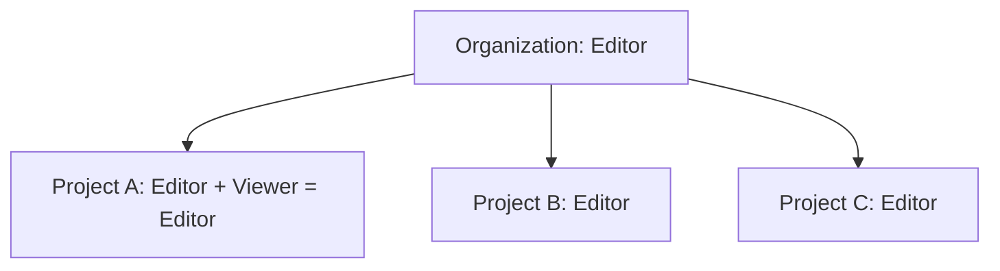

<details open>
<summary><b>Day 04 - Demo on Policy Inheritance, Deny Policy, Service Account Concept - Part 1 (KK-CS45-script-v2-Inst-v3)</b></summary>

# Session 04: Demo on Policy Inheritance, Deny Policy, Service Account Concept - Part 1

## Table of Contents
- [Introduction and Scenario Setup](#introduction-and-scenario-setup)
- [Policy Inheritance Demonstration](#policy-inheritance-demonstration)
- [Browser Role for Hierarchy Viewing](#browser-role-for-hierarchy-viewing)
- [Deny Policy Concept](#deny-policy-concept)
- [Deny Policy Implementation Demo](#deny-policy-implementation-demo)
- [Service Account Fundamentals](#service-account-fundamentals)
- [Service Account Types](#service-account-types)
- [Virtual Machine Service Account Practices](#virtual-machine-service-account-practices)
- [Access Scopes and Security Implications](#access-scopes-and-security-implications)
- [Summary](#summary)

## Introduction and Scenario Setup

The session demonstrates IAM policy inheritance mechanisms and advanced denial policies in Google Cloud Platform. Two primary scenarios explore inheritance behavior:

1. **High Privilege at Org Level**: Grant editor role at organization, restrict with viewer at project level
2. **Low Privilege at Org Level**: Grant browser at org, specific privileges at lower levels

This illustrates the **union operation** of IAM permissions and introduces **deny policies** as an override mechanism.

> [!NOTE]
> The demo uses a Cloud Identity managed user for clarity, avoiding email invites.

## Policy Inheritance Demonstration

IAM policies cascade from higher resource levels (Organization → Folder → Project). Permissions granted at superior levels automatically flow to subordinate resources.

### Demo Steps: High Privilege User Scenario

1. Create user `high-privilege-user@learnwithmahesh.org`

2. Assign Editor role at Organization level:
   ```bash
   gcloud organizations add-iam-policy-binding ORG_ID \
     --member=user:high-privilege-user@learnwithmahesh.org \
     --role=roles/editor
   ```

3. Observe: User gains access to all projects in the organization immediately

4. Attempted Restriction: Grant Viewer role at specific project ('website') level

   **Result**: Union operation prevails - Editor (inherited) ∪ Viewer = Editor access maintained

   ❌ **Key Learning**: Lower-level restrictions cannot override higher-level grants

### Inheritance Visualization



> [!IMPORTANT]
> This demonstrates why granting broad privileges at org/folder level creates governance challenges.

## Browser Role for Hierarchy Viewing

The Editor role provides modification privileges but lacks read access to the resource hierarchy structure.

### Browser Role Permissions
- `resourcemanager.projects.list`
- `resourcemanager.projects.get`
- `resourcemanager.folders.list`
- `resourcemanager.folders.get`
- `resourcemanager.organizations.get`

**Demonstration**: Assign browser role to high-privilege user → User can now view folder/project tree in IAM console.

> [!NOTE]
> Without browser role, users see granted roles but not inheritance details or hierarchy view.

### Key Observation
Even with editor access granted, the `iampolicy.getIamPolicy` permission is controlled separately, requiring organization administrator role for full inheritance visibility.

## Deny Policy Concept

Deny policies provide fine-grained permission blocking, overriding any inherited or directly granted access.

### Characteristics
- Introduced ~1.5 years ago (as of 2026 knowledge cutoff)
- Cannot deny individual resource operations (e.g., specific VM access)
- Applied at project/folder/organization level only
- Not available in GCP Console UI - requires gcloud/REST API/Terraform
- Use as safeguard against overly broad grants

> [!WARNING]
> Deny policies are the "band-aid" for privilege escalation issues.

### Deny Policy JSON Structure (Version 2 preferred)

```json
{
  "name": "deny-role-creation-in-production",
  "deniedPrincipals": [
    "principal://goog/subject/high-privilege-user@learnwithmahesh.org"
  ],
  "deniedPermissions": [
    "iam.roles.create"
  ],
  "restriction": null
}
```

**Version 1 (Legacy)** uses `deniedPrincipal` (singular) with `user:` prefix.

## Deny Policy Implementation Demo

### Scenario: Restrict High-Privilege User from Role Creation

1. Owner creates deny policy via command line:
   ```bash
   gcloud iam policies create deny-role-creation-policy \
     --project=website-project-id \
     --kind=deny-policy \
     --policy-file=deny-policy.json
   ```

2. Policy applies: User with Editor role can no longer create custom roles in the project

3. Verification: Attempt role creation → Permission Denied

4. Propagation: Takes 2-24 minutes for changes to reflect

### Cleanup
```bash
gcloud iam policies delete deny-role-creation-policy \
  --project=website-project-id
```

> [!NOTE]
> Deny policies allow selective override without removing base access grants.

## Service Account Fundamentals

Service accounts are application identities in Google Cloud, enabling secure API access without human credentials.

### Key Characteristics
- **Email Format**: `sa-name@project-id.iam.gserviceaccount.com`
- **Multiple VMs/Containers** can use same service account
- **Authentication**: OAuth 2.0 access tokens (preferred) or key-based authentication
- **Quota**: Up to 10 keys per service account (avoid keys whenever possible)

### Use Cases
- VM-to-VM communication
- Application-to-Cloud service interactions
- CI/CD pipelines and automated processes

> [!IMPORTANT]
> Service accounts are not "free users" - they provide programmatic access with defined privilege boundaries.

## Service Account Types

### 1. Google Managed Service Accounts
- Auto-created by Google for specific services
- **Touch Me Not** ✅ - Never modify, delete, or change roles
- Example: App Engine service accounts, internal system SAs
- Visible in contracts IAM list with "Google provided" filters turned on

### 2. Built-in Service Accounts
- Created when enabling APIs (e.g., Compute Engine default SA)
- Email: `<project-number>@project-number.iam.gserviceaccount.com`
- Default role: Editor (can be removed/modified)
- Known as `compute-engine-default-service-account@PROJECT_ID.iam.gserviceaccount.com`

### 3. User-created/Custom Service Accounts
- Recommended approach
- Up to 100 per project (default quota, increaseable)
- Created via console/CLI/Terraform
- Zero roles by default - assign minimal required privileges

> [!TIP]
> Always prefer custom service accounts over built-in ones for better governance.

## Virtual Machine Service Account Practices

### Demo: VM Data Processing Scenario

**Business Requirement**: VM generates data files and uploads to GCS bucket.

Three VM configurations演示 - good, bad, and dangerous:

#### 1. ✅ Recommended: Custom SA + Storage Admin Role
```bash
# Create custom service account
gcloud iam service-accounts create vm-data-generator \
  --description="SA for VM data processing" \
  --display-name="VM Data Generator"

# Grant minimal role
gcloud projects add-iam-policy-binding PROJECT_ID \
  --member=serviceAccount:vm-data-generator@PROJECT_ID.iam.gserviceaccount.com \
  --role=roles/storage.admin

# Create VM with SA
gcloud compute instances create vm-with-custom-sa \
  --service-account=vm-data-generator@PROJECT_ID.iam.gserviceaccount.com \
  --scopes=https://www.googleapis.com/auth/cloud-platform
```

**Result**: VM can read/write GCS, cannot modify Compute Engine resources

#### 2. ❌ Poor: Compute Engine Default SA + Editor Role
- Default SA has Editor across all services
- Risk: VM compromise → Full project control

#### 3. ❌ Dangerous: Default SA + Full Access Scopes
- Combines Editor role with unrestricted API access
- **Highest Security Risk** 🚨 - VM gains god-mode capabilities

> [!WARNING]
> Never create VMs with compute default SA + full scopes in production.

## Access Scopes and Security Implications

Access scopes are legacy authorization mechanism providing additional permission layering for VM service accounts.

### Functionality
- **Primary Control**: IAM roles on service accounts
- **Secondary Control**: Access scopes limit available permissions
- **Permissions Equation**: IAM Roles ∩ Access Scopes

### Scope Options
1. **Allow default access**: Limited storage/monitoring access
2. **Allow full access to all APIs**: No additional restrictions
3. **Set access for each API**: Granular per-service control

### Demonstration Findings
- Default scopes + Editor IAM = Restricted actual permissions (e.g., read-only Storage despite Editor)
- Full scopes = IAM permissions applied fully

> [!NOTE]
> Access scopes cannot be modified without VM restart. Prefer IAM-based control.

## Summary

### Key Takeaways

政策继承强调了简单性和潜在风险。有效的先决条件： 

```diff
+ IAM permissions cascade from org → folder → project with union operations
+ Deny policies provide selective overrides for overly broad access
+ Service accounts enable secure application-to-cloud communication
- Avoid high privilege grants at org level without careful control
- Built-in service accounts with editor role create privilege escalation risks
+ Use custom service accounts with least-privilege principle
```

### Quick Reference

**IAM Role Assignment:**
```bash
# Org level
gcloud organizations add-iam-policy-binding ORG_ID \
  --member=PRINCIPAL \
  --role=ROLE

# Project level
gcloud projects add-iam-policy-binding PROJECT_ID \
  --member=PRINCIPAL \
  --role=ROLE
```

**Deny Policy Management:**
```bash
# Create
gcloud iam policies create POLICY_NAME \
  --project=PROJECT_ID \
  --kind=deny-policy \
  --policy-file=policy.json

# List
gcloud iam policies list --project=PROJECT_ID

# Delete
gcloud iam policies delete POLICY_NAME --project=PROJECT_ID
```

**Service Account Operations:**
```bash
# Create
gcloud iam service-accounts create SA_NAME --display-name=DISPLAY_NAME

# Grant role
gcloud projects add-iam-policy-binding PROJECT_ID \
  --member=serviceAccount:SA_EMAIL \
  --role=ROLE
```

### Expert Insight

**Real-world Application**
- Enterprise environments use deny policies to enforce separation-of-duties controls
- Service accounts power microservices architectures, enabling secure inter-service communication
- Auto-scaling groups use shared service accounts for consistent permissions across dynamic instances

**Expert Path**
- Implement service account key rotation policies (90-day maximum)
- Use workload identity federation for secure cross-cloud authentications
- Master conditional IAM bindings with organization policies

**Common Pitfalls**
- Granting org-level editor "for convenience" - leads to unmonitored privilege escalation
- Forgetting deny policy propagation delays (up to 24 hours in edge cases)
- Using personal accounts for automated processes instead of service accounts
- Leaving compute engine default SA enabled after creating custom SAs

**Lesser-Known Facts**
- Service accounts can be granted cross-project roles, but keys remain project-bound
- Deny policies apply after IAM allow decisions (deny trumps allow)
- Google managed SAs use cryptographically signed tokens internally, no user-visible keys
- Access scopes originated from dev/staging production isolation in early GCP

**Advantages and Disadvantages of Key Concepts**

| Concept | Advantages | Disadvantages |
|---------|------------|---------------|
| Policy Inheritance | Simplified IAM management, reduced policy bloat | Broad grants lead to privilege creep, hard to audit |
| Deny Policies | Surgical permission overrides, zero-trust implementation | CLI-only, limited to resource level, complex interactions possible |
| Service Accounts | Application-centric security, independent of human access | Key management overhead, additional billing entities |
| Built-in SA | Zero setup for quick prototyping | Uncontrolled permissions, security liability if misused |
| Custom SA | Least-privilege enforcement, audit-friendly | Requires upfront planning, additional management |

🤖 Generated with Claude Code.

</details>