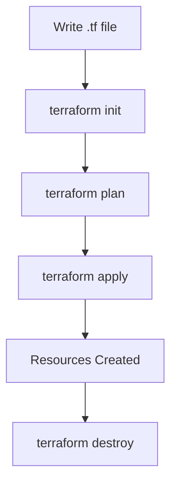

# Session 2: Cloud SDK, REST API, Terraform, and Cloud IAM Concepts

## Table of Contents
- [Cloud SDK and Client Libraries](#cloud-sdk-and-client-libraries)
- [REST API Fundamentals](#rest-api-fundamentals)
- [Using Google APIs Explorer](#using-google-apis-explorer)
- [Using Curl Command](#using-curl-command)
- [Using Postman](#using-postman)
- [Infrastructure as Code with Terraform](#infrastructure-as-code-with-terraform)
- [Cloud Shell Quiz](#cloud-shell-quiz)
- [Cloud IAM: Identity and Access Management](#cloud-iam-identity-and-access-management)
- [Identities in Cloud IAM](#identities-in-cloud-iam)
- [Roles in Cloud IAM](#roles-in-cloud-iam)
- [Summary](#summary)

## Cloud SDK and Client Libraries
### Overview
Client libraries provide programming language support for provisioning Google Cloud resources programmatically. Google Cloud offers support for languages like Go, Java, Node.js, Python, and others, allowing users to write scripts or code to interact with cloud services without deep programming knowledge. Tools like ChatGPT, Gemini, or Vertex AI can assist in generating boilerplate code for common tasks.

### Key Concepts and Deep Dive
Client libraries simplify resource management by encapsulating API calls into user-friendly methods. For example, creating a Google Cloud Storage (GCS) bucket involves importing the library, initializing a client, and calling a creation method. This approach is more developer-friendly than direct API manipulation and supports automation in CI/CD pipelines.

**Code Snippet for Python Client Library (Example):**
```python
from google.cloud import storage

# Initialize client
client = storage.Client()

# Create bucket
bucket_name = 'cloud-architect-gcs-python-client'
bucket = client.bucket(bucket_name)
bucket.create(project='your-project-id', location='US')
```

### Lab Demos
- **Provisioning GCS Bucket in Cloud Shell:** Use ChatGPT to generate Python code, paste it into Cloud Shell (`gcs.py`), and run with `python3 gcs.py` or `python gcs.py`. Refresh the Cloud Console to verify the bucket creation.

## REST API Fundamentals
### Overview
REST API serves as the foundation for all Google Cloud operations, underlying Console, CLI, client libraries, and Terraform. Everything in Google Cloud is API-driven, with each service exposing endpoints (e.g., `storage.googleapis.com`). Without APIs, no GUI or tooling exists.

### Key Concepts and Deep Dive
APIs follow REST principles using HTTP methods (e.g., GET, POST). They enable programmatic access for scenarios where client libraries aren't available (e.g., C language, Perl). Google emphasizes controller APIs for interactions.

| HTTP Method | Purpose in Context |
|-------------|-------------------|
| GET         | Retrieve resources (e.g., list buckets) |
| POST        | Create resources (e.g., new bucket) |
| PUT         | Update resources (with full payload) |
| DELETE      | Remove resources |

**Key Insight**: Even CLI tools like `gcloud` invoke APIs behind the scenes, visible via debug flags.

### Code/Config Blocks
**Debug Mode Example with gcloud:**
```
gcloud storage buckets list --verbosity=debug
```
This reveals API calls to `storage.googleapis.com`, highlighting the API-centric nature.

**Curl Command Structure:**
```
curl -X POST \
  -H "Authorization: Bearer <ACCESS_TOKEN>" \
  -H "Content-Type: application/json" \
  https://storage.googleapis.com/storage/v1/b \
  -d '{"name": "bucket-name", "location": "us-multi"}'
```

## Using Google APIs Explorer
### Overview
Google APIs Explorer is a built-in tool for testing and executing REST APIs without coding, with OAuth 2.0 authentication.

### Lab Demos
- Navigate to Google APIs Explorer, enable OAuth if prompted.
- **Create GCS Bucket:**
  1. Search for "Cloud Storage".
  2. Select `Buckets: insert` method.
  3. Input project ID (e.g., from URL bar or dashboard).
  4. Specify bucket name and parameters (e.g., "cloud-architect-v1").
  5. Execute and authorize access.
  6. Verify in Cloud Console (200 status code indicates success, with JSON response).

## Using Curl Command
### Overview
Curl is a command-line tool for sending HTTP requests, usable for REST API calls when OAuth tokens replace basic auth.

### Key Concepts and Deep Dive
Generate access tokens via `gcloud auth print-access-token`. Embed in curl commands for authentication. Useful for non-interactive environments or scripts.

### Lab Demos
- **Create GCS Bucket:**
  1. Obtain token: `gcloud auth print-access-token`
  2. Run curl: Replace token in the API call structure.
  3. Verify bucket creation with unique name (e.g., "cloud-architect-v2").

## Using Postman
### Overview
Postman is a graphical tool for API testing, supporting authentication, beautification, and request management.

### Lab Demos
- **Create GCS Bucket:**
  1. Import API from Explorer (endpoint: `https://storage.googleapis.com/storage/v1/b`).
  2. Set method to POST, add Bearer token.
  3. Send JSON body: `{"name": "bucket-name", "location": "us-multi"}`.
  4. Execute and verify (200 response, e.g., "cloud-architect-v3").

## Infrastructure as Code with Terraform
### Overview
Terraform enables declarative infrastructure provisioning, spinning up/down resources via code files (e.g., `.tf`). It's cloud-agnostic and supports planning via "dry runs."

### Key Concepts and Deep Dive
**Code Structure:**
```bash
terraform init  # Initialize provider
terraform plan  # Dry run
terraform apply # Provision
terraform destroy # De-provision
```

**Mermaid Diagram for Terraform Workflow:**


### Lab Demos
- **Provision VM via Terraform:**
  1. Generate snippet from Console (e.g., for Compute Engine instance).
  2. Create `main.tf` with code.
  3. Run `terraform init`, `terraform plan`, `terraform apply`.
  4. Confirm VM creation in Console.
  5. Destroy with `terraform destroy`.
- **Provision GCS Bucket:**
  1. Use Gemini/Vertex AI to generate Terraform code:
     ```hcl
     resource "google_storage_bucket" "bucket" {
       name     = "cloud-architect-tf-v1"
       location = "US"
     }
     ```
  2. Follow init-plan-apply cycle.
  3. Use `--auto-approve` for non-interactive runs.

> [!NOTE]
> Terraform states are persisted by default; use ephemeral mode for Cloud Shell to avoid storage issues.

## Cloud Shell Quiz
### Overview
The quiz tests understanding of Cloud Shell installation locations and persistence.

### Key Takeaways from Quiz
**Question 1: Persistent Custom Utility Install Location**
- Options: /tmp (not persistent), /opt (OS components), /home (persistent), /usr (system).
- Answer: /home – Ensures persistence across sessions.
- 💡 Tip: Use absolute paths in scripts, as shells may differ.

**Question 2: Default Region/Zone Setting**
- Question: Use `gcloud config set compute/region europe-west1` to set defaults.
- Explanation: `gcloud config set compute/region europe-west1` configures region for CLI commands.
- ✅ Correct: B) gcloud config set compute/region europe-west1
- ❌ Wrong options: A (manual navigation), C (zone instead of region), D (VPN setup).

## Cloud IAM: Identity and Access Management
### Overview
Cloud IAM defines "Who" (identities) can do "What" (roles) on "Which" resources, following least privilege. It applies at project, folder, or organization levels. Free service.

### Key Concepts and Deep Dive
IAM overlies resource permissions via roles. Identities must be Google-verified (e.g., via Workspace or Cloud Identity). Alternatives like Active Directory require synchronization for access.

## Identities in Cloud IAM
### Overview
Identities are principals (users, apps, services) authenticated for access. Service accounts act for apps/VMs, while users have human contexts.

### Key Concepts and Deep Dive
| Identity Type | Description | Use Cases | Creation Location |
|---------------|-------------|----------|-------------------|
| Google Account (Gmail) | Personal email (e.g., @gmail.com) | Self-learners | accounts.google.com |
| Workspace Account | Organizational (e.g., @example.com) | Enterprises using Google tools | admin.google.com |
| Cloud Identity | Sync-friendly for AD/SSO | Large orgs with AD | console.cloud.google.com |
| Directory Sync (Google Cloud Directory Sync) | Migrates AD users | Existing AD environments | Install tool on AD server |
| Groups | Collections of users (e.g., @googlegroups.com) | Bulk access (e.g., dev-team@example.com) | IAM console |
| Service Accounts | Non-human (e.g., @project.iam.gserviceaccount.com) | APIs, VMs | Console or `gcloud iam service-accounts create` |

**Code Snippet: Create Service Account**
```bash
gcloud iam service-accounts create gcs-sa \
  --display-name="GCS Service Account" \
  --description="For VM to GCS access"
```

### Lab Demos
- **Grant Access to Gmail User:** In IAM, add principal (e.g., simple-gcp-user@gmail.com), assign role (e.g., Editor).
- **Create Service Account:** Via Console or CLI, assign roles post-creation.
- **Verify Identity Types:** Attempt adding non-Google domains – fails prominently.

> [!IMPORTANT]
> Service accounts enable VMs to access services without human auth, using JSON keys or OS-level attachments.

## Roles in Cloud IAM
### Overview
Roles bundle permissions (e.g., storage.objects.create) for access control. Choose predefined for granularity over broad basic roles (Owner, Editor, Viewer).

### Key Concepts and Deep Dive
**Basic/Primitives:** Broad, deprecated for production (e.g., Owner: ~10,000 permissions).
**Predefined:** Service-specific (e.g., Storage Admin: 55 permissions), maintained by Google.
**Custom:** User-defined for unique needs, requiring maintenance.
**Role Granting:** Assign roles to identities at resource/resource levels.

**Table: Role Comparisons**
| Role Type | Permissions Count (Approx.) | Maintenance | Best For |
|-----------|-----------------------------|-------------|---------|
| Basic (e.g., Owner) | 10,000+ | Hosted | Admin-intensive grants |
| Predefined (e.g., Storage Admin) | 50-500 | Google | Standard tasks |
| Custom (e.g., Combined Permissions) | User-defined | You | Rare business logic |

### Lab Demos
- **Explore Roles:** In IAM > Roles, filter by service (e.g., Compute Engine: 45 roles).
- **Custom Role Scenario:** Create role allowing bucket creation but not deletion – select granular permissions.

## Summary

### Key Takeaways
```diff
+ Google Cloud operations rely on APIs, accessible via SDK, client libraries, Terraform, or direct calls
+ IAM follows "Who can do What on Which resources" with least privilege as a best practice
+ Service accounts enable programmatic, non-human access for security
- Avoid basic roles in production; use predefined for specific services
- Persistence in Cloud Shell requires /home installations
! API endpoints (e.g., storage.googleapis.com) are universal across tools
```

### Expert Insight
**🚀 Real-world Application**: In enterprise environments, integrate AD via Directory Sync for seamless IAM; use Terraform for multi-cloud deployments to maintain consistency across providers.

**🧠 Expert Path**: Master IAM by earning Professional Cloud Architect certification; focus on organization-level policies (e.g., SCP equivalents) and OAuth 2.0 flows for app integrations.

**⚠️ Common Pitfalls**: Granting Owner prematurely leads to accidental deletions – always start with minimal roles. Mistakes: Ignoring role bindings can cause "permission denied" errors when switching projects.

**🔍 Lesser Known Things**: Terraform backends store state remotely (e.g., GCS bucket) for team collaboration, preventing state file conflicts. Custom roles can include deny permissions, overriding undefined cases in complex hierarchies. Service accounts can impersonate users for elevated actions without permanent role escalation. Cloud Identity's "Premium Edition" enables SSO without Workspace, ideal for budget-constrained setups.
