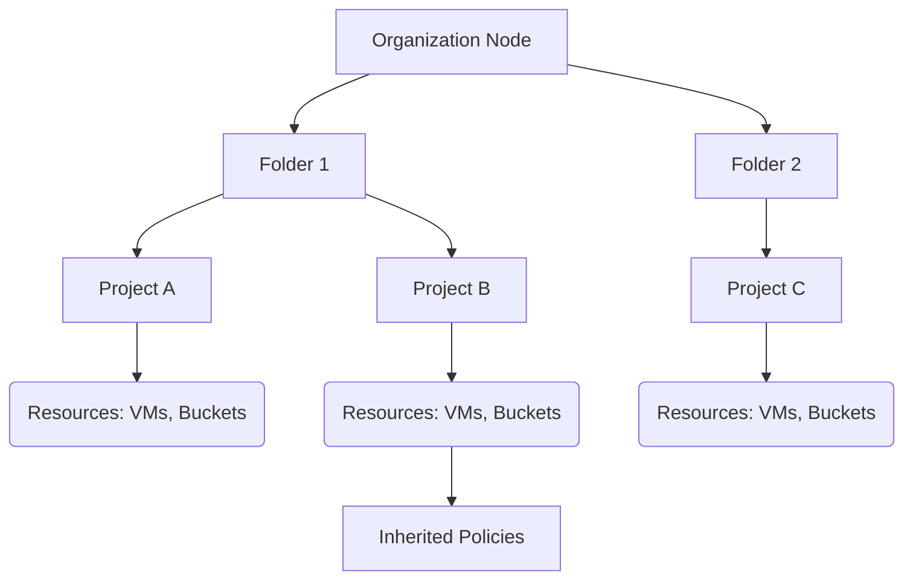

# Session 3: Principle of Least Privilege, IAM Policy Binding, What & Why Organization

## Table of Contents
- [Principle of Least Privilege Overview](#principle-of-least-privilege-overview)
- [Basic Roles: Editor, Owner, and Viewer](#basic-roles-editor-owner-and-viewer)
- [Demo: Assigning Editor Role and Testing Permissions](#demo-assigning-editor-role-and-testing-permissions)
- [Predefined Roles and Over-Privileges](#predefined-roles-and-over-privileges)
- [Demo: Using Predefined Roles (Compute Engine Admin and Storage Admin)](#demo-using-predefined-roles-compute-engine-admin-and-storage-admin)
- [Custom Roles: Creation and Application](#custom-roles-creation-and-application)
- [Demo: Creating Custom Role for VM Management](#demo-creating-custom-role-for-vm-management)
- [IAM Policy Binding and Commands](#iam-policy-binding-and-commands)
- [Demo: Granting Access via CLI](#demo-granting-access-via-cli)
- [Bucket-Level Permissions](#bucket-level-permissions)
- [Organization Node: Why and How](#organization-node-why-and-how)
- [Resource Hierarchy: Organization, Folders, Projects](#resource-hierarchy-organization-folders-projects)
- [Organization Policies: Constraints and Enforcement](#organization-policies-constraints-and-enforcement)
- [Custom Roles at Organization Level](#custom-roles-at-organization-level)
- [Summary](#summary)

## Principle of Least Privilege Overview

The principle of least privilege is a fundamental security concept that dictates users (or systems) should only be granted the minimum permissions necessary to perform their required tasks and nothing more. This approach minimizes security risks like accidental data exposure, unauthorized access, or potential malicious activity by limiting the scope of privileges.

🔐 **Key Principles:**
- Grant only essential permissions for specific roles
- Regularly review and revoke unnecessary privileges
- Avoid over-provisioning of rights that could be exploited

In cloud environments like Google Cloud Platform (GCP), this principle is implemented through fine-grained Identity and Access Management (IAM) roles that control access to specific resources and operations.

## Basic Roles: Editor, Owner, and Viewer

**Overview:**  
Google Cloud provides three basic roles at the project level: Owner, Editor, and Viewer. These roles offer broad permissions but often lead to over-privileged access, violating the principle of least privilege.

**Key Concepts:**

📝 **Role Definitions:**
- **Viewer:** Read-only access to resources; cannot modify or create anything
- **Editor:** Read/write access including ability to delete, create, and manage most resources
- **Owner:** Full control over project including IAM management; can assign/remove other owners

⚠ **Limitations:**
- These roles are project-wide and don't allow granular control
- Viewer provides too few permissions in many use cases
- Editor and Owner often grant excessive permissions that exceed requirements

💡 **When to Use (Rarely):** Basic roles should be avoided in favor of predefined or custom roles due to their blanket permissions.

## Demo: Assigning Editor Role and Testing Permissions

**Overview:**  
This demo demonstrates the over-privileged nature of the Editor role using a Gmail user account for testing.

**Lab Steps:**

1. **Account Setup:**
   ```bash
   # Use a Gmail ID for testing (no organization-based accounts needed)
   # Two accounts: Owner (learn-gcp-with-mahesh@gmail.com) and Test User (simple-gcp-user@gmail.com)
   ```

2. **Assign Editor Role:**
   - Navigate to IAM & Admin → IAM
   - Click "Grant"
   - Add user email: `simple-gcp-user@gmail.com`
   - Select "Basic" → "Editor" role
   - Click "Save" (note: no notification sent for non-owner roles)

3. **Verify Access:**
   - Log out and log in as test user
   - Refresh IAM page to confirm "Editor" role
   - Check for project visibility (may take 7-10 minutes for propagation)

4. **Test VM Permissions:**
   - Create VM instance with default settings
   - Verify SSH access works
   - Attempt start/stop operations → ✅ **Allowed**
   - Attempt delete operation → ❌ **Should fail but Editor allows it over-privilege detected**

5. **Test Storage Permissions:**
   - Upload object to existing bucket → ✅ **Allowed**
   - Create new bucket → ❌ **Should fail but Editor allows it**
   - Delete bucket → ❌ **Should fail but Editor allows it over-privilege detected**

> [!IMPORTANT]
> Editor role grants compute.instances.delete and storage.buckets.delete permissions, making it unsuitable for least privilege scenarios where a user should create/manage but not delete resources.

6. **Additional Permissions Test:**
   - Verify test user can see all service accounts and IAM roles (information disclosure risk)
   - Confirm inability to grant roles to others (lacks iam.roles.* or resource-manager.projects.setIamPolicy)

> [!NOTE]
> The Editor role displays ~8,693 permissions across all services, far exceeding minimal requirements.

## Predefined Roles and Over-Privileges

**Overview:**  
Predefined roles offer service-specific granularity but often include excessive permissions for common use cases.

**Key Concepts:**

📋 **Predefined Role Categories:**
- Service-specific roles (e.g., Compute Engine Admin, Storage Admin)
- Managed and maintained by Google
- Updated automatically when new permissions are added

⚠ **Common Issues:**
- **Compute Engine Admin** (*~868 permissions*): Includes instance management but allows deletion
- **Storage Admin** (*~55 permissions*): Includes bucket/object creation and deletion
- Roles with "Admin" in name typically grant excessive privileges

✅ **Best Practice:** Review permissions list before assignment using IAM roles filtering and testing.

## Demo: Using Predefined Roles (Compute Engine Admin and Storage Admin)

**Overview:**  
Testing predefined roles continues to reveal over-privilege issues despite being more granular than basic roles.

**Lab Steps:**

1. **Assign Predefined Roles:**
   - In IAM, select "Predefined" filter
   - Assign both `Compute Engine Admin` and `Storage Admin` roles
   - Log out/login to propagate changes

2. **Test Compute Permissions:**
   - Attempt VM creation without additional service account access → ❌ **Fails** (requires IAM service account serviceAccountUser role)
   - Add IAM serviceAccountUser role as additional role
   - VM creation now succeeds
   - Verify start/stop works but deletion capability exists (over-privilege)

3. **Test Storage Permissions:**
   - Create new bucket → ✅ **Allowed ( violates requirements)**
   - Upload objects → ✅ **Allowed**
   - Delete objects/buckets → ❌ **Should fail but allowed**

> [!IMPORTANT]
> Predefined roles often exceed least privilege requirements. The storage.objectCreator role (~17 permissions) proves more suitable for upload-only scenarios.

## Custom Roles: Creation and Application

**Overview:**  
Custom roles allow precise permission selection, enabling true least privilege implementation by granting only required permissions.

**Key Concepts:**

🔧 **Creation Process:**
- Select specific permissions from ~8,000+ available
- Project-level scope (can be organization-level with proper hierarchy)
- Google managed vs. user-maintained roles

⚖ **Advantages vs. Disadvantages:**
- ✅ Exact permission matching
- ✅ Least privilege compliance  
- ❌ Requires manual maintenance
- ❌ Cannot inherit new permissions

📊 **Permission Table:**

| Permission Type | Typical Use Case | Risk Level |
|-----------------|-------------------|------------|
| compute.instances.create | VM provisioning | Low |
| compute.instances.start | VM management | Low |
| compute.instances.stop | Resource control | Low |
| compute.instances.delete | Destructive operation | High |

> [!NOTE]
> Custom roles should be named descriptively (e.g., "custom-compute-instance-admin") and marked as Generally Available.

## Demo: Creating Custom Role for VM Management

**Overview:**  
Create a custom role removing delete permissions to achieve least privilege for VM management.

**Lab Steps:**

1. **Review Compute Instance Admin Role:**
   - Filter for compute engine roles
   - Examine permissions list (~393 permissions)
   - Confirm compute.instances.delete exists

2. **Create Custom Role:**
   - Navigate to IAM → Roles → Create Role
   - Title: "Custom Compute Instance Admin"
   - Description: "Manage VMs without delete permissions"
   - Add permissions: compute.instances.* (except delete)
   - Stage: Generally Available
   - Permission count: ~392

3. **Assign Custom Role:**
   - Replace Compute Engine Admin with custom role
   - Test VM start/stop functionality → ✅ **Works**
   - Test VM deletion → ❌ **Blocked** (achieves requirement)

4. **Storage Solution:**
   - Assign predefined `Storage Object Creator` role (~17 permissions)
   - Test bucket listing → ❌ **Blocked**
   - Test object upload → ✅ **Allowed**
   - Test object deletion → ❌ **Blocked**

> [!IMPORTANT]
> Combining custom roles with predefined roles enables least privilege across multiple services while maintaining security boundaries.

## IAM Policy Binding and Commands

**Overview:**  
IAM policy binding represents the connection between identities (users, groups, service accounts) and roles. The "binding" concept appears more prominently in CLI operations.

**Key Concepts:**

🔗 **Binding Components:**
- **Member:** User, group, service account, or domain
- **Role:** IAM role identifier
- **Binding:** Complete relationship object in JSON/YAML format

💻 **Common Commands:**
- `gcloud projects get-iam-policy <project-id>`: Retrieve current bindings
- `gcloud projects add-iam-policy-binding --member=user:<email> --role=<role-id>`: Add binding
- `gcloud projects remove-iam-policy-binding --member=user:<email> --role=<role-id>`: Remove binding

> [!NOTE]
> Policy operations are eventually consistent and may take several minutes to propagate.

## Demo: Granting Access via CLI

**Overview:**  
Demonstrate IAM operations using both gcloud CLI and gsutil for comprehensive access control testing.

**Lab Steps:**

1. **Grant Domain Access (Dangerous Example):**
   - Command: `gcloud projects add-iam-policy-binding <project-id> --member=domain:@myorg.com --role=roles/viewer`
   - All Google users get viewer access ⚠️ **Not recommended**

2. **Command Line Policy Retrieval:**
   - Run: `gcloud projects get-iam-policy <project-id> --format=yaml > iam-policy.yaml`
   - Examine JSON structure showing member-role bindings

3. **Bucket-Level CLI Access Grant:**
   - Create bucket: `gsutil mb -p <project-id> gs://<bucket-name>`
   - Grant access: `gsutil iam ch user:<email>:roles/storage.objectCreator gs://<bucket-name>`
   - Verify upload permission retained

> [!WARNING]
> Domain-level grants can be extremely permissive. Always use specific user/group assignments when possible.

## Bucket-Level Permissions

**Overview:**  
Permissions can be applied at the bucket level instead of project-wide, enabling resource-specific access control that aligns with least privilege.

**Key Concepts:**

🗂️ **Bucket-Level Advantages:**
- More granular than project-level assignments
- Restricts access to specific resources
- Reduces blast radius of compromised credentials

⚙️ **Implementation:**
- Navigate to Cloud Storage → Buckets → [bucket-name] → Permissions
- Add principals with specific roles
- URL-based sharing with gs:// protocol

> [!IMPORTANT]
> Bucket-level permissions prevent listing all buckets while allowing specific resource operations, enhancing security posture.

## Organization Node: Why and How

**Overview:**  
An organization node provides hierarchical IAM management, policy inheritance, and enhanced security controls not available in standalone projects.

**Key Concepts:**

🏢 **Core Benefits:**
- Centralized IAM administration
- Policy inheritance through resource hierarchy
- Custom role sharing across projects
- Organization-level security constraints

🔀 **Creation Requirements:**
- Google Workspace account or Cloud Identity
- Domain ownership verification (TXT record)
- May involve extra setup vs. standalone projects

> [!NOTE]
> Organization nodes represent a "job with benefits" model where structured management replaces individual project freedom.

## Resource Hierarchy: Organization, Folders, Projects

**Overview:**  
Google Cloud resources follow a hierarchical structure: Organization → Folders → Projects → Resources.

**Key Concepts:**

🏗️ **Hierarchy Levels:**
1. **Organization Node:** Top-level container with global policies
2. **Folders:** Grouping mechanism for projects with policy inheritance
3. **Projects:** Resource boundaries and access isolation
4. **Resources:** Actual cloud services (VMs, buckets, etc.)

🔄 **Inheritance Flow:**
- Policies flow down the hierarchy (transitive)
- Resources inherit IAM roles from higher levels
- Overrides possible at lower levels
- Billing flows up from bottom to top



> [!IMPORTANT]
> Custom roles only creatable at organization or project levels (not folders). Resources deploy only within projects.

## Organization Policies: Constraints and Enforcement

**Overview:**  
Organization policies provide centralized security and compliance controls that prevent risky configurations.

**Key Concepts:**

📜 **Policy Types (~126 available):**
- **Compute Instance External IP:** Block/allow external IPs
- **Storage Public Access Prevention:** Prevent public bucket exposure
- **Service Account Restrictions:** Control service account usage

🔒 **Implementation:**
- Set at organization level
- Inherit by default or override at project level
- Retroactive enforcement (existing resources affected)

💡 **Common Policies:**
```yaml
# Example organization policy to disable external IPs
name: "constraints/compute.restrictLoadBalancerCreationForTypes"
listPolicy:
  deniedValues: ["LOAD_BALANCER"]
```

> [!WARNING]
> Policy enforcement prevents attempting risky actions, reducing attack surface through configuration hardening.

## Custom Roles at Organization Level

**Overview:**  
Organization-level custom roles enable consistent IAM across multiple projects, improving scalability and maintainability.

**Key Concepts:**

🌐 **Advantages:**
- Created once, usable across all projects/folders
- Facilitates multi-environment role consistency
- Simplifies role management in complex organizations

🔍 **Identification:**
- Organization roles: `organizations/{org-id}/roles/{role-name}`
- Project roles: `projects/{project-id}/roles/{role-name}`

> [!NOTE]
> Organization roles solve the scalability issue of recreating custom roles across multiple projects for dev/test/prod environments.

## Summary

### Key Takeaways

```diff
+ Google Cloud provides three basic roles (Viewer, Editor, Owner) that are generally over-privileged for least privilege scenarios
+ Predefined roles offer service-specific granularity but often include unnecessary deletion permissions
- Avoid basic roles and unrestricted predefined roles when least privilege is required
+ Custom roles enable precise permission control by allowing manual selection of only required permissions
- Custom roles require manual maintenance and cannot automatically inherit new permissions added by Google
+ IAM policy binding represents the relationship between identities and roles, appearing in CLI operations
+ Organization nodes enable hierarchical access management, policy inheritance, and organization-wide custom roles
- Standalone projects offer less control and role sharing compared to organization hierarchies
+ Organization policies provide security constraints like disabling external IPs or preventing public bucket access
+ Bucket-level permissions enable fine-grained resource access without project-wide visibility
```

### Expert Insight

**Real-world Application:** In enterprise environments, implement organization hierarchies with folder separation between development, staging, and production environments. Create custom roles at the organization level for consistent least privilege across teams, and leverage organization policies to enforce compliance requirements like data residency or encryption standards.

**Expert Path:** Start with Infrastructure as Code (IaC) tools like Terraform to manage IAM bindings as code. Progress to automated access reviews using Cloud Asset Inventory and scheduled scripts to identify and remediate over-privileged accounts. Master organization policy constraints and consider Google Cloud's built-in compliance frameworks (e.g., CIS, NIST) for blueprint implementations.

**Common Pitfalls:**
- Automatically assigning "Admin" roles when "Creator" or custom roles suffice, leading to unnecessary blast radius
- Forgetting policy inheritance can grant access through organizational structure rather than explicit assignment  
- Using project-level custom roles instead of organization-level, creating maintenance overhead across multiple environments
- Misspelling permission names in custom roles (e.g., "compute.instances.delete" vs "compute.instances.delete") preventing proper enforcement
- Granting roles at project level when bucket- or resource-level permissions achieve the same security with less exposure

**Lesser Known Aspect:** The gsutil iam command uses different permission models than project-level IAM grants. Service account domain impersonation risks are often overlooked but can escalate privileges significantly beyond assigned roles through cloud-custodian checks. Organization policies can enforce retention policies on resource deletion, preventing accidental data loss even with proper deletion permissions assigned.
