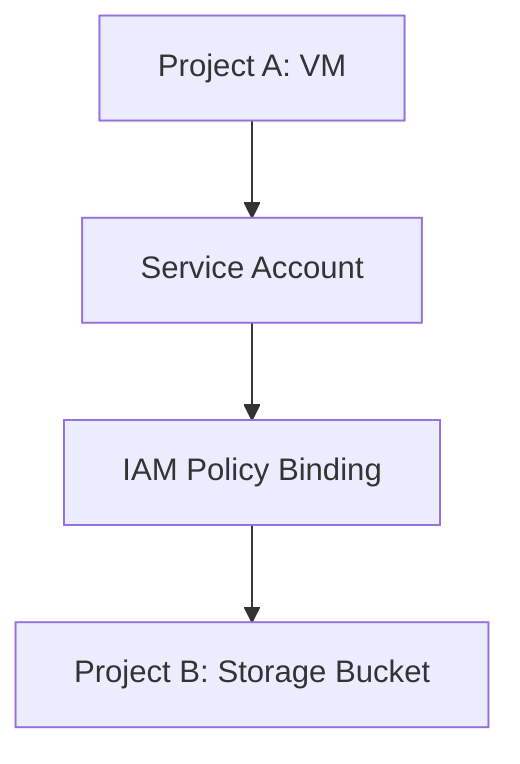

```diff
+ Policy Inheritance: Hierarchical flow where permissions cascade from organization → folders → projects → resources
+ Deny Policy: Security control that overrides allow policies for specific scenarios, configured via gCloud CLI
+ Service Accounts: Machine identities using email addresses for authentication, essential for automated workloads
- Never use default Compute Engine service account with full access scopes in production
- Avoid organization-level Editor roles without deny policies for restrictions
```

### Expert Insights

**Real-world Application:**
In enterprise environments, policy inheritance enables consistent security models across large portfolios. Deny policies protect critical production resources, while service accounts enable secure automation workflows like data pipelines and scheduled operations between different Google Cloud services.

**Expert Path:**
Master IAM hierarchies by creating multi-folder organizational structures, implement deny policies for production guardrails, and migrate to workload identity instead of service account keys. Use `gcloud iam` commands extensively and audit policies regularly with `gcloud projects get-iam-policy`.

**Common Pitfalls:**
- Granting high privileges at organization level makes restriction impossible without deny policies
- Using default service accounts with access scopes introduces unnecessary complexity and security risks
- Service account key creation instead of workload identity increases attack surface
- Assumptions about immediate IAM policy propagation not accounting for 2-7 minute delays
- Lack of service account lifecycle management leading to accumulation of unused accounts

### Common Issues and Resolution
1. **IAM Propagation Delays**: Access changes appear effective locally but aren't propagated globally for 2-7 minutes. Wait for completion before testing.
2. **Access Scope Restrictions**: VM can't use service account permissions due to legacy access scopes. Solution: Don't use access scopes, rely purely on IAM.
3. **Browser Role Missing**: Users can't see resource hierarchy without roles/browser. Solution: Grant browser role for cross-project visibility.
4. **Deny Policy Override**: Even owners can't perform denied actions. Solution: Use strategic deny policies, not role removals.
5. **Service Account Impersonation**: Applications can't authenticate. Solution: Use workload identity instead of keys for GKE/Compute Engine.

### Virtual Machine Service Account Implementation

**Requirements Addressed:**
- Production VM without frequent restarts
- Data generation by application running on VM
- Long-term storage in Cloud Storage buckets

**Architecture Pattern:**
```
VM (Custom Service Account) → IAM Policy → Cloud Storage Bucket
       ↓
   Application Code
       ↓
   Generated Data → Storage Operations
```

**Three Implementation Approaches:**

#### Approach 1: Default Service Account with Access Scopes (NOT RECOMMENDED)
```bash
# VM Creation
gcloud compute instances create default-sa-vm \
  --service-account=<project-id>-compute@developer.gserviceaccount.com \
  --scopes=storage-rw

# Results
✅ Default access to project buckets
✅ Simple configuration
❌ Limited permissions by scopes
❌ Cannot restrict or expand effectively
❌ Requires VM restart for changes
```

#### Approach 2: Custom Service Account (RECOMMENDED)
```bash
# Create custom service account
gcloud iam service-accounts create vm-data-generator \
  --description="VM service account for data processing"

# Grant targeted permissions
gcloud projects add-iam-policy-binding my-project \
  --member=serviceAccount:vm-data-generator@my-project.iam.gserviceaccount.com \
  --role=roles/storage.admin

# VM Creation
gcloud compute instances create custom-sa-vm \
  --service-account=vm-data-generator@my-project.iam.gserviceaccount.com \
  --scopes=https://www.googleapis.com/auth/cloud-platform

# Results
✅ Precise permissions via IAM
✅ No access scopes complexity
✅ Change permissions without VM restart
✅ Supports granular access control
❌ Requires service account management
```

#### Approach 3: Dangerous Configuration (NEVER USE)
```bash
# Dangerous setup
gcloud compute instances create dangerous-vm \
  --service-account=<project-id>-compute@developer.gserviceaccount.com \
  --scopes=https://www.googleapis.com/auth/cloud-platform

# Results
❌ Extremely broad permissions (~4K rights)
❌ Can perform destructive operations
❌ Security nightmare for production
```

### Cross-Project Resource Access

**Problem Statement:**
VM in Project A needs to access Storage bucket in Project B

**Solution Architecture:**


**Implementation Steps:**
1. **Service Account Creation** (Project A)
```bash
gcloud iam service-accounts create cross-project-sa \
  --project project-a
```

2. **IAM Policy Binding** (Project B)
```bash
# Grant storage access to bucket in different project
gsutil iam ch \
  serviceAccount:cross-project-sa@project-a.iam.gserviceaccount.com:objectAdmin \
  gs://target-bucket
```

3. **VM Configuration** (Project A)
```bash
gcloud compute instances create cross-project-vm \
  --service-account=cross-project-sa@project-a.iam.gserviceaccount.com \
  --scopes=default-access \
  --project project-a
```

4. **Testing Operations**
```bash
# From VM in Project A, access bucket in Project B
gsutil ls gs://target-bucket/
gsutil cp data.txt gs://target-bucket/
# Results: Perfect granular access across projects
```

### Best Practices for Enterprise Adoption

1. **Service Account Lifecycle**
   - Create for specific workloads
   - Use descriptive naming conventions
   - Regularly audit unused accounts
   - Rotate keys every 90 days if keys cannot be avoided

2. **IAM Security**
   - Apply principle of least privilege
   - Use deny policies strategically
   - Enable audit logging for IAM changes
   - Regular IAM policy reviews

3. **Automation Patterns**
   - Infrastructure as code for service accounts
   - Automated key rotation systems
   - Workload identity preferred over keys
   - Service account impersonation for CI/CD

### Lesser-Known Aspects

**Service Account Capabilities:**
- One service account can be used by multiple VMs simultaneously
- Service accounts can represent entire applications, not just individual instances
- Can be granted access to resources across different projects and organizations
- Support both programmatic and user-like authentication patterns

**IAM Propagation Details:**
- Changes can take 2-7 minutes minimum, often longer for complex hierarchies
- Some UI elements show "working" state before actual propagation is complete
- CLI might show different results than UI due to caching layers
- Workload identity changes propagate faster than traditional IAM

**Organization Policy Interactions:**
- Organization policies can override IAM policies
- Domain restrictions may block certain service account operations
- Resource location constraints affect cross-region access
- Service account key restrictions can be enforced at organization level

**Advanced Scenarios:**
- Service accounts can be granted organization-level roles (rare, dangerous)
- Deny policies support exception lists for selective overrides
- Service account delegation enables chain-of-trust authentication
- Workload identity federation allows external identity providers
