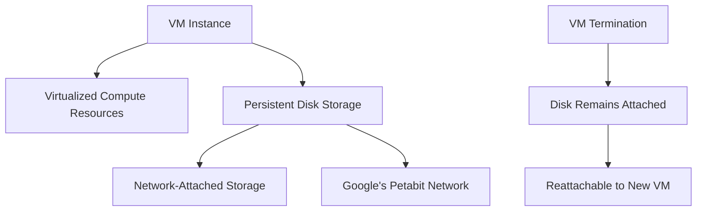
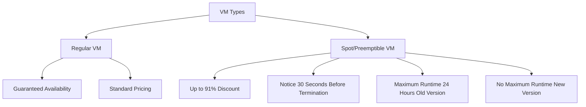

# Session 9: IaaS, CaaS, PaaS, FaaS Compute Concepts, Predefined Machine Type, Custom Machine Type, Persistent Disk

## Table of Contents
- [Introduction](#introduction)
- [Compute Service Models](#compute-service-models)
- [Infrastructure as a Service (IaaS) - Compute Engine](#infrastructure-as-a-service-iaas---compute-engine)
- [Container as a Service (CaaS) - GKE](#container-as-a-service-caas---gke)
- [Platform as a Service (PaaS) - App Engine](#platform-as-a-service-paas---app-engine)
- [Function as a Service (FaaS) - Cloud Functions/Cloud Run](#function-as-a-service-faas---cloud-functionscloud-run)
- [Migration Examples](#migration-examples)
- [Predefined Machine Types](#predefined-machine-types)
- [Custom Machine Types](#custom-machine-types)
- [Persistent Disk Storage](#persistent-disk-storage)
- [VM Classes (Regular vs Spot/Preemptible)](#vm-classes-regular-vs-spotpreemptible)
- [Summary](#summary)

## Introduction

### Overview
This session covers the core compute options available in Google Cloud Platform (GCP), starting with fundamental service models and progressing through implementation details. We'll focus on the "journey" approach: understanding how to choose the right abstraction level for different use cases, from full control (infrastructure as service) to zero operational overhead (serverless).

### Key Concepts
- **Service Models**: Four main abstraction layers with decreasing management responsibility
- **Compute Engine**: GCP's IaaS offering for virtual machines
- **Machine Types**: Predefined configurations vs. custom specifications
- **Storage**: Persistent disks for VM-attached storage
- **VM Classes**: Regular vs. preemptible/spot instances for cost optimization

## Compute Service Models

### Overview
Google Cloud compute options follow an abstraction ladder from on-premise-like control to fully managed serverless execution. This enables choosing the appropriate level of management based on application needs and team expertise.

### Key Concepts

#### Abstraction Ladder
As we move from bottom to top:
- **Control decreases**: Less infrastructure management
- **Abstraction increases**: More Google-managed components
- **Ops responsibility decreases**: From full infrastructure ownership to application-only focus

#### Service Model Comparisons

| Aspect | On-Premise | IaaS | CaaS | PaaS | FaaS |
|--------|------------|------|------|------|------|
| Management | Full control | Infrastructure + OS | Containers only | Application only | Code only |
| Responsibility | Everything | Patching, scaling | Orchestration | Deployment | Execution |
| Analogy | Own car | Commute by taxi | Car pooling | Hired car | City buses |

#### On-Premise Comparison
- **Infrastructure ownership**: Own data center with full hardware management
- **Scaling**: Manual capacity planning and hardware procurement
- **Migration focus**: Source environment assessment (hypervisors, vCenter, etc.)

## Infrastructure as a Service (IaaS) - Compute Engine

### Overview
Infrastructure as a Service provides the highest level of control among cloud offerings, similar to owning your own car on a commute. You get full access to underlying infrastructure while Google handles physical hardware maintenance.

### Key Concepts

#### Analogy and Control Levels
```
Control Spectrum: Own Car (IaaS) > Car Pooling (CaaS) > Taxi (PaaS) > Bus (FaaS)
```

What you **can control** in IaaS:
- Operating System (Linux distributions: Ubuntu, CentOS, Red Hat; Windows Server versions)
- Runtime versions (Python 3.7, 3.8, Java versions)
- Virtual CPU and memory allocation
- Storage types (SSD vs HDD vs local SSD)
- Network configurations

What you **cannot control**:
- Physical hardware specifications
- Hypervisor type (Google uses KVM)
- Underlying chipset/manufacturer
- Full engine mechanics (in car analogy)

#### Management Responsibilities
```diff
+ Operating system patching and updates
+ Application runtime management
+ Capacity planning and scaling
+ Backup and disaster recovery
+ Security hardening at OS level
```

#### GCP Implementation
- **Service Name**: Compute Engine (GCE) or Google Compute Engine
- **Comparable AWS Service**: Elastic Compute Cloud (EC2)
- **Comparable Azure Service**: Virtual Machines
- **Pricing**: Pay for compute resources only when VMs are running

#### Machine Configuration Example
```bash
# Example VM creation with specific configurations
Operating System: Ubuntu 20.04 LTS
CPU: 4 vCPUs
Memory: 16 GB
Storage: 100 GB SSD persistent disk
```

### Real-world Application
IaaS suits traditional applications requiring:
- Full OS-level control and customization
- Legacy applications with specific OS dependencies
- Stateful applications needing persistent storage
- Workloads with predictable, stable resource needs

### Common Pitfalls
```diff
- Not implementing automated patching leads to security vulnerabilities
- Under-provisioning resources causes performance degradation
- Over-provisioning wastes cloud budgets
- Ignoring backup strategies risks data loss
! Forgetting to stop VMs after testing incurs unnecessary costs
```

## Container as a Service (CaaS) - GKE

### Overview
Container as a Service abstracts infrastructure management while providing full control over container orchestration. This is similar to car pooling - you share infrastructure but maintain travel control.

### Key Concepts

#### Container Fundamentals
- **Definition**: Portable application packaging technology (Docker containers)
- **Run Anywhere**: Same behavior across development and production environments
- **Architecture**: Application + dependencies + runtime = single deployable unit

#### GCP Implementation
- **Service Name**: Google Kubernetes Engine (GKE)
- **Analogy**: Car pooling - shared infrastructure, cooperative resource usage
- **Comparable AWS Service**: Elastic Kubernetes Service (EKS)
- **Comparable Azure Service**: Azure Kubernetes Service (AKS)

#### Focus Areas
Developer emphasis shifts from:
```diff
- Infrastructure provisioning
+ Application containerization
+ Kubernetes orchestration
+ Service mesh management
```

### Real-world Application
- Microservices architectures with dynamic scaling needs
- DevOps pipelines requiring consistent environments
- Applications needing horizontal scaling
- Multi-cloud portability requirements

### Common Pitfalls
```diff
- Complex cluster management for small teams
- Initial learning curve for Kubernetes concepts
- Resource over-provisioning in multi-tenant clusters
- Network security misconfigurations between pods
! Stateful application data persistence challenges
```

## Platform as a Service (PaaS) - App Engine

### Overview
Platform as a Service completely abstracts infrastructure, handling OS, runtime, and scaling automatically. This is like hiring a taxi - you focus only on your destination while the service manages everything.

### Key Concepts

#### Service Specifications
- **Runtime Restrictions**: Limited language versions (e.g., Python 3.12 only, no Python 2.7)
- **First GCP Product**: Launched in 2008 with "upload and deploy" simplicity
- **Billing Model**: Pay only when application processes requests, zero when idle

#### Resource Management
```diff
+ Automatic horizontal scaling
+ Built-in load balancing
+ Health checks and auto-healing
+ Integrated monitoring and logging
- Plattform version constraints
- Vendor lock-in potential
! Limited access to underlying OS
```

#### GCP Implementation
- **Service Name**: App Engine
- **First Product**: Only application code deployment required
- **Comparable AWS Service**: Elastic Beanstalk (partial), AWS Lambda (with API Gateway)
- **Comparable Azure Service**: Azure App Service

### Real-world Application
- Web applications with variable traffic patterns
- APIs needing automatic scaling
- Small to medium applications with simple deployment needs
- Teams preferring focus on business logic over infrastructure

### Common Pitfalls
```diff
- Runtime version limitations break legacy applications
- Vendor lock-in challenges during cloud migration
- Difficult debugging without OS access
- Cost estimation difficulties with variable scaling
! Slow cold starts for infrequently accessed applications
```

## Function as a Service (FaaS) - Cloud Functions/Cloud Run

### Overview
Function as a Service (FaaS) provides the highest abstraction level, focusing purely on code execution triggered by events. This eliminates all infrastructure concerns.

### Key Concepts

#### Merger and Evolution
- **2023 Merger**: Cloud Functions capabilities merged into Cloud Run
- **Unified Service**: Now Cloud Run Functions for all serverless execution
- **Previous Limitation**: Cloud Functions required specific runtimes and scaling patterns

#### Trigger Examples
```diff
+ HTTP requests triggering webhooks
+ Cloud Storage object uploads
+ Pub/Sub message reception
+ Cloud Scheduler timed events
```

#### Service Comparison

| Characteristic | Cloud Functions | Cloud Run Functions |
|----------------|-----------------|---------------------|
| Runtime Support | Limited languages | Any containerized app |
| Execution Length | Short (timeout limits) | Long-running services possible |
| Scaling | Event-driven | Request-driven |
| Portability | GCP-bound | Cross-cloud viable |

#### GCP Implementation
- **Current Name**: Cloud Run Functions
- **Comparable AWS Service**: AWS Lambda
- **Comparable Azure Service**: Azure Functions
- **Cloud Run**: Serverless containers without infrastructure

### Real-world Application
- Event-driven microservices (file processing, data transformation)
- Webhooks and API integrations
- Scheduled tasks and automation
- Real-time streaming data processing

### Common Pitfalls
```diff
- Cold start latency for infrequent executions
- Execution timeout limits for long-running tasks
- Vendor lock-in for proprietary services
- Debugging challenges without persistent environments
! Cost monitoring required for event volume spikes
```

### Lesser Known Things
- **Container to Lambda Migration**: Cloud Run can run containerized Lambda functions
- **Beyond GCP**: Cloud Run containers deployable to AWS ECS/Fargate, Azure ACI
- **GraalVM Support**: Faster cold starts using native image compilation

## Migration Examples

### Overview
Service model selection often depends on existing application architecture and team expertise.

### Key Concepts

#### Stateful vs Stateless Assessment
**Problem**: State-dependent applications (using persistent file storage)
- **Initial Planning**: Assumed container migration to Cloud Run
- **Discovery**: Application used directory-based storage (`/mnt/data`)
- **Solution Change**: Switched to GKE (full Kubernetes control) instead of Cloud Run (stateless only)

#### Cost-Skill Analysis Framework
```
Migration Assessment Question:
├── Does team have Kubernetes expertise?
│   ├── Yes → Consider GKE
│   └── No → Consider Cloud Run/App Engine
├── Is application stateful?
│   ├── Yes → GKE required
│   └── No → Cloud Run viable
└── Is application compute-intensive?
    ├── Yes → Custom machine types
    └── No → Predefined types
```

#### Real Migration Case Study
- **Source**: AWS EKS (Kubernetes) with MySQL database in PHP
- **Challenge**: Non-Kubernetes skilled team, legacy codebase
- **Options Assessed**:
  - **Cloud Run**: Stateless preference, but code used stateful storage
  - **App Engine**: Runtime version support check (PHP compatibility)
  - **Result**: Recommended GKE with code refactoring, team training

### Expert Insight
- **Assessment Tools**: Use Google Migration Center for automated analysis
- **Code Analysis**: Leverage Gemini/Vertex AI to understand application behavior
- **Progressive Migration**: Start with lift-and-shift to IaaS, then refactor to higher abstractions

## Predefined Machine Types

### Overview
Predefined machine types offer packaged configurations optimized for specific workloads, similar to laptop configuration tiers (gaming, business, content creation).

### Key Concepts

#### Series Types and Use Cases

| Series | Workload Type | Memory Ratio | Example Use Case |
|--------|----------------|--------------|------------------|
| E2 | General Purpose | 3.75 GB per vCPU | Day-to-day applications |
| N2/N4 | Balanced/General | 4 GB per vCPU | Web servers, databases |
| C3/C4 | Compute Optimized | Low memory ratio | Scientific computing |
| M3 | Memory Optimized | 8 GB per vCPU | In-memory databases (SAP HANA) |
| A4 | GPU Accelerated | Varies | ML training, rendering |
| Z3 | Storage Optimized | High storage ratio | Big Data analytics |

#### Special Purpose Types
```diff
+ F1-micro, G1-small: Learning/testing (free tier eligible)
+ LOCAL-SSD options: Extremely low latency (NVMe)
+ GPU varieties: NVIDIA A100, V100, T4 configurations
```

#### Generation Evolution
- **N1**: First generation (deprecated in some regions)
- **N2**: Second generation, broader availability
- **N4**: Latest, optimized performance
- **AMD Support**: "d" suffix (C3D, etc.) indicates AMD processors

#### Disk Throughput Limits
Each series has published IOPS limits:
- **N2 standard-4**: ~16,000 IOPS
- **N2 ultra-high-memory**: Higher limits for large instances
- **Local SSD**: Millions of IOPS for high-performance needs

### Relations Application
Select series based on application characteristics:
1. **Compute-bound**: Use C-series with minimal memory allocation
2. **Memory-bound**: Choose M-series with maximum memory density
3. **Balanced workloads**: N-series for most business applications
4. **Learning/development**: E2 or F1/G1 (cost-effective)

### Common Pitfalls
```diff
- Using general-purpose for specialized workloads wastes budget
- Ignoring IOPS limits causes performance bottlenecks
- Not using right-sizing recommendations after initial deployment
- Forgetting regional availability of newer series
! Using deprecated series without migration planning
```

### Lesser Known Things
- **Regional Differences**: Series availability and pricing vary by region
- **AMD vs Intel**: Performance characteristics differ (AMD scales better horizontally)
- **Burstable Instances**: E2 provides burstable CPU credits for varying loads

## Custom Machine Types

### Overview
Custom machine types provide precise resource allocation not available in predefined configurations, enabling cost optimization through exact resource matching.

### Key Concepts

#### Configuration Rules
```diff
+ vCPU must be even numbers (minimum 2, no odd numbers like 3, 5)
+ Memory in 0.25 GB increments (e.g., 17.25 GB allowed, 17.3 GB not)
+ Maximum: 208 vCPUs, 12 TB memory (varies by series)
```

#### Cost Comparison Analysis

Real pricing example (Singapore region):
```diff
! Standard-8 (N2-series): 8 vCPU, 32 GB memory = $289.28/month
+ Custom equivalent: 8 vCPU, 30 GB memory = $265.63/month
- Cost difference: $23.65 saved (7.9% reduction)
+ Even more optimized: 6 vCPU, 17.25 GB = $String $189.44/month
- Total savings vs original: $99.84/month (34.5% reduction)
```

#### Implementation Examples
```bash
# gcloud command for custom machine creation
gcloud compute instances create my-instance \
  --machine-type custom-8-17408 \  # 8 vCPUs, 17.25 GB memory
  --zone us-central1-a
```

### Real-world Application
- **Proprietary Applications**: Exact resource requirements known
- **Cost Optimization**: Precise budgeting for predictable workloads
- **Migration Scenarios**: Matching existing on-premise configurations

### Common Pitfalls
```diff
- Rounding errors in memory calculations (must be quarter-GB aligned)
- Odd vCPU selections rejected
- Over-sizing beyond actual application needs
- Not comparing with predefined options first
! Series restrictions (N1 only supports 1 vCPU minimum in some zones)
```

### Lesser Known Things
- **Memory:vCPU Ratios**: Can be far outside predefined limits
- **Live Migration**: Custom types support live migration like predefined
- **Bursting Support**: E2 custom types inherit bursting capabilities

## Persistent Disk Storage

### Overview
Persistent disks provide network-attached storage that survives VM termination, enabling reliable data persistence with various performance characteristics.

### Key Concepts

#### Architecture Types



#### Disk Types Comparison

| Type | Technology | Performance | Price/Month | Use Case |
|------|-----------|-------------|-------------|----------|
| Standard | HDD | Lower IOPS | Lowest | Cold storage, backups |
| Balanced | SSD | Medium IOPS | Medium | Most workloads |
| SSD | SSD | High IOPS | High | Database, analytics |
| Extreme | SSD | Highest IOPS | Highest | High-throughput applications |

#### Key Features
```diff
+ Persistent across VM lifecycle
+ Hot-attachable to running VMs
+ Independent scaling from compute
+ Regional replication for disaster recovery
+ Snapshot and backup capabilities
```

#### Attachment Limitations
```diff
+ Maximum 128 disks per VM
+ Maximum 257 TB total storage per VM
+ Minimum 10 GB per disk
+ Maximum 64 TB per individual disk
```

### Real-world Application
- **Database Storage**: SSD or Extreme for transactional workloads
- **Application Data**: Balanced for general-purpose requirements
- **Backup Storage**: Standard HDD for cost-effective archival
- **High-Performance Computing**: Extreme disks for HPC workloads

### Common Pitfalls
```diff
- Not configuring appropriate disk types causes performance issues
- Exceeding attachment limits requires architectural changes
- Regional snapshots cost more than zonal
- Not using right-sized disks leads to stranded capacity
! Forgetting encryption key management for CMEK-enabled disks
```

### Lesser Known Things
- **Regional vs Zonal**: Regional disks survive zone outages
- **Hyperdisk Architecture**: Google's next-generation storage with guaranteed IOPS
- **Balanced Series**: Provides consistent performance without over-provisioning

## VM Classes (Regular vs Spot/Preemptible)

### Overview
VM classes provide different pricing and availability models. Regular VMs offer guaranteed availability while spot instances provide deep discounts at risk of interruption.

### Key Concepts

#### Preemptible VM (PVVM) vs Spot VM



#### Cost Savings Analysis
```diff
! Example: 8 vCPU, 32 GB VM in Singapore
+ Regular VM monthly cost: $289.28
+ Spot VM discount: 91% savings
- Effective cost: $26.04/month
+ Potential savings: $263.24/month
```

#### Termination Handling
Spot VMs send signals 30 seconds before termination:
```bash
# Shutdown script example
#!/bin/bash
# Graceful application shutdown
systemctl stop my-application
# Persist in-memory data to disk
save_application_state_to_disk
# Optional: Send notification
curl -X POST https://webhook.example.com/termination-notice
```

#### Use Cases
```diff
+ Batch processing jobs
+ Data analytics pipelines
+ Machine learning training
+ Non-critical development environments
- Mission-critical production systems
- Long-running stateful applications
```

### Real-world Application
- **Distributed Computing**: Hadoop/Spark jobs utilizing multiple spot instances
- **Cost-Controllable Development**: Environment scaled down overnight
- **Data Processing Pipelines**: ETL workloads with job resumption capability

### Common Pitfalls
```diff
- Using for stateful applications without data persistence planning
- Not implementing graceful shutdown scripts
- Over-relying on spot availability causing delays
- Budgeting without interruption buffer
! Not testing application resilience to interruptions
```

### Lesser Known Things
- **Spare Capacity Usage**: Spot VMs utilize Google's unused compute capacity
- **Availability Variances**: Popularity affects interruption frequency by region/zone
- **Reservation Integration**: Reservations don't apply to spot instances
- **Sustained Use Discounts**: Incompatible with spot pricing (can't combine)

## Summary

### Key Takeaways
```diff
+ Infrastructure as a Service provides maximum control but requires patching/scaling management
+ Container as a Service ideal for microservices with Kubernetes orchestration
+ Platform as a Service best for simple web applications needing auto-scaling
+ Function as a Service perfect for event-driven code without infrastructure concerns
+ Custom machine types enable precise resource allocation saving up to 35% costs
+ Persistent disks offer varying performance levels from HDD to extreme SSD
+ Spot instances provide 91% discounts but with 30-second termination notices
- Wrong service model selection leads to increased costs or management overhead
! Migration assessments critical - stateful vs stateless determines viable options
```

### Expert Insight

#### Real-world Application
**Hybrid Approach Example:** Large enterprises often use CaaS for application containers while maintaining IaaS for legacy databases. Custom machine types handle specialized workloads like SAP HANA, while spot instances power development and testing environments.

#### Expert Path
1. **Foundation**: Master basic VM creation, SSH access, and disk management
2. **Orchestration Skills**: Gain GKE proficiency for containerized workloads
3. **Serverless Mastery**: Learn Cloud Run for new applications and Cloud Functions for events
4. **Cost Optimization**: Understand sustained usage discounts and committed use contracts
5. **Advanced Patterns**: Implement autoscaling policies, managed instance groups, and Terraform IaC

#### Common Pitfalls
**Configuration Drift Issues:** Teams customize OS configurations outside automation systems, leading to unpatchable vulnerabilities and manual recovery requirements.

**Spot VM Reliance Risks:** Over-dependency on cheap spot instances causes SLA breaches when cloud provider needs capacity back.

**Disk IOPS Bottlenecks:** Applications fail unexpectedly due to storage performance limits not matching compute capacity.

#### Lesser Known Things
**Petabit-Scale Operations:** Google's internal network enables near-instant cross-zone disk operations that seem local but span data centers.

**Live Migration Magic:** VMs migrate between hosts with zero downtime, enabling seamless maintenance and optimization.

**Tenth Regional Resources:** Regional persistent disks and load balancers survive zone outages, crucial for enterprise continuity.

** Burstable CPU Crediting:** E2 instances accumulate "CPU credits" for burst performance, enabling cost-effective variable workloads without constant high provisioning.
