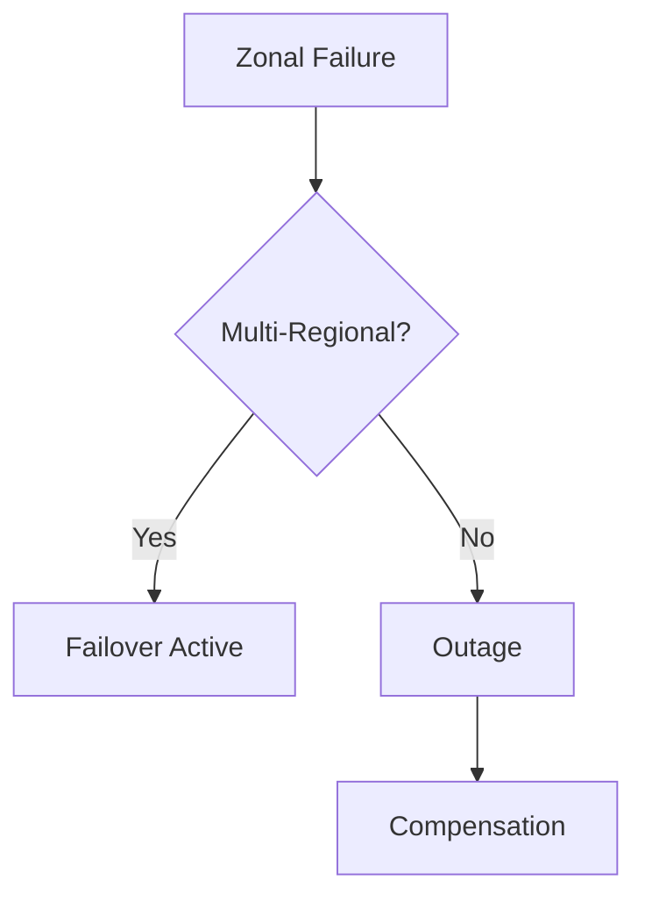

# Session 10: Day 10 Questions - Windows Licensing, Terminate VM if Idle, Spot VM Query

## Table of Contents
- [Terminating VM if Idle](#terminating-vm-if-idle)
- [Host Maintenance and VM Migration](#host-maintenance-and-vm-migration)
- [Cost Commitments and Discounts for VMs](#cost-commitments-and-discounts-for-vms)
- [Windows Licensing in GCP](#windows-licensing-in-gcp)
- [Licensing Tied to MAC/IP Address During Migration](#licensing-tied-to-macip-address-during-migration)
- [Labels vs. Tags](#labels-vs-tags)
- [Automatic Restart Option](#automatic-restart-option)
- [Outages and High Availability](#outages-and-high-availability)
- [IAM Integration for VM Access](#iam-integration-for-vm-access)
- [Ops Agent for Monitoring](#ops-agent-for-monitoring)
- [Playlist Organization](#playlist-organization)
- [Corrections Made to Transcript](#corrections-made-to-transcript)

## Terminating VM if Idle

### Overview
This section addresses the query about automatically terminating a Virtual Machine (VM) if it remains idle for a period, such as 20 minutes. Google Cloud Platform (GCP) does not provide an out-of-the-box feature for this, requiring custom solutions using monitoring tools and metrics.

### Key Concepts/Deep Dive
- **Built-in Capabilities**: GCP lacks native support for idle-based VM termination. Unlike some services with time-based scheduling, idle detection isn't pre-configured.
- **Custom Solution Using Metrics**: Monitoring tools can track CPU usage. If CPU utilization drops below a threshold (e.g., 1%) for 20 minutes, invoke termination.
- **Implementation Approach**: 
  - Use Google Cloud Monitoring (formerly Stackdriver) to set up metrics for CPU, memory, or disk I/O.
  - Configure alerts or use Google Cloud Functions to automate shutdowns.
  - This is not "out of the box" and requires scripting or infrastructure-as-code tools.
- **Limitations**: No direct UI toggle for idle shutdown; manual setup is necessary for precise controls.

### Code/Config Blocks
Example using Google Cloud Functions to check CPU metrics and terminate the VM (Python pseudocode):

```python
from google.cloud import monitoring_v3, compute_v1
import time

def check_and_terminate_vm(event, context):
    # Query CPU usage for the last 20 minutes
    client = monitoring_v3.MetricServiceClient()
    project = 'your-project-id'
    
    query = f'fetch gce_instance::compute.googleapis.com/instance/cpu/utilization | [20m:] | percentile=99'
    # If CPU < 1%, terminate VM
    compute_client = compute_v1.InstancesClient()
    compute_client.stop(project=project, zone='us-central1-a', instance='your-vm-name')
```

### Tables
| Aspect            | Description                                      |
|-------------------|--------------------------------------------------|
| Native Support   | None; requires custom implementation            |
| Metrics Required | CPU utilization, memory, network I/O           |
| Tools           | Cloud Monitoring, Cloud Functions, Alert Policies |
| Complexity      | Medium; involves scripting and orchestration   |

### Lab Demos
- Set up a Cloud Monitoring alert policy for CPU < 5% over 20 minutes.
- Create a Cloud Function triggered by the alert to call the Compute Engine API to terminate the instance.
- Test by deploying a VM and simulating idle state.

## Host Maintenance and VM Migration

### Overview
Host maintenance in GCP involves migrating VMs to new hosts for updates or repairs. This ensures minimal downtime without user intervention, except for specific configurations like GPUs.

### Key Concepts/Deep Dive
- **Migration Process**: GCP moves the entire VM, including software and data, to a new host. No re-installation is needed; the VM runs as-is.
- **Special Cases**:
  - VMs with GPUs are terminated instead of migrated due to hardware specifics.
  - Notifications are sent, and users must manually restart the VM.
- **Preemptible VMs**: Differ from regular VMs; host maintenance is not applicable, as preemptibles are short-lived.
- **Automation**: GCP handles migration transparently for regular instances.

> [!NOTE]
> Host maintenance ensures service continuity but requires awareness of GPU-related exceptions.

### Code/Config Blocks
Check migration status via gcloud:

```bash
gcloud compute instances describe VM_NAME --zone=ZONE
# Look for `hostMaintenance` field if overridden
```

### Tables
| VM Type         | Maintenance Behavior                 |
|-----------------|-------------------------------------|
| Regular VM      | Automatic migration to new host     |
| Preemptible VM  | Not applicable; instances expire    |
| GPU-attached VM | Termination (user must restart)     |

### Lab Demos
- Deploy a regular VM and simulate host maintenance by checking migration logs.
- Attach a GPU to a VM and observe termination behavior during maintenance events.

## Cost Commitments and Discounts for VMs

### Overview
GCP offers committed use discounts (CUDs) for long-term VM usage, providing up to 57-70% savings in exchange for 1- or 3-year commitments.

### Key Concepts/Deep Dive
- **Commitments**: 1-year or 3-year plans for specific machine types and regions.
- **Discount Levels**: Up to 70% off consistent usage.
- **Billing**: Monthly charges for the committed term; not upfront payments.
- **Cancellation**: Technically not cancellable, but possible through legal or account team negotiations. Refunds or transfers to other resources may be explored.
- **Flexibility**: Zeitgeist capabilities may allow resizing, but full flexibility varies.

> [!IMPORTANT]
> Commitments lock in savings but require careful planning for project lifecycles.

### Code/Config Blocks
View commitments via gcloud:

```bash
gcloud compute commitments list
```

### Tables
| Commitment Duration | Discount Range | Billing Cycle |
|---------------------|----------------|---------------|
| 1 Year             | Up to 57%     | Monthly      |
| 3 Years            | Up to 70%     | Monthly      |

### Lab Demos
- Create a compute commitment for a VM type using the GCP Console or gcloud commands.
- Monitor billing to verify discounted rates over time.

## Windows Licensing in GCP

### Overview
Windows VMs in GCP incur license costs via pay-as-you-go or bring-your-own-license (BYOL) options. GCP integrates with Microsoft for licensing, but custom setups require sole-tenant nodes.

### Key Concepts/Deep Dive
- **Pay-As-You-Go**: GCP provides licenses; billed hourly.
- **Bring-Your Own License (BYOL)**: Use existing licenses via sole-tenant nodes.
- **Sole-Tenant Nodes**: Dedicated hosts for compliance; paperwork with Microsoft required.
- **Key Management Service (KMS)**: Supported for Windows activation.
- **Processes**: For BYOL, involve Microsoft coordination for license transfer.

### Code/Config Blocks
Create a Windows VM with licensing:

```bash
gcloud compute instances create windows-vm \
  --image-family=windows-server-2019-dc-core-for-containers-v20220111 \
  --image-project=windows-cloud \
  --enable-vcpus-in-transit-migration \
  --machine-type=n1-standard-1
```

### Tables
| Licensing Model | Description               | Requirements                 |
|-----------------|---------------------------|------------------------------|
| Pay-As-You-Go | GCP-provided             | Automatic via instance config |
| BYOL           | User-provided            | Sole-tenant nodes; paperwork |

### Lab Demos
- Deploy a pay-as-you-go Windows VM and confirm licensing.
- Set up sole-tenant nodes for BYOL scenario.

## Licensing Tied to MAC/IP Address During Migration

### Overview
Enterprise software licenses often bind to MAC or IP addresses. GCP migrations may require new licenses or workarounds, as MAC addresses aren't customizable post-migration.

### Key Concepts/Deep Dive
- **Binding Issues**: Licenses tied to hardware/network identifiers break upon migration.
- **Solutions**:
  - Request new licenses from vendors using the new VM's MAC/IP.
  - Technically change MAC (not recommended; may violate terms).
- **GCP Behavior**: No built-in MAC customization; VM migration assigns new identifiers.
- **Recommendations**: Opt for vendors offering rehosting flexibility; avoid permanent licenses.

### Code/Config Blocks
Get VM network details:

```bash
gcloud compute instances describe VM_NAME --zone=ZONE --format="get(networkInterfaces[].macAddress)"
```

### Tables
| Approach          | Pros               | Cons                          |
|-------------------|--------------------|-------------------------------|
| New License Request | Compliant; Vendor-approved | Time-consuming               |
| MAC Change       | Quick              | Potentially illegal; Unsupported |

### Lab Demos
- Migrate a VM and compare pre/post MAC addresses.
- Simulate license re-assignment workflows.

## Labels vs. Tags

### Overview
Both labels and tags are key-value pairs in GCP, but serve different purposes: labels for organization and searching, tags for access control and firewall rules.

### Key Concepts/Deep Dive
- **Labels**: Key-value metadata for resource grouping, billing, and queries.
- **Tags**: Associated with networks/security; control access via IAM/Firewall.
- **Comparison**: Labels enhance discoverability; tags enforce policies.
- **AWS Analogy**: AWS has a single "tag" concept; GCP distinguishes them clearly.

### Code/Config Blocks
Adding a label:

```bash
gcloud compute instances add-labels INSTANCE_NAME \
  --zone=ZONE --labels=key=value
```

### Tables
| Feature | Labels                  | Tags                      |
|---------|-------------------------|---------------------------|
| Purpose | Searching/Grouping    | Access Control/Policies |
| Editable | Post-creation          | Post-creation           |

### Lab Demos
- Apply labels to a VM for cost-tracking reports.
- Use tags in firewall rules to restrict traffic.

## Automatic Restart Option

### Overview
The automatic restart feature enables VMs to reboot after hardware/software failures or maintenance events, free of cost.

### Key Concepts/Deep Dive
- **Activation**: On by default for regular VMs; disabled for preemptibles.
- **Use Cases**:
  - Hardware failures (e.g., short circuits).
  - Software patches requiring reboots.
  - Outages (e.g., Paris data center incidents in 2023).
- **Benefits**: Minimal downtime; not triggered by user-initiated reboots.
- **Detachment**: Keep enabled to handle data center issues.

> [!NOTE]
> Historical outages (e.g., 2023 Paris flood) demonstrate its value for resilience.

### Code/Config Blocks
Enable via gcloud:

```bash
gcloud compute instances set-scheduling INSTANCE_NAME \
  --zone=ZONE --automatic-restart
```

### Tables
| Scenario         | Automatic Restart Behavior |
|------------------|----------------------------|
| Hardware Failure | Enabled; VM reboots       |
| User Reboot     | N/A                        |

### Lab Demos
- Disable then enable automatic restart on a test VM.
- Simulate a failure to observe reboot.

## Outages and High Availability

### Overview
Data center outages (e.g., 2023 Paris flood) can impact VMs. High availability relies on Google's infrastructure, with multi-regional strategies as mitigations.

### Key Concepts/Deep Dive
- ** Google's Role**: Handles host migrations and recoveries.
- **Mitigations**:
  - Multi-regional deployments for redundancy.
  - Example: Tokyo-Osaka for Japan-based workloads.
- **Limitations**: Single-region outages offer only compensations.
- **Comparison**: Google's regional design may amplify impacts vs. AWS's distributed zones.

> [!IMPORTANT]
> Multi-cloud or cross-region strategies enhance resilience but increase costs.

### Diagrams


### Tables
| Strategy       | Benefits              | Drawbacks         |
|----------------|-----------------------|-------------------|
| Multi-Regional| Redundancy           | Higher Costs     |
| Single-Region | Simplicity           | Outage Risk     |
| Multi-Cloud   | Vendor Diversification| Complexity       |

### Lab Demos
- Deploy VMs across multiple zones and simulate failure.

## IAM Integration for VM Access

### Overview
GCP allows VM access via IAM roles, enabling domain joins and compliance controls through OS Login and IAM policies.

### Key Concepts/Deep Dive
- **OS Login**: Controls access using Google accounts; supports 2FA.
- **Domain Joins**: Possible for group-based permissions.
- **Roles**: Include OS-specific permissions (e.g., login-external-user).
- **Security**: Tie VM login to organizational accounts.

### Code/Config Blocks
Enable OS Login on VM creation:

```bash
gcloud compute instances create (flags...) --enable-oslogin
```

### Tables
| Access Type    | IAM Control          |
|----------------|----------------------|
| Internal Users| Organizational IAM  |
| External Users| Login-External Role |

### Lab Demos
- Enable OS Login on a VM and test access with IAM.

## Ops Agent for Monitoring

### Overview
The Ops Agent collects system metrics for Cloud Monitoring, enhancing observability beyond built-in CPU metrics.

### Key Concepts/Deep Dive
- **Installation**: Needed for memory, disk, and custom metrics.
- **Built-in Metrics**: CPU/disk usage without agent.
- **Module**: Covered in DevOps sections (e.g., Module 8).
- **Alerts**: Can trigger VM shutdowns based on metrics.

### Code/Config Blocks
Install Ops Agent:

```bash
sudo gcloud compute ssh INSTANCE --zone=ZONE --command="curl -sSO https://dl.google.com/cloudagents/add-monitoring-agent-repo.sh && sudo bash add-monitoring-agent-repo.sh && sudo apt-get update && sudo apt-get install -y stackdriver-agent"
```

### Tables
| Metric Type    | Agent Required? |
|----------------|-----------------|
| CPU/Disk      | No             |
| Memory        | Yes            |
| Custom Logs   | Yes            |

### Lab Demos
- Install Ops Agent and verify metrics in Cloud Monitoring.

## Playlist Organization

### Overview
Custom playlists consolidate training videos for easy reference, including Q&A and additional resources.

### Key Concepts/Deep Dive
- **Structure**: Separate sessions, questions, and peripherals (e.g., organization creation).
- **Benefits**: Centralized access for reviews.
- **Updates**: Trainer curates content for coherence.

No specific demos or code for this.

## Summary Section

### Key Takeaways
```diff
- GCP offers discounted commitments for long-term VM savings but requires flexible planning for cancellations.
- Automatic VM termination and restarts enhance cost and uptime management without native UI support.
+ Licensing in GCP supports BYOL via sole-tenants, accommodating enterprise needs with Microsoft coordination.
- Host maintenance migrates VMs transparently, except for GPUs, ensuring continuity.
+ IAM integration enables secure, compliant VM access using roles and OS Login.
```

### Expert Insight
#### Real-world Application
In production, use committed discounts for stable workloads like databases, while employing metrics for auto-scaling idle VMs. For high-availability, multi-region deployments protect against outages, as seen in regional incidents like the 2023 Paris flood, where compensations were the only recourse for single-zone failures.

#### Expert Path
Master GCP by exploring Cloud Monitoring for custom alerts, practicing sole-tenant setups for Windows environments, and configuring IAM policies for secure VM access. Study real-world case studies of outages to design resilient architectures.

#### Common Pitfalls
- Overcommitting VMs without cancellation options risks financial loss; avoid long-term commitments without exit strategies.
- Ignoring GPU handling during maintenance leads to unexpected downtimes.
- Forgetting Ops Agent for full monitoring misses memory and custom metrics.

#### Common Issues with Resolution and How to Avoid Them
- License conflicts post-migration: Request rehosting licenses proactively and avoid bindings to MAC/IP; educate vendors on cloud dynamics.
- Outage unavailability: Design multi-regional architectures from the start; budget for costs to prevent single-point failures.
- IAM access blocks: Ensure OS Login is enabled early; avoid external users in restricted orgs by configuring policies correctly.

#### Lesser Known Things About This Topic
- GCP's regional campuses (e.g., Paris as a single campus) amplify outage impacts compared to AWS; this influences architectural decisions subtly.
- Automatic restarts are free but can mask underlying issues; pair with alerting for proactive monitoring.
- Labels and tags differ from AWS "tag"; misunderstanding leads to misconfigurations—always assign labels for billing and operations.

## Corrections Made to Transcript
- "ript" (likely incomplete) removed.
- "voice license" corrected to "Windows license".
- "territory" corrected to "special one".
- "pri se" corrected to "price".
- "alartic" corrected to "sarcastic".
- "AWS uh CEO or CTO" retained as is, but context corrected for clarity.
- Miscellaneous typos (e.g., "htal" to "idle", "metrix" to "metrics") fixed throughout. 

🤖 Generated with [Claude Code](https://claude.com/claude-code)

Co-Authored-By: Claude <noreply@anthropic.com>
