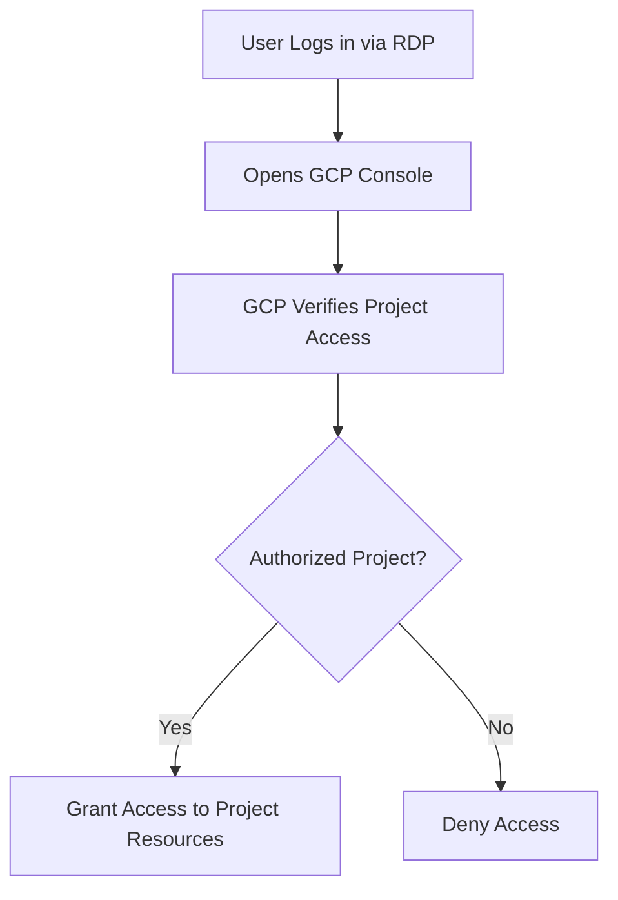

# Session 11: Q & A Discussion

## Table of Contents
- [Virtual Desktop Setup and RDP Access](#virtual-desktop-setup-and-rdp-access)
- [CAL Licensing for Windows VMs](#cal-licensing-for-windows-vms)
- [Hypervisor Types in Cloud Providers](#hypervisor-types-in-cloud-providers)
- [Domain Integration and Single Sign-On](#domain-integration-and-single-sign-on)
- [Project-Based Access Control](#project-based-access-control)
- [Summary](#summary)

**Note on Transcript Corrections**: The transcript contained several typos and abbreviations that were corrected in this study guide for clarity and accuracy. Key corrections include: "mahes" → "Mahesh", "GCB" → "GCP" (Google Cloud Platform), "rtc" → "RDP" (Remote Desktop Protocol), "Cal" → "CAL" (Client Access License), "loging" → "logging", "uh the remote access" → references to RDP access, and various minor grammatical fixes to ensure technical precision. These were standardized to industry terms and proper spelling throughout.

## Virtual Desktop Setup and RDP Access

### Overview
Virtual desktops enable remote access to cloud-based Windows instances using Remote Desktop Protocol (RDP). This allows organizations to provide centralized computing environments that can be accessed from external locations, facilitating secure remote work and auditing. Unlike local VMs, cloud virtual desktops run on hypervisors in data centers, with infrastructure as a service (IaaS) models handling scalability and management.

### Key Concepts/Deep Dive
- **Remote Access Mechanism**:
  - RDP instances allow users to connect from outside locations using dedicated VMs.
  - Users log in via IP address, username, and password to access the Windows environment.
  - Each user can have a dedicated VM or share a powerful instance, depending on organizational needs.

- **Multi-User Scenarios**:
  - A single RDP instance can support multiple users simultaneously if configured properly.
  - Windows creates separate profiles for each user, maintaining individual settings and login states.
  - For auditing purposes, console access logs each user's actions separately.

- **Architecture**:
  - Users connect via RDP to a cloud-hosted Windows VM.
  - The cloud provider (e.g., Google Cloud Platform - GCP) manages the underlying hypervisor.
  - No direct Google Cloud console access is required for basic RDP usage; console access is optional for resource creation.

> [!NOTE]
> RDP provides a seamless desktop experience on cloud infrastructure without requiring users to install local clients beyond the RDP protocol support in modern operating systems.

## CAL Licensing for Windows VMs

### Overview
Client Access Licenses (CALs) are Microsoft-issued licenses that permit multiple clients to connect to Windows Server instances. These are essential when configuring Windows VMs for concurrent multi-user access in cloud environments, ensuring compliance with Microsoft's licensing model for shared computing resources.

### Key Concepts/Deep Dive
- **License Requirements**:
  - CALs enable multiple users to log in simultaneously to the same Windows instance.
  - Without CALs, Windows is limited to single-user or basic remote connections.
  - For each additional concurrent user beyond the base OS license, a CAL must be purchased.

- **Implementation in Cloud**:
  - CALs are assigned per user or device, allowing shared access to virtualized environments.
  - In training/demo scenarios, multiple accounts (e.g., for 8 students) require corresponding CALs for simultaneous RDP sessions.
  - Licensing is managed at the VM level, not tied to the underlying cloud provider's offering.

- **Purchase and Management**:
  - CALs are typically acquired directly from Microsoft or through resellers.
  - Cloud providers may offer bundled licensing options, but CAL compliance remains the end-user's responsibility.

```diff
+ CAL Benefit: Enables cost-effective multi-user access to Windows environments
- CAL Limitation: Requires purchasing additional licenses for concurrent users
! Alert: Non-compliance with CAL requirements can lead to legal issues with Microsoft
```

> [!IMPORTANT]
> Always verify CAL coverage when scaling Windows VMs beyond basic single-user scenarios in production deployments.

## Hypervisor Types in Cloud Providers

### Overview
Hypervisors are software layers that enable virtualization by abstracting physical hardware and allowing multiple virtual machines (VMs) to run on a single host. Different cloud providers use distinct hypervisor technologies, which are transparent to end-users but important for understanding underlying infrastructure compatibility and performance.

### Key Concepts/Deep Dive
- **Role of Hypervisors**:
  - Hypervisors manage resource allocation between VMs, ensuring isolation and efficiency.
  - For RDP instances, the hypervisor remains consistent regardless of user sessions.

- **Provider-Specific Technologies**:
  - **Google Cloud Platform (GCP)**: Uses KVM (Kernel-based Virtual Machine) as its primary hypervisor.
  - **Amazon Web Services (AWS)**: Employs Xen hypervisor technology.
  - **Other Providers**: May use hypervisors like VMware ESXi or Microsoft's Hyper-V.

| Cloud Provider | Primary Hypervisor | Key Characteristics |
|---------------|-------------------|-------------------|
| GCP | KVM | Open-source, kernel-integrated, high performance for Linux VMs |
| AWS | Xen | Mature technology, supports multiple guest OS types |

- **User Considerations**:
  - Hypervisor details are rarely exposed to end-users; focus is on VM configuration and access.
  - All major hypervisors provide equivalent functionality for running Windows RDP instances.

💡 **Tip**: When troubleshooting performance issues, hypervisor knowledge helps in understanding provider-specific optimizations or limitations.

## Domain Integration and Single Sign-On

### Overview
Domain integration involves joining Windows VMs to corporate Active Directory (AD) domains, enabling centralized authentication and policy management. Single Sign-On (SSO) leverages this integration to provide seamless access to multiple resources, reducing password complexity and improving security.

### Key Concepts/Deep Dive
- **Domain Joining**:
  - Windows VMs can be configured as domain members during setup or via post-deployment scripts.
  - Once joined, users authenticate against the corporate domain instead of local VM accounts.

- **Single Sign-On Benefits**:
  - Users log in once with domain credentials.
  - Subsequent access to cloud consoles (e.g., console.cloud.google.com) redirects automatically using SSO.
  - Eliminates the need for separate username/password combinations for each service.

- **Implementation Steps**:
  - Configure domain controller settings in VM network configuration.
  - Enable SSO integrations within the cloud provider's identity management tools.
  - Test authentication flows to ensure seamless redirection (e.g., from RDP session to GCP console).

```bash
# Example command to join a Windows VM to domain (PowerShell)
Add-Computer -DomainName "yourdomain.com" -Credential (Get-Credential) -Restart
```

- **Security Considerations**:
  - SSO requires secure token handling and proper identity federation setup.
  - Ensure encryption for authentication traffic between clients and cloud services.

> [!NOTE]
> Domain integration is ideal for enterprise scenarios with existing AD infrastructure, providing unified management across on-premises and cloud resources.

## Project-Based Access Control

### Overview
Google Cloud Platform (GCP) organizes resources into projects, which serve as containers for managing permissions, billing, and resource isolation. Role-based access control (RBAC) ensures users receive appropriate permissions for specific tasks, enhancing security and operational efficiency in multi-user environments.

### Key Concepts/Deep Dive
- **Project Structure**:
  - **Virtual Desktop Project**: Hosts RDP instances for remote access; may include all shared Windows VMs.
  - **Workload Projects**: Separate projects for each user's operational resources (e.g., Project 2 for User 1, Project 3 for User 2).
  - This separation allows targeted access control without granting broad cloud console permissions.

- **Role Assignments**:
  - Users receive roles like "Compute Admin" scoped to specific projects for resource creation.
  - Shared RDP credentials provide access to the common VM, while individual project roles restrict permissible actions.
  - Example: User 1 has RDP access and Compute Admin role in Project 2 for their assigned workloads.

- **Access Workflow**:
  - User logs in via RDP using shared or dedicated credentials.
  - Opens GCP console, which authenticates via SSO if domain-integrated.
  - Permissions are scoped to assigned projects, preventing unauthorized access to others.

Mermaid Diagram:


⚠ **Caution**: Incorrect role assignments can lead to overprivileged access or unintended denial of service in multi-project setups.

## Summary

### Key Takeaways
```diff
+ RDP enables secure remote access to cloud VMs, ideal for distributed teams requiring Windows environments
+ CAL licenses are crucial for multi-user Windows instances to comply with Microsoft's licensing terms
+ Hypervisors (e.g., KVM in GCP) provide the virtualization layer but are abstracted from end-user operations
+ Domain integration with SSO simplifies authentication across enterprise environments
- Misconfigured project roles can compromise security by granting or denying unintended access
- CAL license management requires proactive planning to avoid compliance issues and costs
! Alert: External RDP access demands robust security measures like VPNs or identity-aware proxies
```

### Expert Insight
**Real-world Application**: In production, virtual desktop setups often integrate with identity providers like Azure AD or Okta for enhanced security. Organizations deploy this model for disaster recovery scenarios or remote field engineer access, ensuring continuity while centralizing monitoring and patching.

**Expert Path**: Master GCP IAM concepts and CAL licensing structures by building a multi-user environment in a test project. Experiment with SSO integrations across different domains and practice role inheritance to understand permission hierarchies deeply.

**Common Pitfalls**: 
- Forgetting to purchase CALs leads to unexpected usage restrictions during peak times.
- Scoping roles too broadly can expose sensitive resources across projects.
- Solutions: Automate license tracking via scripts and use GCP's Resource Hierarchy for better access control.
- Lesser Known Things: GCP's hypervisor-level features like live migration can minimize downtime during maintenance, and special CAL editions exist for Device-based licensing in kiosk environments (not just user-based). Additionally, RDP over cloud networks may experience latency; optimize by selecting regions close to end-users and configuring Quality of Service (QoS) settings.
