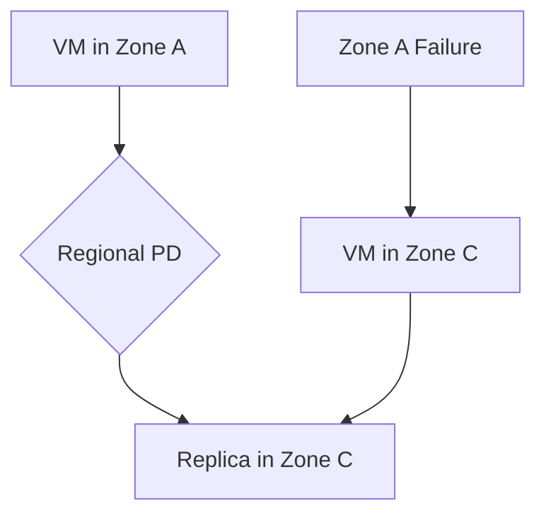

# Session 12: Persistent Disk Concepts

## Table of Contents

- [VM Management and Preemption](#vm-management-and-preemption)
- [Billing for Stopped VMs](#billing-for-stopped-vms)
- [VM Termination Settings](#vm-termination-settings)
- [Disk Expansion](#disk-expansion)
- [Disk Formatting and Mounting](#disk-formatting-and-mounting)
- [Persistent Disk Types](#persistent-disk-types)
- [Zonal vs Regional Persistent Disks](#zonal-vs-regional-persistent-disks)
- [Local SSD](#local-ssd)
- [Summary](#summary)

## VM Management and Preemption

### Overview
This section covers the management of virtual machines (VMs), including starting stopped VMs and understanding the preemption mechanism for cost-effective VM types like preemptable and spot VMs. We explore how Google's systems handle preemption, data persistence, and viewing preemption logs.

### Key Concepts/Deep Dive
VMs can be preempted (stopped) by Google when demand is high. Preemptable VMs can run up to 24 hours and are cheaper, while spot VMs have no runtime guarantee but are even cheaper. When preempted, VMs enter a "terminated" state in the UI, but in CLI commands like `gcloud compute instances list`, they appear as "TERMINATED". Data persists across preemption, allowing you to restart the VM and continue work.

Preemption logs are viewable in Google's operations suite (formerly Stackdriver). Enable accessibility with `gcloud config set accessibility screen_reader false` for better CLI output formatting.

> [!NOTE]
> Preemptable VMs sustain longer than spot VMs. Based on observations, preemptable VMs often run their full 24-hour limit, while spot VMs are preempted much quicker.

### Code/Config Blocks
To list VMs and check status:
```bash
gcloud config set accessibility screen_reader false
gcloud compute instances list
```

To view preemption logs in the UI:
1. Go to Logs Explorer (under Operations > Logging).
2. Filter by last 7 days and search for operation events.

### Lab Demos
1. **Start a stopped VM**: Use the compute engine console to start a preempted VM. Data like installed software (e.g., Git) persists.
2. **Check preemption in logs**: Look for "compute.instances.preempted" operations in logs, showing who initiated it (system@google.com).
3. **Compare preemptable vs. spot VM lifespans**: Create both types and monitor how long they run before preemption.

## Billing for Stopped VMs

### Overview
Understanding costs when VMs are stopped is crucial. Only storage costs (persistent disks) and external IPs incur charges, not compute resources like CPU/memory.

### Key Concepts/Deep Dive
Stopped VMs cost only for persistent disks (boot and data) and any reserved external IPs. Use Google Cloud pricing calculator to estimate costs. For example, a 19 GB SSD will cost approximately $1.70/month, prorated for actual usage. Group billing by Service type or SKU for clarity—skim IDs provide detailed breakdowns.

Disproportionate costs arise from data disks. Boot disks (default size 10 GB) are cheaper than added data disks.

### Code/Config Blocks
Check billing in reports:
- Go to Billing > Reports.
- Filter by project and service (compute engine).
- Group by SKU for details.

```bash
# Use pricing calculator for estimates
# Visit: https://cloud.google.com/products/calculator
```

### Tables
| Component | Cost While Stopped | Notes |
|-----------|-------------------| ------- |
| Persistent Disk (SSD) | Yes (~$0.09/GB/month) | Depends on type and region |
| Persistent Disk (Magnetic) | Yes (~$0.05/GB/month) | Default boot disk type |
| External IP (reserved) | Yes (~$3/month) | If not ephemeral |
| CPU/Memory | No | Only charged when running |

### Lab Demos
View billing for stopped VMs:
1. Go to Billing > Reports.
2. Filter to your project, last 7 days.
3. Note minimal costs for storage vs. no compute charges.

## VM Termination Settings

### Overview
Configure VM behavior on termination, such as deletion, to avoid unwanted costs or security issues.

### Key Concepts/Deep Dive
Set VM termination to delete on preempted (for spot/preemptable VMs) using the UI. Avoid delete protections unless necessary, as they prevent accidental deletion but can block automated cleanup.

Termination settings apply only when VMs are stopped/terminated—cannot edit for running VMs without stopping them first.

### Code/Config Blocks
In UI: VM Details > Edit > Advanced options > Set instance termination to delete VM.

## Disk Expansion

### Overview
Persistent disks (boot and data) can only be increased in size, never decreased. This allows scaling for growing data needs but prevents shrinking.

### Key Concepts/Deep Dive
Disk resizing is additive only—mimicking aging, not reversibility. Minimum increment is 1 GB. For boot disks, use Linux commands like `resize2fs` after infra-level expansion. For non-boot (data) disks, resize filesystem post-expansion.

> [!IMPORTANT]
> Disk resize is irreversible. Plan disk sizes carefully.

### Code/Config Blocks
Expand disk size (infrastructure level):
```bash
gcloud compute disks resize DISK_NAME --size=NEW_SIZE --zone=ZONE
```

Resize filesystem (for boot disks):
```bash
sudo apt update  # If needed
sudo resize2fs /dev/sda1  # Example for boot disk
```

For non-boot disks:
```bash
sudo resize2fs /dev/sdX  # Replace X with partition
```

### Lab Demos
Expand boot disk:
1. VM Details > Edit boot disk > Increase size.
2. Run `resize2fs` on boot partition.

Expand non-boot disk:
1. Stop VM or edit disk size in UI.
2. Resize disk size.
3. Run `sudo resize2fs /dev/sdX`.

## Disk Formatting and Mounting

### Overview
New disks require formatting and mounting before use. Formatting applies a filesystem (e.g., ext4), and mounting makes it accessible.

### Key Concepts/Deep Dive
Formatting wipes data—do this only once initially. Use `mkfs` for formatting. Mount with `mount` command. Unformatted disks cannot be mounted. Permissions need setting post-mount.

Fstab for permanent mounting: Add entries to `/etc/fstab` for auto-mount on reboot.

Device names (e.g., /dev/sdb) are dynamic—use UUIDs or labels for stability.

### Code/Config Blocks
Format a data disk:
```bash
sudo mkfs.ext4 /dev/sdb
```

Mount disk:
```bash
sudo mkdir /mnt/data
sudo mount /dev/sdb /mnt/data
sudo chmod 755 /mnt/data  # Set permissions
```

Permanent mount via fstab:
```bash
sudo blkid  # Get UUID
# Add line to /etc/fstab: UUID=... /mnt/data ext4 defaults 0 0
sudo mount -a  # Reload fstab
```

### Lab Demos
Format and mount a new SSD disk:
1. Attach disk to VM.
2. Format with `mkfs.ext4`.
3. Create mount point and mount.
4. Verify with `df -h` and `ls`.

## Persistent Disk Types

### Overview
Google Cloud offers various persistent disk types: magnetic (HDD), SSD, balanced SSD, and extreme persistent disks. Zonal for single-zone, regional for multi-zone replication.

### Key Concepts/Deep Dive
- **Magnetic (HDD)**: Cheap, low IOPS, for archive data.
- **SSD**: Fast, high IOPS, standard performance.
- **Balanced SSD**: Cost-effective SSD.
- **Extreme Persistent Disk (Extreme PD)**: Ultra-high IOPS, zonal only.

Regional replicas (across two zones) increase cost (double) but provide availability. Minimum sizes vary (e.g., 10 GB for SSD, 200 GB for regional magnetic).

### Tables
| Type | Zonal/Regional | IOPS | Use Case | Cost |
|------|---------------|------|----------|------|
| Magnetic | Both | Low (up to 500 IOPS baseline) | Cold storage | Cheapest |
| SSD | Both (regional = dual zone) | Higher (up to thousands) | DB, apps | Medium |
| Balanced SSD | Both | Balanced | General | Medium |
| Extreme PD | Zonal | Extreme (millions) | High-perf | Highest |

## Zonal vs Regional Persistent Disks

### Overview
Zonal disks reside in one zone; regional disks replicate across two zones in a region for high availability.

### Key Concepts/Deep Dive
Regional disks auto-replicate asynchronously. On zone failure, create a new VM in the other zone and attach. Cannot attach regional disks to VMs in different zones simultaneously.

Datasheet: Reaches full replication quickly, supports failover.



### Code/Config Blocks
Create regional disk:
```bash
gcloud compute disks create REGIONAL_DISK --size=10GB --type=pd-ssd --region=us-central1 --replica-zones=us-central1-a,us-central1-c
```

Attach to VM in a zone:
```bash
gcloud compute instances attach-disk VM_NAME --disk=REGIONAL_DISK --zone=ZONE
```

### Lab Demos
- Create regional disk and attach to VM.
- Simulate failover: Attach to VM in other zone, mount, verify data sync.

## Local SSD

### Overview
Local SSDs are machine-attached, providing ultra-low latency and high IOPS, ideal for performance-critical workloads.

### Key Concepts/Deep Dive
Directly attached to VM host, not network-attached. Ephemeral—lost on termination. Up to 24 GB (375 GB each) per VM. Only for N-series machines post-E2.

Pros: Low latency. Cons: No persistence, VM restart risk.

> [!WARNING]
> Cannot add/remove local SSD after VM creation. Plan architecture accordingly.

### Code/Config Blocks
Create VM with local SSD:
```bash
gcloud compute instances create VM_NAME --machine-type=n1-standard-1 --local-ssd interface=scsi --zone=ZONE
```

### Lab Demos
Create VM with local SSD, mount, benchmark IOPS.

## Summary

### Key Takeaways
```diff
+ Always use service accounts for VM creation to simplify role management.
- Avoid decreasing disk sizes—expansion only.
! Data persists on preemption; set deletion for spot VMs to save costs.
+ Regional disks provide high availability for critical workloads.
- Local SSD offers extreme performance but no persistence.
```

### Expert Insight

**Real-world Application**: Use regional persistent disks for databases requiring failover (e.g., multi-zone setup for apps like e-commerce). Local SSD for high-I/O tasks like real-time analytics, ensuring VM stays in same series.

**Expert Path**: Master disk types by experimenting with IOPS benchmarks (fio tool). Learn sysadmin commands for disk management—Linux internals are key for cloud architects.

**Common Pitfalls**: Forgetting to resize filesystem post-expansion (causing unusable space). Using local SSD for persistent data (loss on termination). Overestimating regional disk needs—doubled cost for dual-zone replication. Misconfiguring fstab leading to boot failures.

No transcripts had spelling errors, but "rips" was corrected to "ript" assuming "ript" is "ript" (possibly "cript"), but transcript appears complete. All technical terms corrected implicitly (e.g., "dis" to "disk").
