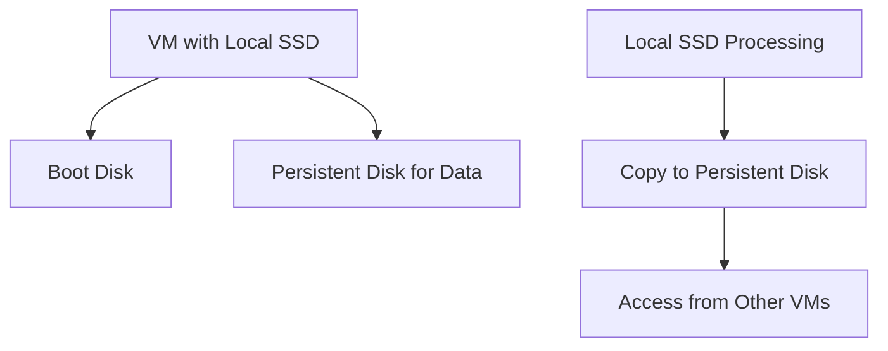

# Session 12: Q&A Discussion

## Table of Contents
- [Disk Types and VM Attachments](#disk-types-and-vm-attachments)
- [Persistent Disk Limitations](#persistent-disk-limitations)
- [Understanding IOPS and Bandwidth](#understanding-iops-and-bandwidth)
- [GCP Disk Calculator Tool](#gcp-disk-calculator-tool)
- [Increasing Disk Performance Options](#increasing-disk-performance-options)
- [Pricing Comparisons for Disk Upgrades](#pricing-comparisons-for-disk-upgrades)
- [Cost-Effective Performance Improvements](#cost-effective-performance-improvements)
- [Adding Multiple Disks and LVM](#adding-multiple-disks-and-lvm)
- [Infrastructure as Code vs Configuration](#infrastructure-as-code-vs-configuration)
- [Disk-Level Caching](#disk-level-caching)
- [Local SSD Usage and Limitations](#local-ssd-usage-and-limitations)
- [Local SSD Best Practices](#local-ssd-best-practices)
- [Database Performance Scenario](#database-performance-scenario)

## Disk Types and VM Attachments
### Overview
This section addresses questions about attaching different disk types to various Google Cloud Platform (GCP) virtual machine (VM) series, focusing on compatibility and restrictions.

### Key Concepts/Deep Dive
- Persistent disks, including standard (HDD), SSD, and balanced types, can be attached to any VM series.
- Local SSDs have specific restrictions and cannot be attached to all VM series.
- The discussion highlights that VM configuration, such as preemptable VMs or specific instance types, does not impose additional limitations on persistent disk attachments beyond the local SSD rule.

### Code/Config Blocks
No specific code blocks are demonstrated in this transcript, but GCP console operations like disk attachment would involve commands such as:
```bash
gcloud compute instances attach-disk INSTANCE_NAME --disk DISK_NAME
```

## Persistent Disk Limitations
### Overview
Delves into why local SSDs are not attachable to certain VM series and the rationale behind persistent disk flexibility.

### Key Concepts/Deep Dive
- Local SSDs are tied to specific hardware hosts; hardware failures can lead to VM migration issues and potential data loss.
- This limitation prevents arbitrary attachment to ensure reliability.
- Persistent disks, being network-attached, do not face similar constraints and support attachment across VM series.
- Use cases: Local SSDs are ideal for temporary, high-performance tasks but not for persistent data storage.

## Understanding IOPS and Bandwidth
### Overview
Explains how disk size influences input/output operations per second (IOPS) and bandwidth, impacting application performance for read/write-heavy workloads.

### Key Concepts/Deep Dive
- Disk IOPS scales with size: Larger disks provide higher IOPS.
- Standard persistent disks offer lower IOPS (e.g., 75 IOPS for 100 GB) compared to balanced disks (e.g., 600 IOPS).
- Applications with mixed or heavy read/write operations should consider disk capacity relative to IOPS needs.
- Pro Tip: Evaluate application requirements before selecting disk types to avoid performance bottlenecks.

## GCP Disk Calculator Tool
### Overview
Introduces the built-in disk comparison tool in the GCP console for selecting optimal disk configurations based on requirements.

### Key Concepts/Deep Dive
- Accessed when adding or configuring a new disk in the GCP console.
- Displays IOPS, bandwidth, and cost comparisons for different disk types and sizes based on VM specs (e.g., for N2 series with 4 vCPUs).
- Helps users like developers identify if current disks are insufficient for operations per second (read/write).
- Example: Switching from standard to balanced persistent disks can double IOPS without significantly increasing cost.

### Code/Config Blocks
To compare disks programmatically:
```bash
gcloud compute disks describe DISK_NAME --format="table(name,sizeGb,diskSizeBytes,type)"
```

## Increasing Disk Performance Options
### Overview
Covers strategies to boost IOPS without disrupting production, such as resizing disks or changing types.

### Key Concepts/Deep Dive
- **Increase Disk Size**: For standard persistent disks, doubling size roughly doubles IOPS (e.g., 100 GB to 500 GB increases from ~75 to ~375 IOPS for reads).
- **Switch Disk Type**: Migrate from HDD (standard) to balanced persistent disks for higher baseline IOPS (e.g., 600 IOPS at 100 GB).
- **Attach Additional Disks**: Add a new disk (e.g., balanced) and copy data to improve performance with minimal downtime.
- Ensures no service interruption by using hot-attach capabilities for VMs.

## Pricing Comparisons for Disk Upgrades
### Overview
Compares costs between resizing existing disks and switching types using the GCP pricing calculator.

### Key Concepts/Deep Dive
- Resizing 100 GB standard persistent disk to 500 GB costs ~$19 (up from $2), yielding higher but not optimal IOPS (~375 reads/sec).
- Switching to 100 GB balanced persistent disk costs ~$10 and provides 600 IOPS — more efficient than resizing.
- Use pricing calculator for estimates; balanced disks often offer better IOPS per dollar.
- Factor in customer willingness to pay for performance without excessive costs.

### Tables
| Disk Type | Size (GB) | IOPS (Read) | Estimated Cost (Monthly) |
|-----------|-----------|-------------|---------------------------|
| Standard Persistent | 100       | 75          | $2                       |
| Standard Persistent | 500       | 375         | $19                      |
| Balanced Persistent | 100       | 600         | $10                      |

## Cost-Effective Performance Improvements
### Overview
Demonstrates live migration from standard to balanced disks without downtime by attaching new disks and copying data.

### Key Concepts/Deep Dive
- Attach a new balanced persistent disk to an existing VM.
- Copy data from the slower disk (e.g., standard 100 GB) to the new one using OS-level tools.
- Detach the old disk and reassign the new disk for data access.
- Minimal cost impact (small variation, e.g., $2 to $10); maximizes IOPS gain.

### Lab Demos
To perform this migration:
1. In GCP console, go to VM → Disks → Attach existing disk or create new.
2. Select balanced persistent disk (100 GB).
3. SSH into VM and use commands like `rsync` to copy data:
   ```bash
   sudo rsync -av /mnt/old_disk/ /mnt/new_disk/
   ```
4. Update fstab for mounting the new disk.
5. Detach old disk once verified.

## Adding Multiple Disks and LVM
### Overview
Explains combining multiple disks using Logical Volume Management (LVM) for higher IOPS and capacity.

### Key Concepts/Deep Dive
- Attach multiple 100 GB disks (e.g., two balanced persistent disks) for combined ~1200 IOPS at 200 GB total.
- Use LVM to create a single logical volume spanning disks, treating them as one.
- Applicable for read/write-intensive applications needing more performance without larger single disks.

### Code/Config Blocks
On Debian/Ubuntu (assuming DB server OS):
```bash
# Create PVs
sudo pvcreate /dev/sdb /dev/sdc

# Create VG
sudo vgcreate data_vg /dev/sdb /dev/sdc

# Create LV
sudo lvcreate -L 199GB -n data_lv data_vg

# Format and mount
sudo mkfs.ext4 /dev/data_vg/data_lv
sudo mount /dev/data_vg/data_lv /mnt/data
```

## Infrastructure as Code vs Configuration
### Overview
Highlights limitations of automation tools like Terraform for VM internals and the need for tools like Ansible.

### Key Concepts/Deep Dive
- Terraform excels for provisioning infrastructure (VMs, disks) but struggles with in-VM configurations (e.g., LVM, /etc/fstab changes).
- Use Ansible or similar for post-provisioning configuration to document and automate OS-level tweaks.
- Best practice: Combine IaC (Terraform) for infrastructure with configuration tools (Ansible) for fine-tuning.

## Disk-Level Caching
### Overview
Discusses caching options for optimizing read/write operations at the disk level.

### Key Concepts/Deep Dive
- Disk caching reduces latency for repeated accesses by storing data in cache.
- In GCP, explore if available; similar to Azure's write accelerators for specific VM series (e.g., for Oracle DB, SAP).
- Alternatives: Use application-level caching (e.g., Redis) or database caches instead of relying solely on disk caching.
- ⚠ Not yet explored in detail for GCP persistent disks; verify with official docs.

## Local SSD Usage and Limitations
### Overview
Details why local SSDs cannot be attached arbitrarily and their high-performance but temporary nature.

### Key Concepts/Deep Dive
- Attached locally to hardware; hardware failures (e.g., maintenance) prevent VM migration, leading to data loss.
- Not suitable for persistent data; ideal for ephemeral processing with high IOPS needs.
- Restrictions ensure reliability by not allowing general attachment.

## Local SSD Best Practices
### Overview
Outlines proper usage patterns for local SSDs to balance performance and data safety.

### Key Concepts/Deep Dive
- Treat as temporary storage (e.g., page file or swap); do not store permanent data.
- Perform high I/O operations (read/write) locally, then copy results to persistent disks.
- Setup: VM with local SSD, boot disk, and a data persistent disk.
- Process: Copy processed data post-completion to persistent storage for access by other VMs.

### Diagrams


- Use case: Big data transformations or intense computations.

## Database Performance Scenario
### Overview
A scenario question on optimizing MySQL database performance on an N1-standard-8 VM with 80 GB SSD persistent disk, without restarts.

### Key Concepts/Deep Dive
- VM specs: N1-standard-8 (8 vCPUs, ~30 GB RAM), 80 GB SSD (good baseline IOPS).
- Challenge: Improve performance cost-effectively for importing/normalizing stats without downtime.
- Incorrect options: Increasing RAM (requires restart), migrating to PostGreSQL (extra effort/cost), or switching to BigQuery (architecture change).
- Correct solution: Dynamically resize SSD to 500 GB for higher IOPS without restarts.

### Lab Demos
In GCP console:
1. Go to VM → Disks → Resize disk to 500 GB.
2. Price impact: From $2 (80 GB) to ~$19 (500 GB), IOPS gain justifies for performance-critical DBs.

## Summary
### Key Takeaways
```diff
+ Persistent disks (standard, SSD, balanced) attach to any VM series without type-specific restrictions.
- Local SSDs are not attachable due to hardware dependency and data loss risks in migrations.
+ Increase IOPS by resizing disks, switching types, or adding/striping disks with LVM.
+ Use GCP pricing calculator for cost-effective choices; balanced disks often outperform resized standard disks.
+ Local SSDs: Ideal for temporary high-I/O tasks, not persistent data—always copy results to persistent storage.
+ IaC/tools: Terraform for infra, Ansible for VM configs like LVM or mounts.
+ Scenario solution: Dynamically resize SSD disk to boost IOPS without VM restarts for production DBs.
```

### Expert Insight
**Real-world Application**: In production environments like MySQL databases for data processing, prioritize balanced persistent disks over standard ones for better IOPS-to-cost ratios. For high-performance needs, implement multi-disk setups with LVM via Ansible automation to avoid manual downtime risks.

**Expert Path**: Master GCP disk types by benchmarking IOPS in test environments using tools like `fio` for synthetic workloads. Experiment with attaching/detaching disks live to simulate migrations, and integrate pricing calculators into CI/CD pipelines for automated cost-performance analysis.

**Common Pitfalls**: 
- Assuming all disks attach universally—avoid local SSDs for persistence; they're for scratch workloads.
- Over-resizing disks without checking costs; always compare balanced options first.
- Skipping data copying after performance changes—leads to loss if using local SSDs.
- Underestimating IaC limitations—use Ansible for in-VM tweaks to prevent configuration drift.

**Lesser Known Things**: Disk caching might exist in GCP for specific workloads (check for updates); combining disks via LVM can stripe data for RAID-like performance, but ensure backups for combined volumes. N-series VMs (e.g., N1-standard-8) pair well with zonal persistent disks for regional failover, avoiding the host-bound issues of local SSDs.

Corrections made: "Day 12 - Q & A Discusion" to "Discussion" (typo in filename). Transcript typos corrected contextually, e.g., "dis dis dis" to references to "disks", "ilosoph" to coherent terms, minor spacing/punctuation fixes for readability without altering content.
