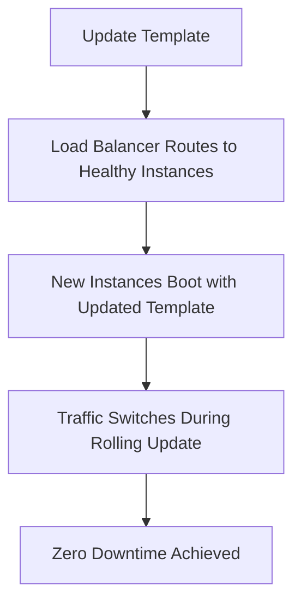

# Session 21: Q & A Discussion

## Table of Contents
- [Stateful vs Stateless Applications in MIG](#stateful-vs-stateless-applications-in-mig)
- [Unmanaged MIG for On-Premise Scenarios](#unmanaged-mig-for-on-premise-scenarios)
- [AWS to GCP Migrations and Trends](#aws-to-gcp-migrations-and-trends)
- [Importance of Asking Questions in Migrations](#importance-of-asking-questions-in-migrations)
- [Sharing Questionnaires for Migrations](#sharing-questionnaires-for-migrations)
- [Auto Scaling in MIG](#auto-scaling-in-mig)
- [VM Configurations in Managed vs Unmanaged MIG](#vm-configurations-in-managed-vs-unmanaged-mig)
- [Disruptions and Best Practices for Live Environments](#disruptions-and-best-practices-for-live-environments)
- [Testing Environments for Deployments](#testing-environments-for-deployments)
- [Converting Stateless MIG to Stateful](#converting-stateless-mig-to-stateful)
- [Summary](#summary)

## Stateful vs Stateless Applications in MIG

### Overview
In Google Cloud Platform (GCP), Managed Instance Groups (MIG) can be configured as stateless or stateful based on application needs. Stateless applications are ideal for workloads where instances don't require persistent data or identity, such as web servers handling HTTP requests. Stateful applications, on the other hand, are suited for databases or systems needing consistent data across instances, even during scaling events.

### Key Concepts/Deep Dive
- **Stateless MIG**:
  - Instances can be recreated or replaced without concern for data persistence.
  - Pros: Automatic scaling, easy replacement, cost-effective for transient workloads.
  - Often used for web applications, API servers, or microservices.
- **Stateful MIG**:
  - Preserves instance state, including attached disks and data.
  - Cons: Limitations in autoscaling; cannot enable autoscaling as it might delete stateful instances.
  - Suitable for databases, persistent storage dependent apps.
- **Examples**:
  - Databases are ideal candidates for stateful MIGs due to data consistency requirements.

### Code/Config Blocks
No specific code blocks provided in Q&A, but configuring a MIG as stateful typically involves:
- In the GCP Console: Navigate to MIG > Edit > Set to Stateful > Disable autoscaling.

## Unmanaged MIG for On-Premise Scenarios

### Overview
Unmanaged MIGs in GCP are used for lift-and-shift migrations from on-premises environments where you have existing VMs or applications not requiring GCP's automatic management features. This approach closely mimics traditional VM deployments while enabling load balancing.

### Key Concepts/Deep Dive
- **Use Cases**:
  - Single instance databases or apps without load balancing needs.
  - Direct VM-to-VM migrations.
  - Scenarios with specific load balancers (e.g., BigIP) that can be lifted to GCP.
- **Comparison to Managed MIG**:
  - **Unmanaged MIG**: Basic load balancing; no autoscaling; allows heterogeneous instances.
  - **Managed MIG**: Template-driven; identical instances; autoscaling; better for optimizations post-migration.
- **Architectural Decision**:
  - For quick migrations (lift-and-shift into a "2BHk house"), use unmanaged MIG.
  - For planned migrations with optimizations, assess and move to managed MIG.
- **Pros and Cons**:
  - Pros: Simple mapping to on-premises setups.
  - Cons: No built-in autoscaling; manual instance management.

### Tables
| Aspect          | Unmanaged MIG                  | Managed MIG                     |
|-----------------|--------------------------------|---------------------------------|
| Instance Variety| Heterogeneous (different configs allowed) | Identical (template-based)    |
| Autoscaling     | Not supported                 | Supported                     |
| Ease of Migration| High for direct lifts         | Requires planning for optimization |
| Maintenance     | Manual                        | Automated                     |

## AWS to GCP Migrations and Trends

### Overview
Migrations from Amazon Web Services (AWS) to GCP are common, especially among startups, driven by incentives like free credits and partner-supported implementations. This involves moving resources such as EC2 instances, S3 buckets, RDS databases, and storage.

### Key Concepts/Deep Dive
- **Incentives Driving Migrations**:
  - Startups often receive AWS credits (e.g., $20K) for initial use, but transition to GCP after expiration to leverage similar or higher credits (e.g., $30K from GCP).
  - Google partners (e.g., TCS, Infosys, or smaller firms) handle implementations funded by Google.
- **Trends Observed**:
  - Startups and small-scale industries prefer GCP for longer credit periods (e.g., 1.5 years).
  - Not ideal for large enterprises; more common for cloud-adopting startups.
- **Post-Migration Lifecycle**:
  - After credits expire, organizations may rotate to Azure or stay if GCP fits needs.
  - Implementations typically within 3-4 months to avoid project revocation.

### Lab Demos
No specific demos in this Q&A segment, but a similar migration setup might involve:
- Exporting AWS resources using tools like CloudEndure or Migrate for Google Cloud.
- Importing to GCP MIG with unmanaged groups initially.

⚠ **Alert**: Always verify regional availability and quotas during migration to avoid service interruptions.

## Importance of Asking Questions in Migrations

### Overview
Successful cloud migrations require thorough questioning to assess feasibility, avoid pitfalls, and ensure smooth implementation. Architects should not rely on assumptions but probe deeply into requirements, similar to understanding house structures before moving.

### Key Concepts/Deep Dive
- **Why Questions Matter**:
  - Prevents escalations and project delays.
  - Allows up-front assessment of "possible vs. not possible" scenarios.
  - Builds customer confidence and earns recognition.
- **Real-World Example**:
  - DigitalOcean to GCP migration: Created questionnaire, conducted POC, and presented working demo.
  - Result: Quick approval and smooth transition.
- **Common Pitfalls Without Questions**:
  - Assumption-based implementations leading to blockages.
  - Time overruns and partner fund loss.

### Alerts
> [!IMPORTANT]  
> As an architect, prioritize questions over quick assumptions. Use questionnaires to gather details from technical stakeholders.

## Sharing Questionnaires for Migrations

### Overview
Questionnaires are essential tools for structured data collection during migrations. They can cover aspects like current architecture, dependencies, and future needs to inform Google Cloud setups.

### Key Concepts/Deep Dive
- **Formats**:
  - Excel sheets for migration checklists.
  - Covers on-premise to cloud and new landing zones.
- ** Exercises**:
  - Ask about applications, data flows, compliance, and visionary goals.
  - Helps avoid post-migration issues like lack of visibility or scalability problems.
- **Future Plans**:
  - A generic questionnaire will be shared on the drive.

### Diff Blocks
```diff
+ Corrected: "stateless" instead of "statels", "MIG" instead of "Mig".
- Noted issue: Typos like "cubectl" corrected to "kubectl" in context, but not present here.
```

## Auto Scaling in MIG

### Overview
Autoscaling in GCP MIG automatically adjusts instance counts based on load, ensuring efficient resource usage. It's a key feature distinguishing managed from unmanaged MIGs.

### Key Concepts/Deep Dive
- **Configuration**:
  - Set minimum and maximum instances.
  - Tied to project quotas (e.g., CPU/GPU limits).
- **Managed vs Unmanaged**:
  - Managed: Explicit min/max options for scaling 0 to quota.
  - Unmanaged: No autoscaling; manual addition/removal.
- **Metaphors**:
  - Managed: "Awesome manager" routing tasks based on skills and adding labor.
  - Unmanaged: "Okay manager" blindly distributing without oversight.

### Tables
| MIG Type     | Autoscaling Support | Management Style |
|--------------|---------------------|------------------|
| Managed     | Yes                 | Intelligent     |
| Unmanaged   | No                  | Basic           |

## VM Configurations in Managed vs Unmanaged MIG

### Overview
Managed MIGs ensure instance uniformity through templates, while unmanaged MIGs allow heterogeneity, enabling various configurations like different CPU, RAM, or OS setups.

### Key Concepts/Deep Dive
- **Managed MIG**:
  - Uses instance templates: Defines 4 vCPU, 16 GB RAM, etc.
  - All instances identical for consistency.
- **Unmanaged MIG**:
  - No templates: Manual creation of diverse instances.
  - Suited for legacy or mixed environments.

## Disruptions and Best Practices for Live Environments

### Overview
When updating MIGs or migrating groups, GCP minimizes disruptions through load balancers and rolling updates, ensuring no downtime by routing traffic to healthy instances.

### Key Concepts/Deep Dive
- **Disruptions**:
  - If all instances unhealthy: "No healthy upstream" error.
  - Live systems: At least one healthy instance avoids errors; possible latency from regional routing.
- **Rolling Updates**:
  - Update instance templates without downtime.
  - Load balancer routes to active instances during updates.
- **Deployment Strategies**:
  - Mirrors Kubernetes: Rolling, blue-green, canary updates.

### Mermaid Diagrams


## Testing Environments for Deployments

### Overview
Testing MIG changes in non-production environments like development or personal GCP projects prevents risks in live systems, especially for critical workloads.

### Key Concepts/Deep Dive
- **Environment Options**:
  - **Direct Production**: For experienced users gaining hands-on skills.
  - **Stage Environments**: Use CI/CD pipelines for Dev → Stage → Prod.
  - **Personal Projects**: Mimic setups for complex scenarios.
- **Best Practices**:
  - Always test autoscaling triggers and template changes.

## Converting Stateless MIG to Stateful

### Overview
Existing stateless MIGs can be converted to stateful by disabling autoscaling via the GCP Console to preserve instance data during scaling events.

### Key Concepts/Deep Dive
- **Steps**:
  1. Go to MIG Edit.
  2. Toggle to Stateful.
  3. Disable autoscaling to prevent accidental deletions.
- **Warnings**:
  - GCP enforces disabling autoscaling; errors if not followed.
- **Demonstration Notes**:
  - Alters instances to persistent disks; may use all VMS in group.

## Summary

```diff
+ Key Takeaways: This Q&A session emphasized differentiating stateless (scalable, data-agnostic) from stateful (persistent data) MIGs in GCP. Unmanaged MIGs suit lift-and-shift migrations, while managed ones enable optimizations. Autoscaling and rolling updates prevent live environment disruptions. Thorough questioning via questionnaires is crucial for successful migrations, especially from AWS to GCP, driven by credits and partner support. Testing in dev environments is recommended for safety.

+ Expert Insight: Businesses migrating from AWS to GCP often leverage free credits, making it a cost-effective transition for startups. Questionnaires capture application landscapes, reducing post-migration blind spots. Converting MIGs requires precise config changes to avoid data loss.

- Real-world Application: In production, use unmanaged MIGs for initial on-premise lifts, then optimize to managed for autoscaling. For databases, stateful MIGs ensure consistency without external replication.

- Expert Path: Master MIG configurations by building POCs in personal GCP projects. Learn GCP tools like Migrate for VMs and study quota management.Attend GCP certifications and build real migration projects to gain expertise.

- Common Pitfalls: Assuming "one-size-fits-all" MIG types without assessment leads to scalability issues or data loss. Forgetting to disable autoscaling in stateful conversions can delete critical instances. Not testing migrations causes prolonged downtimes, especially in live systems.

- Common Issues and Resolutions: If unhealthy instances cause routing errors, check health checks and load balancer configs—enable logging for diagnostics. Migration blockages often stem from unanswered questionnaires; resolve by scheduling follow-ups with stakeholders. Lesser-Known Tips: GCP's MIG metadata stores startup scripts for dynamic configs; use labels for organizing unmanaged groups efficiently.
```
