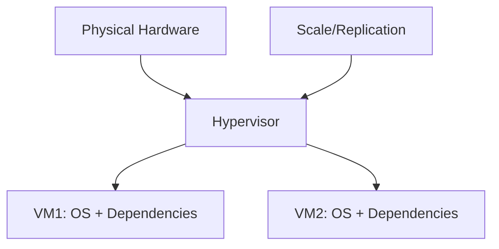

# Session 22: Activating New Account, Basics of Containerization, and Artifact Registry

## Table of Contents
- [Reactivating GCP Free Trial Account](#reactivating-gcp-free-trial-account)
- [Evolution from Dedicated Servers to Virtualization to Containerization](#evolution-from-dedicated-servers-to-virtualization-to-containerization)
- [Understanding Containers and Docker](#understanding-containers-and-docker)
- [Containerizing a Node.js Application](#containerizing-a-nodejs-application)
- [Artifact Registry Essentials](#artifact-registry-essentials)
- [Pushing and Pulling Container Images](#pushing-and-pulling-container-images)
- [Deploying Containers to GCE VM](#deploying-containers-to-gce-vm)
- [Containerizing and Deploying a Python Application](#containerizing-and-deploying-a-python-application)
- [Advanced Artifact Registry Features](#advanced-artifact-registry-features)

## Reactivating GCP Free Trial Account

### Overview
When a Google Cloud Platform (GCP) free trial account is about to expire (around 90 days), you can reactivate a new account with a different Gmail ID and same credit/debit card to continue using GCP resources. This process allows for a seamless continuation of projects without gaps.

### Key Concepts/Deep Dive
- ** account Expiration and Reactivation**:
  - GCP free trials typically last 90 days and provide credits for usage.
  - To reactivate, create a new account using a different Gmail ID while keeping the same payment method (credit or debit card).
  - Option 1: Create entirely new projects; straightforward but discontinuous.
  - Option 2: Maintain continuity by adjusting billing accounts and project linkage for existing projects.

- **Billing Account Management for Continuity**:
  - Use the Google Cloud Console to manage billing accounts.
  - Steps involve linking projects under the same billing account.
  - Add new Gmail ID as an administrator to an existing billing account.
  - Change billing linkage from the old project to the new billing account.
  - This enables extending trial periods and sharing resources across multiple accounts.

```bash
# Example commands for billing account changes via Bash (illustrative, not executable directly)
# 1. Authenticate and set project
gcloud auth login
gcloud config set project your-new-project-id

# 2. List and manage billing accounts
gcloud billing accounts list
gcloud billing accounts list --owner-email=your-email@gmail.com
```

> [!IMPORTANT]  
> Always use a unique Gmail ID for each new account to avoid conflicts. Ensure no actions disrupt ongoing workloads.

- **Potential Issues and Resolutions**:
  - Common mistakes include using the same Gmail ID, leading to account rejection.
  - If VMs or resources are running, ensure billing continuity to prevent disruption.

### Lab Demos
1. Create a new GCP account:
   - Go to Google Cloud Console registration.
   - Use a new Gmail ID and same card.
   - Complete verification.

2. Link existing project to new billing account:
   - Access billing account management.
   - Add new Gmail ID as billing administrator.
   - Switch project's linked billing account.
   - Verify updated credits and expiration date.

> [!NOTE]  
> Monitor trial expiration warnings via email and console notifications.

## Evolution from Dedicated Servers to Virtualization to Containerization

### Overview
This section traces the evolution of compute resources, starting from dedicated hardware, moving to virtualization for efficiency, and culminating in containerization for portability and consistency across environments.

### Key Concepts/Deep Dive
- **Dedicated Servers Era (1990s-2000s)**:
  - Hardware bound to specific applications.
  - Pros: Full hardware utilization, isolation.
  - Cons: Tedious provisioning, scaling issues, no environment portability (e.g., dev vs. prod mismatches).

- **Virtualization (2010s)**:
  - Introduced hypervisors (e.g., VMware, KVM, Hyper-V, Xen) to slice physical hardware into virtual machines (VMs).
  - Type 1 hypervisor: Directly on bare metal (e.g., KVM in GCP).
  - Type 2 hypervisor: On top of an OS (e.g., VirtualBox for local testing).
  - Pros: Faster provisioning, multi-environment isolation.
  - Cons: OS overhead, resource inefficiency, still bulky for transfers.



- **Containerization (2013 onward)**:
  - Leverages container runtimes (e.g., Docker) for isolated user spaces sharing the host kernel.
  - Base on namespaces, cgroups, and isolated dependencies.
  - Solves portability: "It works on my machine" issues due to bundled environments.
  - Lightweight: No full OS per container; super-fast boot times.

> [!CAUTION]  
> Containerization is Linux-centric; Windows support came in 2016 Server editions.

### Tables

| Aspect             | Dedicated Servers          | Virtualization              | Containerization            |
|--------------------|----------------------------|-----------------------------|-----------------------------|
| Portability       | ❌ Low (Hardware-bound)   | ⚠️ Moderate (VM images)   | ✅ High (Works everywhere) |
| Resource Efficiency| ❌ Low (Full HW/VM)       | ⚠️ Moderate (Shared HW)   | ✅ High (Shared kernel)    |
| Boot Time         | ❌ Slow                   | ⚠️ Moderate               | ✅ Near-instant             |
| Example Tools     | Bare metal servers        | VMware, KVM                | Docker, Podman             |

### Lab Demos
None; conceptual illustration via diagrams.

## Understanding Containers and Docker

### Overview
Containers are standardized packages bundling code, dependencies, and runtime into portable units. Docker revolutionized containerization by simplifying runtime management, enabling developers to focus on code rather than low-level implementations.

### Key Concepts/Deep Dive
- **What is a Container?**
  - Software unit with bundled code and dependencies.
  - Enables consistent execution across latitude/longitude (environments like laptops, VMs, clouds).

- **Docker's Role**:
  - Open-source runtime on Linux kernel features.
  - Provides easy commands: `docker build`, `docker run`, `docker push/pull`.
  - Supports base images from Docker Hub for quick starts (e.g., Node.js).

- **OCI and Alternatives**:
  - Docker built on OCI standards via tools like LXD, Rocket (rkt).
  - But Docker dominates (98%+ market share) due to simplicity.
  - Runtime options: Docker Engine (Enterprise/Community), containerd (lightweight daemon).

- **Containerization Process**:
  - Write code (e.g., app.js).
  - Author Dockerfile (instructions for image building).
  - Build image: `docker build`.
  - Run container: `docker run`.

```diff
+ Portable: Bundled dependencies ensure consistency
- Resource-Heavy: Early versions carried OS overhead
! Evolution: From low-level commands to user-friendly tools
```

### Code/Config Blocks

```nodejs
// Example Node.js app (server.js)
const http = require('http');

const server = http.createServer((req, res) => {
  res.statusCode = 200;
  res.setHeader('Content-Type', 'text/html');
  res.end('<h1>Hello World to Containers</h1>');
});

server.listen(8080, () => {
  console.log('Server running on port 8080');
});
```

```dockerfile
# Example Dockerfile for Node.js
FROM node:20.18-alpine
EXPOSE 8080
COPY server.js /app/
WORKDIR /app
RUN npm install (if deps)
CMD ["node", "server.js"]
```

### Lab Demos
1. Check Docker in Cloud Shell: `docker --version`.
2. Build and run a simple container:
   - Create Dockerfile and app files.
   - `docker build -t my-app:v1 .`
   - `docker run -d -p 8080:8080 my-app:v1`
   - Verify: `curl localhost:8080`

## Containerizing a Node.js Application

### Overview
Containerizing a basic Node.js web server involves crafting a Dockerfile, building the image, and running it in isolated environments like Cloud Shell or VMs.

### Key Concepts/Deep Dive
- **Optimizing Images**:
  - Use slim bases (e.g., Alpine) for smaller footprints.
  - Image layers cache; order commands for efficiency.

- **Multi-Environment Deployment**:
  - Same image runs in Cloud Shell, local VMs, etc.

- **Commands Recap**:
  - `docker build`: Creates image.
  - `docker run`: Starts container.
  - `docker exec`: Interactive access inside containers.

### Code/Config Blocks

```bash
# Build optimized image
docker build -t my-app:v2 -f Dockerfile .

# Run in background with port mapping
docker run -d -p 8080:8080 my-app:v2

# Interact inside container
docker exec -it <container-id> sh
```

### Lab Demos
1. Create app: server.js and Dockerfile.
2. Build image: `docker build -t shared/my-app:v1 --platform=linux/amd64 .` (to match Cloud environments).
3. Run and test: Use Web Preview in Cloud Shell for UI access.
4. Inspect: `docker ps`, `docker exec`, check OS/types via `cat /etc/os-release`.

> [!NOTE]  
> Resize Cloud Shell for better visibility; images are ephemeral.

## Artifact Registry Essentials

### Overview
Artifact Registry is GCP's successor to Container Registry, offering a universal repository for containers and other artifacts, with enhanced features for management and security.

### Key Concepts/Deep Dive
- **Vs. Container Registry**:
  - Supports more than containers: Docker, Maven, NPM, Python packages, etc.
  - Granular IAM, regional repositories, vulnerability scanning.

- **Setup**:
  - Enable APIs, create repositories.
  - Modes: Docker (for containers), apt, yum, etc.
  - Regions: Choose for latency optimization (e.g., us-central1).

- **Benefits**:
  - Integrated with GCP billing.
  - Better than external registries (e.g., Docker Hub for private repos).

```diff
+ Universal: Handles multiple artifact types
- Migration Needed: From deprecated Container Registry
! Cost: Aligned with GCP usage
```

### Lab Demos
1. Create repository: In Console > Artifact Registry > Create (e.g., Docker format, us-central1).
2. Grant IAM roles: Use granular permissions like `roles/artifactregistry.reader`.

## Pushing and Pulling Container Images

### Overview
Once built, images are pushed to Artifact Registry for sharing and storage, then pulled for deployment.

### Key Concepts/Deep Dive
- **Tagging and Pushing**:
  - Tag images: `docker tag source_image repo-url/image:tag`.
  - Push: `docker push repo-url/image:tag`.

- **Access Control**:
  - Authenticate: `gcloud auth configure-docker`.
  - Use service accounts for automation.

- **Public/Private Repos**:
  - Grant roles for access; public repos visible to all.

```bash
# Authenticate
gcloud auth configure-docker us-central1-docker.pkg.dev

# Tag and push
docker tag my-app:v2 us-central1-docker.pkg.dev/project-id/shared/my-app:v2
docker push us-central1-docker.pkg.dev/project-id/shared/my-app:v2
```

### Lab Demos
1. Push image: Follow tagging and push commands.
2. Pull in another Cloud Shell: `gcloud auth configure-docker`, then `docker pull`.
3. Test: Run pulled image and access app.

> [!IMPORTANT]  
> Use `<region>-docker.pkg.dev` URLs for Artifact Registry.

## Deploying Containers to GCE VM

### Overview
Container-optimized OS (COS) images in GCE VMs provide pre-built Docker support, allowing direct deployment of containers without manual runtime setup.

### Key Concepts/Deep Dive
- **COS Benefits**:
  - Lightweight, secure OS optimized for containers.
  - Auto-mounts gcsfuse; no login prompt.
  - Includes Docker, no manual installation.

- **Deployment via Console**:
  - Use "Deploy Container" in VM creation.
  - Specify image from Artifact Registry, ports, environment variables.

- **Comparison to Standard VMs**:
  - Standard VMs require Docker installation.
  - COS VMs boot faster, are patchless except for containers.

### Code/Config Blocks

```bash
# Example Docker run on COS VM
sudo docker run -d -p 8080:8080 us-central1-docker.pkg.dev/project-id/shared/my-app:v2
```

### Lab Demos
1. Create VM: In GCE > Create VM > Container tab > Specify image and port.
2. Expose: Add firewall rules (e.g., allow tcp:8080).
3. Access: Use external IP:8080 in browser.
4. Inspect: SSH into VM, `sudo docker ps`, `sudo docker exec -it <id> sh`.

> [!TIP]  
> COS VMs ideal for container workloads; avoid mixing unneeded services.

## Containerizing and Deploying a Python Application

### Overview
Similar to Node.js, Python applications (e.g., Flask-based) can be containerized with Docker, using base images like Python-slim.

### Key Concepts/Deep Dive
- **Dependencies Management**:
  - Use `requirements.txt` for packages.
  - Copy and install in Dockerfile.

- **Base Images**:
  - `python:3-slim` for minimal size.

### Code/Config Blocks

```python
# app.py
from flask import Flask
app = Flask(__name__)

@app.route('/')
def hello():
    return 'Hello World from Python'

@app.route('/version')
def version():
    return 'Hello World Version 1.0'

if __name__ == '__main__':
    app.run(host='0.0.0.0', port=8080)
```

```dockerfile
# Dockerfile for Python
FROM python:3-slim
EXPOSE 8080
COPY requirements.txt /
RUN pip install -r requirements.txt
COPY app.py /
CMD ["python", "app.py"]
```

### Lab Demos
1. Build and push: `docker build -t us-central1-docker.pkg.dev/...:my-python-app:v1 .`
2. Deploy to VM: Repeat GCE steps.
3. Test: Access routes via IP/ports.

## Advanced Artifact Registry Features

### Overview
Beyond basic storage, Artifact Registry offers scanning, IAM, regional support, and multi-format handling.

### Key Concepts/Deep Dive
- **Vulnerability Scanning**:
  - Automatic scans for known CVEs.
  - Supports specific bases (e.g., Alpine, Debian).
  - Generates reports with fix details.

- **Granular IAM**:
  - Repo-level access; e.g., `reader` for pull-only.
  - Integrate with service accounts.

- **Other Features**:
  - Regions for performance.
  - Multi-format: Containers, Python packages, etc.
  - Pub/Sub for notifications.

### Tables

| Feature               | Description                          | GCP Equiv              |
|--------------------|--------------------------------------|-----------------------|
| Vulnerability Scanning| Detects security flaws             | Built-in              |
| Regional Repos     | Low-latency image pulls             | Choose region         |
| Granular IAM       | Per-repo permissions               | IAM roles             |

### Lab Demos
1. Enable scanning: Enable in Artifact Registry settings.
2. Review scans: Post-push, check Security tab for vulnerabilities.
3. Test access: Pull with restricted roles; observe denial.

## Summary

### Key Takeaways
```diff
+ Containerization enables portability across environments via bundled dependencies.
- Virtualization carries OS overhead; containers are lighter and faster.
+ Docker simplifies container management with intuitive commands.
+ Artifact Registry provides GCP-integrated, secure artifact storage with scanning.
+ COS VMs streamline container deployment on GCE.
```

### Expert Insight

**Real-world Application**: Use containers for microservices in production to ensure dev-prod consistency. For migrations, containerize apps and deploy to GCE VMs as interim steps before Kubernetes.

**Expert Path**: Master Docker Compose for multi-container apps, then progress to Kubernetes. Study OCI specs and experiment with containerd for production runtimes.

**Common Pitfalls**: Ignoring base image sizes (use Alpine); not securing registries (apply IAM); skipping vulnerability scans. Also, over-relying on latest tags leads to instability.

**Lesser Known Things**: Docker initially relied on low-level Linux features, popularized by its ease. Artifact Registry's universal format supports even OS packages, enabling holistic artifact management beyond containers. COS VMs rarely need manual patching, as updates focus on containers.
