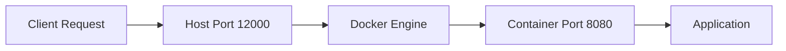

# Session 22: Q & A Discussion

## Table of Contents

- [Pulling the Container Image](#pulling-the-container-image)
- [Running the Container](#running-the-container)
- [Accessing the Application](#accessing-the-application)
- [Port Mapping Explanation](#port-mapping-explanation)
- [General Q&A Wrap-up](#general-qa-wrap-up)
- [Summary](#summary)

## Pulling the Container Image

### Overview
This section covers the initial activity of pulling a container image from a public registry and verifying access, which is a fundamental step in containerization workflows using Docker. The instructor makes the image public to ensure accessibility, and participants are instructed to follow the specified steps to pull and run the image.

### Key Concepts/Deep Dive

#### Image Access and Public Registry
- The instructor confirms that the container image is made public in a registry to allow unrestricted access.
- Participants are guided to pull the image using standard Docker commands.
- Access issues are addressed by ensuring the image is publicly available, eliminating authentication barriers.

#### Steps for Image Pull and Verification
- **Step 1**: Pull the container image from the public registry.
- **Step 2**: Run the container in a local Cloud Shell environment.
- **Step 3**: Transition to running the container in Google Cloud (formerly "ER Cloud").
- Participants are given 5 minutes to attempt these steps and provide confirmation of success or issues.

#### Step-by-Step Lab Demo
1. Open your terminal or Cloud Shell.
2. Execute the Docker pull command (assuming the image name is provided in the course materials, e.g., `docker pull <registry>/<image>:<tag>`).
3. Verify the image is downloaded by listing Docker images: `docker images`.
4. Confirm no access errors occur; the instructor has made it public for this purpose.

### Code/Config Blocks
```bash
# Example pull command (replace with actual image from transcript context)
docker pull gcr.io/<project>/<image>:latest

# List images to verify
docker images
```

## Running the Container

### Overview
After successfully pulling the image, participants proceed to run the container. This involves executing Docker run commands with appropriate port mappings and verifying that the container starts correctly, demonstrating basic container lifecycle management.

### Key Concepts/Deep Dive

#### Container Execution Environment
- Initial runs are performed in Cloud Shell for simplicity and testing.
- Subsequent runs in Google Cloud environments simulate production deployment.
- The instructor monitors participant progress and confirms successful executions.

#### Successful Runs and Confirmation
- Multiple participants reported successfully running the container.
- The instructor acknowledges completions and allocates additional time for others to attempt the task.
- No mandatory requirement, but encouragement to try for hands-on experience.

### Lab Demo
1. After pulling the image, run the container with port forwarding: `docker run -p 12000:8080 <image>`.
2. Check container status: `docker ps`.
3. Note any output or errors during startup.
4. If running in Google Cloud, use the cloud shell or compute engine instance.

### Code/Config Blocks
```bash
# Run container with port mapping
docker run -p 12000:8080 -d <image>:<tag>

# Check running containers
docker ps
```

## Accessing the Application

### Overview
Once the container is running, participants learn how to access the web application within it. This involves using port forwarding and the web preview feature in Cloud Shell, highlighting the difference between direct container port access and mapped external ports.

### Key Concepts/Deep Dive

#### Web Preview in Cloud Shell
- Use the gear icon (settings) to access web preview options.
- Enter port 12000, as that's the host port mapped to the container's application port.
- Direct access to port 8080 (container internal) will fail, demonstrating networking concepts.

#### Demonstration of Access
- The instructor guides participants through clicking the web preview icon and entering 12000.
- Successful access confirms proper port mapping and application responsiveness.
- This step validates the containerized application is running correctly.

### Lab Demo
1. Locate the gear (settings) icon in Cloud Shell.
2. Click on "Web preview" and select "Change port".
3. Enter `12000` and confirm.
4. The web page should load, displaying the application response.

> [!NOTE]  
> If the page doesn't load, verify the container is running and the port mapping is correct.

## Port Mapping Explanation

### Overview
A key Q&A segment explains Docker port mapping mechanics, clarifying the relationship between host and container ports. This addresses participant questions about why port 12000 works while 8080 does not, and how Docker networking routes requests.

### Key Concepts/Deep Dive

#### Port Mapping Syntax and Logic
- Docker run syntax: `-p host_port:container_port`
- Requests to the host port (e.g., 12000) are forwarded to the container port (e.g., 8080).
- Host is the machine running Docker (e.g., Ubuntu or compute instance); container runs the application on its internal port.

#### Request Flow Visualization



- Diagram shows the request routing from external access to internal application.

#### Troubleshooting Port Access
- Accessing port 8080 directly fails because the container is isolated; only the mapped host port accepts external connections.
- Use `docker ps` to verify port mappings in the PORTS column.
- Common mistake: Confusing host and container ports, leading to connection errors.

### Tables
| Port Type | Description | Example |
|-----------|-------------|---------|
| Host Port | External port on the Docker host machine (accessible from outside) | 12000 |
| Container Port | Internal port within the Docker container (application listens here) | 8080 |

### Lab Demo
1. Run `docker ps` to see active containers and port mappings.
2. Attempt access to host port 12000 – should succeed.
3. Attempt direct access to port 8080 – will fail with connection error.
4. Analyze the port mapping in the command: `-p 12000:8080` means host receives on 12000 and forwards to container's 8080.

### Code/Config Blocks
```bash
# Check port mappings
docker ps --format "table {{.Names}}\t{{.Ports}}"

# Example error when accessing wrong port
curl localhost:8080
# Output: Failed to connect to localhost port 8080: Connection refused

curl localhost:12000
# Output: Should return application response (e.g., for a web app)
```

## General Q&A Wrap-up

### Overview
The session concludes with open mic for remaining questions, ensuring clarity on containerization concepts. The instructor summarizes progress, confirms understanding is improving, and transitions back to the main lecture material.

### Key Concepts/Deep Dive

#### Concept Reinforcement
- Containerization concepts covered include image management, port mapping, and application access.
- Progression from simple pulls to environment-specific runs (Cloud Shell → Google Cloud).
- Participant engagement validates hands-on learning effectiveness.

#### No Additional Questions
- After allocating time, no further questions arise.
- Leads into continuing the demonstration and lecture content.

> [!IMPORTANT]  
> Active participation in these activities is crucial for mastering container deployment fundamentals.

## Summary

### Key Takeaways
```diff
+ Container images can be made public for easy access in training environments
+ Port mapping in Docker follows host:container syntax for request forwarding
+ Use web preview tools in cloud environments for testing containerized apps
+ Host ports handle external traffic, while container ports manage internal application communication
+ Successful container runs demonstrate proper image pulls and execution steps
! Avoid attempting direct access to container internal ports without mapping
- Confusing host and container ports can lead to connection issues
```

### Expert Insight

#### Real-world Application
In production environments, container port mapping is essential for service exposure in orchestration platforms like Kubernetes. For example, Kubernetes Services use port mappings to route traffic to pods, ensuring scalability by distributing requests across replicated containers.

#### Expert Path
To master Docker networking, experiment with advanced features like custom networks (`docker network create`), overlay networks for Docker Swarm, or Kubernetes ingress controllers. Regularly use tools like `docker inspect` to understand container configurations and troubleshoot networking issues.

#### Common Pitfalls
- **Port Conflicts**: Always ensure host ports are not already in use by other services (`lsof -i :port` can help verify).
- **Firewall Configurations**: In cloud environments, check security groups or firewall rules to allow traffic on mapped ports.
- **Resolution and Avoidance**: If access fails, run `docker logs <container>` for application errors, and verify port mappings with `docker port <container>`. Avoid hardcoding port numbers in scripts; use environment variables for flexibility.
- **Lesser Known Aspects of Port Mapping**: Docker supports both TCP and UDP protocols; specify with `-p 12000:8080/tcp` or `/udp`. Advanced setups might use `EXPOSE` in Dockerfiles for documentation, but it doesn't automatically map ports – the run command must explicitly do so. Additionally, Docker's `--publish-all` flag can automatically expose all EXPOSEd ports but is rarely used in controlled deployments due to security implications.
