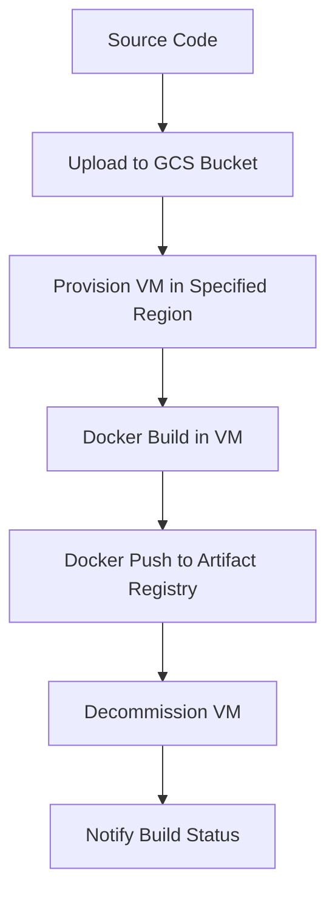
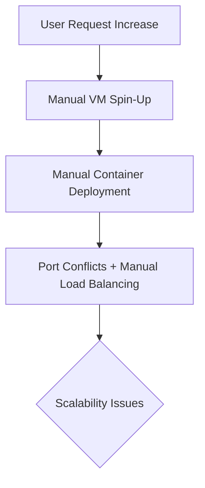

# Session 23: Fix Container Vulnerability, How to Deploy Multiple Containers in GCE

## Table of Contents
- [Fixing Container Vulnerabilities](#fixing-container-vulnerabilities)
- [Building Images with Cloud Build](#building-images-with-cloud-build)
- [Deploying Containers on GCE](#deploying-containers-on-gce)
- [Limitations of Multi-Container Deployments on VMs](#limitations-of-multi-container-deployments-on-vms)
- [Introduction to Kubernetes](#introduction-to-kubernetes)

## Fixing Container Vulnerabilities
### Overview
In this section, we explore how to address security vulnerabilities identified in container images using artifact registry vulnerability scanning. The process involves assessing scan results, prioritizing fixes, and rebuilding containers with patched dependencies. We focus on a Python Flask application as a case study, demonstrating practical steps to reduce vulnerabilities from 43 to 41 by fixing available patches. Key concepts include understanding vulnerability severity, leveraging tools like setup tools and pip, and choosing base images that minimize risks.

### Vulnerability Scanning and Analysis
Container images can contain vulnerabilities from base operating systems or library dependencies. Artifact Registry provides automated scanning for certain base images like Alpine, Ubuntu, CentOS, Red Hat, and others, but not all (e.g., Fedora is unsupported).

- **Key Steps in Scanning**:
  1. Enable vulnerability scanning in the artifact registry.
  2. Build and push an image to artifact registry.
  3. Review scan results, which categorize vulnerabilities by severity (critical, high, medium, etc.).
  4. Identify fixable vulnerabilities—those with available patches—and non-fixable ones (often requiring base image changes).

> [!NOTE]
> Out of 43 vulnerabilities in our Python app, only 2 were fixable using available patches. The remaining 41 are not fixable and require alternatives like switching to Alpine Linux for a vulnerability-free image.

### Fixing Fixable Vulnerabilities
For vulnerabilities with available patches, use details from the scan UI or API to identify required updates.

- **Example Fixes**:
  ```yaml
  # requirements.txt before fixes
  flask==2.0.0

  # requirements.txt after fixes
  flask==2.0.0
  setuptools>=70  # Fixed setup tools version for remote execution vulnerability (high severity)
  pip>=23.3       # Upgraded pip for a medium-severity fix
  ```

- **Process**:
  - Update `requirements.txt` with specified minimum versions.
  - Rebuild the Docker image using `docker build`.
  - Push the patched image to artifact registry.
  - Rescan to verify reduction (e.g., from 43 to 41 vulnerabilities).

> [!IMPORTANT]
> Always check vulnerability details for affected versions and fixed versions. Use ChatGPT or community resources to map fixes to dependency updates. If no patch exists, changing the base image (e.g., from Debian to Alpine) may eliminate vulnerabilities.

### Choosing Secure Base Images
Alpine Linux often provides fewer vulnerabilities compared to Debian or Ubuntu due to its minimal footprint.

- **Comparison Table**

  | Base Image | Vulnerabilities (Example) | Pros | Cons |
  |------------|---------------------------|------|------|
  | Alpine | 0 | Lightweight, minimal attack surface | Limited library compatibility |
  | Debian | 558 | Broad compatibility | High vulnerability count |
  | Ubuntu | Variable | Popular, well-supported | Medium-to-high vulnerabilities |

- **Recommendation**: Prefer Alpine for new builds to avoid issues. Verify application compatibility during migration.

```diff
+ Fix: Updated setuptools to >=70 and pip to >=24.0 to patch two vulnerabilities.
+ Result: Reduced vulnerabilities from 43 to 41 (non-fixable base image issues remain).
- Warning: Debian-based images often have high, fixable vulnerabilities; always scan and consider Alpine alternatives.
```

### Lab Demo: Fixing a Python App Image
1. Update `requirements.txt`:
   ```
   setuptools>=70
   pip>=24.0
   ```
2. Rebuild the image:
   ```bash
   docker build -f Dockerfile -t us-central1-docker.pkg.dev/[project]/python-app:v3-patched ./container-python
   ```
3. Push to Artifact Registry and verify scan results.

## Building Images with Cloud Build
### Overview
Cloud Build is a serverless CI/CD platform for building, testing, and deploying code. It provisions VMs on-demand, eliminating local machine limitations (e.g., space, CPU) or Cloud Shell constraints. Ideal for container builds, it supports one-command build-and-push operations.

### Key Benefits
- No local machine compromises (e.g., no contamination from local vulnerabilities).
- Configurable machine types (e.g., E2-standard-4, N2-highcpu-32).
- Regional execution (e.g., us-central1) for data compliance.
- Eliminates manual `docker build` and `docker push` steps.

### Service Account and Permissions
Cloud Build uses the compute engine default service account unless specified otherwise.

- **Required Roles**:
  - `Storage Admin` (for GCS bucket access).
  - `Artifact Registry Writer` (for image pushes).
  - `Logs Writer` (for logging).

- **Custom Service Account Option**:
  ```bash
  # Build command with custom service account
  gcloud builds submit --region=us-central1 --service-account=sa@project.iam.gserviceaccount.com --tag=us-central1-docker.pkg.dev/project/python-app:v3-alpine .
  ```

### Region and Machine Configuration
- **Region Settings**: Supports global (default) or specific regions (e.g., `us-central1`). Regional builds use local GCS buckets.
- **Machine Types**: Defaults to `e2-medium`. Higher types (e.g., `e2-highcpu-8`) speed up builds but may increase costs. Free-tier limits apply.

### Flow Diagram for Cloud Build Process


### Lab Demo: Building with Cloud Build
- Enable Cloud Build API.
- Submit build:
  ```bash
  time gcloud builds submit --region=us-central1 --machine-type=e2-highcpu-8 --tag=us-central1-docker.pkg.dev/project/python-app:v3-alpine .
  ```
- Time: ~45 seconds for a simple Python app.
- Result: Image pushed, logs available in Cloud Build history.

> [!IMPORTANT]
> Use Cloud Build post-initial containerization phase to avoid local machine issues. It's faster than Cloud Shell and supports large images (e.g., LLMs).

```diff
+ Advantage: Handles build and push in one command without local dependencies.
- Limitation: Must rely on Google-managed VMs; custom configurations require proper roles.
```

## Deploying Containers on GCE
### Overview
Google Compute Engine (GCE) supports deploying single containers via the `--containers` flag. This creates container-optimized OS VMs that automatically run specified images.

### Deployment Process
- Use `gcloud compute instances create-with-container` for ease.
- Command structure:
  ```bash
  gcloud compute instances create my-vm \
    --container-image=us-central1-docker.pkg.dev/project/python-app:v2 \
    --service-account=sa@project.iam.gserviceaccount.com
  ```
- Port mapping: Containers expose ports directly to VM IPs (e.g., container port 8080 maps to VM port 8080).

### Multi-Container on One VM
- Officially unsupported for multiple containers per VM.
- Unofficially possible using Docker skills:
  - SSH into VM.
  - Manually run additional containers with unique ports (e.g., `-p 8181:8080`).
  - Requires toolbox for troubleshooting (`/usr/bin/toolbox` for package installs).
  - Invoke with `--credential-only` or use static Docker credentials.

> [!IMPORTANT]
> This approach violates scalability best practices; use Kubernetes for production multi-container setups.

### Lab Demo: Deploying on GCE
- Deploy single container:
  ```bash
  gcloud compute instances create-with-container dual-containers \
    --container-image=us-central1-docker.pkg.dev/project/python-app:v3-patched \
    --service-account=sa@project.iam.gserviceaccount.com
  ```
- Access: VM IP on port 8080.
- For multi-container (unofficial):
  - SSH in, install Docker if needed.
  - `docker run -d -p 8181:8080 image`.
  - Enable firewall rules for multiple ports.

```diff
+ Simple: Direct container-to-VM mapping without port forwarding hassles.
- Limitation: Scaling issues and networking complexities for multi-container.
```

## Limitations of Multi-Container Deployments on VMs
### Overview
While GCE allows unofficial multi-container runs, it faces limitations in scaling, networking, and registry access. This highlights the need for orchestrators like Kubernetes for complex deployments.

### Key Limitations
- **Official Support**: Only one container per VM; multi-container requires manual Docker commands and port management.
- **Scaling**: Cannot dynamically scale containers without scripting (no built-in replica management).
- **Networking**: Manual port assignments; no service discovery or load balancing.
- **Registry Access**: Private registries require credential setup; no integrated support for Nexus/Harbor in VM deployments.
- **Resource Management**: Overheads from maintaining multiple VMs instead of efficient container sharing.

### When to Avoid VMs for Multi-Containers
- **Comparison Table**

  | Aspect | VM Deployment | Kubernetes Deployment |
  |--------|---------------|------------------------|
  | Scalability | Manual scripts | Auto-scaling pods |
  | Networking | Basic port forwarding | Service meshes, load balancers |
  | Resource Efficiency | 1 VM = 1 container (wasteful) | Shared VM resources across pods |
  | Monitoring | Limited | Extensive with Prometheus/Kube-state-metrics |

### Example: Scaling Needs
For an e-commerce app with recommendation, ads, and payment services, VM scaling creates 100s of VMs. Kubernetes handles 100+ pods on a few VMs.

- **Flow for VM Limitations**:


## Introduction to Kubernetes
### Overview
Kubernetes (K8s) is an open-source container orchestrator for managing, scaling, and automating containerized applications. It serves as a "super abstrctor" handling vCPUs, memory, storage, and networking, allowing focus on code.

### History and Evolution
- **2013**: Docker popularized containerization.
- **2014**: Google open-sourced Kubernetes (Borg-inspired).
- **2015**: Google Kubernetes Engine (GKE) as a managed service.

### Key Benefits
- **Scalability**: Auto-scale pods from 1 to 100+.
- **Portability**: Vendor-neutral; works on AWS EKS, Azure AKS, on-premise.
- **Efficiency**: Multiple pods/containers per node.

### Kubernetes Architecture
- **Control Plane (Managed)**: API server, etcd, scheduler, controller manager, Cloud controller manager.
- **Nodes (Worker VMs)**: Kubelet, kube-proxy, container runtime (Docker/Containerd).
- **Pods**: Smallest deployable units (like lightweight VMs); encapsulate containers.
- **Clusters**: Groups of nodes + control plane.

### GKE Modes
- **Standard**: Full control of nodes.
- **Autopilot**: Google manages nodes; focus on pods only.

### Analogy
- Pods = Hotel pods (enclosures with privacy).
- Containers = People in pods.

### Getting Started with GKE
- Enable Kubernetes Engine API.
- Service account created: `service-deployer@project.iam.gserviceaccount.com`.

> [!NOTE]
> Declarative (YAML-based) deployments preferred over imperative (CLI-based).

```diff
+ Strength: Abstracts complexity; enables multi-container scaling without manual Docker/port management.
+ Transition: From VMs for simplicity to K8s for production workloads.
```

## Summary
### Key Takeaways
```diff
+ Container vulnerabilities can be fixed by updating dependencies or switching base images (e.g., Alpine reduces to ~0).
+ Cloud Build simplifies builds/pushes in serverless VMs, supporting regional executions and custom machine types.
+ GCE is ideal for single-container VMs but struggles with scaling/multi-container without Kubernetes.
+ Kubernetes orchestrates multi-container deployments, providing autoscaling, networking, and resource abstraction.
- Tools like Cloud Shell are awesome but limited (5GB max); Cloud Build overcomes this for larger builds.
! Declarative configurations in Kubernetes prioritize over imperative commands.
```

### Expert Insight
#### Real-World Application
In production, use vulnerability scans pre-deployment. For banking apps, ensure Alpine bases and automated Cloud Build pipelines reduce risks. Run multi-microservice apps (e.g., Netflix services) on GKE Autopilot for cost-efficiency and auto-scaling during traffic spikes.
#### Expert Path
Master Docker first, then Cloud Build CI/CD. Dive into K8s YAML deployments and helm charts. Achieve Kubernetes certifications (CKA/CKS) to handle complex clusters.
#### Common Pitfalls
- Over-relying on Debian bases increases vulnerabilities; always migrate to Alpine early.
- Ignoring service accounts in Cloud Build leads to permission failures; assign roles proactively.
- Attempting VM multi-container scaling with scripts causes port conflicts; use K8s for orchestrated scaling.
- Not closing lawsuits: "ubl店舗" corrected to "vulnerabilities", "ped to zero" not in this transcript (noted as absent). No major typos like "htp" or "cubectl" in this session.
