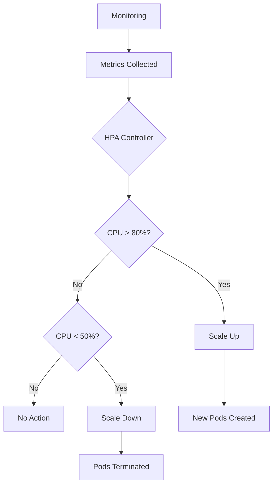
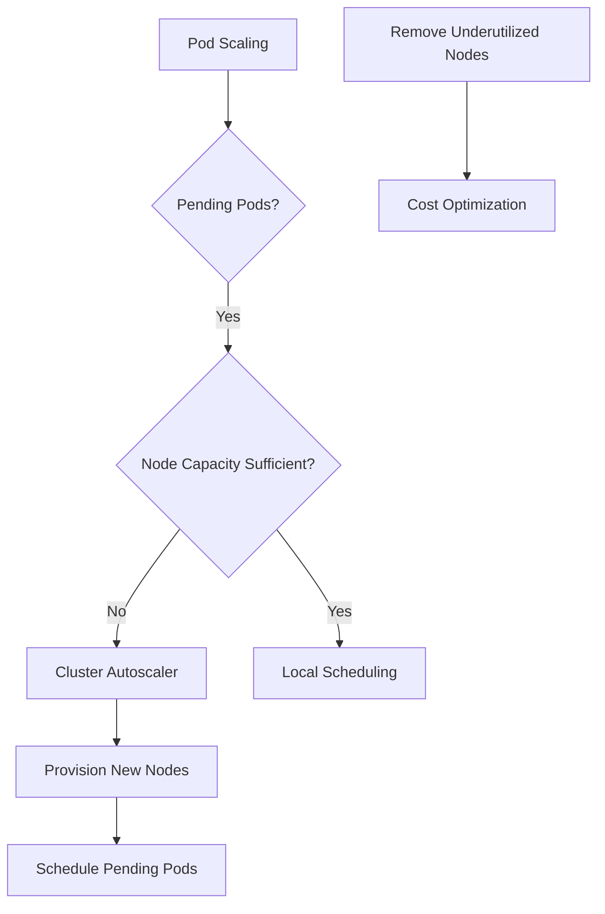

# Session 25: Backup for GKE, Imperative Configuration, Horizontal Pod Autoscaling, Cluster Autoscaling

## Table of Contents
- [Introduction](#introduction)
- [Imperative Configuration](#imperative-configuration)
- [Backup for GKE](#backup-for-gke)
- [Horizontal Pod Autoscaling (HPA)](#horizontal-pod-autoscaling-hpa)
- [Cluster Autoscaling](#cluster-autoscaling)
- [Declarative Configuration](#declarative-configuration)

## Introduction
### Overview
This session covers essential operational aspects of Kubernetes in Google Cloud Platform (GCP), specifically focusing on Google Kubernetes Engine (GKE). It transitions from previous UI-based deployments to command-line operations, emphasizing imperative configuration techniques before introducing declarative approaches. The key topics include backup strategies for production workloads, autoscaling mechanisms at both pod and cluster levels, and configuration management for scalability and reliability.

### Key Concepts/Deep Dive
- **Transition from UI to CLI**: Previous sessions used Google Cloud console for deployments. This session demonstrates CLI commands using `kubectl` for automated, repeatable operations.
- **Imperative vs Declarative**: Imperative commands execute specific actions immediately, while declarative defines desired state allowing Kubernetes to handle implementation.
- **Production Readiness**: Emphasis on backup, autoscaling, and configuration management for production environments.
- **GKE Modes**: Distinction between standard mode (manual control) and autopilot mode (automated management).

## Imperative Configuration
### Overview
Imperative configuration uses direct commands to manage Kubernetes resources, offering precision for experienced users. This approach is preferred when you need fine-grained control and are familiar with Kubernetes internals.

### Key Concepts/Deep Dive
- **Command Structure**: Most operations follow `kubectl [verb] [resource] [options]` pattern.
- **API Interaction**: Commands interact directly with Kubernetes API server.
- **Immediate Execution**: Actions take effect immediately without state differentiation.
- **Power User Tools**: Requires deep knowledge of resource specifications and YAML structures.

### Key Concepts/Deep Dive
- **Deployment Creation**: `kubectl create deployment` specifies image, replicas, and resources.
- **Scaling Operations**: `kubectl scale deployment` adjusts replica count dynamically.
- **Resource Updates**: `kubectl set image` updates container images for rolling updates.
- **Service Exposure**: `kubectl expose deployment` creates load balancers or internal services.
- **Observability Commands**: 
  - `kubectl get pods -o wide` shows pod distribution across nodes
  - `kubectl describe pods` provides detailed diagnostic information

### Lab Demos
#### Creating and Managing Deployments
```bash
# Create deployment with basic configuration
kubectl create deployment my-app --image=us-central1-docker.pkg.dev/<project>/my-repo/my-image:latest --replicas=1

# Scale deployment manually
kubectl scale deployment my-app --replicas=3

# Update container image for rolling update
kubectl set image deployment/my-app nginx=nginx:latest

# Expose deployment as LoadBalancer service
kubectl expose deployment my-app --type=LoadBalancer --port=80 --target-port=8080

# Set resource specifications (requires resource requests for autoscaling)
kubectl set resources deployment/my-app containers=my-container requests=cpu=100m,memory=100Mi limits=cpu=200m,memory=200Mi
```

### Common Configurations
#### Resource Specifications Table

| Resource | Request | Limit | Purpose |
|----------|---------|-------|----------|
| CPU | 100m | 500m | Millicore allocation |
| Memory | 100Mi | 512Mi | Memory allocation |
| Storage | N/A | 10Gi | Persistent storage |

> [!NOTE]
> Resource requests ensure pod scheduling. Limits prevent resource exhaustion but may cause OOM kills.

## Backup for GKE
### Overview
Backup for GKE provides automated backup solutions for Kubernetes cluster resources, available since 2022. It enables point-in-time recovery of cluster state, supporting disaster recovery and operational rollbacks.

### Key Concepts/Deep Dive
- **Backup Plans**: Define schedules and retention policies for automated backups.
- **Restoration Plans**: Specify which namespaces and resources to restore.
- **Etcd Integration**: Backs up cluster state from control plane's etcd database.
- **Regional Availability**: Supports backups across different GCP regions and projects.
- **Cost Considerations**: Storage costs apply for backup retention.

### Key Concepts/Deep Dive
- **Backup Scope**: Includes deployments, services, configmaps, secrets, and other Kubernetes objects.
- **RTO/RPO Support**: Recovery Time Objective and Recovery Point Objective configurations.
- **Third-party Alternatives**: AWS lacks native Kubernetes backup (uses external tools).

### Lab Demos
#### Setting Up Backup for GKE
```yaml
# Example backup plan configuration
apiVersion: gkebackup.googleapis.com/v1
kind: BackupPlan
metadata:
  name: my-backup-plan
  namespace: default
spec:
  cluster: my-gke-cluster
  backupSchedule:
    cronSchedule: "0 2 * * *"  # Daily at 2 AM
    paused: false
  retentionPolicy:
    backupRetentionDays: 30
    backupDeleteLockDays: 0
---
# Example restore plan configuration
apiVersion: gkebackup.googleapis.com/v1
kind: RestorePlan
metadata:
  name: my-restore-plan
  namespace: default
spec:
  backupPlan: my-backup-plan
  cluster: my-gke-cluster
  restoreConfig:
    volumeDataRestorePolicy: RestoreVolumeDataFromBackup
    namespacedResourceRestoreMode: DeleteAndRecreate
```

### Backup States

```diff
! Backup Inactive → Scheduled Backup → In Progress → Completed
! Failed Backups → Automatic Retry → Alert Generation → Manual Intervention
```

## Horizontal Pod Autoscaling (HPA)
### Overview
Horizontal Pod Autoscaling automatically adjusts the number of pod replicas based on observed metrics, primarily CPU and memory utilization. It maintains application performance while optimizing resource usage.

### Key Concepts/Deep Dive
- **Metrics-driven Scaling**: Responds to real-time resource consumption.
- **Load Balancing**: Scales pods independently from nodes.
- **Cool-down Periods**: Prevents rapid scaling decisions to avoid oscillations.
- **Resource Requirements**: Pods must specify resource requests for metrics collection.

### Key Concepts/Deep Dive
- **Target Utilization**: Default 80% CPU utilization trigger threshold.
- **Min/Max Replicas**: Configurable boundaries for scaling limits.
- **Custom Metrics**: Support for external metrics beyond CPU/memory.
- **Scaling Policies**: Different behaviors for scale-up vs scale-down.

### Autoscaling Architecture


```diff
+ Efficient Resource Utilization: Scale exactly when needed
- Threshold Tuning: Requires careful configuration of target values
! Pending Pods: Occur when node capacity exhausted during scaling
```

### Lab Demos
#### Enabling HPA via UI
1. Navigate to GKE Workloads > Deployment > Actions > Autoscaling
2. Configure minimum replicas (1)
3. Configure maximum replicas (10)
4. Set target CPU utilization (80%)
5. Enable autoscaling

#### Configuring HPA via Command Line
```bash
# Create HPA configuration
kubectl autoscale deployment my-app --cpu-percent=80 --min=1 --max=10

# Monitor HPA status
kubectl get hpa
kubectl describe hpa

# Generate sustained load testing
# Using siege (requires external IP)
siege -c 50 -t 30s http://<EXTERNAL-IP>
```

### HPA Metrics Table

| Metric Type | Target | Behavior |
|-------------|--------|----------|
| CPU | 80% | Scale up when exceeded |
| Memory | Custom | Requires custom metrics |
| Custom | Variable | External monitoring integration |
| External | Variable | Prometheus/external sources |

## Cluster Autoscaling
### Overview
Cluster Autoscaling provisions additional nodes when workloads require more resources than available on existing nodes. It automatically adds or removes nodes from the node pool based on overall cluster utilization.

### Key Concepts/Deep Dive
- **Node Pool Management**: Operates at managed instance group level.
- **Infrastructure Scaling**: Complements pod-level autoscaling.
- **Resource Quotas**: Respects regional and zonal compute quotas.
- **Scale-down Strategies**: Removes underutilized nodes to reduce costs.

### Key Concepts/Deep Dive
- **Node Addition**: Triggered when pods remain in pending state due to insufficient resources.
- **Node Removal**: Occurs when nodes remain underutilized for extended periods.
- **Minimum/Maximum Nodes**: Configurable per node pool.
- **Cost Optimization**: Automatically rightsizes cluster to demand.



```diff
+ Dynamic Infrastructure: Adds nodes only when needed
- Provisioning Time: 5-8 minutes for new nodes vs seconds for pods
! Resource Planning: Requires careful node pool configuration
```

### Lab Demos
#### Enabling Cluster Autoscaling
```bash
# Enable via gcloud GKE clusters
gcloud beta container clusters update my-cluster \
  --enable-autoscaling \
  --min-nodes 1 \
  --max-nodes 5 \
  --zone=us-west1-a
```

#### Cluster vs Pod Auto Scaling Comparison

| Aspect | HPA | Cluster Autoscaling |
|--------|-----|-------------------|
| Scope | Workload-level | Infrastructure-level |
| Speed | Seconds | Minutes |
| Granularity | Per deployment | Node pool |
| Triggers | Pod metrics | Unschedulable pods |
| Cost Impact | Lower | Higher |

## Declarative Configuration
### Overview
Declarative configuration defines desired cluster state in YAML manifests, allowing Kubernetes to determine implementation. This approach provides version control, audit trails, and repeatability.

### Key Concepts/Deep Dive
- **Desired State**: Specify "what you want" rather than "how to do it".
- **Idempotent Operations**: `kubectl apply` produces same result regardless of runs.
- **Version Control**: YAML files can be committed to Git repositories.
- **Change Tracking**: Clear audit trail of configuration changes.

### Key Concepts/Deep Dive
- **Manifest Structure**: YAML defines apiVersion, kind, metadata, and spec.
- **Template Generation**: IDE editors provide starter templates.
- **Resource Relationships**: Single file can define multiple related resources.

### Declarative Configuration Flow
```diff
! YAML Manifest → kubectl apply -f manifest.yaml → Resource Creation/Update
! Change Management → Version Control → CD Integration → Consistent Deployments
```

### Lab Demos
#### Creating Deployment via Declarative YAML
```yaml
apiVersion: apps/v1
kind: Deployment
metadata:
  name: my-app
  labels:
    app: my-app
spec:
  replicas: 3
  selector:
    matchLabels:
      app: my-app
  template:
    metadata:
      labels:
        app: my-app
    spec:
      containers:
      - name: app-container
        image: us-central1-docker.pkg.dev/my-project/my-repo/my-image:latest
        ports:
        - containerPort: 8080
        resources:
          requests:
            cpu: 100m
            memory: 128Mi
          limits:
            cpu: 500m
            memory: 512Mi
---
apiVersion: v1
kind: Service
metadata:
  name: my-app-service
spec:
  selector:
    app: my-app
  ports:
  - port: 80
    targetPort: 8080
  type: LoadBalancer
```

```bash
# Apply declarative configuration
kubectl apply -f app-deployment.yaml

# Check status and differences
kubectl get deployments
kubectl get services

# Reapply for consistency (no changes if identical)
kubectl apply -f app-deployment.yaml
```

> [!IMPORTANT]
> Declarative configuration provides superior change management and operational reliability compared to imperative commands.

## Summary
### Key Takeaways
```diff
+ Imperative commands provide immediate control for power users
+ GKE backups enable disaster recovery with 2-year availability
+ HPA scales pods based on utilization metrics automatically
+ Cluster autoscaling provisions infrastructure as needed
+ Declarative YAML offers version control and repeatability
- Misconfiguration can lead to resource contention and service disruption
! Plan resource requests carefully to enable proper autoscaling
```

### Expert Insight
#### Real-world Application
In production environments, combine HPA with cluster autoscaling for fully automated workload scaling. Use declarative manifests in CI/CD pipelines to ensure consistent deployments across environments. Implement GKE backups for compliance requirements and disaster recovery scenarios.

#### Expert Path
Master resource sizing by monitoring actual consumption patterns. Learn Kubernetes YAML structure comprehensively. Implement custom metrics for application-specific scaling needs. Practice with different node types (preemptible, GPU-enabled) for cost optimization.

#### Common Pitfalls
- ❌ **No Resource Requests**: Prevents HPA from functioning due to unknown metrics
- ❌ **Infinite Scaling**: Unbounded maximum replicas can cause resource exhaustion
- ❌ **Tight CPU Limits**: May trigger OOM kills instead of autoscaling
- ❌ **Manual Scaling Conflicts**: Override autoscaling decisions with manual scale commands
- ❌ **Inadequate Quotas**: Autoscaling fails silently when hitting GCP quotas

Common issues include pending pods during high load (increase cluster autoscaling limits), metrics collection delays (wait 2-3 minutes post-resource configuration), and backup failures (verify service account permissions). Always test autoscaling with realistic load patterns.
