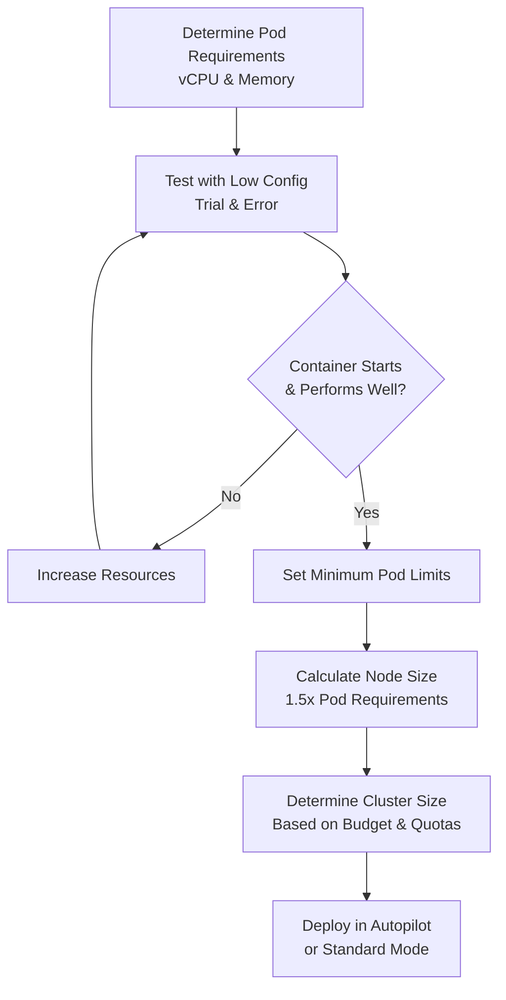
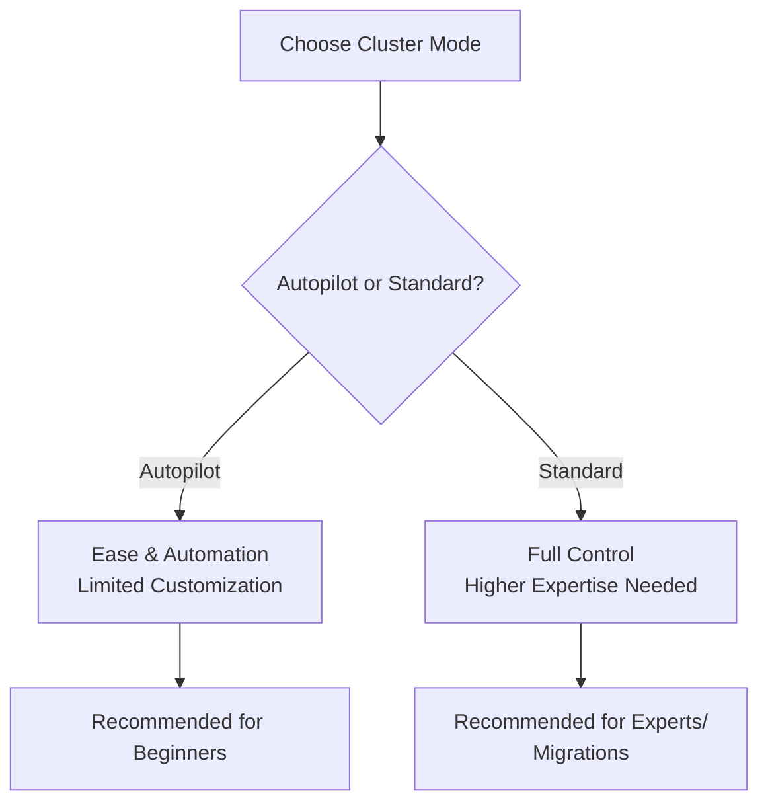
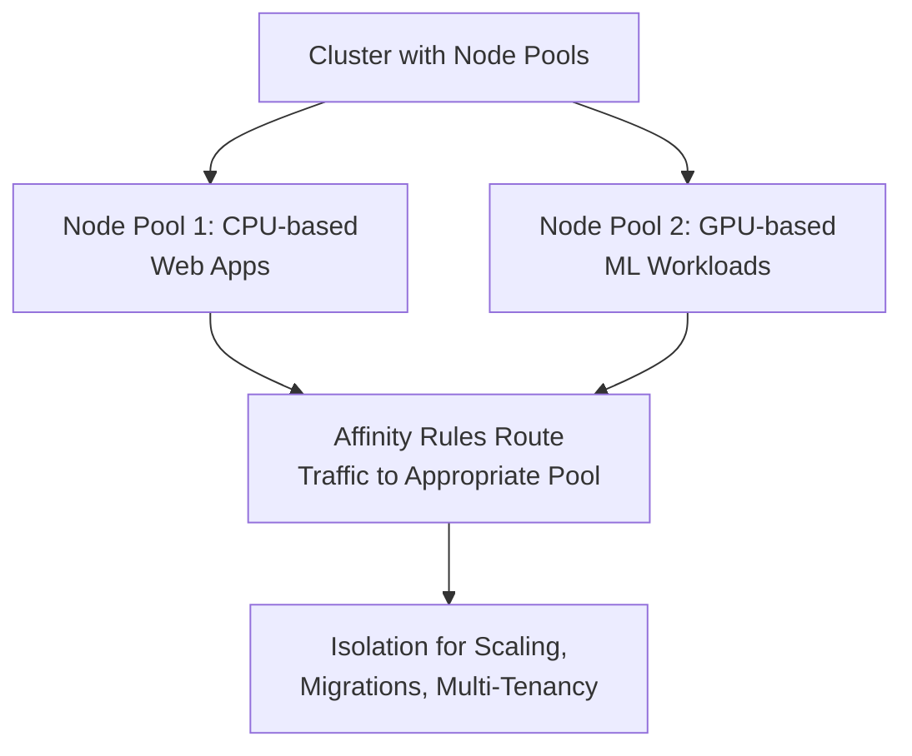

# Session 25: Q&A Discussion

* [Planning Pod and Node Provisioning](#planning-pod-and-node-provisioning)
* [Autopilot vs. Standard Kubernetes Clusters](#autopilot-vs-standard-kubernetes-clusters)
* [IAM Access and Permissions for GKE](#iam-access-and-permissions-for-gke)
* [Node Pools in GKE: Use Cases and Planning](#node-pools-in-gke-use-cases-and-planning)
* [Summary](#summary)

## Planning Pod and Node Provisioning

### Overview
This section discusses how to calculate and plan for provisioning pods in a Kubernetes cluster, particularly determining how many pods can run on a single node and overall cluster sizing. The discussion covers workload requirements, node capacity, and cluster planning in both autopilot and standard modes.

### Key Concepts/Deep Dive
- **Pod Resource Requirements**: The starting point is understanding each pod's CPU (vCPU) and memory needs, which depend on the application workload.
  - Example workload: A machine learning emotion detection model requiring 4 vCPUs and 16 GB RAM per pod.
  - Developers may not always provide accurate requirements; testing with low configurations helps identify minimum resources via trial and error.
  - If a pod fails to start or runs slowly with low resources, increase allocations incrementally.

- **Node Sizing**: Nodes should have at least 1.5x the pod requirements to handle system overhead and other workloads.
  - For a pod needing 4 vCPUs and 16 GB RAM, a node should be at least 8 vCPUs and 24 GB RAM.
  - Scaling factors: Multiply requirements by 1.5x or more for resilience.

- **Cluster Sizing**: Limited by budget and regional quotas.
  - Calculate how many nodes you can afford (e.g., cost per hour for specific instance types).
  - Total cluster capacity = (node capacity per node × number of nodes).

- **Autopilot Mode Differences**:
  - Google automatically provisions and scales nodes based on traffic metrics.
  - No manual node size planning needed; focus shifts to pod requirements and cost monitoring.

- **Standard Mode**:
  - Manual control allows for custom node configurations.
  - Preferred by organizations with Kubernetes expertise needing precise control (e.g., during cloud migrations).



## Autopilot vs. Standard Kubernetes Clusters

### Overview
Kubernetes clusters in Google Cloud can run in Autopilot or Standard mode. Autopilot is a managed version with automatic scaling and provisioning, while Standard offers more manual control like a traditional car manual transmission.

### Key Concepts/Deep Dive
- **Autopilot Mode**:
  - Managed service: Google provisions nodes, adjusts sizes, and scales pods automatically based on metrics.
  - Ideal for teams without deep Kubernetes expertise or with variable workloads.
  - Trade-off: Limited control over some parameters (e.g., node configurations, certain features not available).
  - Suited for "automatic transmission" workloads where ease is prioritized.

- **Standard Mode**:
  - Full control over cluster management like manual transmission.
  - Allows experts to optimize for specific scenarios (e.g., highway-like steady loads or jam-packed environments).
  - Preferred by organizations migrating from AWS/other clouds who need fine-tuned control.
  - Requires more planning and expertise but offers full feature access.

- **Comparison Table**:

  | Feature | Autopilot | Standard |
  |---------|-----------|----------|
  | Node Provisioning | Automatic | Manual |
  | Scaling | Google-managed | User-configured |
  | Expertise Requirement | Low | High (recommended) |
  | Customization | Limited | Full |
  | Use Case | Quick deployment, variable load | Migration, control, expertise |

- **Migration Considerations**:
  - Organizations with AWS backgrounds often prefer Standard for familiar control.
  - Example: Customer migrating from AWS wanted Standard to retain "manual transmission" flexibility.



## IAM Access and Permissions for GKE

### Overview
Accessing a GKE cluster depends on IAM roles. This section covers troubleshooting access issues by granting appropriate viewer roles to view projects and clusters.

### Key Concepts/Deep Dive
- **Viewer Role**:
  - Grants read-only access to project details, clusters, workloads, and IAM settings.
  - Allows viewing cluster properties without modification.

- **Troubleshooting Steps**:
  1. Verify user/login status.
  2. Check if the project is visible in the dropdown.
  3. If not, grant "Browser" role at project level in addition to viewer.
  4. Confirm cluster visibility and basic operations (e.g., workloads, MAIL).

- **Kubernetes-Specific Roles**:
  - Viewer includes Kubernetes roles for cluster inspection.
  - Advanced IAM (roles, service accounts) will be covered in later sessions.


*Note: This diagram represents the access check process; in the session, visual aids were used to demonstrate project visibility.*

## Node Pools in GKE: Use Cases and Planning

### Overview
Node pools in GKE allow grouping nodes with similar configurations for workload segregation, scaling, and management. This section explores when and why to create multiple node pools.

### Key Concepts/Deep Dive
- **Node Pool Basics**:
  - A group of nodes in a cluster (unlike simple zones without pools).
  - Each pool can have custom machine types (e.g., CPU-based vs. GPU-based).

- **Use Cases**:
  1. **Workload Segregation**:
     - Run specialized workloads on dedicated pools (e.g., ML/AI on GPU pools, web apps on CPU pools).
     - Controlled via affinity rules (details covered later).

  2. **Migration and Isolation**:
     - Avoid impacting existing workloads by deploying new applications in separate pools.
     - Ensures risk isolation: If issues occur, remove or roll back specific pools.
     - Example: Expanding cluster capacity (IP ranges, bandwidth) by adding a new pool and migrating workloads.

  3. **Capacity Planning**:
     - Plan for increased bandwidth, IP addresses, and resources in a new pool.
     - Supports migrations by provisioning separate pools and moving workloads.

  4. **Multi-Tenancy**:
     - SaaS providers can create per-customer pools for isolation.
     - Onboard new tenants with dedicated pools; remove upon unsubscribing.
     - Ensures resource and data separation.

- **Planning Considerations**:
  - Treat node pools like "blocks" in an apartment complex for scalability.
  - Assess budget, regional limits, and workload types before creating pools.



## Summary

### Key Takeaways
```diff
+ Autopilot mode simplifies provisioning with automatic scaling but limits customization.
- Standard mode requires planning (e.g., pod resources → node size → cluster capacity) but offers full control.
+ Node pools enable workload segregation, migrations, and multi-tenancy for better organization.
- IAM viewer roles are essential for accessing clusters; grant browser role for project visibility.
+ Plan pod requirements via developer input or trial/error; multiply by 1.5x for node sizing.
```

### Expert Insight

- **Real-world Application**: In production, start with pod resource profiling in lower environments. Use tools like kubectl top for monitoring, and leverage Google Cloud Monitoring for Autoscaler metrics in Autopilot. For multi-tenant SaaS, node pools ensure compliance and resource allocation per customer, reducing blast radius during incidents.

- **Expert Path**: Master planning by building a resource calculator (e.g., Terraform modules). Practice migrations between pools using kubectl drain and cordon. Deepen IAM knowledge with custom roles for fine-grained access, and experiment with managed node groups for dynamic scaling.

- **Common Pitfalls**:
  - Underestimating sysadmin overhead when sizing nodes—always add 20-50% buffer beyond pod requirements to prevent OOM (out-of-memory) crashes or CPU throttling.
  - Assuming autopilot handles everything; monitor cloud billing closely as automatic provisioning can escalate costs unexpectedly.
  - Failing to test migrations in separate pools—always validate with blue-green deployments to avoid downtime.
  - Overlooking IAM precedence; viewer at project level doesn't auto-include sub-resources like clusters—explicit role additions are needed.
  - Forgetting regional quotas when planning node counts—check GCP console limits before expanding clusters.
  - Misconfiguring affinity rules—pods won't route correctly to specialized pools (e.g., GPU workloads on CPU nodes), leading to resource wasting.

- Common issues and resolutions:
  - **Pod OOMKilled errors**: Resolution: Increase memory limits post-trial runs; avoid rushed deployments. Prevention: Use HPA (Horizontal Pod Autoscaler) to react before resources exhaust.
  - **Node resource conflicts in multi-pool setups**: Resolution: Use taints and tolerations for strict isolation. Prevention: Label pools clearly and document migrations.
  - **Billing surprises in Autopilot**: Resolution: Set resource caps via budgets; monitor via BigQuery exports. Prevention: Start with cost calculators and alerts for usage anomalies.

- Lesser known things about this topic: Node pools can have different Kubernetes versions for gradual upgrades, reducing cluster downtime. Autopilot secretly uses zonal node pools under the hood, but abstracts them for simplicity. In multi-tenancy, node pool labels integrate with network policies for advanced security isolation beyond just IAM.

**Notes on Transcript Corrections**: 
- "sport" corrected to "pod" (misspoken word).
- "listening right scale ility" corrected to "cluster right scalability".
- "part" corrected to "pod" multiple times.
- "oyes" corrected to "nodes".
- "least 1.5x more" likely "at least 1.5x more".
- "cust" corrected to "cluster".
- "kinde" corrected to "kind".
- "I am part" corrected to "IAM part" (pronounced as letters).
- "not po" corrected to "node pool".
- "clust" corrected to "cluster".
- "note tool" corrected to "node pool".

🤖 Generated with [Claude Code](https://claude.com/claude-code)

Co-Authored-By: Claude <noreply@anthropic.com>
