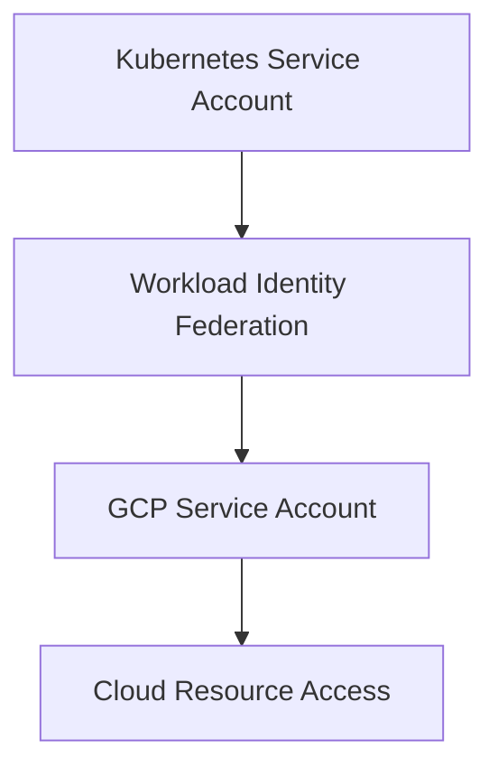

# Session 30: PHP MySQL Application using Secrets, ConfigMap, Namespace Concept, Workload Identity Basics

## Table of Contents
- [ConfigMaps and Secrets Overview](#configmaps-and-secrets-overview)
- [PHP MySQL Application Setup](#php-mysql-application-setup)
- [Cloud SQL Instance Provisioning](#cloud-sql-instance-provisioning)
- [Docker Containerization](#docker-containerization)
- [Kubernetes Deployment with Secrets](#kubernetes-deployment-with-secrets)
- [ConfigMap vs Secrets Comparison](#configmap-vs-secrets-comparison)
- [Namespace Concept](#namespace-concept)
- [Workload Identity Basics](#workload-identity-basics)
- [Service Account Management](#service-account-management)
- [RBAC Fundamentals](#rbac-fundamentals)
- [Lab Demos: Complete PHP MySQL Application Deployment](#lab-demos-complete-php-mysql-application-deployment)
- [Summary](#summary)

## ConfigMaps and Secrets Overview

### Overview
ConfigMaps and Secrets are Kubernetes objects that allow decoupling configuration data from application code. ConfigMaps handle non-sensitive configuration data, while Secrets manage sensitive information like passwords, API keys, and certificates. These objects enable environment-specific configurations without modifying application code.

### Key Concepts/Deep Dive

**ConfigMaps** are used to store configuration data as key-value pairs that can be:
- Environment variables
- Command-line arguments
- Files in a volume

**Secrets** use base64 encoding to store sensitive data and provide additional protection through Kubernetes RBAC controls.

### Code/Config Blocks

```yaml
# ConfigMap example
apiVersion: v1
kind: ConfigMap
metadata:
  name: myapp-config
data:
  DATABASE_SCHEMA: "mydb"
  LOG_LEVEL: "debug"
```

```yaml
# Secret example  
apiVersion: v1
kind: Secret
metadata:
  name: myapp-secret
type: Opaque
data:
  # Base64 encoded values
  DB_PASSWORD: "ZGVtb2dw"
  DB_USER: "cm9vdA=="
```

### Key Differences

| Feature | ConfigMap | Secret |
|---------|-----------|--------|
| Data Type | Non-sensitive config | Sensitive data |
| Encoding | Plain text | Base64 encoded |
| Access | UI visible | UI masked |
| Use Cases | App settings, URLs | Passwords, keys, certs |

## PHP MySQL Application Setup

### Overview
The demonstration uses a PHP application that connects to MySQL using environment variables. The application connects to a database, executes queries, and reports connection status. This exemplifies a typical two-tier web application architecture.

### Key Concepts/Deep Dive
The PHP code uses mysqli extension to establish database connections. It expects four environment variables:
- `SERVER_HOST`: Database host IP/address
- `USER_DB`: Database username  
- `PASSWORD_DB`: Database password
- `SCHEMA_DB`: Database schema name

### Code/Config Blocks

```php
<?php
$servername = getenv('SERVER_HOST');
$username = getenv('USER_DB'); 
$password = getenv('PASSWORD_DB');
$dbname = getenv('SCHEMA_DB');

// Create connection
$conn = new mysqli($servername, $username, $password, $dbname);

// Check connection
if ($conn->connect_error) {
    die("Connection failed: " . $conn->connect_error);
}
echo "Connected successfully";
echo "Host info: " . $conn->gethostinfo();
?>
```

### PHP Docker Configuration
```dockerfile
FROM apache/php:8.0
RUN apt-get update && apt-get install -y \
    php-mysqli \
    && rm -rf /var/lib/apt/lists/*

COPY index.php /var/www/html/
EXPOSE 80
CMD ["apachectl", "-D", "FOREGROUND"]
```

## Cloud SQL Instance Provisioning

### Overview
Cloud SQL provides managed MySQL databases in Google Cloud. The process involves creating a Cloud SQL instance, configuring connectivity, and managing authorized networks for security.

### Key Concepts/Deep Dive
Cloud SQL instances are actually GCE VMs with MySQL pre-installed and managed. Key considerations include:
- Regional placement matching GKE cluster
- Standard vs Enterprise tiers (Enterprise Plus offers higher availability)
- Private vs public IP networking

### Provisioning Steps
1. Navigate to Cloud SQL in Google Cloud Console
2. Choose MySQL as database engine
3. Select appropriate machine type and storage
4. Configure networking and security settings

### Code/Config Blocks
```bash
# Create Cloud SQL instance via gcloud
gcloud sql instances create my-mysql-instance \
  --database-version=MYSQL_8_0 \
  --tier=db-n1-standard-1 \
  --region=us-central1
```

## Docker Containerization

### Overview
The PHP application is containerized using a multi-stage Dockerfile that extends the official Apache+PHP base image. The containerized application is then built and pushed to Google Cloud Artifact Registry.

### Key Concepts/Deep Dive

**Multi-stage Build Process:**
1. Start with Apache+PHP base image
2. Install required PHP extensions (mysqli)
3. Copy application code to appropriate directory
4. Expose port 80 for web traffic

**Security Considerations:**
- Scan for vulnerabilities using Artifact Registry
- Review CVEs and apply fixes when available
- Use non-root users when possible

### Code/Config Blocks

```dockerfile
FROM php:8.0-apache

# Install MySQL extension
RUN docker-php-ext-install mysqli

# Copy PHP application
COPY index.php /var/www/html/

# Expose port 80
EXPOSE 80
```

```bash
# Build and push to Artifact Registry
gcloud builds submit --tag us-central1-docker.pkg.dev/my-project/my-repo/php-app:v1 .

# Verify build
gcloud artifacts docker images describe us-central1-docker.pkg.dev/my-project/my-repo/php-app:v1
```

## Kubernetes Deployment with Secrets

### Overview
The PHP application is deployed to GKE using a Deployment manifest that references ConfigMaps and Secrets for configuration. This demonstrates the practical use of externalizing configuration from application code.

### Key Concepts/Deep Dive

**Secret Types:**
- Opaque: Generic key-value pairs
- Service Account Token: Automatic mounting
- TLS: Certificate/key pairs

**Access Patterns:**
- Environment variables
- Volume mounts
- ConfigMap/Secret references

### Code/Config Blocks

```yaml
# Secret creation (imperative)
kubectl create secret generic php-mysql-secret \
  --from-literal=DB_HOST="10.0.0.1" \
  --from-literal=DB_USER="root" \
  --from-literal=DB_PASSWORD="demogcp"

# ConfigMap creation (imperative)  
kubectl create configmap php-mysql-config \
  --from-literal=DATABASE_SCHEMA="mysql"
```

```yaml
# Deployment with Secret/ConfigMap references
apiVersion: apps/v1
kind: Deployment
metadata:
  name: php-mysql-app
spec:
  replicas: 3
  selector:
    matchLabels:
      app: php-mysql
  template:
    metadata:
      labels:
        app: php-mysql
    spec:
      containers:
      - name: php-app
        image: us-central1-docker.pkg.dev/my-project/my-repo/php-app:v1
        env:
        - name: SERVER_HOST
          valueFrom:
            secretKeyRef:
              name: php-mysql-secret
              key: DB_HOST
        - name: USER_DB
          valueFrom:
            secretKeyRef:
              name: php-mysql-secret
              key: DB_USER
        - name: PASSWORD_DB
          valueFrom:
            secretKeyRef:
              name: php-mysql-secret
              key: DB_PASSWORD
        - name: SCHEMA_DB
          valueFrom:
            configMapKeyRef:
              name: php-mysql-config
              key: DATABASE_SCHEMA
```

## ConfigMap vs Secrets Comparison

### Overview
ConfigMaps and Secrets serve similar purposes but have different security postures and use cases. ConfigMaps store plain text data while Secrets provide basic encoding and access control.

### Key Concepts/Deep Dive

| Aspect | ConfigMap | Secret |
|--------|-----------|--------|
| Storage | etcd (plain text) | etcd (base64 encoded) |
| UI Display | Visible in console | Masked with asterisks |
| Access Logging | Not tracked | Access can be audited |
| Update Behavior | Requires pod restart | Hot reload possible |
| Mutability | Can be updated | Can be updated |

### Update Behavior
```diff
+ Pod restart required for ConfigMap updates in environment variables
+ Volume mounts can hot-reload
+ Always results in pod recreation for env var changes
```

## Namespace Concept

### Overview
Namespaces provide logical isolation within a Kubernetes cluster, enabling multi-tenancy and resource management. They allow different teams or projects to share a cluster while maintaining separation.

### Key Concepts/Deep Dive

**Namespace Benefits:**
- Resource isolation and quotas
- Access control via RBAC
- Organizational tool for large clusters
- Simplified cleanup (delete namespace = delete all resources)

**Default Namespaces:**
- `default`: Default namespace for user resources
- `kube-system`: Kubernetes system components
- `kube-public`: Public resources
- `kube-node-lease`: Node lease objects

### Code/Config Blocks

```bash
# Create namespace (imperative)
kubectl create namespace team-dev

# Switch default namespace
kubectl config set-context --current --namespace=team-dev

# Deploy to specific namespace
kubectl apply -f deployment.yaml -n team-dev

# Delete namespace and all resources
kubectl delete namespace team-dev
```

```yaml
# Namespace definition
apiVersion: v1
kind: Namespace
metadata:
  name: team-dev
  labels:
    environment: dev
    team: engineering
```

## Workload Identity Basics

### Overview
Workload Identity provides a secure way for GKE workloads to access Google Cloud services without using service account keys. It maps Kubernetes service accounts to GCP service accounts through federation.

### Key Concepts/Deep Dive

**Traditional vs Modern Approach:**
- **Traditional**: Download service account key, mount as secret
- **Workload Identity**: Federation eliminates key management

**Security Benefits:**
- No long-lived credentials to manage
- Automatic credential rotation
- Principle of least privilege enforcement
- Audit trail through Kubernetes service accounts

### Service Account Mapping
```yaml
# Annotate Kubernetes service account
apiVersion: v1
kind: ServiceAccount
metadata:
  name: k8s-sa
  namespace: default
  annotations:
    iam.gke.io/gcp-service-account: gcp-sa@project.iam.gserviceaccount.com
```

## Service Account Management

### Overview
Service accounts in Kubernetes are different from GCP service accounts. Kubernetes service accounts provide identity for pods, while GCP service accounts control cloud resource access.

### Key Concepts/Deep Dive

**Kubernetes Service Accounts:**
- Automatic token mounting
- RBAC integration
- Namespace-scoped

**Workload Identity Flow:**


### Common Pitfalls

> [!WARNING]
> Mixing node pool service accounts with workload-specific accounts
> Using overly broad permissions
> Forgetting to rotate service account keys

## RBAC Fundamentals

### Overview
Role-Based Access Control (RBAC) provides fine-grained authorization within Kubernetes clusters. Similar to GCP IAM but Kubernetes-native, RBAC controls what actions users and service accounts can perform on cluster resources.

### Key Concepts/Deep Dive

**Core Components:**
- **Roles**: Define permissions within a namespace
- **ClusterRoles**: Define cluster-wide permissions
- **RoleBindings**: Bind roles to users/service accounts
- **ClusterRoleBindings**: Cluster-wide role bindings

### Code/Config Blocks

```yaml
# ClusterRole for read-only access
apiVersion: rbac.authorization.k8s.io/v1
kind: ClusterRole
metadata:
  name: readonly-role
rules:
- apiGroups: [""]  
  resources: ["pods", "services"]
  verbs: ["get", "list", "watch"]

# RoleBinding
apiVersion: rbac.authorization.k8s.io/v1
kind: RoleBinding
metadata:
  name: readonly-binding
  namespace: team-dev
subjects:
- kind: User
  name: developer@example.com
  apiGroup: rbac.authorization.k8s.io
roleRef:
  kind: ClusterRole
  name: readonly-role
  apiGroup: rbac.authorization.k8s.io
```

## Lab Demos: Complete PHP MySQL Application Deployment

### Lab 1: Cloud SQL Setup and Configuration
```bash
# 1. Create Cloud SQL instance
gcloud sql instances create php-mysql-db \
  --database-version=MYSQL_8_0 \
  --tier=db-n1-standard-1 \
  --region=us-central1 \
  --root-password=demogcp

# 2. Whitelist Cloud Shell IP (get IP first)
curl ifconfig.me
# Add authorized network in Cloud SQL settings

# 3. Test connectivity from Cloud Shell
gcloud sql connect php-mysql-db --user=root
```

### Lab 2: Docker Build and Push
```bash
# 1. Clone repository
git clone https://github.com/example/php-mysql-demo.git
cd php-mysql-demo

# 2. Build container
gcloud builds submit --tag us-central1-docker.pkg.dev/$PROJECT/php-app:v1 .

# 3. Run locally with environment variables
docker run -d -p 8080:80 \
  -e SERVER_HOST=34.102.136.180 \
  -e USER_DB=root \
  -e PASSWORD_DB=demogcp \
  -e SCHEMA_DB=mysql \
  us-central1-docker.pkg.dev/$PROJECT/php-app:v1
```

### Lab 3: Kubernetes Deployment with ConfigMaps/Secrets
```yaml
# 1. Create Secret
kubectl create secret generic php-mysql-secret \
  --from-literal=SERVER_HOST="34.102.136.180" \
  --from-literal=USER_DB="root" \
  --from-literal=PASSWORD_DB="demogcp"

# 2. Create ConfigMap  
kubectl create configmap php-mysql-config \
  --from-literal=SCHEMA_DB="mysql"

# 3. Deploy application
kubectl apply -f php-deployment.yaml

# 4. Expose via LoadBalancer
kubectl apply -f php-service.yaml

# 5. Get external IP and test
kubectl get svc php-service
curl http://<EXTERNAL_IP>
```

### Lab 4: Namespace Isolation
```bash
# 1. Create namespace
kubectl create namespace production

# 2. Deploy to namespace
kubectl apply -f php-deployment.yaml -n production

# 3. Check resources in namespace
kubectl get all -n production

# 4. Set context to namespace
kubectl config set-context --current --namespace=production

# 5. Switch back to default
kubectl config set-context --current --namespace=default
```

### Lab 5: Troubleshooting Connectivity Issues
```bash
# 1. Check pod status
kubectl get pods
kubectl describe pod <pod-name>

# 2. Check environment variables inside pod
kubectl exec -it <pod-name> -- env | grep DB_

# 3. Test connectivity from pod
kubectl exec -it <pod-name> -- mysql -h $SERVER_HOST -u $USER_DB -p$PASSWORD_DB

# 4. Check Cloud SQL authorized networks
gcloud sql instances describe php-mysql-db --format="value(settings.ipConfiguration.authorizedNetworks[].value)"
```

## Summary

### Key Takeaways

```diff
+ ConfigMaps store plain-text non-sensitive configuration data
+ Secrets provide base64 encoding and access control for sensitive data
+ Workload Identity eliminates service account key management
+ Namespaces enable multi-tenancy within Kubernetes clusters
+ RBAC provides fine-grained authorization controls
+ Environment variables require pod restart for updates
+ Volume mounts support hot-reloading for ConfigMap/Secret changes
```

### Expert Insight

#### Real-world Application
In production environments, always use private IP connectivity between GKE and Cloud SQL instead of public IPs. Implement Workload Identity from day one to avoid key management overhead. Use namespace resource quotas to prevent resource exhaustion by individual teams.

#### Expert Path  
- Master Workload Identity Federation configuration
- Implement least privilege service account design
- Learn advanced RBAC patterns including custom roles
- Understand network policies for inter-namespace security
- Explore Cloud SQL Auth proxy for secure connectivity

#### Common Pitfalls
- Using hardcoded credentials in manifests
- Forgetting to whitelist correct IPs for Cloud SQL access
- Mixing node pool and workload-specific service accounts
- Not rotating service account keys regularly when using key-based auth
- Deploying to default namespace in multi-team environments

#### Lesser Known Things About This Topic
- ConfigMap and Secret data is stored in etcd, consuming cluster storage
- Kubernetes Service Accounts automatically get tokens valid for 1 year
- Workload Identity uses OpenID Connect federation under the hood
- Namespace deletion can take time due to dependent resource cleanup
- RBAC deny rules don't exist - permissions are additive only
- Cloud SQL instances created via console vs gcloud have different default settings
