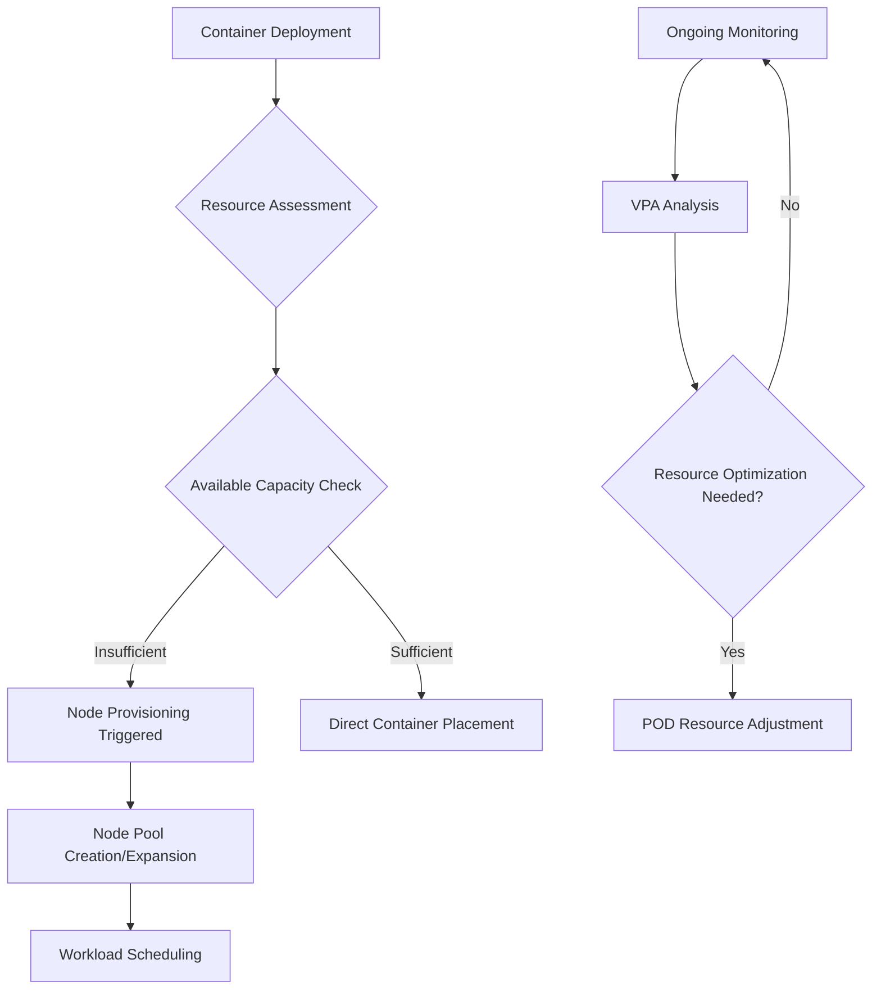

# Session 38: GKE Autopilot Deep Dive - Regional, Workload Identity, Cluster & Node Autoscaling

## Table of Contents
1. [Introduction to GKE Autopilot](#introduction-to-gke-autopilot)
2. [Billing Model Comparison](#billing-model-comparison)
3. [Autoscaling Capabilities](#autoscaling-capabilities)
4. [SLA and Availability Considerations](#sla-and-availability-considerations)
5. [Regional vs Zonal Clusters](#regional-vs-zonal-clusters)
6. [Cluster and Node Configuration](#cluster-and-node-configuration)
7. [Creating an Autopilot Cluster](#creating-an-autopilot-cluster)
8. [Workload Identity Implementation](#workload-identity-implementation)
9. [Machine Types and Performance Classes](#machine-types-and-performance-classes)
10. [Feature Comparison Matrix](#feature-comparison-matrix)

## Introduction to GKE Autopilot

### Overview
Google Kubernetes Engine (GKE) Autopilot represents Google's recommended approach to Kubernetes deployment, providing a fully-managed serverless experience where infrastructure complexity is abstracted away, allowing developers to focus exclusively on application development and deployment strategies.

### Key Concepts

Autopilot fundamentally reimagines Kubernetes management by implementing Google Cloud Platform's operational expertise directly into the service offering. The core value proposition centers on eliminating traditional infrastructure management challenges while maintaining full Kubernetes API compatibility.

### Deep Dive into Core Differences

**Infrastructure Abstraction**: Unlike standard GKE where administrators maintain full visibility into virtual machines, Autopilot operates nodes in Google's managed tenant projects, rendering infrastructure invisible to users while Google handles all provisioning and lifecycle management.

**Operational Philosophy**: Autopilot embodies a "serverless" paradigm where containers and pods serve as the primary resource abstraction, contrasting with traditional node-centric approaches.

### Architectural Comparison

| Component | Standard GKE | Autopilot GKE |
|-----------|-------------|----------------|
| Node Ownership | User-controlled VMs | Google-managed instances |
| Infrastructure Visibility | Full access via GCP console | Completely abstracted |
| Billing Unit | Virtual machine instances | Container workloads |
| Scaling Logic | Node pool configuration | Pod resource requirements |

### Lab Demos: Environment Preparation
Before proceeding with cluster creation, establish baseline environment verification:

```bash
# Infrastructure state assessment
gcloud compute instances list
gcloud compute disk list
gcloud compute instance-groups list
```

Expected output: Empty listings confirming clean state
Default network infrastructure: Standard VPC with firewall configurations intact

## Billing Model Comparison

### Overview
Billing models represent the most critical architectural decision point when selecting between GKE deployment modes, directly influencing total cost of ownership and resource utilization strategies.

### Key Concepts

Standard GKE implements traditional infrastructure billing where costs accrue based on provisioned virtual machine instances regardless of actual workload consumption. This approach requires extensive capacity planning to accommodate peak loads.

Autopilot pioneers pod-level billing where costs directly correlate with active resource utilization within deployed containers, enabling precise cost attribution to individual application components.

### Deep Dive into Cost Mechanics

**Standard GKE Cost Components:**
- Master/control plane management fees
- Per-node pricing encompassing all allocated instances
- Sustained costs for infrastructure regardless of utilization
- Manual scaling operations to optimize expenditures

**Autopilot Cost Components:**
- Minimal baseline control plane maintenance
- Direct billing only for active pod resource consumption
- Automatic scaling with zero-cost periods during inactivity
- Precise attribution to individual workloads

### Cost Structure Analysis

| Billing Scenario | Standard GKE Implementation | Autopilot Implementation |
|------------------|-----------------------------|--------------------------|
| **Idle Infrastructure** | Full node pricing applied | Minimal (~$0.10) baseline cost |
| **Single Container** | Complete cluster infrastructure costs | Pod resource allocation costs only |
| **Peak Load Provisioning** | Pre-provisioned capacity requirements | Dynamic resource allocation |

### Lab Demos: Cost Analysis Validation

```bash
# Simulate workload deployment costs
# Standard GKE: Pay for 3 nodes minimum
# Autopilot: Pay for pod resources only

kubectl apply -f deployment.yaml
kubectl get pods --all-namespaces --watch
kubectl top pods --all-namespaces
```

⚠️ **Economic Considerations**: Autopilot's billing precision promotes resource efficiency but demands strict resource specification adherence to prevent unexpected cost escalation.

## Autoscaling Capabilities

### Overview
Autopilot provides comprehensive autoscaling functionality covering vertical pod autoscaling and node auto-provisioning, enabling fully automated resource management without manual intervention.

### Key Concepts

Autopilot's autoscaling ecosystem integrates multiple scaling dimensions operating in concert to maintain optimal resource utilization and performance characteristics.

### Deep Dive into Scaling Mechanisms

**Vertical Pod Autoscaling (VPA):**
- Monitors historical usage patterns across containerized workloads
- Automatically adjusts CPU and memory resource allocations
- Prevents resource starvation while optimizing cloud costs

**Node Auto-Provisioning (NAP):**
- Creates specialized node pools matching workload resource requirements
- Provisions appropriate infrastructure for GPU-intensive or high-memory workloads
- Eliminates manual node pool configuration overhead

**Cluster-Level Autoscaling:**
- Dynamically adjusts node counts within existing pools
- Maintains optimal resource utilization across deployment topologies
- Scales infrastructure preemptively based on workload resource demands

### Scaling Logic Flow



### Lab Demos: Autoscaling Behavior

**Initial Cluster State:**
```bash
kubectl get pods
kubectl get nodes
```
Output: Pending system components, zero visible infrastructure

**Workload Trigger Scaling:**
```bash
kubectl apply -f nginx-deployment.yaml
kubectl get pods -w
kubectl get nodes -w
```

Expected behavior: Node provisioning (typical 1-2 minute delay), container transitions from pending to running state

**Resource-Based Scaling Demonstration:**

```yaml
apiVersion: apps/v1
kind: Deployment
metadata:
  name: autoscaling-demo
spec:
  replicas: 5
  template:
    spec:
      containers:
      - name: nginx
        image: nginx:1.20
        resources:
          requests:
            memory: "500Mi"
            cpu: "200m"
          limits:
            memory: "1Gi"
            cpu: "500m"
        ports:
        - containerPort: 80
```

Observation: Automatic node pool creation exceeding default capacity, workload distribution across multiple nodes

## SLA and Availability Considerations

### Overview
Service Level Agreements establish contractual commitments regarding system uptime, directly influencing architectural approaches to fault tolerance and business continuity planning.

### Key Concepts

Zonal clusters consolidate all cluster components within single availability zones, offering basic operational continuity guarantees. Regional clusters distribute control planes and workloads across multiple zones, providing enhanced resilience against infrastructure failures.

### Deep Dive into Availability Tiers

**Zonal Cluster Characteristics:**
- Control plane operating within single availability zone
- 99.5% uptime commitment (approximately 3 hours 45 minutes monthly downtime)
- Lower operational complexity and reduced infrastructure costs
- Suitable for development environments and non-critical applications

**Regional Cluster Characteristics:**
- Distributed control plane across 3+ availability zones
- 99.9% uptime commitment (approximately 43 minutes monthly downtime)
- Enhanced fault tolerance but increased infrastructure overhead
- Essential for production workloads requiring high availability

### SLA Mathematical Breakdown

| Availability Target | Monthly Downtime Allowance | Hourly Impact |
|---------------------|----------------------------|----------------|
| 99.5% (Zonal) | 3 hours 44 minutes | ~4.5 seconds per hour |
| 99.9% (Regional) | 43 minutes 12 seconds | ~0.008 seconds per hour |
| 99.95% (Enterprise) | 21 minutes 36 seconds | ~0.004 seconds per hour |
| 99.99% (Multi-cluster) | 4 minutes 21 seconds | ~0.0007 seconds per hour |

### Lab Demos: SLA Verification

```bash
# Cluster regional distribution confirmation
gcloud container clusters describe autopilot-cluster \
    --region=us-central1 --format="value(location)"
gcloud container clusters describe zonal-cluster \
    --zone=us-central1-a --format="value(location)"
```

Expected outputs: Regional cluster shows multi-zone distribution, zonal cluster shows single-zone concentration

> [!IMPORTANT]
> Autopilot exclusively supports regional topology, mandating higher availability standards compared to standard GKE's zonal option.

## Regional vs Zonal Clusters

### Overview
Geographical distribution architectures directly influence both operational availability and infrastructure expenditure, requiring careful analysis of business requirements versus cost implications.

### Key Concepts

Zonal clusters minimize deployment complexity through single-availability-zone operations but sacrifice fault tolerance capabilities. Regional clusters maximize resilience through multi-zone distribution but incur significant operational overhead.

### Deep Dive into Distribution Models

**Zonal Implementation:**
- Single failure domain encompassing all cluster resources
- Economically efficient for development and testing scenarios
- Simplified networking and management operational requirements
- Suboptimal for production workloads requiring high availability

**Regional Implementation:**
- Multiple availability zones providing built-in redundancy
- Threefold increase in infrastructure resource requirements
- Complex cross-zone networking coordination
- Essential foundation for mission-critical application deployments

### Comparative Analysis

| Architectural Consideration | Zonal Configuration | Regional Configuration |
|------------------------------|---------------------|-----------------------|
| **Fault Tolerance** | Single point of failure | Zone-level failure isolation |
| **Infrastructure Cost** | Optimized resource utilization | 3x resource allocation |
| **Network Complexity** | Simplified configuration | Cross-zone traffic management |
| **Operational Overhead** | Minimal administration | Enhanced complexity |
| **Production Readiness** | Limited suitability | Full production support |

### Responsibility Trade-offs

```nginx
# Zonal Approach (Standard GKE only):
- Single zone: us-central1-a
- Management: Simplified
- Availability: Basic

# Regional Approach (Autopilot default):
- Multi-zones: us-central1-a, us-central1-b, us-central1-c
- Management: Automated
- Availability: Enhanced
```

> [!NOTE]
> Autopilot mandates regional deployment strategy, eliminating architectural choice between zonal and regional approaches - teams receive enhanced availability as default configuration.

## Cluster and Node Configuration

### Overview
Autopilot enforces standardized cluster configurations through automated best practices implementation, eliminating manual customization capabilities while ensuring operational security and performance optimization.

### Key Concepts

Autopilot provides zero-configuration cluster deployment where Google Cloud Platform automatically implements infrastructure best practices, removing operational complexity while maintaining security compliance.

### Deep Dive into Configuration Enforcement

**Security Hardening:**
- Automated Shielded VM implementation preventing boot-level attacks
- Integrated Workload Identity providing secure identity federation
- Mandatory container-optimized operating system preventing unauthorized modifications

**Operational Simplification:**
- Pre-configured GCSFuse enabling seamless Cloud Storage integration
- Automatic logging and monitoring implementation
- Standardized networking configurations with Google-managed service CIDRs

**Configuration Restrictions:**
- Operating system changes prohibited
- Node-level customizations blocked
- Certain Kubernetes features filtered through Google Warden admission controller

### Node Management Architecture

```bash
# Node visibility: Present in kubectl, absent in GCP console
kubectl get nodes                          # Returns managed node inventory
gcloud compute instances list             # Returns empty collection

# Node interaction attempts
kubectl describe nodes <node-name>        # Basic information accessible
kubectl logs <pod-name> -c <container>     # Standard debugging retained
gcloud compute ssh <node-name>            # Access denied - tenant project isolation
```

### Configuration Comparison Matrix

| Configuration Element | Standard GKE Control | Autopilot Implementation |
|----------------------|---------------------|--------------------------|
| **Operating System** | Multiple distributions available | Container-Optimized OS enforced |
| **Security Hardening** | Manual Shielded VM enablement | Automatic Shielded VM activation |
| **Identity Management** | Manual Workload Identity setup | Automatic Workload Identity enablement |
| **Storage Integration** | Manual GCSFuse installation | Automatic GCSFuse activation |
| **Node Customization** | Full modification privileges | Configuration lockdown enforced |
| **Monitoring Stack** | Optional logging/metrics | Mandatory observability activated |

### Lab Demos: Configuration Exploration

```bash
# Cluster security verification
kubectl get pods -n kube-system | grep -i shield
kubectl get pods -n kube-system | grep -i identity

# Node specification examination
kubectl get nodes -o wide | grep autopilot-nap
kubectl describe nodes autopilot-nap-nap- | grep -i os|cpu|memory
```

Expected observations: Mandatory security features activated, standardized OS configurations visible

## Creating an Autopilot Cluster

### Overview
Autopilot cluster provision requires minimal configuration input as automated defaults handle operational complexity and infrastructure requirements.

### Key Concepts

Cluster creation involves streamlined parameter specification where Google Cloud Platform automatically determines optimal configurations for regional distribution and infrastructure sizing.

### Deep Dive into Provisioning Process

**Prerequisites Validation:**
- Container API activation ensuring GKE service availability
- Hub API enablement facilitating fleet management integration
- Identity access management verification for service account permissions

**Regional Infrastructure Allocation:**
- Automatic three-zone distribution across selected region
- Control plane deployment with 99.9% availability Service Level Agreement
- Tenant project isolation maintaining operational security boundaries

**Automated Configuration Implementation:**
- Pre-configured security hardening features activation
- Standard networking topology establishment
- Monitoring and logging infrastructure initialization

### Cluster Creation Command Sequence

```bash
# API prerequisites confirmation
gcloud services list | grep -E "(container|hub)\.googleapis\.com"

# Missing API remediation
gcloud services enable container.googleapis.com
gcloud services enable hub.googleapis.com

# Cluster provision command
gcloud container clusters create-autopilot autopilot-demo \
  --region=us-central1 \
  --project=my-gcp-project \
  --fleet-project=my-gcp-project

# Progress monitoring
gcloud container operations list \
  --filter="operationType=CLUSTER_CREATE" \
  --format="value(name)"
```

### Lab Demos: Creation Workflow

**Infrastructure Pre-verification:**
```bash
gcloud compute instances list     # Confirm empty baseline
gcloud container clusters list    # Verify no existing clusters
```

**Real-time Provisioning Observation:**
```bash
# Background creation monitoring
watch -n 30 "gcloud container clusters describe autopilot-demo --region=us-central1 --format='value(status)'"

# Concurrent cluster connectivity testing
kubectl config use-context gke_my-gcp-project_us-central1_autopilot-demo
kubectl cluster-info --request-timeout='10s'
```

**Post-Provisioning Validation:**
```bash
kubectl get nodes                          # Initially empty - lazy provisioning
kubectl get pods --all-namespaces --watch   # System components in pending state
gcloud container clusters get-credentials autopilot-demo --region=us-central1
kubectl api-versions                       # Verify API availability
```

### Creation Timeline Analysis

| Provisioning Phase | Duration | Activities |
|--------------------|----------|------------|
| **Infrastructure Reservation** | 3-5 minutes | Virtual network allocation, project association |
| **Control Plane Initialization** | 4-6 minutes | Kubernetes API server deployment, etcd cluster establishment |
| **Worker Node Preparation** | On-demand | Lazy provisioning triggered by first workload |
| **Services Integration** | 1-2 minutes | Monitoring, logging, security services activation |
| **Total Creation Time** | 8-10 minutes | End-to-end cluster readiness |

### Version Management Strategy

```bash
# Supported version inspection
gcloud container get-server-config --region=us-central1 \
  --format="value(validMasterVersions)"

# Current version verification
kubectl version --client
kubectl get nodes -o jsonpath='{.items[0].status.nodeInfo.kubeletVersion}'
```

Expected outcome: Qualified Kubernetes version automatically selected by Google Cloud Platform

## Workload Identity Implementation

### Overview
Workload Identity facilitates secure authentication between Kubernetes workloads and Google Cloud Platform services, eliminating traditional service account key management complexities.

### Key Concepts

Implementation maps Kubernetes service accounts to Google Cloud Platform service accounts, enabling seamless credential management through automated identity federation rather than manual key distribution.

### Deep Dive into Authentication Architecture

**Identity Mapping Established:**
- Service account annotation establishing GCP- Kubernetes association
- Google Cloud IAM permissions granting necessary service account authority
- Principal identifier construction using project, namespace, and service account components

**Authentication Flow:**
- Pod requests Google Cloud Platform service access
- Kubernetes admission controller validates service account configuration
- Google Cloud Platform matches principal identifier against IAM policies
- Credential injection provides short-lived authentication tokens

**Security Advantages:**
- Eliminates persistent credential storage in application configurations
- Implements automatic credential rotation through identity federation
- Provides granular permission assignment at pod level rather than namespace scope

### Complete Implementation Process

1. **Kubernetes Namespace Establishment:**
```yaml
apiVersion: v1
kind: Namespace
metadata:
  name: secure-workloads
  labels:
    app.kubernetes.io/name: secure-workloads
```

2. **Service Account Creation with Identity Annotation:**
```yaml
apiVersion: v1
kind: ServiceAccount
metadata:
  name: cloud-storage-access-sa
  namespace: secure-workloads
  annotations:
    # Google Cloud service account mapping
    iam.gke.io/gcp-service-account: wkld-identity-demo-gcp-sa@my-gcp-project.iam.gserviceaccount.com
    # Additional metadata for service account management
    iam.gke.io/description: "Cloud Storage access for demo applications"
```

3. **Google Cloud IAM Policy Configuration:**
```bash
# Enable IAM service account credential API
gcloud services enable iamcredentials.googleapis.com

# Grant Workload Identity user role to GCP service account
gcloud iam service-accounts add-iam-policy-binding \
  wkld-identity-demo-gcp-sa@my-gcp-project.iam.gserviceaccount.com \
  --role=roles/iam.workloadIdentityUser \
  --member="serviceAccount:my-gcp-project.svc.id.goog[secure-workloads/cloud-storage-access-sa]"

# Concrete permissions assignment (object viewer example)
gcloud projects add-iam-policy-binding my-gcp-project \
  --role=roles/storage.objectViewer \
  --member="serviceAccount:wkld-identity-demo-gcp-sa@my-gcp-project.iam.gserviceaccount.com"
```

4. **Pod Deployment with Service Account Association:**
```yaml
apiVersion: v1
kind: Pod
metadata:
  name: gcp-services-demo
  namespace: secure-workloads
  labels:
    app: gcp-integration
    demo: workload-identity
spec:
  serviceAccountName: cloud-storage-access-sa
  # GPR added for additional security
  automountServiceAccountToken: true
  containers:
  - name: cloud-sdk-demo
    image: google/cloud-sdk:alpine
    command:
    - /bin/sh
    - -c
    - |
      echo "Starting Cloud Storage access verification...\n"
      gcloud auth list
      echo "Authenticated service account confirmed\n"
      gsutil ls gs://wkld-identity-demo-bucket/ || echo "Bucket access successful"
      echo "Workload identity successfully configured\n"
      sleep 3600
    resources:
      requests:
        memory: "128Mi"
        cpu: "100m"
      limits:
        memory: "256Mi"
        cpu: "200m"
    securityContext:
      runAsNonRoot: true
      runAsUser: 1000
      allowPrivilegeEscalation: false
    ports:
    - containerPort: 8080
      protocol: TCP
```

5. **Authentication Functionality Verification:**
```bash
# Pod access establishment
kubectl exec -it gcp-services-demo -n secure-workloads -- /bin/sh

# Authentication status inspection
gcloud config get-value account
gcloud auth list

# Cloud Storage service access validation
gsutil ls gs://wkld-identity-demo-bucket
gsutil cp test-file.txt gs://wkld-identity-demo-bucket/

# Logging configuration confirmation
gcloud logging logs list --filter="resource.type=k8s_container"
gcloud logging logs read --filter="resource.labels.pod_name=gcp-services-demo"
```

### Implementation Advantages Overview

```diff
- Traditional Authentication Approach:
- Service account keys stored in Kubernetes secrets
- Manual key rotation and distribution required
- Broad permissions at namespace level
- Security risks from persistent credentials

+ Workload Identity Implementation:
+ Automatic credential management via identity federation
+ No persistent secrets storage required
+ Granular pod-level permission assignment
+ Enhanced security through transient credentials
+ Reduced operational overhead for credential management

! Security enhancement: Eliminates persistent credential exposure
! Operational efficiency: Automatic key rotation and lifecycle management
```

### Advanced Configuration Options

```yaml
# Enhanced service account configuration
apiVersion: v1
kind: ServiceAccount
metadata:
  name: multi-region-access-sa
  namespace: production-workloads
  annotations:
    iam.gke.io/gcp-service-account: prod-multi-access@my-gcp-project.iam.gserviceaccount.com
    # Workload Identity federation metadata
    iam.gke.io/name: production-access-service-account
    iam.gke.io/description: "Multi-service GCP access for production workloads"
    # Trust domain configuration for cross-project scenarios
    iam.gke.io/trust-domains: "my-org.com,my-gcp-project"
---
# Deployment configuration with multiple containers
apiVersion: apps/v1
kind: Deployment
metadata:
  name: multi-container-gcp-services
  namespace: production-workloads
spec:
  replicas: 2
  template:
    spec:
      serviceAccountName: multi-region-access-sa
      containers:
      - name: cloud-storage-worker
        image: google/cloud-sdk:alpine
        command: ["gsutil", "rsync", "-r", "/data", "gs://prod-data-bucket"]
      - name: bigquery-processor
        image: google/cloud-sdk:bigquery
        command: ["bq", "query", "--use_legacy_sql=false", "SELECT * FROM prod_dataset.important_table"]
      # Sidecar container for authentication validation
      - name: auth-validation
        image: gcr.io/google.cloudsdk/cloud-sdk:alpine
        command:
        - sh
        - -c
        - |
          while true; do
            gcloud auth list --format="value(account)" && echo "Authentication active" || echo "Authentication failed";
            sleep 300;
          done;
```

## Machine Types and Performance Classes

### Overview
Autopilot automatically provisions infrastructure configurations matching workload resource specifications, implementing "just-in-time" node pool creation for optimal resource utilization.

### Key Concepts

Performance classes categorize computing capabilities into standardized tiers, enabling automated infrastructure provisioning that aligns with application resource requirements and performance expectations.

### Deep Dive into Provisioning Intelligence

**General Purpose Classification:**
- Balanced resource allocation suitable for standard application workloads
- Automated node pool provisioning: e2-standard-2, e2-standard-4 configurations
- Cost-effective solution for web applications and general-purpose computing

**Performance Classification:**
- High-performance computing optimized for demanding workloads
- Automatic selection of n2-standard, c3-highcpu, or c3-highmem configurations
- Essential for intensive machine learning training and data processing operations

**Scale-Out Classification:**
- Cost-optimized configurations for high-throughput processing
- Automatic provisioning of resource-efficient virtual machines
- Ideal for batch processing and horizontally scalable applications

### Intelligent Provisioning Logic

Autopilot analyzes specified resource requests to determine optimal infrastructure configuration:

```yaml
# Resource specification triggering automated provisioning
apiVersion: apps/v1
kind: Deployment
metadata:
  name: intelligent-provisioning-demo
spec:
  replicas: 3
  template:
    metadata:
      labels:
        app: resource-intensive-application
    spec:
      # Performance class selection through resource specification
      containers:
      - name: high-compute-workload
        image: tensorflow/tensorflow:latest-gpu
        resources:
          requests:
            cpu: "4000m"          # 4 CPU cores minimum requirement
            memory: "8192Mi"      # 8 GB RAM baseline requirement
            nvidia.com/gpu: 1     # GPU requirement indication
          limits:
            cpu: "8000m"          # Up to 8 CPU cores allowed
            memory: "16384Mi"     # Maximum 16 GB RAM allocation
        ports:
        - containerPort: 8888
        # Environment-specific GPU configuration
        env:
        - name: CUDA_VISIBLE_DEVICES
          value: "0"
        # Readiness and liveness probes for workload monitoring
        readinessProbe:
          httpGet:
            path: /
            port: 8888
          initialDelaySeconds: 30
          periodSeconds: 10
        livenessProbe:
          httpGet:
            path: /health
            port: 8888
          initialDelaySeconds: 60
          periodSeconds: 30
```

### Provisioning Trigger Analysis

```bash
# Scaling initiation observation
kubectl apply -f gpu-workload.yaml

# Real-time provisioning monitoring
kubectl get nodes -w

# Resource allocation verification
kubectl describe nodes | grep -A 5 -B 5 "Allocated resources"
```

### Performance Class Mapping Matrix

| Resource Specification | Performance Class | Provisioned Configuration | Network Bandwidth |
|-----------------------|------------------|---------------------------|-------------------|
| **CPU ≤ 1, Memory ≤ 2GB** | General Purpose | e2-standard-2 (2 vCPU, 8 GB) | 10 Gbps |
| **CPU 2-4, Memory 4-8GB** | General Purpose | e2-standard-4 (4 vCPU, 16 GB) | 10 Gbps |
| **CPU > 4, Memory > 8GB** | Performance | n2-standard-8 (8 vCPU, 32 GB) | 16 Gbps |
| **GPU Required** | Performance | n2-standard-8 + NVIDIA GPU | 32 Gbps |
| **High-Throughput Processing** | Scale-Out | e2-standard-2 (cost-optimized) | 10 Gbps |
| **Compute-Optimized** | Performance | c3-highcpu-8 (8 vCPU, 16 GB) | 38 Gbps |
| **Memory-Optimized** | Performance | c3-highmem-8 (8 vCPU, 64 GB) | 32 Gbps |

### Lab Demos: Provisioning Behavior Investigation

**Automatic Node Pool Creation:**
```bash
kubectl apply -f complex-resource-requirements.yaml
kubectl get pods --watch
kubectl get nodes --watch
kubectl logs -l app=complex-app --follow
```

Expected behavior: New node pool creation, container scheduling to appropriate nodes

**Node Naming Convention Analysis:**
```bash
kubectl get nodes
kubectl describe nodes autopilot-demo-nap-nap-abcdef12
```

Node naming pattern: autopilot-{cluster}-nap-{pool}-{zone} indicating dynamic provisioning origin

**Resource Utilization Tracking:**
```bash
kubectl top nodes
kubectl top pods
kubectl describe nodes | grep -A 10 "Allocated resources"
```

Expected output: Resource allocation matching autoscaling requirements

## Feature Comparison Matrix

### Overview
Comprehensive evaluation of available features across GKE deployment modes requiring detailed comparison for architectural decision-making processes.

### Key Concepts

Feature availability analysis reveals significant operational differences between deployment approaches, necessitating detailed evaluation of requirements against implementation capabilities.

### Deep Dive into Feature Parity Analysis

**Infrastructure Administration Domain:**

| Administrative Facet | Standard GKE Capabilities | Autopilot Implementation |
|----------------------|---------------------------|--------------------------|
| **Node Accessibility** | Complete visibility and management through GCP console | Infrastructure abstracted in tenant projects |
| **Node Lifecycle Control** | Full modification permissions for operating systems and configurations | Automated lifecycle management by Google Cloud Platform |
| **Troubleshooting Capabilities** | Direct SSH access to virtual machine instances | Debugging restricted to kubectl command-line interface |
| **Instance Group Management** | Manual managed instance group configuration and scaling | Automated instance group management and modification prohibition |

**Financial Administration Domain:**

| Economic Considerations | Standard GKE Billing Strategy | Autopilot Economic Model |
|-------------------------|-------------------------------|---------------------------|
| **Cost Attribution Unit** | Virtual machine instance pricing | Container workload resource consumption |
| **Resource Optimization Strategy** | Proactive over-provisioning minimizing application disruptions | Dynamic provisioning matching exact workload requirements |
| **Cost Allocation Precision** | Infrastructure-level cost attribution challenges | Granular pod-level expenditure transparency |
| **Idle Capacity Management** | Continuous infrastructure expenditure regardless of utilization | Automatic cost reduction during workload inactivity periods |

**Workload Orchestration Capabilities:**

| Orchestration Components | Standard GKE Feature Set | Autopilot Orchestration Implementation |
|---------------------------|--------------------------|---------------------------------------|
| **Scalability Mechanisms** | Manual cluster autoscaling configuration | Native autoscaling capability activation |
| **Node Pool Expansion** | Manual new node pool creation processes | Automatic node auto-provisioning responding to resource demands |
| **Pod Resource Optimization** | Manual vertical pod autoscaling setup | Automatic vertical scaling implementation |
| **Operating System Selection** | Comprehensive operating system distribution support | Enforced container-optimized operating system implementation |

**Security and Identity Management:**

| Security Implementation | Standard GKE Security Framework | Autopilot Security Architecture |
|--------------------------|-------------------------------|-------------------------------|
| **Virtual Machine Protection** | Shielded virtual machine technology optional implementation | Mandatory Shielded VM technology activation |
| **Service Authentication** | Manual Workload Identity mechanism configuration | Automatic Workload Identity implementation |
| **Persistent Identity Storage** | Service account key-based authentication approach | Passwordless authentication through identity federation |

**Storage and Persistence Management:**

| Storage Administration | Standard GKE Storage Capabilities | Autopilot Storage Architecture |
|-------------------------|------------------------------|-------------------------------|
| **Cloud Storage Integration** | Manual GCSFuse CSI driver installation | Pre-configured GCSFuse implementation |
| **Persistent Volume Provisioning** | Conventional PV/PVC Kubernetes constructs | Pod-focused storage utilization approach |
| **Local Storage Allocations** | Comprehensive local storage allocation support | Performance-class dependent local storage availability |

### Access Control and Interaction Framework

| Technical Interaction | Standard GKE Interaction Model | Autopilot Interaction Paradigm |
|----------------------|-------------------------------|------------------------------|
| **System-Level Modifications** | Unrestricted system modification capabilities | Prevention of system-level configuration changes |
| **Nodal Operational Control** | Direct node manipulation and configuration privileges | Node-level operational restrictions |
| **Deployment Platform Integration** | Full Marketplace application deployment support | Prohibited Marketplace application installations |
| **Operational Namespace Utilization** | Permissive system namespace utilization | Restricted kube-system namespace access |
| **External Monitoring Integration** | Broad third-party monitoring tool compatibility | Limited node-level monitoring tool integration |

### Lifecycle and Evolution Management

| Maturity Considerations | Standard GKE Lifecycle Management | Autopilot Lifecycle Framework |
|--------------------------|-----------------------------------|------------------------------|
| **Software Version Administration** | Comprehensive version selection capabilities | Approved Kubernetes version enforcement |
| **Update Strategy Flexibility** | Granular update orchestration controls | Automated update management by Google Cloud Platform |
| **Release Channel Selection** | Full spectrum of stability configuration options | Limited rapid/regular channel accessibility |

### Computational Architecture Analysis

| Processing Capability | Standard GKE Processing Architecture | Autopilot Processing Framework |
|------------------------|--------------------------------------|-------------------------------|
| **Central Processing Capabilities** | Full processor architecture flexibility | Restricted processor configuration selection |
| **Graphical Processing Integration** | Manual GPU node pool configuration requirements | Automatic GPU workload node provisioning |
| **Processing Optimization** | Manual processor selection and configuration | Intelligent processor capability mapping |

### Decision Framework Implementation

**Architectural Decision Criteria:**

- **Process Advanced Troubleshooting Requirements:** Standard GKE provides unrestricted diagnostic capabilities through direct infrastructure access
- **Marketplace Application Integration Needs:** Standard GKE supports comprehensive commercial application deployment options
- **Kubernetes Expertise Availability:** Organization possessing deep Kubernetes operational knowledge benefits from Standard GKE flexibility
- **Infrastructure Administration Reduction:** Autopilot architecture minimizes operational complexity and administrative overhead

**Autopilot Selection Rationale:**

- **Operational Simplification Priority:** Teams focusing on application development rather than infrastructure management
- **Financial Optimization Focus:** Organizations prioritizing resource utilization cost efficiency
- **Scalability Dynamics Requirements:** Applications demonstrating variable resource consumption patterns
- **Automated Administration Preference:** Organizations requiring autonomous operational management capabilities

## Summary

### Key Takeaways

```diff
+ Autopilot delivers comprehensive infrastructure management abstraction
+ Pod-centric billing enables precise cloud expenditure control
+ Integrated autoscaling automates resource optimization dynamics
+ Security enhancements implement industry standard compliance measures
+ Mandatory regional topology ensures superior fault tolerance characteristics
- Infrastructure invisibility constrains detailed operational analysis capabilities
- Deployment flexibility limitations restrict sophisticated configuration options
- Initial workload provisioning introduces deployment sequencing delays

! Autopilot serves application-centric organizations requiring managed container orchestration
! Standard GKE provides infrastructure specialists comprehensive control mechanisms
```

### Expert Insight

#### Real-world Application
Autopilot demonstrates specialized efficacy in development scenarios prioritizing application innovation over operational complexity management:

**Microservices Architecture Optimization:**
- Automatic workload distribution across dynamically provisioned infrastructure
- Cost-effective development environment operations through precise resource allocation
- Accelerated deployment pipelines minimizing operational intervention requirements

**Machine Learning Training Pipeline Enhancement:**
- Intelligent GPU node provisioning responding to computational resource demands
- Automated scaling mechanisms accommodating unpredictable training duration requirements
- Economic efficiency through usage-based computational resource billing

**Development Platform Acceleration:**
- Operational simplicity enabling developer focus on application functionality
- Rapid prototyping capabilities through infrastructure automation
- Cost optimization strategies for experimental development activities

**Enterprise Container Adoption Facilitation:**
- Simplified Kubernetes implementation strategy minimizing learning curve complexity
- Progressive cloud migration pathways reducing operational risk factors
- Standardized infrastructure patterns promoting operational consistency

#### Expert Path
Accomplished GKE Autopilot proficiency development requires systematic competency progression:

1. **Resource Specification Expertise Development:**
   Precision calibration of CPU and memory parameters optimizing deployment economics
   Strategic resource limit establishment preventing unexpected expenditure escalation
   Resource utilization pattern analysis informing optimization strategy formulation

2. **Performance Class Optimization Strategies:**
   Workload characteristic assessment determining optimal computational tier selection
   Performance requirement matching aligning infrastructure capabilities with application demands
   Cost-performance equilibrium achievement balancing financial and computational objectives

3. **Workload Identity Integration Mastery:**
   Advanced identity federation implementation patterns development
   Cross-project authentication framework establishment
   Identity management lifecycle automation strategy formulation

4. **Scaling Dynamics Comprehension:**
   Provisioning latency incorporation into deployment strategies
   Autoscaling behavior pattern recognition
   Dynamic scaling event response mechanism development

5. **Cost Management Governance Framework:**
   Automatic alerting mechanism configuration for expenditure threshold violations
   Pod-based consumption monitoring dashboard development
   Budget enforcement policy implementation strategies

#### Common Pitfalls
1. **Resource Declaration Omissions:** Unspecified resource requirements result in default allocation cost increments
2. **Provisioning Latency Underestimation:** Initial deployment delays underestimate scaling operation timing
3. **Marketplace Integration Limitations:** Commercial application deployments prevented by architectural constraints
4. **Diagnostic Capability Restrictions:** Absence of node-level access complicates advanced troubleshooting procedures
5. **Billing Model Misalignment:** Traditional virtual machine pricing expectations conflict with pod-centric economics

#### Lesser Known Things
- System workloads maintain pending state until initial user deployment initiates infrastructure provisioning
- Node naming conventions (autopilot-*-nap-* sequences) signal automated node auto-provisioning activities
- Tenant project isolation enhances Google's compliance posture while maintaining operational transparency
- Workload Identity mappings enable namespace-segmented authentication configurations
- Performance classes automatically select machine series families optimizing resource utilization
- Multi-cluster Ingress architectures achieve five-nines service level agreement commitments
- Protection dynamic VM capabilities prevent infrastructure virtualization attacks
- Container-optimized operating system provides specialized security configuration differentiation

CL-KK-Terminal</parameter>
</xai:function_call>
