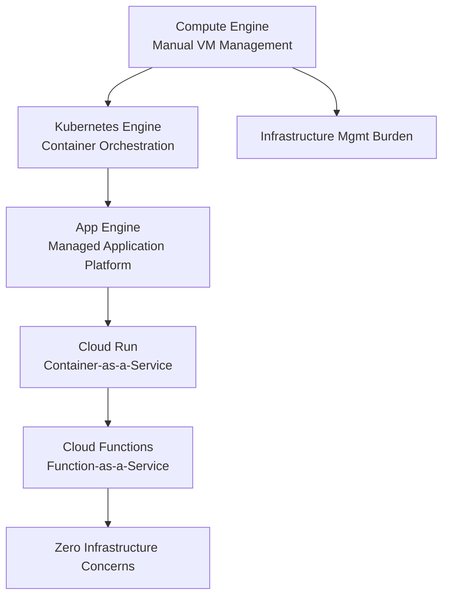

# Session 39: Google App Engine - Standard and Flexible Environments

## Table of Contents
- [Overview](#overview)
- [Compute Options Evolution](#compute-options-evolution)
- [Understanding Serverless in Google Cloud](#understanding-serverless-in-google-cloud)
- [Cloud Native vs Cloud Agnostic Solutions](#cloud-native-vs-cloud-agnostic-solutions)
- [App Engine Fundamentals](#app-engine-fundamentals)
- [App Engine Standard Environment](#app-engine-standard-environment)
- [App Engine Flexible Environment](#app-engine-flexible-environment)
- [Demonstrations and Features](#demonstrations-and-features)
- [Summary](#summary)

## Overview
This session explores Google App Engine, Google's oldest compute service and the pioneer of serverless computing in Google Cloud. We'll examine both Standard and Flexible environments, understand their differences, and see practical demonstrations of deployment, scaling, and traffic management.

## Compute Options Evolution
### From VM-based to Serverless Computing

Google Cloud's compute offerings follow an evolutionary path from manual infrastructure management to fully managed serverless solutions:



**Key Evolution Points:**
- **Compute Engine**: Requires manual provisioning of virtual machines, patching, and scaling
- **Kubernetes Engine**: Introduced containerization but still requires cluster management
- **App Engine**: First fully managed application platform requiring only code deployment
- **Cloud Run & Functions**: Modern serverless successors with improved flexibility

## Understanding Serverless in Google Cloud

### What is Serverless?

Serverless is a cloud computing model where cloud providers fully manage infrastructure, allowing developers to focus exclusively on code. Despite the name, servers exist but are abstracted away from users.

**Google Cloud Serverless Offerings:**

| Service | Primary Purpose | Key Feature |
|---------|----------------|-------------|
| App Engine | Web Applications | Managed app platform |
| Cloud Run | Containerized Apps | Serverless containers |
| Cloud Functions | Event-driven Functions | Function-as-a-Service |
| Cloud Storage | File Storage | Object storage |
| Firestore | NoSQL Database | Serverless document DB |
| BigQuery | Data Warehouse | Serverless analytics |
| Pub/Sub | Messaging | Serverless event streaming |
| Dataflow | Data Processing | Serverless ETL |
| Vertex AI | ML Models | Serverless AI/ML |

**Advantages:**
- `+` Focus on business logic rather than infrastructure
- `+` Automatic scalability and patching
- `+` Cost-effective (pay only for usage)
- `+` Integrated ecosystem with other GCP services

**Trade-offs:**
- `-` Vendor lock-in to Google Cloud platform
- `-` Less architectural flexibility
- `-` Potential limitations on custom runtime versions or frameworks

## Cloud Native vs Cloud Agnostic Solutions

### Real-world Scenario Analysis

A practical example demonstrates the critical decision between cloud-native and cloud-agnostic architectures using App Engine vs. Kubernetes Engine.

**Scenario Context:**
- Uber-like food delivery application with microservices
- Offshore development team (Bangalore)  
- Onshore client team (US)
- Initial development → Migration considerations

**Migration Challenge:**
```
Original Deployment: App Engine (2 days completion)
Migration Need: Make application Cloud-agnostic
Solution: Containerize → Deploy to GKE
Result: Container images runnable on AWS EKS, Azure AKS
```

**Decision Framework:**
```
Roadmap Assessment:
├── Customer Roadmap: 3-5+ years in Google Cloud?
│   ├── YES → Cloud Native (App Engine, Cloud Run)
│   └── NO  → Cloud Agnostic (Kubernetes Engine)
│
├── Use Case Assessment:
│   ├── Stateless web apps → Cloud Native
│   └── Stateful databases/complex workloads → Cloud Agnostic
│
├── Operational Considerations:
    ├── Quick deployment → Cloud Native
    └── Custom infrastructure needs → Cloud Agnostic
```

## App Engine Fundamentals

### What is App Engine?

App Engine is a fully managed Platform-as-a-Service (PaaS) that allows deployment of web applications and services without infrastructure management. It automatically handles scaling, patching, and monitoring.

**Core Characteristics:**
- **Smallest Deployable Unit**: Application/Microservice
- **Trigger Mechanism**: HTTP/HTTPS endpoints only
- **Infrastructure**: Fully abstracted - no direct server access
- **Scaling**: Automatic horizontal scaling
- **Domains**: Default `appspot.com` URLs with custom domain support

### App Engine Architecture

```
Project
├── Service/Microservice 1 (default)
│   ├── Version 1.0 (100% traffic)
│   ├── Version 2.0 (0% traffic)
│   └── Instances (auto-scaled)
├── Service/Microservice 2 (recommendation)
│   ├── Version 1.0 (80% traffic)
│   └── Version 2.0 (20% traffic)
└── Service/Microservice 3 (checkout)
    └── Version 1.0 (100% traffic)
```

**URL Structure:**
- Default service: `https://project-id.appspot.com`
- Named service: `https://service-name-dot-project-id.appspot.com`
- Specific version: `https://version-dot-service-name-dot-project-id.appspot.com`

## App Engine Standard Environment

### Characteristics of Standard Environment

App Engine Standard provides a "sandboxed" runtime environment with strict constraints but excellent performance characteristics.

**Supported Runtimes (key examples):**
- Languages: Python, Go, Java, Node.js, PHP, Ruby
- Specific versions only (e.g., Node.js 20.x, not 22.x)
- **Not supported**: .NET, custom runtimes

**Key Features:**
- `+` Extremely fast scaling (seconds)  
- `+` Scale to zero (no traffic = no cost)
- `+` Lowest cost for variable traffic
- `-` Runtime version limitations
- `-` No persistent disks/backends
- `-` No VPC networking required

### Use Cases for Standard Environment

**Ideal Scenarios:**
- Web applications with variable traffic patterns
- REST APIs and microservices  
- Applications with nights/weekends of zero usage
- Teams preferring rapid deployment over custom control

**Example Traffic Pattern:**
```
Weekdays: High traffic (9 AM - 6 PM)
Weekends: Zero traffic
Result: Scale to zero on weekends = $0 costs
```

## App Engine Flexible Environment

### Characteristics of Flexible Environment

App Engine Flexible removes runtime constraints but introduces infrastructure management overhead.

**Supported Capabilities:**
- All Standard environment features
- **Any runtime/language** (.NET, custom Linux distros, etc.)
- **Custom machine types** and scaling controls
- **Persistent disks** for stateful operations
- **VPC networking** required (for inter-service communication)

**Key Features:**
- `+` Support for any runtime/custom requirements
- `+` Traditional application deployment experience
- `+` Persistent storage and custom networking
- `-` Slower scaling (minutes vs seconds)
- `-` Minimum instances (cannot scale to zero)
- `-` Higher costs due to minimum instance requirement

### Use Cases for Flexible Environment

**Ideal Scenarios:**
- Applications requiring specific runtime versions
- .NET applications needing custom configurations
- Legacy applications with Windows dependencies
- Applications needing persistent file systems
- Steady traffic patterns (always-on applications)

## Demonstrations and Features

### VPC Independence

**App Engine Standard:** Requires no VPC networking

```diff
+ Demonstration: Deleted all VPCs completely
+ VM Creation: Failed (no VPC)
+ Kubernetes Clusters: Failed (no VPC)  
- App Engine Standard: Deployed successfully without any network configuration
```

### Deployment Process

**Code Requirements:**
- **app.yaml**: Configuration file specifying runtime and settings
- **Dependencies**: `package.json` (Node.js), `requirements.txt` (Python), etc.
- **Application code**: Standard web application structure

**Deployment Commands:**
```bash
# Standard deployment
gcloud app deploy app.yaml

# Version-specific deployment  
gcloud app deploy --version v1 app.yaml

# Silent deployment (no promotion)
gcloud app deploy --no-promote app.yaml
```

### Scaling Demonstration

**Scale Up Test:**
- 100 concurrent requests using Siege tool
- Initial: 1 instance  
- Result: Auto-scaled to 4 instances within 30 seconds

**Scale Down Test:**
- Traffic removed
- Instances reduced to minimum configurations
- Standard environment scaled to zero after ~15 minutes

### Traffic Splitting and A/B Testing

**Traffic Splitting Options:**
- **IP-based**: Route based on user IP addresses
- **Cookie-based**: Route based on session cookies  
- **Random**: Statistical distribution for testing

**A/B Testing vs Canary Deployment:**

```diff
+ A/B Testing: Split traffic to measure business impact
- Version A represents revenue-optimized design (right-side buy button)
- Version B represents alternate design (left-side buy button)
- Measure: Conversion rates and revenue impact

+ Canary Deployment: Gradual rollout to minimize risk
- Version A: Stable production code (80% traffic)
- Version B: New features/potential bugs (20% traffic)  
- Goal: Early warning system for production issues
```

**Implementation:**
```bash
# Split traffic by random distribution
gcloud app services set-traffic default \
  --splits v1=50,v2=50 \
  --split-by random

# Migrate all traffic to version 2
gcloud app services set-traffic default \
  --splits v2=100
```

### Version Management

**Version Isolation:**
- Each deployment creates a separate version
- Different versions can coexist with different traffic allocations
- Direct URL access to specific versions for testing

**Multi-service Architecture:**
```
Frontend Service (React.js)
├── app.yaml: runtime=node
├── environment: REACT_APP_API_URL=https://backend-dot-project.appspot.com
└── Deploy as default service

Backend Service (Python)  
├── app.yaml: runtime=python
├── service: backend
└── Handle API requests
```

### Runtime Examples

**Changing Runtimes in Same Service:**
- Deploy Node.js version first
- Deploy Python version as new version
- Seamless runtime migration with different languages

**Example URL Structure:**
- `project.appspot.com` - Default service
- `backend-service-dot-project.appspot.com` - Named service
- `v2-dot-project.appspot.com` - Specific version

## Summary

### Key Takeaways
```diff
+ App Engine is Google's oldest managed compute service, pioneering serverless
+ Standard Environment: Fast scaling, scale-to-zero, runtime constraints, no VPC needed
- Flexible Environment: Custom runtimes, slower scaling, minimum instances, VPC required
+ Traffic splitting enables A/B testing and canary deployments
+ Multi-service architecture allows polyglot microservice development
+ Version management provides rollback capabilities without downtime
```

### Expert Insights

**Real-world Application:**
App Engine excels in scenarios where development speed and cost optimization are prioritized over infrastructure control. Use Standard for greenfield applications with variable traffic; consider Flexible for legacy application migrations requiring specific runtime support.

**Migration Path Considerations:**
When migrating from App Engine to Cloud Run (recommended), containerize your application first. Keep source code intact and create Dockerfile using LLM assistance based on existing dependency files.

**Common Pitfalls:**
- Permanent region locking - select deployment region carefully
- Scaling behavior differences between Standard (0 instances) vs Flexible (minimum 1 instance)
- IAM permission scope - avoid overly broad service account roles
- Version cleanup - delete unused versions to reduce costs
- Network dependency - Standard runs without VPC, Flexible requires network configuration

**Expert Path:**
Master traffic splitting strategies for advanced deployment patterns. Learn to leverage App Engine's logging and monitoring integrations with Cloud Logging and Cloud Monitoring for observability. Understand cost optimization through intelligent scaling configurations. Practice multi-service architectures to build resilient, language-agnostic microservice ecosystems.
