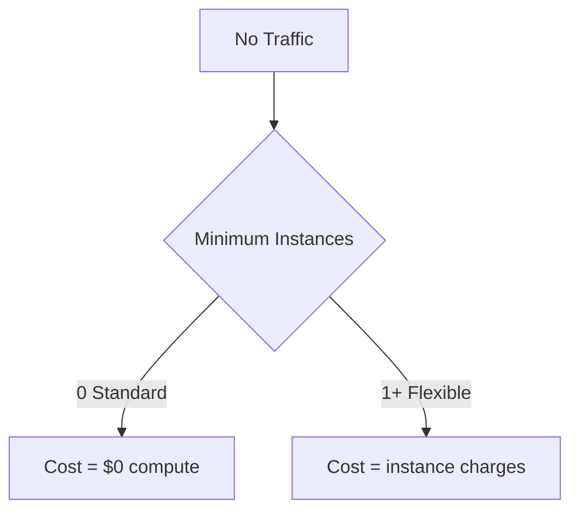
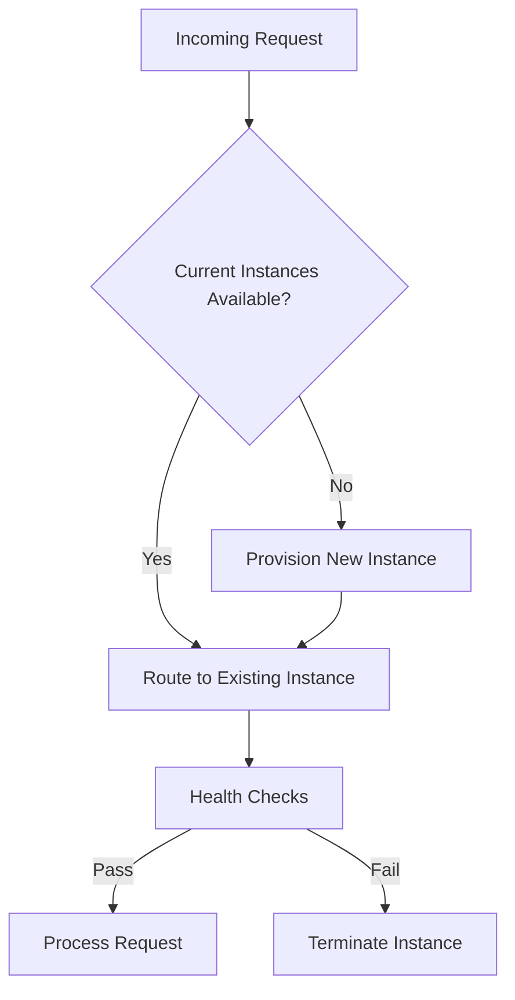
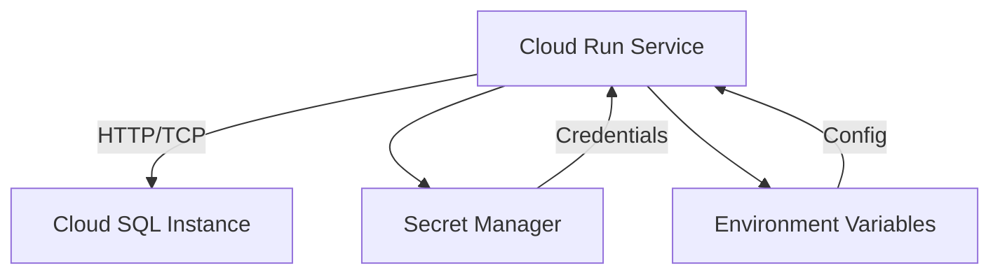

# Session 40: Custom Runtime App Engine Flex, Concept on Cloud Run, Traffic Split, Env & Secrets usage

## Table of Contents
- [App Engine Flexible Environment Introduction](#app-engine-flexible-environment-introduction)
- [Custom Runtime Demonstration](#custom-runtime-demonstration)
- [Performance Comparison: Standard vs Flexible](#performance-comparison-standard-vs-flexible)
- [Scaling Behavior and Costs](#scaling-behavior-and-costs)
- [Cloud Run Introduction](#cloud-run-introduction)
- [Cloud Run vs App Engine Comparison](#cloud-run-vs-app-engine-comparison)
- [Deploying Existing Containers to Cloud Run](#deploying-existing-containers-to-cloud-run)
- [Container Building and Deployment Process](#container-building-and-deployment-process)
- [Cloud Run Architecture and Scaling](#cloud-run-architecture-and-scaling)
- [Traffic Splitting and Revisions](#traffic-splitting-and-revisions)
- [Environment Variables and Configuration](#environment-variables-and-configuration)
- [Secret Manager Integration](#secret-manager-integration)
- [Connecting Cloud Run to Cloud SQL](#connecting-cloud-run-to-cloud-sql)

## App Engine Flexible Environment Introduction

App Engine Flexible Environment provides serverless containerized deployments with more flexibility than Standard Environment, at the cost of performance and scaling characteristics.

### Key Characteristics
- **Container-based**: Runs any runtime that can be containerized via Docker
- **Always-on instances**: Minimum instance count prevents scaling to zero
- **VPC networking**: Must run within a Virtual Private Cloud
- **SSH debugging**: Provides direct access to instances for troubleshooting
- **Custom compute types**: Supports various machine types beyond Standard options

### Default Configuration
```yaml
manual_scaling:
  instances: 2  # Minimum instances always running
```

## Custom Runtime Demonstration

Flexible Environment enables custom runtimes not supported by Standard Environment using containerization.

### Prerequisites
- App Engine project initialized
- Cloud Build API enabled
- Container Registry access

### Example: Perl Application

#### Files Required
- `app.yaml` (configures Flexible Environment)
- `Dockerfile` (defines container image)
- `app.pl` (application source code)

#### app.yaml
```yaml
runtime: custom
env: flex
```

#### Dockerfile (Perl)
```dockerfile
FROM perl:5.32

# Install web framework
RUN cpanm Mojolicious

# Copy application code
COPY app.pl /app/
WORKDIR /app

# Expose port and run
EXPOSE 8080
CMD ["perl", "app.pl"]
```

#### Simple Perl Web App (app.pl)
```perl
#!/usr/bin/env perl
use Mojolicious::Lite;

get '/' => sub {
    my $c = shift;
    $c->render(text => 'Hello from Perl on App Engine Flexible!');
};

app->start;
```

### Deployment Process
```bash
gcloud app deploy --quiet
# Takes ~5 minutes due to container building and pushing
```

> [!IMPORTANT]
> Custom runtimes require explicit Dockerfile creation since Cloud Build Packs only support limited languages.

### Instance Management in GCP Console
- **Standard Environment**: Shows as "Dynamic" scaling
- **Flexible Environment**: Shows SSH option and instance management controls

## Performance Comparison: Standard vs Flexible

| Aspect | Standard Environment | Flexible Environment |
|--------|---------------------|----------------------|
| Deployment Time | ~90 seconds | ~5 minutes |
| Cold Start | ~10-30 seconds | ~5-10 seconds (with min instances) |
| Scaling Speed | Fast | Slower (health checks required) |
| Minimum Instances | 0 | 1+ (configurable) |
| Runtime Support | Limited languages/versions | Any containerized runtime |

### Scaling Characteristics

**Standard Environment:**
- Scales down to zero automatically
- No baseline costs during idle periods
- Faster startup on traffic spikes

**Flexible Environment:**
- Maintains minimum instance count
- Provides predictable cold start behavior
- Higher baseline infrastructure costs

## Scaling Behavior and Costs

### Cost Implications



### Scaling Demonstration Commands

```bash
# Check current instances
gcloud app instances list

# Simulate traffic with Siege (100 concurrent requests)
siege -c 100 -t 60S https://PROJECT-ID.appspot.com
```

### Cost Optimization Strategy
1. Use Standard Environment for development and low-traffic applications
2. Switch traffic to Standard Environment after Flexible Environment testing
3. Manually delete unused Flexible instances

```diff
! Standard Environment (Cost-effective) ← Flexible Environment (Feature-rich)
```

## Cloud Run Introduction

Cloud Run is Google's fully managed serverless platform for containerized applications, representing the evolution of App Engine environments.

### Core Concepts
- **Serverless containers**: Stateless container execution with automatic scaling
- **HTTP-based**: Only supports web applications exposing HTTP/S endpoints
- **Regional service**: Can be deployed to any supported GCP region
- **Managed platform**: Google handles infrastructure, scaling, and operations

### Supported Workload Types
✅ Web applications and APIs  
✅ Microservices  
✅ Stateless workloads  
❌ Stateful applications (use external databases)  
❌ Batch processing (use Cloud Run Jobs)  

## Cloud Run vs App Engine Comparison

Cloud Run combines the advantages of Standard (fast scaling, low costs) and Flexible (custom runtimes, container support) environments.

### Feature Matrix

| Feature | Standard | Flexible | Cloud Run |
|---------|----------|----------|-----------|
| Scale to zero | ✅ | ❌ | ✅ |
| Custom runtimes | ❌ | ✅ | ✅ |
| Deployment speed | Fast | Slow | Fast |
| Regional flexibility | Limited | Limited | Global |
| Network isolation | ❌ | ✅ | Optional |
| SSH debugging | ❌ | ✅ | ❌ |

### Migration Benefits
- **Faster deployments**: Container push + Cloud Run deployment (~30-60 seconds)
- **Regional flexibility**: Deploy to any supported GCP region
- **Cost optimization**: Pay only for request processing time
- **Enhanced security**: Support for VPC Connectors and IAM authentication

## Deploying Existing Containers to Cloud Run

Cloud Run can deploy pre-built container images from Container Registry or other registries.

### UI Deployment Process
1. Navigate to Cloud Run in GCP Console
2. Click "Create Service"
3. Select "Deploy container from an existing container image"
4. Choose container image (from Container Registry)
5. Configure service:
   - Service name: `my-app`
   - Region: `us-central1`
   - Authentication: Allow unauthenticated invocations
   - Port: `8080`
6. Click "Create"

### CLI Deployment
```bash
gcloud run deploy my-app \
  --image gcr.io/PROJECT-ID/my-image:v1 \
  --platform managed \
  --region us-central1 \
  --allow-unauthenticated
```

### URL Structure
- **Service URL**: `https://my-app-HASH-uc.a.run.app`
- **Regional domain**: `a.run.app` (Google-managed SSL certificates provided)

## Container Building and Deployment Process

### Build and Push Container Image

```bash
# Build container (takes ~30-60 seconds)
docker build -t gcr.io/PROJECT-ID/my-app:v1 .

# Push container (~30 seconds)
docker push gcr.io/PROJECT-ID/my-app:v1

# Deploy to Cloud Run (~30 seconds)
gcloud run deploy my-app \
  --image gcr.io/PROJECT-ID/my-app:v1 \
  --platform managed \
  --region us-central1 \
  --allow-unauthenticated
```

### Total Build + Deploy Time
- **App Engine Standard**: ~90 seconds
- **App Engine Flexible**: ~5+ minutes  
- **Cloud Run**: ~1-2 minutes

### Sample Node.js Application

```javascript
// app.js
const express = require('express');
const app = express();

app.get('/', (req, res) => {
  res.send(`Hello from Node.js ${process.version} running on Cloud Run!`);
});

const port = process.env.PORT || 8080;
app.listen(port, () => console.log(`Listening on port ${port}`));
```

```dockerfile
FROM node:23-alpine
WORKDIR /app
COPY package*.json ./
RUN npm install
COPY . .
EXPOSE 8080
CMD ["node", "app.js"]
```

## Cloud Run Architecture and Scaling

Cloud Run provides automatic scaling with intelligent resource allocation.

### Scaling Behavior
- **Minimum instances**: Default 0, configurable (0-100)
- **Maximum instances**: Default 100, configurable (1-1000)
- **Concurrency**: Multiple requests per instance (default 80, max 1000)
- **Scale to zero**: Automatic when traffic stops

### Instance Provisioning


### Cold Start Considerations
- **Baseline**: Container startup time (typically 5-15 seconds)
- **With traffic**: Reduced cold starts due to proactive scaling
- **Min instances**: Eliminates cold starts but increases costs

## Traffic Splitting and Revisions

Cloud Run supports advanced traffic management for canary deployments and progressive rollouts.

### Revisions vs App Engine Versions
| App Engine | Cloud Run |
|------------|-----------|
| Versions | Revisions |
| `appspot.com/version` URLs | Revision tags with custom URLs |
| Percentage/random splitting | Percentage/random splitting |

### Traffic Splitting Methods

| Method | Description | Implementation |
|--------|-------------|----------------|
| Percentage | Split traffic by percentage (e.g., 80/20) | UI or CLI management |
| Tags | Access specific revisions via tagged URLs | Revision tagging |
| Random | Traffic distributed randomly among revisions | Default behavior |

### CLI Commands for Traffic Management

#### Deploy New Revision (No Traffic)
```bash
gcloud run deploy my-app \
  --image gcr.io/project/node-23:latest \
  --no-traffic \
  --platform managed \
  --region us-central1
```

#### Create Revision Tag
```bash
gcloud run revisions describe REVISION-NAME \
  --region us-central1 \
  --format="value(metadata.name)"
```

#### Split Traffic
```bash
gcloud run services update-traffic my-app \
  --to-revisions REVISION-1=80 \
  --to-revisions REVISION-2=20 \
  --region us-central1
```

### Testing URLs
- **Service URL**: `https://my-app-HASH-region.a.run.app`
- **Tagged Revision**: `https://TAG-my-app-HASH-region.a.run.app`

## Environment Variables and Configuration

Cloud Run supports both plain text environment variables and secure secret references.

### Environment Variable Types

| Type | Security | Visibility | Use Case |
|------|----------|------------|----------|
| Plain text | Low | Console | Non-sensitive config |
| Secret reference | High | Obfuscated | Passwords, API keys |

### Environment Variable Configuration
- **UI**: Edit service → Variables & Secrets tab
- **CLI**: `--set-env-vars` parameter

```bash
gcloud run deploy my-app \
  --set-env-vars NODE_ENV=production \
  --set-env-vars VERSION=1.0 \
  --image gcr.io/project/my-app:v1
```

> [!WARNING]
> Never store sensitive information as plain text environment variables. Use Secret Manager instead.

## Secret Manager Integration

Secret Manager provides secure, versioned credential management integrated with Cloud Run.

### Secret Creation
```bash
# Create database password secret
echo -n "my-secret-password" | gcloud secrets create db-password --data-file=-

# Add new version (for rotation)
echo -n "new-secret-password" | gcloud secrets versions add db-password --data-file=-
```

### IAM Permissions Required
- **Service Account**: Cloud Run service account needs `roles/secretmanager.secretAccessor`
- **Create IAM policy**: Allow access to specific secrets

### Adding Secrets to Cloud Run Service

#### UI Method
1. Edit service → Variables & Secrets tab
2. Add "Secret"
3. Select secret name and version
4. Specify environment variable name

#### CLI Method
```bash
gcloud run deploy my-app \
  --set-secrets DB_PASSWORD=my-secret:latest \
  --service-account my-service-account@project.iam.gserviceaccount.com \
  --image gcr.io/project/my-app:v1
```

## Connecting Cloud Run to Cloud SQL

Cloud Run can connect to Cloud SQL for persistent data storage in external databases.

### Architecture Overview


### Connection Prerequisites
- Cloud SQL instance created
- Network connectivity configured (Public IP for testing)
- Service account with Secret Manager access configured

### PHP + MySQL Example

#### Dockerfile
```dockerfile
FROM php:8.2-apache
RUN docker-php-ext-install mysqli pdo pdo_mysql
COPY . /var/www/html/
EXPOSE 80
```

#### Database Connection Code
```php
<?php
$host = getenv('DB_HOST');
$user = getenv('DB_USER'); 
$password = getenv('DB_PASSWORD');
$dbname = getenv('DB_NAME');

$conn = new mysqli($host, $user, $password, $dbname);

if ($conn->connect_error) {
    die("Connection failed: " . $conn->connect_error);
}

echo "Successfully connected to database";
?>
```

### Cloud SQL Configuration
1. **Public IP**: Required for initial connectivity (not recommended for production)
2. **Network Whitelist**: Restrict access to Cloud Run IP ranges
3. **Private IP**: Preferred method using VPC Connectors (advanced networking)

### Testing Connectivity
```bash
# White list 0.0.0.0/0 temporarily (development only)
# In production, restrict to Cloud Run egress IPs
```

> [!WARNING]
> Public IP connectivity to Cloud SQL poses security risks. Use private IP with VPC Connectors in production.

### Service Account Configuration
```bash
# Create dedicated service account
gcloud iam service-accounts create cloud-run-sa \
  --description="Service account for Cloud Run database access"

# Grant Secret Manager access
gcloud secrets add-iam-policy-binding db-password \
  --member="serviceAccount:cloud-run-sa@PROJECT.iam.gserviceaccount.com" \
  --role="roles/secretmanager.secretAccessor"
```

## Summary

### Key Takeaways
✅ **App Engine Flexible**: Supports custom runtimes via containers but has minimum instance requirements  
✅ **Cloud Run**: Best of both worlds - scale to zero with container support  
✅ **Performance**: Cloud Run deployments are significantly faster than Flexible  
✅ **Traffic Management**: Supports advanced canary deployments and version management  
✅ **Security**: Secret Manager integration for secure credential management  
✅ **Database Integration**: Connects to Cloud SQL for persistent state management  

### Expert Insight

#### Real-world Application
Cloud Run excels in:
- **Microservices architectures** where components need independent scaling
- **Web applications** requiring custom runtimes or specific language versions  
- **Development workflows** needing fast build-test cycles
- **Cost-sensitive applications** with variable traffic patterns

#### Expert Path
- Master **Cloud Run Jobs** for batch processing and scheduled tasks
- Implement **custom domains** with Cloud Load Balancing for enterprise deployments
- Configure **VPC Connectors** for secure internal service communication
- Use **Cloud Armor** integration for edge security and DDoS protection
- Implement **distributed tracing** with Cloud Trace for observability

#### Common Pitfalls
- **State management**: Attempting to store state in containers (use external services)
- **Credential exposure**: Using plain text environment variables for sensitive data
- **Cost surprises**: Unexpected scaling behavior from concurrent request limits
- **Network security**: Opening databases to the internet instead of using private connectivity
- **Resource limits**: Hitting concurrency or instance limits without proper configuration
- **Build optimization**: Not optimizing container images leads to slower deployments

#### Common Issues and Resolution
| Issue | Symptom | Resolution |
|-------|---------|------------|
| Secret Access Denied | Service fails to start | Grant Secret Manager roles to service account |
| Database Connection Failed | "Connection refused" errors | Check IP whitelisting and network connectivity |
| Traffic Split Not Working | All traffic going to one revision | Verify revision names and percentages in CLI |
| Cold Start Delays | First request takes time | Set minimum instances or optimize container startup |
| Container Build Failures | Build logs show dependency errors | Check Dockerfile syntax and base image compatibility |

#### Lesser Known Things
- Cloud Run automatically injects distributed tracing headers for request correlation
- Environment variables with `GOOGLE_` prefix are reserved for platform metadata
- Cloud Run instances dynamically share CPU based on concurrent request load
- The platform supports custom health check paths beyond basic HTTP endpoints  
- Automatic SSL certificate management includes custom domain validation
