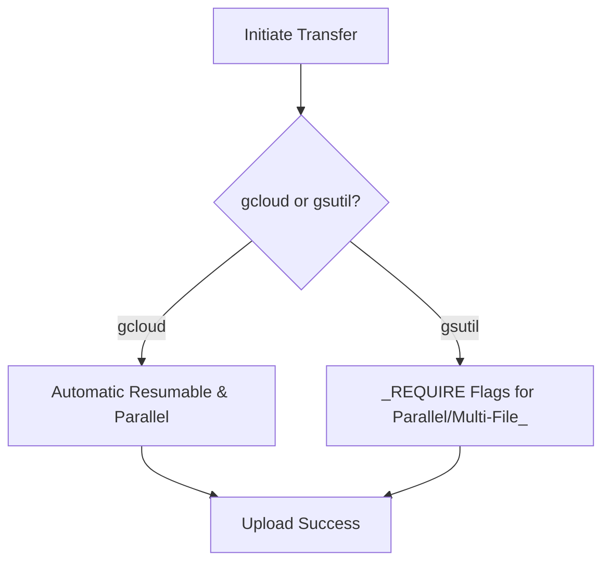
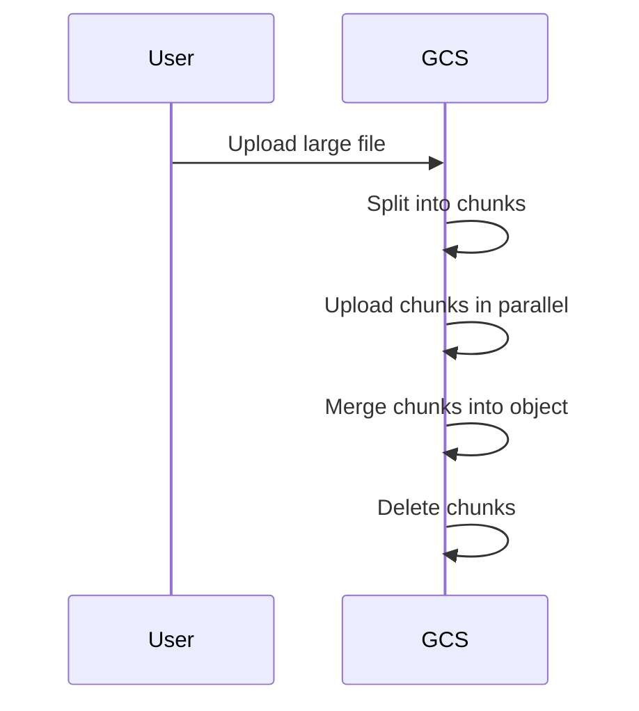
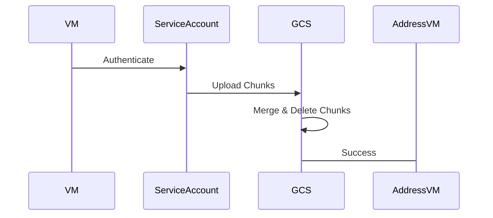
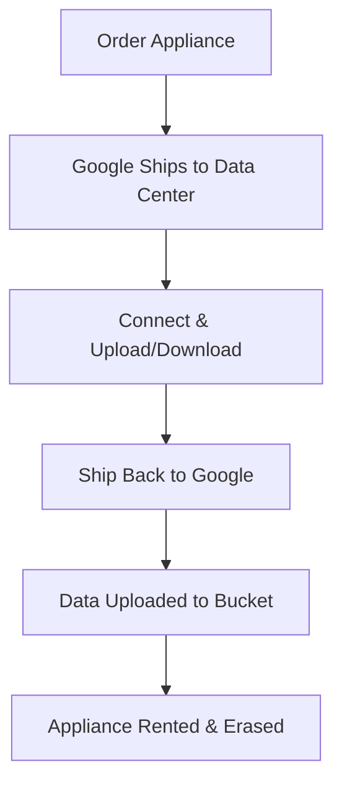

# Session 48: Retention Policy Part 2 & Data Transfer using gcloud, gsutil & Transfer Appliance

## Table of Contents
- [Retention Policy Deletion Demo](#retention-policy-deletion-demo)
- [Data Transfer Options: gcloud vs gsutil](#data-transfer-options-gcloud-vs-gsutil)
- [Resumable Uploads](#resumable-uploads)
- [Parallel Composite Uploads](#parallel-composite-uploads)
- [Service Account Roles and Permissions for Data Transfer](#service-account-roles-and-permissions-for-data-transfer)
- [Generating Large Files for Testing (Truncate Command)](#generating-large-files-for-testing-truncate-command)
- [Lab Demo: Uploading Files with Different Commands](#lab-demo-uploading-files-with-different-commands)
- [Life Cycle Rules for Deleting Multi-Part Uploads](#life-cycle-rules-for-deleting-multi-part-uploads)
- [Bandwidth Rules of Thumb for Data Transfer](#bandwidth-rules-of-thumb-for-data-transfer)
- [Transfer Appliance Overview](#transfer-appliance-overview)
- [Transfer Appliance Process and Options](#transfer-appliance-process-and-options)
- [Transfer Service for Cloud-to-Cloud and Hybrid Transfers](#transfer-service-for-cloud-to-cloud-and-hybrid-transfers)

## Retention Policy Deletion Demo

### Overview
Retention policies in Google Cloud Storage (GCS) enforce minimum retention periods for objects, preventing accidental deletion during specified times. In Session 47, bucket-level retention policies were configured. This session demonstrates object-level retention and deletion after the retention period expires, ensuring data immutability for compliance.

### Key Concepts/Deep Dive
- **Bucket-Level Retention**: Applies to all objects in the bucket (e.g., retention for 20 minutes in previous demo).
- **Object-Level Retention**: Overrides bucket-level for specific objects, useful for critical data like invoices or logs.
- **Retention Expiration**: Objects can only be deleted after the retention period expires. Attempting early deletion fails.
- **Compliance and Defaults**: Retention policies support compliance needs but can be locked to prevent changes.

### Lab Demos
In the demo, an object with a 1-day retention policy (set in Session 47) could not be deleted previously:
- Checked bucket protection tab: Object-level retention was set to the current day (e.g., February 16th).
- After expiration, deletion succeeded via console: Object removed, bucket now empty and deletable.

**Alerts**  
> [!NOTE]  
> Deletion works only post-retention period; early attempts fail with errors.

**Emojis for Markers** ✅ Retention enforced; ❌ Early deletion blocked.

## Data Transfer Options: gcloud vs gsutil

### Overview
Data transfer to GCS can use gcloud or gsutil commands. gcloud is modern, user-friendly, and handles features like resumable and parallel uploads automatically without flags. gsutil is legacy but supports explicit flags for advanced options like parallel transfer.

### Key Concepts/Deep Dive
- **gcloud Command**: `gcloud storage cp/rsync <source> <destination>`. Automatically enables resumable uploads (>8MB) and parallel composite uploads for large files. No need for flags; ideal for most transfers.
- **gsutil Command**: Legacy tool; requires flags for optimizations (e.g., `-m` for multi-file parallel, `-o` for chunk size). More complex but granular control.
- **Why gcloud Preferred**: Simplifies commands; gsutil flagged as Legacy, with features moving to gcloud. Future exams may favor gcloud.
- **Eligibility**: Both support resumable uploads, but gcloud excels in parallel processing without manual setup.
- **Performance Tips**: Use gcloud for large, single files; gsutil for multiple large files or when customizing chunk sizes.

**Table: Command Differences**

| Feature              | gcloud Storage Commands                  | gsutil Commands                       |
|----------------------|------------------------------------------|---------------------------------------|
| Resumable Uploads   | Automatic (>8MB, configurable)           | Via flags (e.g., `-m` for multi-threading), default >8MB |
| Parallel Composite  | Automatic for large files               | Requires `-m` and `-o` flags         |
| Simplicity          | High (no flags needed)                   | Lower (flags required for optimizations) |
| Legacy Status       | Modern, recommended                     | Legacy, being deprecated             |

### Code/Config Blocks
Example gcloud command for large file upload:
```bash
gcloud storage cp large_file.zip gs://my-bucket/
```

Example gsutil with parallel composite:
```bash
gsutil -m -o GSUtil:parallel_composite_upload_threshold=100M cp large_file.zip gs://my-bucket/
```

**Mermaid Diagram: Transfer Command Flow**


**Diff Blocks for Comparison**
```diff
+ gcloud: Automated, simple (recommended)
- gsutil: Manual flags, complex (Legacy)
! Exam Focus: gcloud for modern transfers
```

## Resumable Uploads

### Overview
Resumable uploads allow resuming interrupted transfers, crucial for large files over unreliable connections. Enabled by default for files >8MB in both tools.

### Key Concepts/Deep Dive
- **Trigger Condition**: Files >8MB; default threshold 8MB (configurable via `GSUtil:rsyncable_threshold` in boto config).
- **Mechanism**: Stores transfer state in tracker files (`~/.gsutil/tracker-files` for gsutil; different location for gcloud). Transfers in chunks, resuming from last point on interruption.
- **Storage Efficiency**: Avoids restarting entire uploads; critical for network issues or machine restarts.
- **Client Libraries**: Supported in Python, Go, Java, etc., via REST APIs (e.g., Python's `google.cloud.storage`).

### Code/Config Blocks
Boto config for customizing threshold:
```boto
[upload]
rsyncable_threshold = 1048576  # 1MB in bytes
```

Python example:
```python
from google.cloud import storage
client = storage.Client()
bucket = client.bucket('my-bucket')
blob = bucket.blob('large_file.zip')
with open('large_file.zip', 'rb') as f:
    blob.upload_from_file(f, resumable=True)
```

### Lab Demos
- Uploaded 425MB file via gsutil cp: Interrupted at 100MB; tracker files created; resumed successfully post-restart.
- gcloud command: Resumed analogous uploads without gsutil tracker files (uses internal state).
- Small file (<8MB) upload: No resumable; uploads as multipart.

> [!IMPORTANT]  
> Test resumables with interruptions; use client libraries for app integrations.

## Parallel Composite Uploads

### Overview
Breaks large files into chunks, uploads in parallel, then merges. Reduces upload time via parallelism but linked to resumable uploads.

### Key Concepts/Deep Dive
- **Default Behavior**: gcloud enables automatically; gsutil requires `-m` and `-o` flags.
- **Chunk Management**: Chunks created, merged into final object; chunks deleted post-merge. Prevents early deletion costs in cold storage (e.g., Archive class incurs fees if chunks delete prematurely).
- **Interaction with Resumable**: Often used together; interruptions resume chunk uploads without restarting merges.
- **Exam Note**: Resumable priority in exams; ensures large file handling.

**Diagram: Chunk Process**


### Code/Config Blocks
gsutil with custom chunks:
```bash
gsutil -m -o GSUtil:parallel_composite_upload_threshold=50M cp large_file.zip gs://my-bucket/
```

## Service Account Roles and Permissions for Data Transfer

### Overview
For VM-based transfers, use service accounts with appropriate IAM roles. Incorrect roles prevent operations; correct roles ensure upload/delete.

### Key Concepts/Deep Dive
- **Common Pitfall**: "Storage Object Creator" role allows creation but not deletion, causing orphaned chunks in parallel uploads.
- **Recommended Role**: "Storage Object User" for creation, deletion, and listing.
- **Permissions Needed**: `storage.objects.create`, `storage.objects.delete`, `storage.buckets.get` for full operations.
- **Custom Roles**: Use if granular access needed; avoid half-baked predefined roles.

### Lab Demos
- Used "Storage Object Creator": Parallel uploads created chunks but failed to delete them (orphaned data, higher costs).
- Switched to "Storage Object User": Deletes succeeded, cleaned uploads.

**Diff Blocks**
```diff
+ Storage Object User: Full create/delete (recommended)
- Storage Object Creator: Partial (avoids for large files)
! Custom roles for fine-tuned access
```

## Generating Large Files for Testing (Truncate Command)

### Overview
Generate test files of any size using `truncate` command on Linux/Cloud Shell VMs.

### Key Concepts/Deep Dive
- **Syntax**: `truncate -s <size> <filename>` (e.g., `truncate -s 3G my_test_file.dat` for 3GB).
- **Use Cases**: Test large uploads without actual data.
- **Placement**: Run in mounted disk directories, not home boot disk.

### Code/Config Blocks
Generate 2GB file:
```bash
truncate -s 2G test_file.dat
```

**Emojis** 💡 Efficient testing without bandwidth.

## Lab Demo: Uploading Files with Different Commands

### Overview
Demos compare gsutil and gcloud uploads, VM setups, and chunk behaviors.

### Lab Demos
- VM Setup: 4vCPU VM with 4TB SSD (Magnetic for cost); formatted disk, generated large files.
- gsutil Upload: Created chunks; interrupted uploads left orphans.
- gcloud Upload: Seamless with auto-parallel; chunks auto-managed.
- Role Fixes: Switched service account roles; added "buckets.get" for bucket access.

**Mermaid Sequence for Upload Flow**


## Life Cycle Rules for Deleting Multi-Part Uploads

### Overview
Configure object lifecycle rules to delete orphaned chunks from failed uploads.

### Key Concepts/Deep Dive
- **Rule Types**: Condition-based (prefix/suffix); age-based deletes (e.g., delete after 1 day).
- **Common Prefixes**: `gs://bucket/gsutil-temp-` or `gcp-temp-` for gcloud.
- **Cost Savings**: Prevents storage costs from leftover chunks.

### Code/Config Blocks
GCS Console Lifecycle Rule:
1. Add rule: Condition prefix `gsutil-temp-`, age 1 day, action: Delete.

**Alerts**
> [!WARNING]  
> Without rules, chunks incur costs.

## Bandwidth Rules of Thumb for Data Transfer

### Overview
Rules estimate transfer times; transfer via Appliance if >7 days.

### Key Concepts/Deep Dive
- **Examples**:
  - 10TB @ 1Gbps: 30 hours.
  - 100TB @ 100Mbps: 12 days (recommend Appliance).
- **Bandwidth Impact**: Low bandwidth (e.g., 10Mbps) for 1PB: 34 years—use Appliance.
- **Timeline**:
  ```diff
  + <7 days: Online transfer (pack)
  - >7 days: Appliance
  ! >20TB: Appliance preferred
  ```

### Tables: Transfer Time Examples

| Data Size  | Bandwidth  | Time Estimate | Recommendation |
|------------|------------|---------------|----------------|
| 10TB      | 1Gbps     | 30 hours     | Online        |
| 100TB     | 100Mbps   | 12 days      | Appliance     |
| 1PB       | 10Mbps    | 34 years     | Appliance     |

## Transfer Appliance Overview

### Overview
Hardware device shipped to data centers for secure, high-speed transfers; ideal for bandwidth-constrained or massive data moves.

### Key Concepts/Deep Dive
- **Models**: Rack-mountable or suitcase-style (300TB SSD, 40TB legacy removed).
- **Use Cases**: On-prem to GCS or GCS to on-prem; secure with encryption/tamper-proof.
- **Availability**: US, Europe, UK, Singapore, Japan, Australia, Canada—not India/S. America yet.
- **Compliance**: NIST 800-88 data erasure post-transfer.

### Mermaid Diagram: Appliance Process


> [!NOTE]  
> Rental basis; free days included (e.g., 25 days for 300TB).

## Transfer Appliance Process and Options

### Key Concepts/Deep Dive
- **Ordering**: Via GCS Console > Transfer Appliance; select size, project, bucket.
- **Data Flow**: Receive device, connect via RJ45, transfer data; Google uploads/downloads automatically.
- **Bi-Directional**: GCS to on-prem or on-prem to GCS; rackable for data centers.
- **Costs**: Daily fees post-free period; shipping costs apply.

**Diff Blocks**
```diff
+ Secure, fast, no bandwidth hit
- Limited regions, one-time use
! Cost-effective for >20TB
```

## Transfer Service for Cloud-to-Cloud and Hybrid Transfers

### Overview
Service for migrating data from AWS/Azure/on-prem to GCS, or GCS to other clouds.

### Key Concepts/Deep Dive
- **Support**: AWS S3/Azure Blob → GCS; GCS → other clouds; on-prem agents.
- **Process**: Install agents for on-prem; set sources/destinations; automate migrations.
- **Bucket-to-Bucket**: Copy between GCS buckets/projects.

**Table: Supported Transfers**

| Source          | Destination | Method             |
|-----------------|-------------|--------------------|
| AWS S3/Azure   | GCS        | Transfer Service  |
| GCS            | On-prem/AWS| Transfer Appliance|
| On-prem        | GCS        | Agents/Service    |

> [!IMPORTANT]  
> Mature option for multi-cloud; supports one-time free migrations between clouds.

## Summary

### Key Takeaways
```diff
+ gcloud simplifies large transfers with auto-parallel/resumable
- gsutil Legacy; avoid for parallel without flags and proper roles
! Use Appliance for massive data (>20TB or >7 days transfer)
+ Service accounts: Storage Object User (not Creator) prevents orphans
- Misconfigurations cause cost overruns from leftover chunks
+ Resumable uploads save time on interruptions
! Apply lifecycle rules to clean multi-part failures
+ Bandwidth rules: Calculate always—prevents surprises
```

### Expert Insight

**Real-world Application**: For enterprise migrations (e.g., 50TB on-prem to GCS), assess bandwidth first. Use Appliance to avoid choked networks; integrate resumable uploads in apps via client libraries for user uploads (e.g., YouTube-like platforms).

**Expert Path**: Master gcloud for daily ops; experiment with Appliance via free trials. Dive into IAM policies for secure transfers; monitor costs via GCS logs.

**Common Pitfalls**: Using wrong roles (e.g., Object Creator) yields orphaned chunks—monitor via lifecycle rules. Ignoring bandwidth limits causes failed transfers; test with truncate-generated files.

**Lesser Known Things**: Appliance data is encrypted end-to-end; gcloud uses multi-threading for parallel uploads unseen in logs; boto configs customize thresholds for edge cases. Lifecycle rules can target prefixes/suffixes for precise cleanup.
