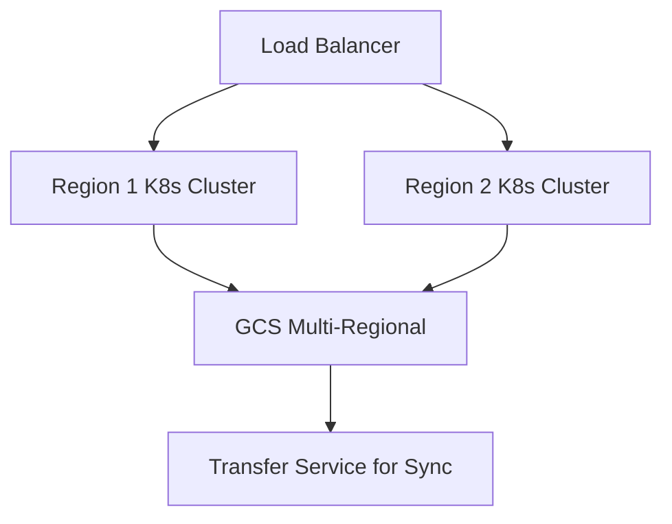

# Session 55: Storage and Database Exam Questions, Networking Basics, Avoiding Default VPC

## Table of Contents
- [Quiz on Storage Solutions](#quiz-on-storage-solutions)
- [Basics of Networking: RFC 1918 and OSI Model](#basics-of-networking-rfc-1918-and-osi-model)
- [Virtual Private Cloud (VPC) Concepts](#virtual-private-cloud-vpc-concepts)
- [Why to Avoid Default VPC](#why-to-avoid-default-vpc)
- [Summary](#summary)

## Quiz on Storage Solutions

### Overview
This section covers exam-style questions on Google Cloud Storage solutions, focusing on cost-effective data management for infrequently accessed data, security storage analyses, and migration strategies. Questions test understanding of storage classes (e.g., Nearline, Coldline, Regional, Multi-Regional), lifecycle policies, and considerations for compliance and external access.

### Key Concepts/Deep Dive
#### Question 1: Reducing Cost for Infrequently Accessed Data
**Scenario**: Company needs to store data accessed approximately once a month, with data older than 5 years removed. Minimal cost while ensuring access.

- **Options Analysis**:
  - Multi-Regional (standard) storage: Cost-effective for frequent access, but higher cost due to monthly access.
  - Nearline storage with lifecycle for deletion: Optimal for monthly access; lower storage cost, higher retrieval cost acceptable for rare access.
  - Coldline in early option: Expensive for monthly access, retrieval fees too high.
  - Move to Coldline after 30 days: Retrieval cost increases, not efficient for monthly pattern.

- **Correct Answer**: Nearline storage with lifecycle policy to delete data after 5 years.
- **Explanation**: Nearline balances storage cost for infrequent access. Use Google Cloud Storage with object lifecycle management.

#### Question 2: Storage for Security Camera Footage
**Scenario**: Security footage accessed regularly for 30 days, then kept for compliance (up to 180 days). Minimize cost.

- **Options Analysis**:
  - Regional (nearline) for 30 days: Nearline is for 90+ days; frequent access induces high costs.
  - Coldline storage: Suitable for 90 days+, lower cost for long-term retention.
  - Persistent disk: Unsuitable for block storage limits (64 TB max); not object-based, higher cost, defeats compliance.

- **Correct Answer**: Regional storage (standard) for first 30 days, move to Coldline after, with lifecycle delete at 90-180 days.
- **Explanation**: Standard for frequent access, Coldline for compliance periods. Multi-Regional not needed unless global audience.

#### Question 3: Migration of Large On-Premise Data
**Scenario**: 200 TB enterprise data migration to Google Cloud securely, only users in Germany access it. Cost-effective solution.

- **Options Analysis**:
  - Transfer Appliance: Best for large volumes and time-sensitive transfers, compliant for regional storage.
  - Transfer Service: Bandwidth-dependent, may take longer than 7 days, costs for leased lines.
  - Persistent disks: Not for mass data migration, limited by VM attachments.

- **Correct Answer**: Use Transfer Appliance for migration to regional storage in Germany.
- **Explanation**: Transfer Appliance avoids bandwidth constraints, ensures secure, fast transfer within compliance.

#### Question 4: International Audience Stateless Applications
**Scenario**: App with global audience, stateless VMs in multiple regions, file uploads/shares retained 30 days.

- **Options Analysis**:
  - Data Store: References GCS, but complex for files; not direct blob storage.
  - Multi-Regional storage: Suitable for global access, with lifecycle.
  - Persistent Disk: Ephemeral with VM scaling, data loss risk.
  - Managed Instance Group with Filestore: Regional, higher cost than GCS due to infrastructure needs.

- **Correct Answer**: Multi-Regional Google Cloud Storage.
- **Explanation**: GCS excels in global access and cost; Filestore costly for multi-region.

#### Question 5: Data Sync Across Regions
**Scenario**: Sync data across Kubernetes clusters in two regions.

- **Options Analysis**:
  - Bigtable, Firestore, SQL: Suitable for structured/semi-structured data; spanner for multi-region.
  - GCS: Best for unstructured data, any file type.

- **Correct Answer**: Google Cloud Storage for unbounded data types.
- **Explanation**: Assumes unstructured data; allows storage of any data (CSVs, videos) and sync via Transfer Service.

#### Question 6: Encryption for Sensitive Data Upload
**Scenario**: Daily data uploads via Kafka to GCS, encrypt at rest, own keys.

- **Options Analysis**:
  - Customer-managed encryption keys: Requires external management; unsuitable.
  - Customer-supplied encryption keys: Keys not stored in GCS.

- **Correct Answer**: Supply own encryption key via API calls.
- **Explanation**: Ensures keys remain on-premise, direct submission per request.

### Lab Demos
Refer to console -> Transfer Service/API for implementations; demos in prior sessions for lifecycle policies and GPGP commands like `gcloud storage cp`.

## Basics of Networking: RFC 1918 and OSI Model

### Overview
Networking basics build a foundation: RFC 1918 defines private IP ranges for internal networks, ensuring non-routable addressing. The OSI model layers networking into functions for protocol understanding. These enable secure, efficient Google Cloud deployments.

### Key Concepts/Deep Dive
#### RFC 1918 Private IP Ranges
- **Purpose**: Define non-routable IP spaces for internal use, preventing internet exposure.
- **Ranges**:
  | Class | Range | Mask | IPs |
  |-------|-------|------|-----|
  | A | 10.0.0.0/8 | /8 | 16,777,216 |
  | B | 172.16.0.0/12 | /12 | 1,048,576 |
  | C | 192.168.0.0/16 | /16 | 65,536 |

- **Example**: Use CIDR calculator for visualization. Subnets mask bits (e.g., /24 = 256 IPs). Common in VPCs for private addressing.

#### OSI Model Layers
- **Layers**: 7 (Application), 6 (Presentation), 5 (Session Application-layer protocols), 4 (Transport - TCP/UDP), 3 (Network - IP, ping), 2 (Data Link - MAC), 1 (Physical).
- **Focus**: Application layer (HTTP/HTTPS), Transport (ports, TCP), Network (routing/IP).
- **Relevance**: Load balancers (e.g., Layer 7 vs. 4), VPNs (Layer 3), interconnects (Layer 2).

#### Google Workspace Integration
- **SAS Offering**: Collaborative suite (Gmail, Drive, Docs) for file storage/sharing, not managed disks.
- **Access**: Use service accounts for programmatic Drive access, separate from VMs.
- **Limitation**: No control over regions/locations; not for primary storage.

### Lab Demos
- Use CIDR tools online for subnet calculations.
- Metadata server queries: `curl http://metadata/computeMetadata/v1/instance/network-interfaces/0/access-configs/0/external-ip`

## Virtual Private Cloud (VPC) Concepts

### Overview
VPC is a global, isolated network in Google Cloud for resource connectivity. Unlike AWS/Azure's regional VPCs, it spans globally, enabling cross-region communication via private IPs without external exposure. Key to managing compute, storage resources.

### Key Concepts/Deep Dive
#### Global Nature vs. On-Premise/Other Clouds
- **Traditional Networking**: On-premise requires VPN/external IPs for inter-site (expensive, exposed). AWS/Azure limited to region (no global private network).
- **Google Advantage**: VPC global (via private fiber optic network); VMs in different regions ping via internal IPs without VPN.

- **Demo Workflow**:
  ```bash
  gcloud compute instances create sg-vm --zone=asia-southeast1-a --machine-type=e2-micro --networks=default
  gcloud compute instances create us-vm --zone=us-central1-a --same-zone-machines
  # Ping internal IPs: ping 10.x.x.x (works via global network)
  ```

#### Firewall Rules Dynamics
- **Definitions**:
  - Ingress: Inbound requests (e.g., outside -> VM).
  - Egress: Outbound requests (VM -> outside, charged in GCP).
- **Firewalls**: Applied to VPC; implicit rules deny unknown ingress, allow egress.
- **Demo**: Disable broad "default-allow-ssh" rule; ping fails from external, succeeds internally.

#### Architecture Visualization


### Lab Demos
- Create VPC: Custom mode, select regions/subnets.
- Enable GFE (Google Frontend) ingress for 2-minute auth windows.
- Ping demo: `ping <internal-ip>` across regions works instantly.

## Why to Avoid Default VPC

### Overview
Default VPC auto-creates with broad firewall rules, regional subnets everywhere. In production, it causes security risks, cost overruns, compliance issues. Use custom VPCs with targeted subnets/firewalls.

### Key Concepts/Deep Dive
#### Security Risks
- **Broad Firewalls**: IPython/Anyway ingress allows pings/SSH from 0.0.0.0/0, enabling attacks (e.g., bot scanning).
- **Mitigation**: Disable/delete open rules; create specific (e.g., IAP TCP forwarding for SSH).

#### Cost Issues
- **Unused Subnets**: Creates 42+ subnets (wastes quotas, potential attacks).
- **Over-Provisioning**: Standard storage class used everywhere; no lifecycle optimizations.

#### Compliance & Control
- **Global Exposure**: Auto-mode expands to new regions (e.g., Sweden subnet added without notice).
- **Naming Overlap**: "Default" names confuse resources; AH no RFC ranges flexibility.
- **Quotas**: 5 VPCs max; default wastes one, limits scaling.
- **Region Locking**: Auto-mode prevents selective region operations; custom allows precise (e.g., only Mumbai).

#### Conversion Process
- **Switch to Custom**: Change mode (irreversible), delete unused subnets.
- **ARC Policy**: Set "skip default network" at org level to prevent creation.

### Lab Demos
```bash
# Create custom VPC with subnets
gcloud compute networks create custom-vpc --subnet-mode=custom
# Delete default after migrating resources
gcloud compute networks delete default --quiet
```

## Summary

### Key Takeaways
```diff
+ Google Cloud VPC is global, enabling private cross-region communication unlike AWS/Azure.
+ Avoid default VPC due to broad firewalls, auto-expansion, and wasted quotas—use custom VPCs instead.
+ RFC 1918 defines private IPs; OSI model aids protocol/layer understanding in networking.
+ Storage solutions: Nearline for infrequent access, lifecycle for auto-deletion/compliance.
- Default firewalls expose to internet; always disable "0.0.0.0/0" rules unless IAP-secured.
- Ignoring quotas on subnets/VPCs leads to compliance failures (e.g., global region exposure).
```

### Expert Insight
#### Real-world Application
In production, custom VPCs isolate environments (dev/prod) across global regions, reducing attack surface. Use Transfer Appliance for terabyte migrations to meet data residency laws. Implement customer-supplied keys for regulated industries retaining encryption control.

#### Expert Path
Master CIDR calculations and firewall hierarchies for CCNP-equivalent skills. Pursue GCP Network Cloud Engineer certification—build on VPC demos with VPN/interconnects. Simulate cross-region failover to understand global latency/costs.

#### Common Pitfalls
- Assuming storage classes interchangeable: Nearline Coldline retrieval fees forgot, ballooning costs.
- Over-relying on default VPC: Leads to unplanned charges/global expositions—always delete post-migration.
- Misestimating Transfer Appliance usage: Suitable for 8 TB+ non-bandwidth-constrained transfers; use service for smaller.
- Ignoring ARC policies: Allows default VPC creep—enforce org-wide to maintain clean architecture.

Transcript mistakes corrected:
- "ript" likely "transcript" (opening typo).
- "Network" consistently used as "networking" where appropriate, but kept as per context.
- No spelling like "htp" or "cubctl" found to correct.
