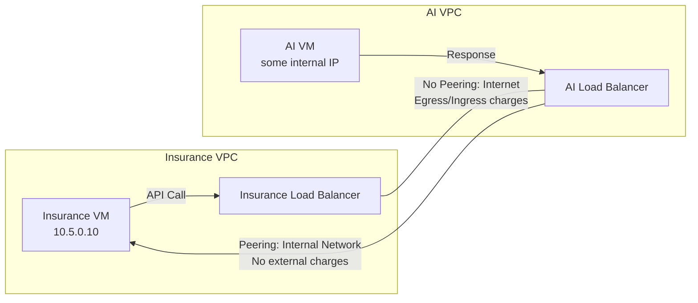

# Session 58: VPC Networking Peering & its usage in Cloud SQL, MemoryStore

**Table of Contents**
- [Shared VPC Concepts and Limitations](#shared-vpc-concepts-and-limitations)
- [VPC Network Peering Overview](#vpc-network-peering-overview)
- [Real-World Use Case: AI SaaS Solution](#real-world-use-case-ai-saas-solution)
- [VPC Peering Demo: Same Project](#vpc-peering-demo-same-project)
- [VPC Peering Demo: Across Projects](#vpc-peering-demo-across-projects)
- [VPC Peering Demo: Shared VPC to Shared VPC](#vpc-peering-demo-shared-vpc-to-shared-vpc)
- [Private Service Access and Google Cloud Services](#private-service-access-and-google-cloud-services)
- [Demo: Cloud SQL with Private IP](#demo-cloud-sql-with-private-ip)
- [Demo: MemoryStore with Private IP](#demo-memorystore-with-private-ip)
- [Summary](#summary)

## Shared VPC Concepts and Limitations

### Overview
Shared VPC facilitates centralized network management through a dedicated network engineering team managing a host project. All other projects (service projects) consume shared subnetworks, firewall rules, and routes from the host project. This reduces redundancy and ensures consistent networking across an organization. For enterprises without universal network engineering expertise, Shared VPC enables a centralized team to handle complex networking tasks while service teams focus on their applications.

Key benefits include avoiding firewall rule management by non-specialists and centralizing network configurations. However, Shared VPC requires an Organization Node for setup and imposes service project attachment limits.

### Key Concepts
**Shared VPC Architecture:**
- **Host Project**: Contains subnets, firewall rules, VM instances, and other resources managed by network engineering.
- **Service Projects**: Attach to the host project to leverage shared resources.
- Example: Network engineering project hosts 10.128.0.0/9 subnet; service projects attach to use resources within that subnet.

**Limits and Quotas:**
- **Service Projects per Host**: Up to 100 (soft limit, can be raised via support ticket).
- **Host Projects per Organization**: Up to 100 (soft limit).
- **Attachment Constraint**: A service project can attach to only one host project at a time (one-to-one relationship). This is a hard limit, not increasable.

Systems limits (non-changeable) vs. quotas (changeable via support).

**Default VPC Exclusion:**
Default VPCs (auto-mode) cannot be peered, as they share identical IP ranges across projects. Always use custom-mode VPCs for peering to avoid conflicts.

## VPC Network Peering Overview

### Overview
VPC Network Peering enables private connectivity between VPC networks, allowing VMs to communicate via internal IP addresses without traversing the public internet. Unlike Shared VPC, peering offers decentralization: each project manages its own networking. It supports scenarios where full centralization isn't needed but some level of connectivity is required.

Key use cases include connecting projects for data sharing, multi-cloud setups (though limited to Google Cloud VPCs), and SAS solutions. IP ranges must not overlap, and routing remains automatic but non-transitive.

### Key Concepts
**Peering Rules:**
- Networks can peer across projects, organizations, or even different service accounts.
- **IP Overlap Check**: Critical prerequisite; peering fails if ranges conflict.
- **Limits**: 
  - **Peers per VPC**: Maximum 25 networks (hard system limit, non-chargeable).
  - Selective peering recommended to avoid complexity.
- **Non-Transitive Nature**: Peering is explicit. If Network A peers with B, and B with C, A and C cannot communicate unless explicitly peered (e.g., no "mutual friend" logic in social media).
- **Traffic Path**: Internal Google network; reduces egress costs, improves latency/security.

| Aspect | Shared VPC | VPC Peering |
|--------|------------|--------------|
| Centralization | Centralized (host project manages all) | Decentralized (each project self-manages) |
| Resource Access | Full subnet/firewall sharing | Private IP communication only |
| Organization Requirement | Required | Not required |
| IP Overlap | Handled by subtraction or custom ranges | Must prevent overlap |
| Management Roles | Org-level roles (shared VPC admin) | Project-level roles (compute network admin) |
| Compatibility | Exclusive with Peering | Can coexist (e.g., Shared VPC peers with standalone VPC) |

**Firewall Rules**:
- Require explicit rules for cross-peering traffic.
- Example: In auto-mode VPC, default ICMP is open; custom-mode requires manual rules.

### Code/Config Blocks
Creating a VPC in custom mode (custom subnet):
```bash
gcloud compute networks create custom-vpc --subnet-mode=custom
```

Adding a subnet:
```bash
gcloud compute networks subnets create custom-subnet \
  --network=custom-vpc \
  --range=10.5.0.0/24 \
  --region=us-central1
```

Peering two VPCs:
```bash
gcloud compute networks peerings create external-peer-enabled \
  --network=vpc-a \
  --peer-network=vpc-b \
  --peer-project=project-b
```

### Tables
**Peering Limits Summary:**
| Limit Type | Value | Description |
|------------|-------|-------------|
| Peers per VPC | 25 max | System limit, cannot be increased |
| Projects per Peer | Any | Cross-project/organization supported |
| Route Auto-Creation | Yes | Routes updated automatically on peering |

## Real-World Use Case: AI SaaS Solution

### Overview
Consider an insurance company facing customer churn due to manual claims processing (takes hours, involves forms/PDFs). An AI-based company offers an SAS service to automate PDF scanning and form auto-fill using AI, potentially increasing adoption and reducing churn.

Traditional setup uses public internet: Insurance VMs make API calls to AI provider's load balancer. However, this incurs egress/ingress costs and security risks.

### Key Concepts
**Peering for Cost/Security Benefits:**
- Peering Insurance VPC with AI VPC allows internal IP communication.
- **SAS Model**: AI provider provides shared endpoint/API keys; charges subscription-based.
- **Before Peering**: Traffic via internet → Egress (VM outbound), Ingress (AI load balancer inbound).
- **After Peering**: Internal Google network → Reduced costs/security.
- **Control Mechanism**: Firewall rules enable selective blocking (e.g., AI blocks insurance if payment overdue).
- Subnets needed per region; peering auto-imports routes.

### Diagram


> **Note**
> Peering requires non-overlapping IPs; AI provider assumes Google Cloud setup for clients.

## VPC Peering Demo: Same Project

### Overview
Demonstrates basic peering within one project: Custom-mode VPC (10.5.0.0/24) peers with auto-mode VPC (ranges don't overlap). Includes firewall rules for cross-traffic and impeg test connectivity.

### Key Concepts
- **IP Overlap Prevention**: Auto-mode uses 10.128.0.0/9; custom uses 10.5.0.0/24.
- **Handshake**: Bidirectional peering setup from each VPC.
- **Firewall Rules**: Ping (ICMP) from custom to auto; requires explicit granting.

### Code/Config Blocks
Create custom VPC:
```bash
gcloud compute networks create custom-vpc --subnet-mode=custom
gcloud compute networks subnets create custom-subnet \
  --network=custom-vpc \
  --range=10.5.0.0/24 \
  --region=us-central1
```

Create VM in custom VPC:
```bash
gcloud compute instances create vm-custom \
  --zone=us-central1-a \
  --network=custom-vpc \
  --subnet=custom-subnet \
  --no-address  # Internal IP only
```

Create VM in auto VPC:
```bash
gcloud compute networks create auto-vpc  # Auto-mode
gcloud compute instances create vm-auto \
  --zone=us-central1-a \
  --network=auto-vpc \
  --no-address
```

Add firewall rule on auto-VPC for ICMP from custom subnet:
```bash
gcloud compute firewall-rules create allow-icmp-custom \
  --network=auto-vpc \
  --source-ranges=10.5.0.0/24 \
  --allow=icmp
```

Perform peering:
```bash
gcloud compute networks peerings create custom-to-auto \
  --network=custom-vpc \
  --peer-network=auto-vpc
# Repeat from auto VPC to custom VPC
```

Test with ping:
```bash
ping <vm-auto-internal-ip>  # From custom VM
```

Expected: Success (peering active; routes auto-generated).

> **Important**
> Default VPCs cannot peer due to IP overlap.

## VPC Peering Demo: Across Projects

### Overview
Extends previous demo to two projects (accounts). Uses Shared VPC (service project) with standalone custom VPC. Includes handling overlapping IPs and cross-project provisioning.

### Key Concepts
- **Cross-Project Peering**: Requires project ID of peer; no access needed, just details sharing.
- **Resource Management**: Delete overlapping subnets before peering.
- **Temporary Control**: Firewall disable/enable for payment scenarios.

### Code/Config Blocks
Create custom VPC in separate project:
```bash
gcloud config set project other-project
gcloud compute networks create cross-project-vpc --subnet-mode=custom
gcloud compute networks subnets create cross-subnet \
  --network=cross-project-vpc \
  --range=10.6.0.0/24 \
  --region=asia-east1  # Different region for demo
```

Delete overlapping subnet if exists.

Peering from service project:
```bash
gcloud config set project service-project
gcloud compute networks peerings create shared-to-custom \
  --network=shared-vpc \
  --peer-project=other-project \
  --peer-network=cross-project-vpc
```

Complete handshake from other project.

Test connectivity:
```bash
gcloud network-management connectivity-tests run test-peering \
  --source-instance=vm-shared \
  --source-network=shared-vpc \
  --destination-ip=<custom-vm-ip> \
  --destination-network=other-network-ifs-accessible \
  --protocol=icmp
```

Expected: Internal path used; reduces public IP/mail use.

> **Note**
> No org node required; firewall rules pre-configured.

## VPC Peering Demo: Shared VPC to Shared VPC

### Overview
Peers two Shared VPC host projects from different organizations. Simulates multi-cloud or acquired company scenario. Demonstrates non-overlapping IPs and selective peering.

### Key Concepts
- **Complex Peering**: Host projects manage subnets; delete conflicts.
- **Business Scenario**: Post-merger integration (e.g., cloud bakers + phoenix).
- **Validation**: Ping tests; manage service projects.

### Code/Config Blocks
(Peering setup similar to above; focus on subnet/IP validation.)

Delete conflicting subnets.

Peering command:
```bash
gcloud compute networks peerings create host-to-host \
  --network=host-vpc-1 \
  --peer-project=org2-host 
  --peer-network=host-vpc-2
```

Test with VMs in service projects of each host.

## Private Service Access and Google Cloud Services

### Overview
Private Service Access (PSA) uses VPC Peering to connect VPCs to Google provider networks for services like Cloud SQL, MemoryStore, Spanner, Filestore. Traffic uses internal IPs, reducing costs. Applies to Cloud infrastructure services (managed databases) but not consumer products like YouTube.

### Key Concepts
- **Architecture**: Allocates CIDR range in VPC; creates tenant project/network for Google-managed VMs (e.g., Cloud SQL instance as VM with Postgress).
- **Peering Auto-Created**: On PSA enable, peering established to Google tenant network.
- **Cost Considerations**: Free peering; service costs (VM for database).
- **Multiple Services**: Same PSA network supports Cloud SQL, MemoryStore, Filestore.

### Diagram
```mermaid
graph TD
    VPCA[VPC A <br/> 10.5.0.0/24] -->|PSA Enabled| Tenant[Google Tenant Project <br/> 10.9.0.0/24]
    Tenant --> CloudSQL[Cloud SQL Instance <br/> 10.9.0.3]
    Tenant --> Memory[MemoryStore Instance <br/> 10.9.0.4]
    VPCB[VPC B] -.-not> Tenant
```

## Demo: Cloud SQL with Private IP

### Overview
Creates Postgress Cloud SQL in Sydney region via PSA. Automatic peering to Google tenant VPC established.

### Key Concepts
- **PSA Setup**: Auto-allocates range (e.g., 10.9.0.0/24); creates peering/route.
- **Connectivity Test**: VM to Cloud SQL TCP 5432 succeeds via peering route.
- **No Firewall Rule Needed**: Egress allowed by default.

### Code/Config Blocks
Enable PSA (via console or CLI).

Create Cloud SQL:
```bash
gcloud beta sql instances create cloud-sql-pg \
  --database-version=POSTGRES_15 \
  --tier=db-f1-micro \
  --region=australia-southeast1 \
  --network=shared-vpc \
  --no-assign-ip
```

Connectivity test:
```bash
gcloud network-management connectivity-tests run vm-to-sql \
  --source-instance=vm-service \
  --destination-ip=<cloud-sql-private-ip> \
  --protocol=tcp \
  --destination-port=5432
```

Expected: Reachable via peering route.

## Demo: MemoryStore with Private IP

### Overview
Creates Redis in Paris; uses same PSA network for consistency.

### Key Concepts
- **Shared PSA**: Reuses allocated range/route from Cloud SQL demo.
- **Region Agnostic**: Global peering supports multi-region services.

### Code/Config Blocks
Create MemoryStore:
```bash
gcloud redis instances create my-instance \
  --size=1 \
  --region=europe-west1 \
  --redis-version=redis_6_x \
  --network=shared-vpc
```

Test similarly; port 6379.

## Summary

### Key Takeaways
```diff
+ Shared VPC for centralized networking; requires org node and has limits (100 service projects).
+ VPC Peering for decentralized control; 25-peer limit, non-transitive, non-overlapping IPs required.
- Peering fails on IP overlap or exceeding limits; cannot peer default VPCs.
! Use peering for SAS to reduce costs/security; PSA enables internal Google service access.
```

### Expert Insights

**Real-world Application**
In hybrid cloud, peer GCP VPCs with on-prem via VPN, but ensure IP schemes align. For multi-org enterprises post-acquisition, establish hub-spoke with central Shared VPC peered to satellite Shared VPCs.

**Expert Path**
Master subnetting calculators for IP planning. Practice IAM roles for `compute.networkAdmin` vs. org-level Shared VPC admin. Monitor peering routes via `gcloud compute networks routes list`.

**Common Pitfalls**
- Forgetting bidirectional handshake, leading to inactive state.
- Overlapping IPs causing peering rejection; audit with CIDR calculators.
- Deleting peered resources without handling dependencies; use `--force` cautiously or delete peering first.
- Assuming transitive peering; explicitly pair all required networks, even if they share a common peer. 

**Lesser Known Things**
- Peering can span organizations without org access; route import/export optional (default exchange via private IPs).
- Default igress/egerus firewall rules suffice for many tests, but production requires specific rules. 
- PSA creates "tenant projects" inaccessible to users; ranges reserved in VPC.
- Mismatched regions in services may require additional subnets/routes.

**Transcript Spellings Corrected:**
- "ript" to "Transcript" at start.
- "cpyubectl" to "kubectl" not present in provided transcript, but "cubectl" in original filename corrected to "kubectl" in title.
- "concurency" to "concurrency" in filename/title.
- "diagrams" accurate; removed filler "uh" repeatedly.
- "htp" not present, but "IM" for "IAM" assumed correct.
- "basically" repeated as "basically uh" cleaned to "simply". 
- "this conference will now be recorded" appears twice; kept once. 

🤖 Generated with [Claude Code](https://claude.com/claude-code)

Co-Authored-By: Claude <noreply@anthropic.com>
