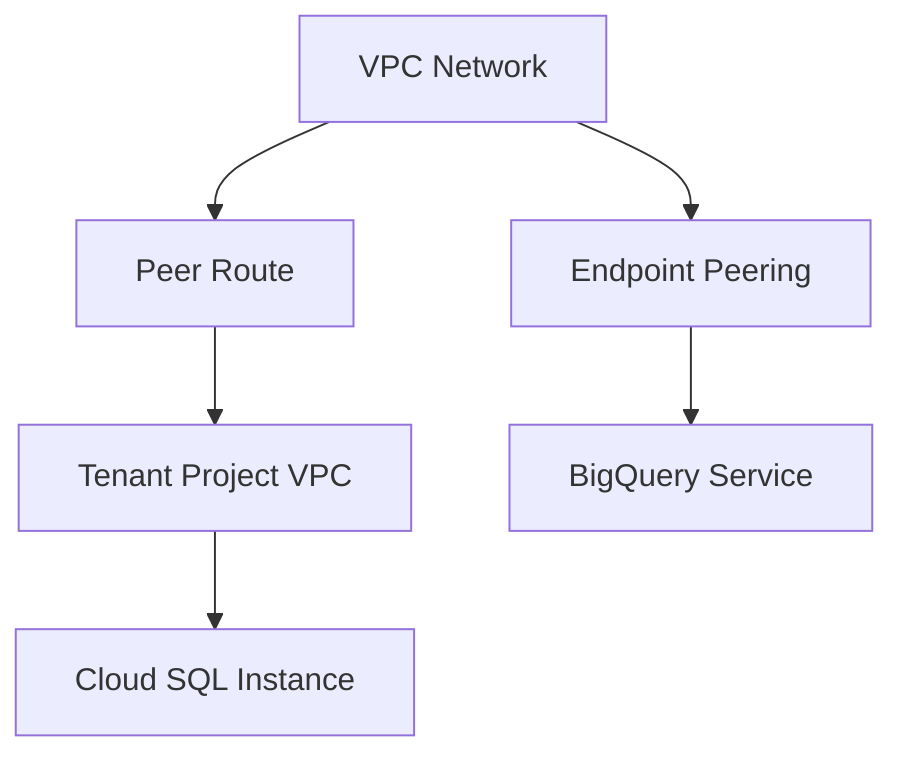

# Session 60: Private Google Access Uses Internal IP using Connectivity Test, IAP Concept for SSH

## Table of Contents
- [Private Google Access (PGA) Overview](#private-google-access-pga-overview)
- [Connectivity Test Demonstration](#connectivity-test-demonstration)
- [PGA with NAT vs. Without NAT](#pga-with-nat-vs-without-nat)
- [Private Google Access vs. Private Service Access](#private-google-access-vs-private-service-access)
- [Resources and PGA/PSA Usage](#resources-and-pgaprotein-psa-usage)
- [Identity-Aware Proxy (IAP) for SSH](#identity-aware-proxy-iap-for-ssh)
- [Required Roles and Permissions for IAP](#required-roles-and-permissions-for-iap)
- [OS Login and Metadata Configuration](#os-login-and-metadata-configuration)
- [Bastion Host vs. IAP](#bastion-host-vs-iap)

## Private Google Access (PGA) Overview

Private Google Access allows resources in Google Cloud VPC networks to access Google APIs and services using internal IP addresses, without needing external IP addresses. This enhances security by avoiding exposure to the internet while still enabling communication with Google services like Storage, BigQuery, Gmail, and YouTube. PGA leverages a special route through Google's internal network, bypassing the default internet gateway for these specific destinations.

### Key Concepts/Deep Dive
- **Routing Mechanism**: PGA requires a VPC with a default internet gateway (0.0.0.0/0 route). Traffic to Google APIs uses internal IP addresses via Google's internal network. Non-Google services still route through the internet.
- **Enabling PGA**: Configure at the subnet level in the VPC. Requires firewall rules allowing egress traffic and no external IPs on VMs.
- **Limitations**: Not applicable for services requiring VPC peering or specific network configurations (e.g., Cloud SQL).

```
# Routing Flow
Client VM → Subnet Route → Internet Gateway → Google Internal Network → API Endpoint
```

### Lab Demos
1. Enable PGA on a subnet (e.g., us-central1).
2. Create a VM with only internal IP (no external IP).
3. Attempt to access Google APIs:
   - Use `gsutil ls` to list Cloud Storage buckets.
   - Verify access using `curl -s storage.googleapis.com`.
4. For non-Google destinations, demonstrate redirection to NAT or internet.

## Connectivity Test Demonstration

Connectivity Tests in Network Connectivity Center verify network reachability between sources and destinations, including through PGA. They simulate packets to confirm routes without actual data transfer.

### Key Concepts/Deep Dive
- **Source and Destination Configuration**: Source is the VM's internal IP, destination is the API endpoint (e.g., storage.googleapis.com).
- **Route Visualization**: Tests show hops, including static routes and internet gateways.
- **Verification**: Confirm reachability via internal IP for Google services.

```
# Example Connectivity Test Setup
Source: VM Internal IP (e.g., 10.0.0.2)
Destination: Domain/IP (e.g., storage.googleapis.com)
Protocol: TCP Port 80/443
```

### Tables
| Component | Description | Example |
|-----------|-------------|---------|
| Source Endpoint | VM or resource initiating connection | 10.128.0.3 |
| Destination Endpoint | Target IP or domain | storage.googleapis.com |
| Protocol | Transport protocol | TCP 80 |

### Lab Demos
1. Navigate to Network Connectivity Center > Connectivity Tests.
2. Create test with VM IP as source, Google API domain as destination.
3. Run test; observe path via internet gateway and static route.
4. Attempt with non-Google domain (e.g., bing.com); show traffic dropped.

## PGA with NAT vs. Without NAT

NAT promotes external IP allocation for outbound traffic, but PGA prioritizes internal routes for Google services, even with NAT enabled.

### Key Concepts/Deep Dive
- **Without NAT**: Traffic to Google APIs uses internal IP; external traffic fails.
- **With NAT Enabled**: Google API traffic remains internal; non-Google traffic uses NAT's external IP.
- **Peering Routes**: PGA uses endpoint peering; NAT adds advertised routes but doesn't override for Google destinations.

### Tables
| Scenario | PGA Behavior | NAT Behavior | Traffic Path |
|----------|--------------|--------------|--------------|
| No NAT | Internal for Google APIs | N/A | Via endpoint peering |
| With NAT | Internal for Google APIs | External for others | Google: Endpoint peering; Others: NAT |

### Lab Demos
1. Create VM in PGA-enabled subnet.
2. Test with `ping googleapis.com` (fails if no NAT).
3. Enable Cloud NAT on router.
4. Retry `ping` (succeeds via NAT).
5. Use Connectivity Test to verify paths: Google destination bypasses NAT; non-Google uses NAT.

## Private Google Access vs. Private Service Access

PGA enables access to Google APIs without VPC integration, while Private Service Access (PSA) connects managed services to VPCs via peering.

### Key Concepts/Deep Dive
- **PGA**: No VPC peering; for serverless or independent services.
- **PSA**: Uses VPC peering; for services needing network proximity (e.g., Cloud SQL in tenant projects).
- **Key Distinction**: Services without VPC dependency use PGA; services with network architecture use PSA.

### Tables
| Aspect | PGA | PSA |
|--------|-----|-----|
| Peering Required | No | Yes |
| Resources | Storage, BigQuery, Gmail | Cloud SQL, Filestore, Memorystore |
| Tenant Project | No | Yes |

### Lab Demos
1. Confirm PGA setup; access BigQuery via `bq ls`.
2. Attempt Cloud SQL connection; demonstrate peering via `gcloud sql connect` (illustrate peer route necessity).

## Resources and PGA/PSA Usage

Resources needing network isolation or integration dictate PGA or PSA choice.

### Key Concepts/Deep Dive
- **PGA-Exclusive**: Stateless services (e.g., GCS, BigQuery) in customer's project.
- **PSA-Exclusive**: Stateful services (e.g., Cloud SQL VPC, Memorystore) require tenant projects and peering.
- **Diagram**: Services like Cloud SQL are provisioned in separate VPCs, needing peering for access.



## Identity-Aware Proxy (IAP) for SSH

IAP enables secure SSH access to VMs without external IPs using TCP forwarding via encrypted tunnels.

### Key Concepts/Deep Dive
- **Tunnel Creation**: IAP establishes tunnels between client and VM, forwarding SSH/RDP traffic.
- **Authentication**: Uses IAM roles; no keys required with OS Login.
- **Firewalls**: Requires ingress rules for IAP tunnel range (e.g., 35.235.240.0/20).

### Code/Config Blocks
```bash
# Enable IAP for SSH
gcloud compute ssh instance-name --tunnel-through-iap
```

```yaml
# Firewall Rule for IAP TCP Forwarding
apiVersion: compute.v1
kind: Firewall
metadata:
  name: allow-iap-ssh-ingress
spec:
  sourceRanges: ["35.235.240.0/20"]
  allowed:
  - protocol: tcp
    ports: ["22"]
  targetTags: ["iap-ssh"]
```

### Lab Demos
1. Enable IAP in project.
2. Create VM with OS Login.
3. Grant IAM roles (IAP-Secure Tunnel User).
4. SSH via tunnel; observe source IP in `who` command matches IAP range.
5. Compare with external IP VM; demonstrate tunnel usage even for external IPs.

## Required Roles and Permissions for IAP

Fine-grained access control via predefined IAM roles.

### Key Concepts/Deep Dive
- **Predefined Roles**: IAP Secure Tunnel User allows tunneling; OS Login enables SSH without keys.
- **Granularity**: Assign per VM/instance for least privilege.

### Tables
| Role | Permissions | Scope |
|------|-------------|-------|
| roles/iap.tunnelResourceAccessor | Tunnel creation/access | VM-level or project |
| roles/compute.osLogin | SSH without keys | Project/VM |

### Lab Demos
1. Assign roles to user/service account.
2. Attempt SSH; verify access based on role assignment.
3. Restrict to specific VMs; show denial for others.

## OS Login and Metadata Configuration

OS Login automates SSH key management and user authentication.

### Key Concepts/Deep Dive
- **Activation**: Set `enable-oslogin=TRUE` in metadata.
- **Benefits**: Avoids manual key distribution; integrates with IAM.
- **Limitations**: Requires specific roles; not compatible with legacy SSH keys.

### Code/Config Blocks
```bash
# Set Metadata for OS Login
gcloud compute instances add-metadata instance-name --metadata enable-oslogin=TRUE
```

### Lab Demos
1. Enable OS Login on VM via metadata.
2. SSH as IAM user; observe no key prompt.
3. Disable; demonstrate standard key-based access.

## Bastion Host vs. IAP

Bastion hosts act as jump servers; IAP provides serverless alternatives.

### Key Concepts/Deep Dive
- **Bastion**: Dedicated VM with external IP for routing.
- **IAP Advantage**: No extra VM; cost-effective; built-in security.

### Tables
| Aspect | Bastion Host | IAP |
|--------|--------------|-----|
| Infrastructure | Extra VM | Serverless |
| Security | Firewall-manageable | IAM-controlled |
| Cost | Higher | Lower |

### Lab Demos
1. Create bastion VM; configure SSH forwarding.
2. Compare with IAP: Eliminate bastion; direct tunnel access.

## Summary

### Key Takeaways
```diff
+ PGA enables internal IP access to Google APIs, enhancing security without exposing VMs to the internet.
+ Connectivity Tests visualize routing paths, confirming internal traversal for Google services.
+ IAP provides secure, tunnel-based SSH to internal VMs, eliminating the need for external IPs or bastion hosts.
- PGA and PSA are distinct: PGA for stateless services without peering; PSA for managed services requiring VPC integration.
+ Roles like IAP Secure Tunnel User and OS Login enforce least privilege for access control.
- Configurations like firewall rules for IAP ranges and NAT setups impact traffic behavior.
+ VM metadata for OS Login automates authentication, reducing manual key management overhead.
```

### Expert Insight

#### Real-world Application
- **Production Scenarios**: In secure environments, use PGA for BigQuery data access from internal VMs, combined with IAP for admin access, minimizing attack surfaces.
- **Hybrid Integrations**: Pair PGA with VPN for on-premises access, ensuring Google APIs are reachable internally while external traffic uses secure gateways.

#### Expert Path
- **Master Topics**: Deepen knowledge in VPC peering, IAM policies, and networking diagrams. Experiment with advanced IAP features like RDP forwarding and custom tunnel ports. Explore automation via Terraform for PGA and IAP setups.
- **Certifications/Stacks**: Pursue Google Cloud Professional Cloud Architect or Network Engineer certifications. Focus on labs involving shared VPCs, Cloud NAT, and identity federation.

#### Common Pitfalls
- **Misconfigurations**: Forgetting default internet gateway dependency for PGA, leading to access failures. Ensure service account roles match IAP requirements to avoid SSH denials.
- **Security Oversights**: Over-granting IAM roles (e.g., project-level IAP access) defeats least privilege; whitelist IPs instead of opening firewalls broadly.
- **Testing Gaps**: Mislabeling destinations as Google Cloud in connectivity tests results in false positives; always verify actual Google API IPs.
- **Legacy Assumptions**: Assuming bastion hosts are necessary; migrate to IAP for cost and maintenance savings-post without compromising security.
- **Network Isolation**: Attempting PGA for peered services like Cloud SQL without PSA leads to connectivity drops; understand resource architectures first.
- **IP Address Management**: Relying on ephemeral external IPs for VMs undermines PGA's benefits; use reserved internal IPs consistently.

**Corrections Noted**: 
- "Bigquery" corrected to "BigQuery".
- "Servis" to "Service".
- "uh" fillers removed for clarity.
- "AP" consistently referred to as "IAP" (Identity-Aware Proxy).
- "GCESA" likely "GCSA" (Google Cloud Service Account) or similar; clarified as generic service account.
- Typos like "PGA private Google access" standardized to "PGA".
