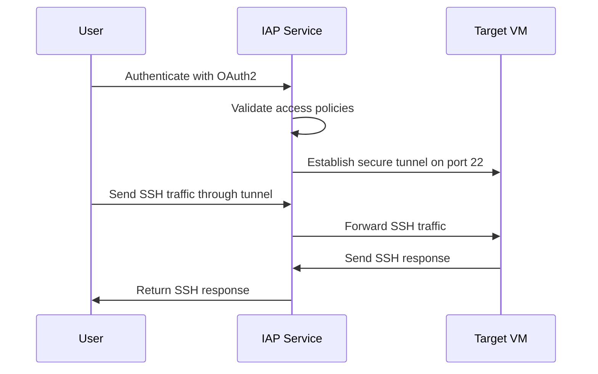
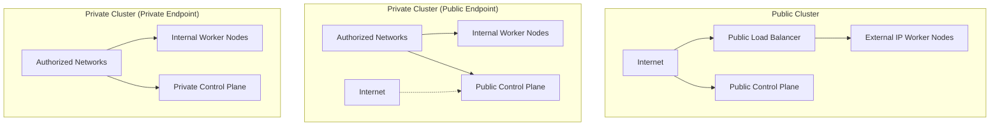

# Session 61: Identity Aware Proxy (IAP) Demystification & Private GKE Cluster Concepts Using Alias IP

## Table of Contents
- [IAP Overview and Access Control Fundamentals](#iap-overview-and-access-control-fundamentals)
- [VM Creation and IAP Roles Setup](#vm-creation-and-iap-roles-setup)
- [Accessing VMs with Internal IP Addresses via IAP](#accessing-vms-with-internal-ip-addresses-via-iap)
- [Accessing VMs with External IP Addresses](#accessing-vms-with-external-ip-addresses)
- [Command Line IAP Access and Local Cloud SDK](#command-line-iap-access-and-local-cloud-sdk)
- [IAP Desktop Client for Windows](#iap-desktop-client-for-windows)
- [How IAP Tunneling Works - Technical Deep Dive](#how-iap-tunneling-works---technical-deep-dive)
- [SSH Keys and PuTTY Integration with IAP](#ssh-keys-and-putty-integration-with-iap)
- [Multiple GCloud Configurations and Profiles](#multiple-gcloud-configurations-and-profiles)
- [Organization Policies - Domain Restricted Sharing](#organization-policies---domain-restricted-sharing)
- [Reserved IP Addresses - Internal vs External](#reserved-ip-addresses---internal-vs-external)
- [Alias IP Ranges and Secondary IP Addresses](#alias-ip-ranges-and-secondary-ip-addresses)
- [Private GKE Clusters - Types and Configuration](#private-gke-clusters---types-and-configuration)

## IAP Overview and Access Control Fundamentals

### Overview
Identity Aware Proxy (IAP) is a service in Google Cloud that provides secure access controls for applications and resources running behind IAP. It acts as a gateway that enforces access control policies based on user identities, allowing organizations to control who can access resources without requiring public IP addresses or VPN connections.

### Key Concepts

IAP provides seamless, context-aware access to applications with zero-trust security:

```diff
+ Secure Access: Eliminates the need for bastion hosts or VPNs
+ Context-Aware: Access decisions based on user identity and context
+ Zero-Trust: Verify every access attempt, regardless of location
- Complex Setup: Requires careful role and firewall configuration
```

### Key IAP Roles

| Role | Description | Scope |
|------|-------------|--------|
| `iap.tunnelResourceAccessor` | Access IAP-tunneled resources | Project or VM specific |
| `roles/iap.securityAdmin` | Configure IAP policies | Organization/Project |
| `roles/iap.admin` | Full IAP administration | Organization/Project |

## VM Creation and IAP Roles Setup

### Overview
Before implementing IAP, VMs need appropriate service account roles. The service account used by VMs must have permission to impersonate other service accounts, and users need specific IAP roles depending on how they access resources.

### Key Concepts

VM service accounts require the `roles/iam.serviceAccountUser` role on other service accounts they need to impersonate.

### Service Account Configuration

```yaml
# VM Service Account Permissions
- roles/iam.serviceAccountUser
- roles/compute.osLogin (for OS Login)
```

### Common Service Account Issues

⚠️ **Common Pitfall**: VMs failing to start due to missing service account user role

```diff
- Error: Service account does not have permission to impersonate
+ Solution: Grant roles/iam.serviceAccountUser on target service accounts
```

## Accessing VMs with Internal IP Addresses via IAP

### Overview
VMs with only internal IP addresses require IAP for secure access. The secure tunnel user role allows users to establish SSH connections through IAP's tunneling mechanism.

### Key Concepts

IAP tunneling creates a secure connection from user's local machine through Google's IAP service to the target VM's internal IP address.

### Firewall Rules Requirements

```bash
# Required firewall rule for internal IP VMs
gcloud compute firewall-rules create iap-ssh \
  --network=my-network \
  --allow=tcp:22 \
  --source-ranges=35.235.240.0/20 \
  --target-tags=iap-accessible
```

### Role Assignment for Internal VMs

```bash
# Grant secure tunnel user role for specific VM access
gcloud projects add-iam-policy-binding my-project \
  --member=user:user@example.com \
  --role=roles/iap.tunnelResourceAccessor

# For organization-wide access
gcloud organizations add-iam-policy-binding my-org \
  --member=user:user@example.com \
  --role=roles/iap.tunnelResourceAccessor
```

### UI vs Command Line Access

```diff
+ UI Access: Automatically handles tunneling for internal IPs
- Command Line: Requires manual tunnel setup with --tunnel-through-iap flag
! IP Range: IAP uses 35.235.240.0/20 for tunneling connections
```

📝 **Lab Demo**: Create VM with internal IP, assign secure tunnel user role, and SSH via both UI and command line methods.

## Accessing VMs with External IP Addresses

### Overview
VMs with external IP addresses can be accessed traditionally via SSH over the internet, but IAP can still provide additional access controls and auditing.

### Key Concepts

External IP VMs don't strictly require IAP, but IAP adds an extra security layer with user identity verification.

### Firewall Rule Options

```bash
# Option 1: Allow from specific IP (secure)
gcloud compute firewall-rules create allow-ssh-from-ip \
  --network=my-network \
  --allow=tcp:22 \
  --source-ranges=YOUR-IP/32 \
  --target-tags=external-ssh

# Option 2: Use IAP for external VMs (recommended for consistency)
gcloud compute firewall-rules create iap-ssh \
  --network=my-network \
  --allow=tcp:22 \
  --source-ranges=35.235.240.0/20 \
  --target-tags=iap-accessible
```

### Access Patterns Comparison

| Access Method | VM Type | Firewall Required | Authentication Method |
|----------------|---------|--------------------|----------------------|
| Direct SSH | External IP | Target IP allowlist | SSH keys |
| IAP Tunnel | Any IP type | IAP range (35.235.240.0/20) | Google identity + SSH keys |
| Console UI | Any IP type | Automatic tunneling | Google identity |

## Command Line IAP Access and Local Cloud SDK

### Overview
Local Cloud SDK installations can use IAP tunneling to securely access VMs with internal IP addresses from any location with internet connectivity.

### Key Concepts

Local cloud SDK requires authentication and can establish IAP tunnels similar to Cloud Shell.

### Local SDK Setup and Access

```bash
# Authenticate to gcloud
gcloud auth login
gcloud auth application-default login

# Set project and zone
gcloud config set project my-project
gcloud config set compute/zone us-central1-a

# SSH via IAP tunnel (internal IPs)
gcloud compute ssh my-vm --tunnel-through-iap

# SSH to external IP VM (direct connection)
gcloud compute ssh my-vm-external

# List VMs with tunneling capability
gcloud compute instances list --filter="network:projects/my-project/global/networks/my-vpc"
```

### Authentication Flow

```diff
+ Local SDK IAP: Uses OAuth2 tokens for secure authentication
+ Key Management: SSH keys managed through OS Login or metadata
- Network Dependency: Requires stable internet connection
! Firewall Rules: IAP tunneling bypasses standard firewall rules using 35.235.240.0/20
```

## IAP Desktop Client for Windows

### Overview
IAP Desktop provides a Windows GUI application for managing and accessing multiple VMs through IAP, simplifying multi-VM environment management.

### Key Concepts

The IAP Desktop application provides a graphical interface for connecting to VMs, with persistent sessions and connection management.

### IAP Desktop Features

```diff
+ Multi-VM Management: Connect to multiple VMs from single interface
+ Persistent Sessions: Maintain connection state across sessions
+ Windows Integration: Native Windows application with putty-like interface
+ Security: All connections routed through IAP
- Platform Limitation: Windows-only (Linux/Mac alternatives available)
! Requirement: VMs must be accessible via IAP (internal IPs preferred)
```

### Supported Connection Types

| Connection Type | IAP Desktop Support | Requirements |
|-----------------|-------------------|--------------|
| SSH | ✅ | IAP tunneling enabled |
| RDP | ❌ | Not supported |
| TCP Forwarding | ✅ | Custom port forwarding |
| VM Console | ❌ | Use standard Cloud Console |

## How IAP Tunneling Works - Technical Deep Dive

### Overview
IAP tunneling establishes a secure proxy connection that forwards traffic from authenticated users to target resources without exposing those resources publicly.

### Key Concepts

The tunneling process creates encrypted connections that bypass traditional network security boundaries.

### Tunnel Establishment Process



### Technical Implementation

```bash
# Manual tunnel establishment
gcloud compute start-iap-tunnel my-vm 22 --local-host-port=localhost:3333

# Connect using forwarded local port
ssh user@localhost -p 3333

# Tunnel management
gcloud compute ssh my-vm --tunnel-through-iap --ssh-flag="-L 8080:localhost:80"
```

### Networking Architecture

```diff
+ Tunnel Security: End-to-end encryption using TLS 1.3
+ IP Transparency: Source IP shows as IAP range (35.235.240.0/20)
- Performance: Slight latency increase due to proxying
! Port Limitations: Typically TCP ports, UDP support limited
+ Audit Trail: All access attempts logged in Cloud Audit Logs
```

## SSH Keys and PuTTY Integration with IAP

### Overview
IAP can work with traditional SSH key authentication while adding identity verification through Google accounts.

### Key Concepts

SSH keys are stored in VM metadata and can be managed through IAP alongside Google identity verification.

### SSH Key Management in GCP

```bash
# Add SSH keys to VM metadata
gcloud compute instances add-metadata my-vm \
  --metadata ssh-keys="user:ssh-rsa AAAAB3NzaC1yc2EAAAADAQABAAABA... user@host"

# OS Login integration (recommended)
gcloud compute instances create my-vm --os-login=ENABLED

# Import SSH key from local machine
gcloud compute os-login ssh-keys add \
  --key="ssh-rsa AAAAB3NzaC1yc2EAAAADAQABAAABA... user@local"
```

### PuTTY Configuration for IAP Tunnels

```bash
# 1. Establish IAP tunnel
gcloud compute start-iap-tunnel my-vm 22 --local-host-port=localhost:3333

# 2. PuTTY configuration
# Host Name: localhost
# Port: 3333
# Connection Type: SSH
# Auth: Select private key file
```

### Key Storage Options

| Method | Advantages | Disadvantages |
|---------|------------|---------------|
| VM Metadata | Simple setup | Key visible in compute API |
| OS Login | Integrated with Google identity | Requires OS Login enabled |
| IAP-only authentication | No key management needed | IAP role required for each access |

## Multiple GCloud Configurations and Profiles

### Overview
GCloud CLI supports multiple configurations, allowing users to work with different projects, organizations, and user accounts simultaneously.

### Key Concepts

Configurations store separate authentication contexts, project settings, and user preferences.

### Configuration Management

```bash
# List all configurations
gcloud config configurations list

# Create new configuration
gcloud config configurations create my-second-account

# Switch between configurations
gcloud config configurations activate my-second-account

# Delete configuration
gcloud config configurations delete unused-config
```

### Multi-Account Setup

```bash
# Owner account configuration
gcloud config configurations create owner-account
gcloud config set account owner@mydomain.com
gcloud config set project owner-project

# Employee account configuration
gcloud config configurations create employee-account
gcloud config set account employee@mydomain.com
gcloud config set project employee-project
```

### Best Practices

```diff
+ Configuration Naming: Use descriptive names indicating account/project
+ Separate Authentication: Each config can have different credentials
+ Environment Variables: Set CLOUDSDK_ACTIVE_CONFIG_NAME
- Shared State: Configs don't share authentication tokens
! Default Config: Always have a working default configuration
```

## Organization Policies - Domain Restricted Sharing

### Overview
Domain restricted sharing controls which identities can be granted access to Google Cloud resources within an organization, enhancing security by limiting cross-domain access.

### Key Concepts

This policy prevents inadvertent sharing of resources with users outside trusted domains or organizations.

### Policy Configuration

```yaml
# Domain restricted sharing policy
constraint: constraints/iam.allowedPolicyMemberDomains
listPolicy:
  allowedValues:
  - "mydomain.com"
  - "trustedpartner.com"
  deniedValues:
  - "CLOUDIDENTITY.googleapis.com/*"  # Allow all Google identities
```

### Implementation Steps

```bash
# Enable domain restriction at organization level
gcloud resource-manager org-policies enable-enforce \
  constraints/iam.allowedPolicyMemberDomains \
  --organization=123456789

# Set allowed domains
gcloud resource-manager org-policies set-policy policy.yaml \
  --organization=123456789
```

### Allowed Values Format

```yaml
# Various allowed value patterns
allowedValues:
  # Single domain
  - "example.com"
  # Multiple domains
  - "example.com"
  - "partner.com"
  # Google Cloud service accounts
  - "CLOUDIDENTITY.googleapis.com/*"
  # Specific Google Workspace customer ID
  - "customers/C01234567"
```

### Access Control Scenarios

```diff
+ Trusted Domains: Specified domains can access resources
+ Google Service Accounts: Allow for service-to-service communication
+ Partner Organizations: Explicitly allow partner domains
- Untrusted Email Domains: Blocked by policy
! Exception Management: Requires organization admin approval for exceptions
```

## Reserved IP Addresses - Internal vs External

### Overview
Reserved IP addresses in GCP prevent address conflicts and ensure consistent network configuration, with different cost and availability implications for internal and external addresses.

### Key Concepts

IP address reservation guarantees consistent IP assignment for resources, with important billing and network design implications.

### IP Address Types Comparison

| Characteristic | Internal Reserved IP | External Reserved IP |
|----------------|---------------------|---------------------|
| Purpose | VM networking, load balancers | Public services, NAT gateways |
| Cost | No cost | Charged when not in use |
| Regional/Global | Regional | Can be regional or global |
| Billing Impact | None | $7.29/month unused (regional) |

### Reserved IP Management

```bash
# Reserve internal IP
gcloud compute addresses create my-internal-ip \
  --region=us-central1 \
  --subnet=my-subnet \
  --addresses=10.0.1.50

# Reserve external IP (premium tier)
gcloud compute addresses create my-external-ip \
  --region=us-central1 \
  --network-tier=PREMIUM

# List reserved IPs
gcloud compute addresses list
```

### Cost Optimization Strategy

```diff
+ Internal IPs: Always reserve for consistency, no cost impact
+ External IPs: Reserve only if needed long-term
- External Static IPs: Avoid reserving unused addresses (costly)
! Regional Limitation: Reserved IPs tied to specific region
+ Cleanup: Release unused reserved IPs immediately
```

### Usage Scenarios

```diff
+ Use Case: VM with required fixed IP address
+ Reserved Internal IP: Ideal, no cost, high reliability

! Use Case: Public-facing service IP
+ Reserved External IP: Required for consistent public access
```

## Alias IP Ranges and Secondary IP Addresses

### Overview
Alias IP ranges enable multiple IP addresses per VM network interface, supporting microservices architecture by allowing multiple services on the same VM with distinct IP identities.

### Key Concepts

Secondary IP ranges provide additional IP namespace without requiring separate network interfaces, enabling IP-based service segregation.

### Secondary Range Configuration

```bash
# Add secondary ranges to subnet
gcloud compute networks subnets update my-subnet \
  --region=us-central1 \
  --add-secondary-ranges=pod-range=10.2.0.0/22,service-range=10.2.4.0/23

# Create VM with alias IPs
gcloud compute instances create my-vm \
  --network-interface=network=my-vpc,subnet=my-subnet,aliases=pod-range:10.2.0.2;service-range:10.2.4.5
```

### IP Address Management

```bash
# List secondary ranges
gcloud compute networks subnets describe my-subnet \
  --region=us-central1 \
  --format="value(secondaryIpRanges)"

# Check VM IP configuration
gcloud compute instances describe my-vm \
  --format="table(networkInterfaces[].aliasIpRanges[])"

# Linux IP address verification
ip addr show dev ens4
```

### VM Configuration Example

```bash
# Primary IP: 10.0.1.10 (from subnet range)
# Alias IP 1: 10.2.0.2 (from pod-range)
# Alias IP 2: 10.2.4.5 (from service-range)

# Install and configure services on each IP
sudo apt-get install nginx
sudo systemctl start nginx

# Bind services to specific IPs
# Service 1 listens on primary IP: 10.0.1.10:80
# Service 2 listens on alias IP 1: 10.2.0.2:8080
# Service 3 listens on alias IP 2: 10.2.4.5:9090
```

### Routing and Firewall Considerations

```diff
+ Automatic Routing: Alias IPs automatically routed in VPC
+ Firewall Rules: Separate rules can be created per alias IP range
- Cross-Subnet Routing: Alias IPs cannot span subnets
! Network Peering: Complex with alias IP configurations
+ Microservices: Ideal for per-service IP isolation
```

## Private GKE Clusters - Types and Configuration

### Overview
Private GKE clusters enhance security by placing control plane and worker nodes on private networks, reducing exposure while maintaining management capabilities through authorized networks.

### Key Concepts

Private clusters come in different configurations based on endpoint accessibility and node IP allocation, providing varying levels of isolation and connectivity.

### Cluster Types Matrix

| Cluster Type | Node IP Type | Control Plane Endpoint | Use Case |
|-------------|--------------|----------------------|-----------|
| Public Cluster | External | Public | Development/Testing |
| Private Cluster | Internal | Public | Production with private workers |
| Private Cluster | Internal | Private | High-security production |

### Cluster Creation Commands

```bash
# Public cluster with external IPs
gcloud container clusters create public-cluster \
  --num-nodes=3 \
  --enable-ip-alias \
  --enable-private-nodes=false \
  --enable-private-endpoint=false

# Private cluster with public endpoint
gcloud container clusters create private-public-cluster \
  --num-nodes=3 \
  --enable-ip-alias \
  --enable-private-nodes=true \
  --enable-private-endpoint=false \
  --master-authorized-networks=10.0.0.0/8

# Private cluster with private endpoint
gcloud container clusters create private-cluster \
  --num-nodes=3 \
  --enable-ip-alias \
  --enable-private-nodes=true \
  --enable-private-endpoint=true \
  --master-authorized-networks=10.0.0.0/8
```

### Pod and Service IP Ranges

```yaml
# Custom pod and service ranges
networkConfig:
  ipAllocationPolicy:
    clusterSecondaryRangeName: pod-range
    servicesSecondaryRangeName: service-range
    clusterIpv4CidrBlock: 10.2.0.0/22    # Pods
    servicesIpv4CidrRange: 10.2.4.0/23   # Services
  network: projects/my-project/global/networks/my-vpc
  subnetwork: regions/us-central1/subnetworks/my-subnet
```

### Network Architecture Comparison



### Authorized Networks Configuration

```bash
# Configure authorized networks for private endpoints
gcloud container clusters update private-cluster \
  --enable-master-authorized-networks \
  --master-authorized-networks=10.0.0.0/8,172.16.0.0/12

# Add additional authorized CIDRs
gcloud container clusters update private-cluster \
  --master-authorized-networks=10.0.0.0/8,192.168.0.0/16
```

### Connectivity Options

```diff
+ Bastion Host: Jump host in authorized network for management access
+ Cloud VPN: Connect on-premises to VPC for cluster management
+ Private Google Access: Enable private access to Google APIs
+ Cloud NAT: Allow outbound internet access for worker nodes
- Direct Internet Access: Not available by default for private nodes
```

## Summary

### Key Takeaways

> [!IMPORTANT]
> **IAP Best Practices**: Use IAP for internal VMs, combine with OS Login, assign minimal required roles, and leverage multiple gcloud configurations for multi-account management.

```diff
+ Private GKE Clusters: Enable private nodes and private endpoints for maximum security
- Avoid External IPs: Use alias IP ranges for microservices instead of multiple VMs
+ Domain Restrictions: Implement organization policies to control cross-domain access
! Cost Management: Reserve internal IPs freely but be cautious with unused external IPs
```

### Expert Insight

#### Real-World Application
**Enterprise Network Architecture**: In production environments, implement private GKE clusters with private endpoints accessible only through authorized networks. Use IAP for jump host access and maintain separate staging/production environments with different access controls.

#### Expert Path
Master IAP by implementing custom OAuth consent screens, integrating with SAML/SSO providers, and using IAP for TCP forwarding beyond SSH. Deepen GKE networking knowledge by implementing multi-cluster service mesh architectures with Istio and understanding VPC-native cluster networking.

#### Common Pitfalls
- **Service Account Impersonation**: VMs failing due to missing `roles/iam.serviceAccountUser` permissions
- **Firewall Rule Conflicts**: IAP range conflicts with overly restrictive firewall rules
- **Domain Restriction Policies**: Incorrect policy configuration blocking legitimate access
- **Reserved IP Costs**: Accumulating charges for unused external static IPs

#### Lesser-Known Aspects
- **IAP Resource-Level Access**: Grant tunnel access to specific VMs rather than entire projects for granular control
- **Multi-Configuration Workflows**: Use named gcloud configurations for seamless switching between dev/prod accounts
- **Alias IP Microservices**: Leverage secondary ranges for cleaner service-to-service communication without port management
- **GKE Private Endpoint Scaling**: Use bastion hosts with IAP for management access when direct private connectivity isn't available

🤖 Generated with [Claude Code](https://claude.com/claude-code)

Co-Authored-By: Claude <noreply@anthropic.com>
