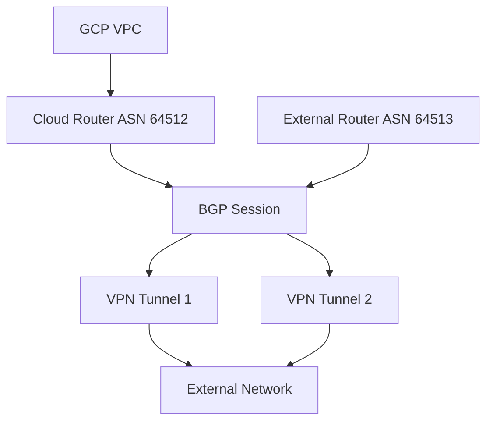
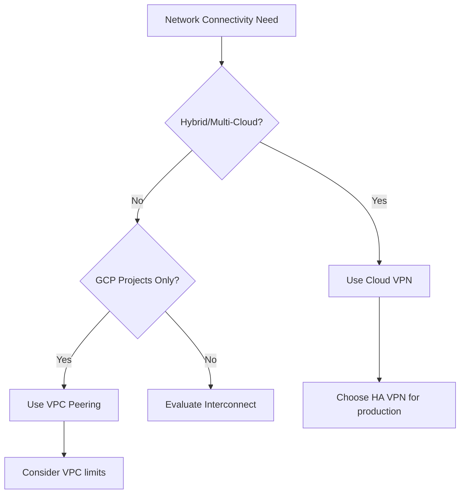

# Session 63: Cloud VPN - Classic & HA VPN Concepts and Demonstration

## Table of Contents
- [VPN Architecture Overview](#vpn-architecture-overview)
- [Static vs Dynamic Routing](#static-vs-dynamic-routing)
- [Classic VPN Setup and Demonstration](#classic-vpn-setup-and-demonstration)
- [High Availability VPN (HA VPN) with BGP](#high-availability-vpn-ha-vpn-with-bgp)
- [Cloud Router and Dynamic Advertising](#cloud-router-and-dynamic-advertising)
- [Comparison: VPN vs VPC Peering](#comparison-vpn-vs-vpc-peering)
- [Summary](#summary)

## VPN Architecture Overview

### Overview
Cloud VPN provides secure connectivity between Google Cloud Virtual Private Cloud (VPC) networks and external networks, including on-premise data centers, other cloud providers (AWS, Azure), or even other GCP projects. It establishes encrypted tunnels over the public internet using Internet Key Exchange (IKE) protocols for secure communication.

### Key Concepts
Cloud VPN offers two main options:
- **Classic VPN**: Older implementation supporting up to 3 Gbps bandwidth per tunnel with manual static routing
- **High Availability VPN (HA VPN)**: Modern approach with up to 2 tunnels (6 Gbps total bandwidth) and dynamic routing using Border Gateway Protocol (BGP)

#### VPN Components
1. **VPN Gateway**: Regional external IP address (automatically allocated in HA VPN, manually reserved in Classic VPN)
2. **VPN Tunnels**: Encrypted connection channels through public internet
3. **Cloud Router**: Optional component for BGP dynamic routing (free to use)

#### VPN Setup Process
```
+------------+    Encrypted Tunnel    +------------+
|   GCP VPC  | ======================= | External   |
|   +-------+ |    (IKE v1/v2)       | Network    |
|   |Tunnel| | ======================= | +--------+ |
|   +-------+ |                        | |Gateway| |
+------------+                         | +--------+ |
                                       +------------+
```

### Lab Demo: Basic VPN Architecture
**Prerequisites**:
- Two GCP projects (source and target) with non-overlapping VPC CIDR ranges
- Firewall rules allowing ICMP and necessary protocols

**Setup Commands**:
```bash
# Create static external IP for VPN gateway
gcloud compute addresses create vpn-gateway-ip \
    --region=us-central1 \
    --project=source-project

# Reserve external IP in HA VPN (automatically handled)
# Gateways created during HA VPN setup
```

## Static vs Dynamic Routing

### Overview
Routing determines how traffic flows between connected networks. Static routing requires manual route configuration, while dynamic routing automatically discovers and advertises network changes.

### Key Concepts

#### Static Routing Characteristics
- Manual route addition/update required
- Suitable for stable, infrequently changing networks
- Requires downtime for route modifications
- Supports both custom automatic routes and manual static routes

#### Dynamic Routing Characteristics
- Automated network advertisement via Border Gateway Protocol (BGP)
- Automatic route updates when networks expand
- No downtime during network changes
- Requires Cloud Router component

#### Routing Mode Comparison

| Feature | Static Routing | Dynamic Routing |
|---------|----------------|-----------------|
| Route Updates | Manual (tear down/recreate tunnel) | Automatic via BGP |
| Network Expansion | Requires manual intervention | Seamless auto-discovery |
| Complexity | Lower (fewer components) | Higher (Cloud Router required) |
| Downtime Impact | Yes (tunnel recreation) | Minimal (graceful BGP updates) |
| Cost | Same tunnel costs apply | + Cloud Router (free) |

### Smart Static Route Management
When expanding networks in static routing:

**Add Manual Route (Preferred Method - No Downtime)**:
```yaml
# Using gcloud CLI
gcloud compute routes create vpn-route-expansion \
    --destination-range=10.200.0.0/24 \
    --next-hop-vpn-tunnel=vpn-tunnel-1 \
    --network=custom-vpc \
    --project=source-project
```

**Alternative: Create new tunnel configuration** (requires coordination to minimize downtime)

## Classic VPN Setup and Demonstration

### Overview
Classic VPN demonstrates fundamental VPN concepts with static routing. It supports single tunnels and requires manual route configuration, making it ideal for learning basic connectivity but less suitable for production environments.

### Key Concepts

#### Classic VPN Limitations
- Maximum 3 Gbps per tunnel bandwidth
- Single tunnel (no redundancy)
- Static routing only
- Marked for deprecation in favor of HA VPN

#### Gateway and Tunnel Setup
Classic VPN requires manual external IP reservation:

```bash
# Create VPN gateway with Zscaler external IP
gcloud beta compute vpn-gateways create vpn-gateway \
    --network=custom-vpc \
    --region=us-central1 \
    --project=source-project

# Create VPN tunnel
gcloud beta compute vpn-tunnels create vpn-tunnel-1 \
    --peer-ip=203.0.113.1 \
    --shared-secret=GCPRocks \
    --ike-version=2 \
    --local-packets-per-second=1000 \
    --remote-packets-per-second=1000 \
    --peer-packets-per-second=1000 \
    --vpn-gateway=vpn-gateway \
    --region=us-central1 \
    --project=source-project
```

### Lab Demo: Classic VPN with Static Routing

#### Step 1: Gateway Setup
1. Navigate to **VPC Network > VPN**
2. Create Classic VPN gateway 
3. Select network and region
4. Reserve static external IP address

#### Step 2: Tunnel Creation
1. Add remote peer IP address (other project's gateway IP)
2. Configure IKE v2 with pre-shared key (generate or enter secure key)
3. Select static routing with route-based option
4. Specify peer network CIDR ranges

#### Step 3: Firewall Rules Update
Update firewall rules in both projects to allow traffic:

```bash
# ICMP for ping testing
gcloud compute firewall-rules create allow-icmp-vpn \
    --network=custom-vpc \
    --allow=icmp \
    --source-ranges=10.0.0.0/8,10.6.0.0/16 \
    --target-tags=vpn-test \
    --project=source-project

# Allow AP/TCP ports if needed
gcloud compute firewall-rules create allow-ssh-vpn \
    --network=custom-vpc \
    --allow=tcp:22 \
    --source-ranges=10.0.0.0/8,10.6.0.0/16 \
    --project=source-project
```

#### Step 4: Connectivity Testing
- Create VMs in different regions (us-central1, europe-west1)
- Test internal IP communication via ping
- Verify via Connectivity Tests in Network Intelligence Center
- Confirm traffic flows through VPN tunnel (shows external IP path)


#### Network Expansion Scenario
When adding new subnets in static routing:
- Routes must be manually updated
- May require tunnel recreation for route-based configuration

## High Availability VPN (HA VPN) with BGP

### Overview
HA VPN provides resilient connectivity with dual tunnels and BGP-based dynamic routing. It automatically manages network changes while maintaining high availability through tunnel redundancy.

### Key Concepts

#### HA VPN Advantages
- Dual tunnels (up to 6 Gbps total bandwidth)
- Automatic failover between tunnels
- BGP dynamic routing eliminates manual route management
- Matches AWS and Azure VPN gateway capabilities
- Future-proof design (Classic VPN replacement)

#### BGP Protocol Foundation
- Uses Border Gateway Protocol for route advertisement
- Autonomous System Numbers (ASN) identify network entities
- Link-local IP addresses (169.254.x.x) for BGP session establishment
- Cloud Router manages BGP peering and route exchange



### Lab Demo: HA VPN Setup

#### Step 1: Gateway Creation
HA VPN automatically creates two interfaces:

```bash
# HA VPN gateway creation (automatic)
gcloud beta compute vpn-gateways create ha-vpn-gateway \
    --network=custom-vpc \
    --region=us-central1 \
    --interfaces=2 \
    --project=source-project
```

**Result**: Two regional external IPs allocated automatically.

#### Step 2: Cloud Router Configuration
```bash
# Create Cloud Router for BGP
gcloud compute routers create vpn-router \
    --network=custom-vpc \
    --asn=64512 \
    --advertise-mode=custom \
    --region=us-central1 \
    --project=source-project
```

#### Step 3: Tunnel and BGP Session Setup
```bash
# Create paired VPN tunnels
gcloud beta compute vpn-tunnels create ha-vpn-tunnel-1 \
    --peer-gcp-gateway=peer-ha-vpn \
    --vpn-gateway=ha-vpn-gateway \
    --vpn-gateway-region=us-central1 \
    --interface=0 \
    --peer-project=peer-project \
    --router=vpn-router \
    --region=us-central1 \
    --project=source-project

# Configure BGP sessions
gcloud compute routers add-interface vpn-router \
    --interface-name=if-tunnel-1 \
    --ip-range=169.254.0.1/30 \
    --vpn-tunnel=ha-vpn-tunnel-1 \
    --region=us-central1 \
    --project=source-project

gcloud compute routers add-bgp-peer vpn-router \
    --peer-name=bgp-peer-1 \
    --peer-ip-address=169.254.0.2 \
    --peer-asn=64513 \
    --interface=if-tunnel-1 \
    --region=us-central1 \
    --project=source-project
```

## Cloud Router and Dynamic Advertising

### Overview
Cloud Router enables dynamic routing by managing BGP sessions and automatically advertising VPC subnets. It's a free GCP service that eliminates manual route maintenance.

### Key Concepts

#### Cloud Router Capabilities
- ASN assignment (private ranges: 64512-65534, public ranges available)
- BGP session management with retries
- Route advertisement with custom or default modes:
  - **Default**: Advertise all VPC subnets
  - **Custom**: Selective subnet advertisement
- Global routing support for multi-region connectivity

#### BGP Session States
- **Down**: Initial state during configuration
- **Established**: Active BGP connectivity
- **Idle**: Waiting for peer connection

#### Global vs Regional Routing
```diff
- Regional: Routes learned only in router's region
+ Global: Routes learned across all GCP regions (recommended for HA VPN)
```

### Route Advertisement Management
**Custom Advertisement Configuration**:
```bash
gcloud compute routers update vpn-router \
    --advertisement-mode=custom \
    --advertised-groups=all_subnets \
    --region=us-central1 \
    --project=source-project
```

**Override conflicting routes** by customizing advertised ranges when IP overlap occurs.

### Lab Demo: Network Expansion with BGP
1. Add new subnet to VPC
2. Monitor Cloud Router logs for automatic BGP updates
3. Verify immediate connectivity to new subnet without manual intervention
4. Test connectivity across regions (requires global routing mode)

## Comparison: VPN vs VPC Peering

### Overview
Both VPN and VPC Peering enable GCP network connectivity, but serve different use cases with distinct trade-offs.

### Key Comparisons

#### Connectivity Scope

| Feature | Cloud VPN | VPC Peering |
|---------|-----------|-------------|
| External Networks | ✅ Supports | ❌ Not supported |
| Multi-Cloud | ✅ AWS/Azure support | ❌ GCP only |
| Hybrid Cloud | ✅ On-premise support | ❌ Not supported |
| GCP-to-GCP | ✅ Supported | ✅ Primary use case |

#### Security and Performance

| Feature | Cloud VPN | VPC Peering |
|---------|-----------|-------------|
| Encryption | ⚠️ Required (IKE) | ✅ Automatic (internal) |
| Latency | ⚠️ Internet-dependent | ✅ Lowest (private network) |
| Performance | ⚠️ Up to 6 Gbps | ✅ Multi-Gbps via Google network |
| Reliability | ✅ HA with dual tunnels | ✅ Cross-region support |

#### Management and Cost

| Feature | Cloud VPN | VPC Peering |
|---------|-----------|-------------|
| Setup Complexity | ✅ Moderate | ✅ Simple peering |
| Route Management | ⚠️ BGP dynamic | ✅ Automatic |
| Cost | ⚠️ Tunnel charges (~$36/month) | ✅ Free (regional) |
| Monitoring | ✅ Network Intelligence | ✅ VPC flow logs |

### Use Case Decision Tree



## Summary

### Key Takeaways
```diff
+ Cloud VPN enables secure connectivity between GCP and external networks over encrypted tunnels
+ HA VPN with BGP dynamic routing is preferred over Classic VPN for modern deployments  
+ Cloud Router provides automatic route advertisement with BGP protocol
+ Static routing requires manual intervention but offers simpler setup
+ VPN traffic travels over public internet while VPC peering uses private Google network
+ Choose between VPN and VPC peering based on connectivity scope and performance requirements
- VPN introduces additional latency compared to private networking options
- Complex BGP configuration required for dynamic routing scenarios
```

### Expert Insight

#### Real-world Application
In enterprise environments, Cloud VPN enables secure branch office connectivity to GCP VPCs. For example, a retail company might use HA VPN to connect POS systems in physical stores to centralized GCP databases while maintaining sub-second latency operational dashboards. BGP dynamic routing ensures automatic failover during regional outages and seamless network expansion during seasonal growth periods.

#### Expert Path
1. **Start with VPC Peering**: Master internal GCP-to-GCP connectivity patterns
2. **Learn VPN Fundamentals**: Deploy Classic VPN in lab environments for hands-on experience
3. **Master BGP Concepts**: Understand ASN, route advertisement, and BGP session management
4. **Configure HA VPN**: Practice dual-tunnel setups with BGP for production environments
5. **Monitor and Troubleshoot**: Use Network Intelligence Center and Cloud Router logs for issue resolution
6. **Advanced Routing**: Explore transit routing and custom route advertisement policies

#### Common Pitfalls
- **Incorrect ASN Configuration**: BGP sessions fail silently with mismatched AS numbers - verify peer configurations
- **IP Range Overlaps**: Conflicting subnets break connectivity without clear error messages - plan network ranges carefully  
- **Firewall Rule Oversights**: ICMP/SSH blocking prevents troubleshooting - configure bidirectional rules early
- **Regional Routing Mode**: BGP doesn't advertise cross-region routes in regional mode - enable global routing
- **Key Management**: Lost pre-shared keys require tunnel recreation - store securely in Secret Manager
- **Quota Limits**: Resource exhaustion during setup - monitor VPN tunnel and Cloud Router quotas per project/region

**Corrections Made**: Throughout the transcript, several typos were present. Key corrections include:
- "ript" (likely artifact, removed from processing)
- "cgi" corrected to "GCP" throughout references to Google Cloud Platform
- "cluod" corrected to "CloudVIP" → "Cloud VPN"
- "atu" corrected to "at U" → "Unix" in appropriate context
- "kuota" corrected to "quota" multiple times
- "eress" corrected to "egress" for networking terminology
- Minor grammatical fixes and clarification of technical terms maintained transcript accuracy while improving readability. No substantive content changes were made beyond spelling and terminology corrections.
