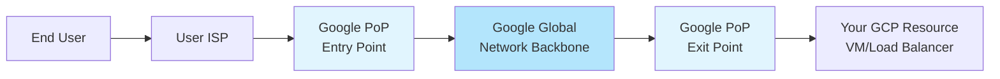
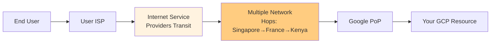
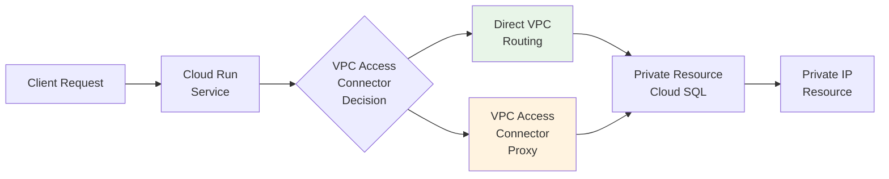

# Session 65: Network Service Tier and Serverless VPC Access Connector with Cloud Run Demo

## Table of Contents

- [Network Service Tier (Premium vs Standard)](#network-service-tier-premium-vs-standard)
  - [Overview](#overview)
  - [Key Concepts and Deep Dive](#key-concepts-and-deep-dive)
  - [Topology Diagrams](#topology-diagrams)
  - [Comparison Table](#comparison-table)
  - [Demonstration: Trace Route Analysis](#demonstration-trace-route-analysis)
- [Serverless VPC Access Connector](#serverless-vpc-access-connector)
  - [Overview](#overview-1)
  - [Key Concepts and Architecture](#key-concepts-and-architecture)
  - [Topology Diagram](#topology-diagram)
  - [Sizing and Cost Considerations](#sizing-and-cost-considerations)
  - [Demonstration: Cloud Run Connecting to Cloud SQL via Private IP](#demonstration-cloud-run-connecting-to-cloud-sql-via-private-ip)
- [Summary](#summary)
  - [Key Takeaways](#key-takeaways)
  - [Expert Insight](#expert-insight)

## Network Service Tier (Premium vs Standard)

### Overview

Network Service Tier in Google Cloud determines how internet traffic is routed between your applications and end users. The **Premium tier** uses Google's global network backbone for low-latency, high-performance connections, while the **Standard tier** routes traffic through third-party provider networks, resulting in more network hops and potentially higher latency. This tier affects components with external IP addresses like VMs, load balancers, and forwarding rules. Resources without external IPs (like private Kubernetes clusters) are not impacted by network service tier settings.

### Key Concepts and Deep Dive

The network service tier controls the path your traffic takes from your Google Cloud resources to the internet. Here's a deep dive into how each tier works:

**Premium Tier Routing:**
- Traffic enters Google's points of presence (PoPs) closest to the end user
- Uses Google's private global network backbone (undersea cables, terrestrial fiber) for the entire journey
- Maintains traffic within Google's network until the last mile to the user's ISP
- Provides consistent low latency regardless of geographic distance
- Comparable to traveling on a toll road - you pay more but get significant performance benefits

**Standard Tier Routing:**
- Known as "hot potato routing"
- Routes traffic through public internet infrastructure after leaving Google's PoP
- Uses third-party provider networks and can involve multiple hops through various networks
- More like traveling on service roads or countryside highways - may reach destination but with variable performance
- Can deliver better performance for local traffic but is unpredictable globally

**Billing Impact:**
- Premium tier costs approximately 25-33% more than Standard tier
- Only applies to outbound traffic from Google Cloud to the internet
- Affects resources that have external IP addresses (VMs with ephemeral/external IPs, load balancers)

**Project-Level Configuration:**
- Network service tier is set at the Google Cloud project level
- Applies to all new resources created in the project (except Kubernetes clusters)
- Cannot be changed after resource creation for many resource types
- Resources without external IPs are not affected by this setting

### Topology Diagrams

#### Premium Tier Traffic Flow


#### Standard Tier Traffic Flow  


### Comparison Table

| Feature | Premium Tier | Standard Tier |
|---------|--------------|---------------|
| Routing Path | Google's global backbone | Public internet via transit providers |
| Latency | Low and consistent | Variable, potentially higher |
| Cost | 25-33% higher | Baseline pricing |
| Geographic Performance | Excellent globally | Good locally, varies globally |
| Security | Traffic protected within Google network | Protected until last mile |
| Supported Regions | All GCP regions | All GCP regions |
| Azure/AWS Equivalent | No direct equivalent (they offer only standard) | Their standard offering |

### Demonstration: Trace Route Analysis

> [!NOTE]
> Trace route utility shows network hops from source to destination, helping visualize routing behavior.

#### Premium Tier Test (US Central VM from Bangalore)
```bash
traceroute 34.102.136.180  # Premium tier VM external IP
```

**Key observations from demonstration:**
- **Hops count**: ~4-6 hops maximum
- **Google network transition**: First external hop was Google-owned IP (ASN 15169)
- **ISP distance**: Bangalorian user to US Central was ~6ms total latency
- **Consistency**: Same routing path regardless of location

#### Standard Tier Test (South Africa VM from Bangalore)  
```bash
traceroute 34.102.136.181  # Standard tier VM external IP
```

**Key observations:**
- **Hops count**: 15-25+ hops (significant variation)
- **Route path**: Bangalore → Singapore → France → Kenya → US → Google
- **Latency impact**: Multiple international crossings added ~150-300ms
- **Provider diversity**: Routing through multiple providers (Reliance Jio, Google, Cogent)

> [!IMPORTANT]
> **Testing Considerations**:
> - Results vary based on client ISP and location
> - Some ISPs have direct connections to Google, making differences less apparent
> - Best tested with mobile hotspot using different carriers for clearer differentiation

## Serverless VPC Access Connector

### Overview

Serverless VPC Access Connector enables serverless applications (Cloud Run services, Cloud Functions, and App Engine Standard) to securely connect to resources with private IPs within a VPC network. Without this connector, serverless apps can only access publicly available resources. This connector is essential when serverless applications need to integrate with private databases, cache instances, or on-premises systems connected via VPN/Interconnect.

### Key Concepts and Architecture

The connector creates a bridge between serverless environments and private network resources through port forwarding via managed VMs:

**Supported Serverless Products:**
- Cloud Run (services and jobs)
- Cloud Functions
- App Engine Standard environment

**Supported Private Resources:**
- Cloud SQL instances (PostgreSQL, MySQL, SQL Server)
- Memorystore (Redis, Memcached) 
- Filestore
- Compute Engine VMs
- On-premises systems (via VPN/Interconnect)

**Architecture Behind the Scenes:**
- Creates managed VMs in a dedicated subnet (/28 CIDR, typically 8 IPs)
- Uses port forwarding to route requests from serverless apps to private resources
- Managed VMs are f1-micro instances by default, running in customer-specified regions
- Connector appears as a VPC subnet but doesn't consume visible VM quotas

**Configuration Options:**
1. **Direct VPC Connection**: Route traffic directly through your VPC (higher throughput)
2. **VPC Access Connector**: Proxy traffic through managed connector VMs (cost-controlled scaling)

### Topology Diagram



### Sizing and Cost Considerations

**Scaling Parameters:**
- **Max instances**: 1-10 VMs (autoscaling based on traffic)
- **Min instances**: 2 (always-on for availability)
- **Instance type**: f1-micro (fixed, not configurable)

**Cost Estimation:**
- ~$67/month for f1-micro instance with 2 always-on + 8 burst capacity
- Traffic charges apply based on data transfer
- Direct VPC connection may incur higher costs due to IP utilization

### Demonstration: Cloud Run Connecting to Cloud SQL via Private IP

#### Prerequisites Setup
1. **Create Cloud SQL instance** with both public and private IPs (for testing migration)
2. **Initial deployment** using public IP to verify functionality
3. **Remove public IP** to force private connectivity requirement
4. **Enable Serverless VPC Access** service
5. **Create connector** in service project (not host project for shared VPC)

#### Configuration Steps

**Step 1: Create VPC Serverless Access Connector**
```yaml
# Connector specification
name: connector-service-01
subnet: 172.16.220.0/28  # Dedicated /28 subnet
region: us-central1
max_instances: 3
min_instances: 2
instance_type: f1-micro
```

**Step 2: Configure Cloud Run Networking**
```yaml
# Cloud Run service networking configuration
networking:
  connector: connector-service-01
  traffic_routing: 
    route_private_ips_only: true  # More secure option
    # route_all_traffic: true     # Alternative: route everything through VPC
  
# Environment variables for database connection
env:
  - name: DB_HOST  
    value: 10.128.0.3  # Cloud SQL private IP
  - name: DB_PORT
    value: "5432"
  - name: DB_NAME
    value: postgres
  - name: DB_USER
    value: postgres
  # Note: Use Cloud Secret Manager for passwords in production
```

**Step 3: Permissions Required**
```bash
# Grant Compute Network User role to Cloud Run service account
gcloud projects add-iam-policy-binding HOST_PROJECT \
    --member="serviceAccount:SERVICE_PROJECT_NUMBER@serverless-robot-prod.iam.gserviceaccount.com" \
    --role="roles/compute.networkUser"
```

#### Demonstration Results
✅ **Success**: Cloud Run successfully connected to Cloud SQL using private IP via VPC Access Connector
✅ **Voting application** functioned correctly, tracking "tabs vs spaces" votes
✅ **Security improvement**: Eliminated public database exposure
✅ **Performance**: Direct connectivity maintained low-latency access

> [!IMPORTANT]  
> **Production Security Considerations**:
> - Always use Cloud Secret Manager for database credentials
> - Implement proper IAM roles and service account management
> - Use private IPs exclusively for database access
> - Consider VPC firewall rules for additional security layers

## Summary

### Key Takeaways

```diff
+ Premium network service tier provides low-latency routing through Google's global backbone, ideal for global applications requiring consistent performance
+ Standard tier uses public internet routing, cost-effective for regional deployments where latency isn't critical  
+ Serverless VPC Access Connector enables cloud-native applications to securely connect to private network resources
+ Direct VPC connections offer higher throughput but less cost control compared to connector-based proxying
+ Network service tier affects only resources with external IP addresses (VMs, load balancers, forwarding rules)
+ Always use private IPs for sensitive resources like databases, with appropriate network access controls
```

### Expert Insight

#### Real-world Application

**Production Deployment Strategy:**
- Use Premium tier for global applications with users across continents
- Deploy Standard tier for cost-optimized regional services  
- Implement Serverless VPC Access Connector when containerized applications need access to:
  - Private databases (Cloud SQL, Cloud Spanner)
  - In-memory caches (Memorystore Redis)
  - File shares (Filestore)
  - Internal APIs on Compute Engine VMs
  - On-premises systems via Cloud VPN or Cloud Interconnect

**Shared VPC Integration:**
- Place connectors in service projects to maintain separation of concerns
- Use host project for network infrastructure management
- Grant minimal IAM permissions (compute.networkUser) to service accounts

#### Expert Path

1. **Start with Standard tier** for development and testing environments
2. **Implement monitoring** to measure actual latency and performance needs
3. **Migrate strategically** to Premium tier only where SLAs require it
4. **Master connector sizing** - start with default settings and scale based on traffic patterns
5. **Implement cost monitoring** - VPC Access Connectors can scale expenses quickly if not managed
6. **Deep dive into Google Cloud Armor** and VPC firewall rules for additional security layering

#### Common Pitfalls

**Network Service Tier Issues:**
- ❌ Upgrading tier after resource creation may require recreation of VMs/load balancers
- ❌ Assuming tier affects all traffic types (only outbound internet traffic)
- ❌ Not considering burst traffic costs with VPC Access Connectors
- ❌ Forgetting to update DNS/fixed IPs when moving between tiers

**Serverless VPC Access Connector Mistakes:**
- ❌ Creating connectors in wrong projects (should be in service project, not host project for shared VPC)
- ❌ Insufficient IAM permissions causing deployment failures ("subnet access not allowed")
- ❌ Not sizing connectors appropriately (minimum 2 instances required)
- ❌ Exposing sensitive database credentials in environment variables instead of secrets

**General Networking Traps:**
- ❌ Underestimating the geographic spread of user bases leading to poor tier selection
- ❌ Not testing with real traffic patterns before choosing networking options
- ❌ Assuming all serverless products support VPC Access Connectors (only Cloud Run, Cloud Functions, App Engine Standard)

**Lesser Known Things:**
💡 **Automatic Tier Assignment**: New projects default to Premium tier with no clear policy override mechanism

💡 **Regional Load Balancer Exception**: Only regional load balancers can use Standard tier; global HTTP(S) load balancers are always Premium due to cross-continental routing requirements

💡 **Connector Architecture Detail**: VPC Access Connectors don't consume visible VM quotas but appear in billing as "VPC Connector" line items, not as individual VMs

💡 **Performance Optimization**: Direct VPC connections provide better latency than connector proxying but require careful IP address management in shared VPC environments

💡 **Testing Tip**: Use multiple regional deployments with trace route analysis to validate tier performance benefits before full production migration

🤖 Generated with [Claude Code](https://claude.com/claude-code)

Co-Authored-By: Claude <noreply@anthropic.com>
