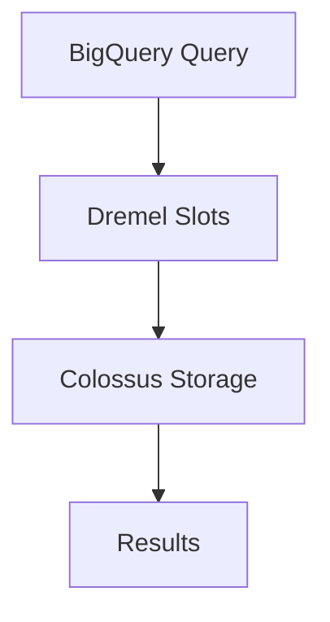

# Session 70: BigQuery Datawarehouse Concepts, Public Dataset, Load Various File Format

## Table of Contents
- [Big Data Overview and Evolution](#big-data-overview-and-evolution)
- [Introduction to BigQuery](#introduction-to-bigquery)
- [BigQuery Architecture](#bigquery-architecture)
- [Exploring Public Datasets](#exploring-public-datasets)
- [Demo: Querying Public Dataset](#demo-querying-public-dataset)
- [Loading Data into BigQuery](#loading-data-into-bigquery)
- [Handling Load Errors](#handling-load-errors)
- [Loading Various File Formats](#loading-various-file-formats)
- [Loading Data from Google Cloud Storage](#loading-data-from-google-cloud-storage)
- [External Tables Concept](#external-tables-concept)
- [Partitioning and Clustering Concepts](#partitioning-and-clustering-concepts)
- [Summary](#summary)

## Big Data Overview and Evolution

### Overview
This section introduces the fundamentals of big data, its characteristics, and historical evolution, setting the stage for understanding data warehousing in cloud environments like Google Cloud.

### Key Concepts and Deep Dive
Big data refers to datasets that are too large and complex to process using traditional database techniques. The three key characteristics, often referred to as the "3Vs," are:

- **Volume**: Data size in terabytes, petabytes, or exabytes. Suitable for handling massive amounts of data, unlike traditional databases that struggle beyond gigabytes.
- **Velocity**: High-speed data ingestion and processing, such as from social media, IoT devices, or streaming sources.
- **Variety**: Diverse data formats including structured (CSV, relational), semi-structured (JSON), and unstructured (videos, logs).

Big data emerged in the mid-2000s with technologies like Hadoop, Apache's MapReduce framework, enabling distributed computing on commodity hardware. Google's white paper on MapReduce inspired frameworks for processing large datasets by dividing tasks (divide, shuffle, combine).

Google Cloud's BigQuery addresses big data challenges by:
- Migrating from on-premise Hadoop/Dataproc setups.
- Handling variety via support for multiple formats (CSV, JSON, Avro, Parquet, ORC).
- Providing serverless scalability for queries.

| Dwelling Term | Description |
|---------------|-------------|
| ETL/ELT | Extract, Transform, Load / Extract, Load, Transform processes for data ingestion. |
| OLTP | Online Transaction Processing focuses on transactions (insert, update, delete). |
| OLAP | Online Analytical Processing focuses on analytics (queries, aggregations). |

Traditional data warehouses like Teradata or Vertica use schemaless or relational models but can have high performance bottlenecks. BigQuery excels due to its serverless architecture, built-in ML, and decoupled storage/compute.

### Code/Config Blocks
Big data processing often involves frameworks like Hadoop. Basic MapReduce structure:

```bash
# Example Hadoop command (not runnable in BigQuery)
hadoop jar mapreduce.jar input output
```

### Lab Demos
No specific labs in this transcript, but practical understanding from examples includes understanding MapReduce flow diagrams.

## Introduction to BigQuery

### Overview
BigQuery is Google's fully managed, petabyte-scale data warehouse for analytics and machine learning, serving as a modern replacement for traditional warehouses.

### Key Concepts and Deep Dive
BigQuery differentiates from databases by handling analytical workloads versus transactional ones. Key features:

- **serverless**: No infrastructure management; automatic scaling.
- **Cost-effective**: Charges based on bytes processed per query.
- **Machine Learning Integration**: Native BigQuery ML for predictions on stored data without data movement.
- **Real-time Analytics**: Queries on streaming data via Pub/Sub integration.

It supports:
- Federated queries across sources (Bigtable, Cloud Storage).
- Multi-cloud querying (AWS S3, Azure Blob via BigQuery Omni).

Traditional databases store transactional data (e.g., bank balance updates) in OLTP systems. BigQuery acts as OLAP, offloading historical data for analytics like spending patterns.

Example flow (banking scenario):
- Transactions in Cloud SQL/Alley DB.
- Historical data in BigQuery for reports.

BigQuery storage is columnar for efficient selective queries, unlike row-based databases.

Partitioning and clustering optimize performance, reducing scanned bytes.

> [!NOTE]
> BigQuery provides 1 TB free query processing monthly.

### Tables
| BigQuery Feature | Traditional Warehouse (e.g., Redshift) | BigQuery Advantage |
|------------------|--------------------------------------|---------------------|
| Scaling | Manual | Automatic serverless |
| ML capability | Limited | Built-in BigQuery ML |
| Cost | High infrastructure | Pay-per-query |
| Federated Query | Rare | Native support |

### Code/Config Blocks
Basic BigQuery SQL query structure:

```sql
SELECT column1, column2
FROM `dataset.table`
WHERE condition;
```

### Lab Demos
- Query a sample public dataset (detailed in later demos).
- Use BigQuery Studio for drag-and-drop query building.

## BigQuery Architecture

### Overview
BigQuery's architecture decouples storage and compute for scalability, with storage in Colossus (GCS-like) and compute in Dremel slots (F1-micro equivalents).

### Key Concepts and Deep Dive
- **Storage (Colossus)**: Distributed, replicated storage resembling Cloud Storage but optimized for analytics.
- **Compute (Dremel)**: Managed as "slots," each equivalent to ~1 vCPU and 614 MB RAM. Scales dynamically.

Network uses a petabit network for low-latency communication.

BigQuery supports:
- Native tables (data copied into BigQuery).
- External tables (query data in Cloud Storage without copy).

Federated queries execute across sources like Bigtable or GCS.

Omni extends to AWS/Azure storage.

| Component | Description |
|-----------|-------------|
| Colossus | Storage layer for data persistence. |
| Dremel | Query execution engine. |
| Distributed Shuffle | Transient memory for intermediates. |

### Code/Config Blocks
No direct config, but job history via CLI:

```bash
bq ls project:dataset
```

### Lab Demos
Visual diagramming of architecture flow:



## Exploring Public Datasets

### Overview
Google provides free public datasets for demos and proofs-of-concept, charging only for queries.

### Key Concepts and Deep Dive
Public datasets include healthcare, blockchain, books, etc. Ideal for demonstrations without security risks.

- Storage is free; queries consume from monthly quota.
- Preview data first to understand schema/theories (free).
- Typology Types Incorrect queries; use schema inspection.
- Job history shows bytes processed and costs.

Quick Tips:
- Avoid `SELECT *` for full table scans.
- Use previews to understand structure.
- Calculate query cost: ~$6.25 per TB beyond free quota.

### Tables
| Term | Definition |
|------|------------|
| Public Data set | Shared Google-hosted datasets for queries |
| Dry Run | Predicated bytes reduction Before execution. |
| Logical fisical Bytes | Storage pricing modes; logical for analysis, physical for compressible. |

### Code/Config Blocks
Query public dataset:

```sql
SELECT *
FROM `bigquery-public-data.dataset.table`
LIMIT 10;
```

### Lab Demos
Navigate to BigQuery Console > Add Data > Public Datasets > Explore.

## Demo: Querying Public Dataset

### Overview
Demonstrate querying NYC bike sharing data, optimizing for cost.

### Key Concepts and Deep Dive
- Preview data to avoid unnecessary loads.
- Queries scan only selected columns.
- Gemini assists in writing queries without SQL knowledge.

| File Feature | Impact |
|-----------------------------|--------|
| Column Selection | Reduces bytes processed (e.g., 350 KB to 84 KB) |
| Cached Results | Free for 24 hours if unchanged |

> [!IMPORTANT]
> Minimize bytes processed for cost efficiency.

### Code/Config Blocks
Optimized query with column selection:

```sql
SELECT station_id, name, capacity
FROM `dataset.table`;
```

Gemini prompt: "Generate SQL to count bikes with name starting with 'A' in department 1."

### Lab Demos
1. Navigate to NYC Citibike dataset.
2. Use BigQuery Studio to generate/query (e.g., "SELECT COUNT(*) WHERE name LIKE 'A%'").
3. Observe bytes processed (start ~350 KB, optimized ~84 KB).

## Loading Data into BigQuery

### Overview
Load data from local or GCS, understanding job types (load vs. query).

### Key Concepts and Deep Dive
- Load operations are free; queries cost based on bytes processed.
- Use native tables for full BigQuery integration.
- Jobs include: LOAD (free), QUERY (charged).

Schema auto-detection simplifies setup.

Prerequisites:
- Dataset must be in the same region as GCS bucket.

### Code/Config Blocks
Load CSV via UI or CLI:

```bash
bq load dataset.table file.csv.csv schema_definitions...
```

### Lab Demos
1. Create dataset (e.g., Mumbai region).
2. Upload employee CSV (columns: name, department, start_date).
3. Select auto-detect; preview loaded data.

## Handling Load Errors

### Overview
Handle errors like date format mismatches with bad record limits.

### Key Concepts and Deep Dive
- `max_bad_records` allows ignoring faulty rows (default 0; all-or-nothing).
- Errors logged; valid rows inserted.
- Robust for bulk loads from uncertain sources.

> [!TIP]
> Set `max_bad_records` > 0 for resilient loading.

### Code/Config Blocks
BQ load with error handling:

```bash
bq load --max_bad_records=10 dataset.table buggy_file.csv ...
```

### Lab Demos
1. Load erroneous CSV (e.g., invalid date format).
2. Set `max_bad_records=10`; observe failures ignored.
3. Query to verify successful inserts.

## Loading Various File Formats

### Overview
BigQuery supports CSV, JSON (newline-delimited), Avro, Parquet, ORC for optimal loading.

### Key Concepts and Deep Dive
- Formats rank by load speed: Avro/Parquet > CSV > JSON.
- Avro/Parquet/ORC are columnar/binary; embed schema.
- JSON newlinedelimited (NDJSON) preferred over standard JSON.

| Format | Best For | Schema Handling |
|--------|----------|-----------------|
| CSV | Human readable | Auto or manual detect |
| NDJSON | Structured text | Auto-detect |
| Avro | Native tables | Embedded |
| Parquet/ORC | External tables, columnar | Embedded |

### Code/Config Blocks
Load Parquet:

```bash
bq load dataset.table file.parquet
```

### Lab Demos
1. Load CSV, NDJSON, Avro, Parquet, ORC files.
2. Compare load times/schemas (Avro/Parquet fastest with embedded schemas).

## Loading Data from Google Cloud Storage

### Overview
Stage data in GCS, then load into BigQuery for large files.

### Key Concepts and Deep Dive
- Use gsutil for uploads (parallel for large files).
- Native tables copy data; incur dual storage costs.
- External tables reference data in GCS (query-only).

> [!WARNING]
> Clean GCS after native loads to avoid double costs.

### Code/Config Blocks
Upload to GCS:

```bash
gsutil cp file.csv gs://bucket/
```

Load from GCS:

```bash
bq load --source_format=CSV dataset.table gs://bucket/file.csv
```

### Lab Demos
1. Create GCS bucket (Mumbai region).
2. Upload Avro/Parquet files.
3. Load as native/external tables; compare storage costs.

## External Tables Concept

### Overview
External tables query data in GCS without copying, reducing redundancy.

### Key Concepts and Deep Dive
- No storage cost in BigQuery; data remains in GCS.
- No preview option; query-only.
- Optimal for Parquet/ORC (columnar) over Avro.

| Type | Data Copy | Preview Available | Storage Cost |
|------|-----------|-------------------|--------------|
| Native Table | Yes | Yes | Yes |
| External Table | No | No | No (GCS only) |

Wildcards support multiple files.

### Code/Config Blocks
Create external table:

```sql
CREATE EXTERNAL TABLE dataset.external_table
OPTIONS (
  uris = ['gs://bucket/file.parquet'],
  format = 'PARQUET'
);
```

### Lab Demos
1. Create external tables for Avro/Parquet.
2. Query; compare bytes processed (Parquet lower due to columnar).
3. Use wildcards for incremental loads.

## Partitioning and Clustering Concepts

### Overview
Partitioning and clustering optimize queries, reducing bytes scanned for efficiency and cost savings.

### Key Concepts and Deep Dive
- **Partitioning**: Divides tables by column (e.g., date).
- **Clustering**: Groups similar rows for hot/cold storage.
- Design proactively; avoid reactive implementations.
- Enables pruning for faster filtering.

Common Pitfalls:
- Forgetting partitioning at table creation.
- Over-partitioning leading to overhead.

### Code/Config Blocks
Create partitioned table:

```sql
CREATE TABLE dataset.table
PARTITION BY DATE(timestamp_column)
OPTIONS (
  partition_expiration_days = 90
);
```

### Lab Demos
Conceptual examples; create schemas with partitioning in mind.

## Summary

### Key Takeaways

```diff
+ BigQuery is a serverless data warehouse for analytics and ML, handling massive datasets efficiently.
+ Optimize queries by selecting columns, avoiding SELECT *, and using partitioning/clustering.
- Avoid full table scans; leverage public datasets for demos without data sharing risks.
! Free activities: Loads, previews, metadata queries; charged: Queries based on bytes processed.
```

### Expert Insight

**Real-world Application**: In a banking scenario, use BigQuery for historical transaction analytics to detect patterns like fraud or optimize investments. Integrate BigQuery ML for predictive models on customer behavior.

**Expert Path**: Master BigQuery ML for embeddings and predictions; combine with Vertex AI for advanced AI workflows. Understand cost optimization via dry runs and monitoring in BigQuery's job history. Pursue GCP Professional Cloud Architect certification, focusing on Big Data migration strategies.

**Common Pitfalls**: Forgetting multi-region restrictions for GCS-BigQuery integration; not setting max_bad_records for error-prone loads; reactive partitioning instead of proactive design. Storage double-charging with native loads and GCS; using row-based formats for external tables. Lesser-known aspect: BigQuery Omni for multicloud querying without data migration. Issues and resolutions: Slow queries—partition/clustering; high costs—predict bytes via dry run; schema errors—use auto-detect or validate NDJSON. Avoid Pod restarting loops by setting appropriate resource limits in deployment yamls—inops, monitor with kubectl-top and adjust limites/request.
