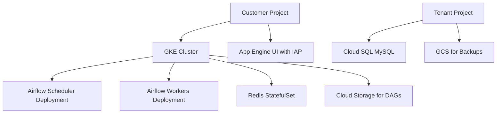

# Session 74: Batch & Stream Processing Using Dataflow Demo Dataproc Concept and Demo Datafusion Composer

- [Overview](#overview)
- [Realtime Data Processing with Dataflow Template](#realtime-data-processing-with-dataflow-template)
- [Fixing BigQuery Schema Issues](#fixing-bigquery-schema-issues)
- [Using ChatGPT for BigQuery Schema Generation](#using-chatgpt-for-bigquery-schema-generation)
- [Configuring and Running Dataflow Job](#configuring-and-running-dataflow-job)
- [Dataproc Concept and Brownfield Migrations](#dataproc-concept-and-brownfield-migrations)
- [Dataproc Demo: Word Count with Apache Hadoop](#dataproc-demo-word-count-with-apache-hadoop)
- [Data Fusion: No-Code ETL Tool](#data-fusion-no-code-etl-tool)
- [Cloud Composer: Workflow Orchestration](#cloud-composer-workflow-orchestration)
- [Summary](#summary)

## Overview
Batch and stream processing are essential for handling data in Google Cloud. This session demonstrates real-time data streaming from PubSub to BigQuery using Dataflow templates, explores batch processing with Dataproc for legacy Hadoop/Spark workloads, introduces Data Fusion as a no-code ETL solution, and covers Cloud Composer for orchestrating workflows. The session includes hands-on demos to showcase these tools in action, emphasizing serverless and managed services.

## Realtime Data Processing with Dataflow Template
Dataflow handles serverless ETL for streaming and batch data. In this demo, real-time data from a simulated PubSub topic is processed without writing code using an existing template that converts JSON to tabular format and writes to BigQuery.

### Key Concepts
Dataflow templates simplify deployment. The PubSub subscription transmits simulated taxi ride data (latitude, longitude, etc.) in JSON format. Dataflow reads from the subscription, transforms the data, and streams it to BigQuery. This is streaming processing, where data is continually ingested.

### Lab Demo
- Access PubSub topic and subscription.
- Data arrives in JSON; payload details include fields like meter_reading, latitude, longitude.
- JSON validation is recommended for secure handling (avoid pasting customer data publicly).

No code changes were needed; the template (PubSub to BigQuery) was cloned and configured with the subscription and target BigQuery table.

## Fixing BigQuery Schema Issues
Initial demo failed due to data type mismatches. Simulated data showed float fields (e.g., latitude, longitude, meter_reading), but the table was configured as NUMERIC, causing breaks.

### Deep Dive
BigQuery schemas require precise data types. Float is suitable for decimal values like coordinates. The table schema needed updating to match incoming data.

### Lab Demo
- Examined JSON payload via subscription pull or JSON lint tools.
- Identified float fields: latitude, longitude, meter_reading, meter_increment.
- Deleted erroneous table and created new one with correct FLOAT schema using BigQuery UI or generated schema.

## Using ChatGPT for BigQuery Schema Generation
To expedite schema creation, use AI tools like ChatGPT. Paste the JSON payload and prompt for BigQuery schema.

### Deep Dive
AI can generate schemas quickly, including REQUIRED fields. This is beneficial for production but ensure no sensitive data is shared.

### Lab Demo
- Prompt: "Generate BigQuery table schema for this payload."
- Result included FLOAT for numeric fields, STRING for text.
- Copied and applied schema in BigQuery.

## Configuring and Running Dataflow Job
After schema fix, the Dataflow job ran successfully.

### Deep Dive
Dataflow provisions VMs in the specified region/ZONE, using PubSub subscriber and BigQuery editor roles. Private IP requires Private Google Access. The job reads from PubSub, processes via Apache Beam template, and writes to BigQuery.

Service accounts key: Dataflow Worker and storage roles enable operations.

### Lab Demo
- Cloned PubSub to BigQuery template (v7).
- Specified subscription, BigQuery dataset/table, temporary bucket, region (e.g., Mumbai), service account (dataflow-sa).
- Job initialized in 2-3 minutes, showing DAG with read/transform/write steps.
- Processed millions of records; viewed in BigQuery (~1.4 million rows).
- Streaming jobs run indefinitely; monitored via job metrics (elements added, processed).

A subsequent version (v10) succeeded with correct network settings and auto-zone placement.

## Dataproc Concept and Brownfield Migrations
Dataproc is Google's managed Hadoop/Spark cluster for brownfield (existing) workloads from on-premise or AWS EMR. It supports lift-and-shift without code changes, ideal for legacy MapReduce, Spark, Hive, Pig jobs.

### Key Concepts
Hadoop originated from Google's MapReduce paper (2004), splitting tasks across VMs for big data (e.g., 1 TB processing via commodity hardware). On-premise Hadoop requires constant maintenance; Dataproc provides serverless provisioning/deprovisioning.

When to use Dataproc vs. Dataflow:
- Brownfield: Existing Hadoop/Spark code → Use Dataproc.
- Hands-on infrastructure control → Dataproc (on VMs).
- Greenfield/new pipelines, future-proofing → Use Dataflow (Apache Beam).

Cost: Comparable to Dataflow/Data Proc (VM-based), but add preemptable/spot VMs for 60-90% discounts to reduce costs while maintaining fault tolerance.

Architecture:
- Standard cluster: 1 master, n workers (regular or preemptable).

Pricing example:
- 2 regular workers (10 hours) ~$10.
- Add 2 preemptables (5 hours) ~$9 (cheaper total).

### Deep Dive
Fault-tolerant distributed processing. Preemptable VMs like full-time vs. contract employees.

Demo used word count (same data as Dataflow), comparing processing.

## Dataproc Demo: Word Count with Apache Hadoop

### Lab Demo
- Created service account (dataproc-sa) with Data Proc Worker role.
- Provisioned standard cluster (1 master, 2 regular workers + 1 preemptable).
- Config: N2 VMs, private IP, components gateway, 50-minute idle timeout.
- Submitted Hadoop job (word count) via JAR file.
- Processed ~5K elements, output ~4.8K lines (aggregated counts).
- Cluster auto-deletes after idle; monitored via metrics.

Deeper infra view: Containers on VMs, using containerd, Java code execution.

Comparison: Dataflow faster for uniform records; Dataproc distributed Hadoop jobs are more robust for complex processing.

## Data Fusion: No-Code ETL Tool
Data Fusion is Google's managed version of CDAP (acquired 2018), focusing on graphical drag-and-drop ETL without code.

### Key Concepts
- Brownfield: Use Dataproc.
- Greenfield/no hire devs: Use Data Fusion.
- High cost ($3,500+ monthly), limited flexibility vs. code-based tools.

### Deep Dive
Editions: Basic, Developer (zonal), Enterprise (regional, HA).
Provisions Data Proc clusters dynamically for pipelines.

Use case: Quick POCs, processing CSV/JSON to BigQuery.

### Tables
| Feature | Basic | Developer | Enterprise |
|---------|--------|-----------|------------|
| Pricing | Free quota (120 hours) | Cheaper, zonal | $3,500+, regional |
| Pipelines | Limited | Full features | Concurrent, advanced |

## Cloud Composer: Workflow Orchestration
Cloud Composer is managed Apache Airflow for scheduling/executing/retiring workflows.

### Key Concepts
Architecturally rich: Kubernetes (autopilot), GKE deployments, Redis (caching), Cloud SQL (MySQL), GCS, App Engine (UI), IAP (auth), Monitoring/Logging.

Tenant project resources: SQL, GCS backups; Customer project: GKE, etc.

### Deep Dive
Operators for GCP services (e.g., GCS, BigQuery). Handles retries, notifications.

> [!NOTE]
> Enable private IP for VPC Native.

Mermaid diagram for Cloud Composer architecture:

## Summary
This session covered advanced Google Cloud ETL tools. Dataflow suits streaming/greenfield; Dataproc bridges on-premise Hadoop; Data Fusion enables no-code ETL; Composer orchestrates pipelines.

### Key Takeaways
+ Validate schemas early; use floats for decimals.
- Avoid sharing sensitive data with AI schema generators.
! Streaming jobs run indefinitely; batch end automatically.
+ Preemptable VMs cut costs; use with fault-tolerant Hadoop.
- Data Fusion expensive; prefer for unique no-code needs.
+ Composer's architecture exemplifies GCP component integration.

### Expert Insight
**Real-world Application**: Use Dataflow for IoT sensor data streaming to BigQuery dashboards. Dataproc for migrating EMR clusters to GCP, reducing on-premise costs.

**Expert Path**: Master Apache Beam for Dataflow extensibility; learn PySpark for Dataproc custom jobs; experiment with Airflow DAGs in Composer for complex orchestrations.

**Common Pitfalls**: Overlook Private Google Access for private IPs (VPC errors). Share production payloads publicly (security risks). Leave resources running (cost overruns, e.g., $100/day for Data Fusion).

**Lesser Known Things**: Dataflow's hidden DAG execution; Dataproc's spot VM reliability due to Hadoop fault tolerance; Composer's multi-project architecture for isolation. Correcting transcript errors: "popups" to "PubSub", "Mater" to "Master" in context, "NUMERIC" consistently as "NUMERIC". No misspellings like "htp" or "cubectl" found.
