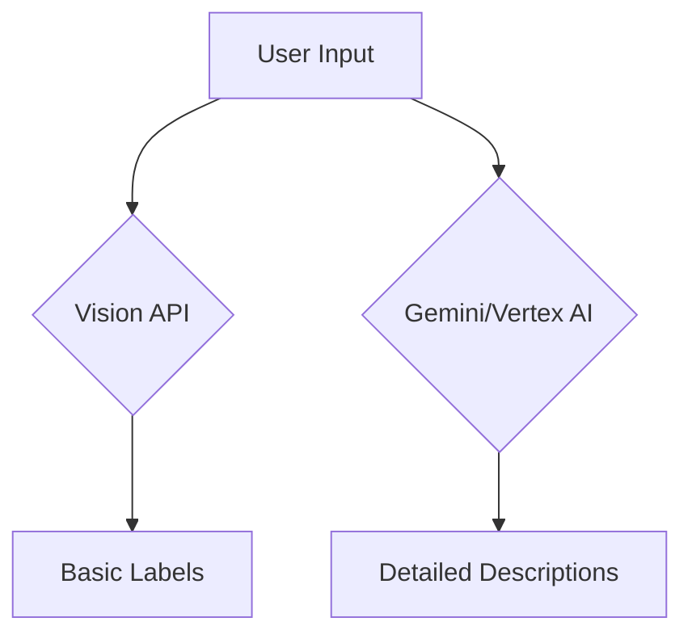
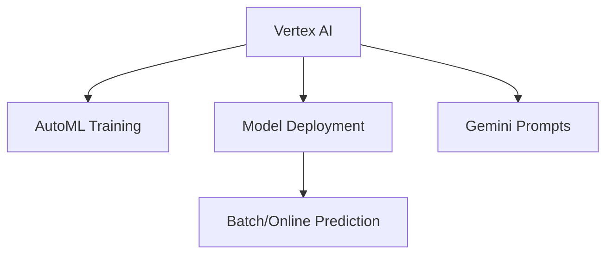

# Session 76: Artificial Intelligence Concepts

## Table of Contents
- [Artificial Intelligence Overview](#artificial-intelligence-overview)
- [Democratization of AI](#democratization-of-AI)
- [Predefined ML APIs](#predefined-ml-apis)
- [AutoML](#automl)
- [BigQuery ML](#bigquery-ml)
- [Vertex AI](#vertex-ai)
- [Deep Learning VMs](#deep-learning-vms)

## Artificial Intelligence Overview

### Overview
Artificial Intelligence (AI) encompasses a broad spectrum, with Machine Learning (ML) as a critical subset. This module covers Google's AI offerings, emphasizing democratized access across skill levels—from developers to business users. AI enables tasks like recommendation systems, speech-to-text, and classification, revolutionizing applications in Gmail (spam filtering), YouTube (recommendations), and more. The focus is on predefined APIs, AutoML, BigQuery ML, and Vertex AI, preparing for exam questions and real-world applications.

### Key Concepts/Deep Dive
AI is a superset of ML, which includes supervised learning (e.g., labels for training) and unsupervised learning (e.g., data segmentation via k-means). Google's TensorFlow, an open-source ML framework launched in 2015, democratized AI by making it accessible to Python users without deep math/statistics expertise.

#### Democratization of AI
Google enables AI access for diverse audiences:
- **End Users**: Utilizes AI in everyday tools (e.g., speech-to-text, Gmail replies).
- **Developers**: Access predefined APIs for quick implementations.
- **Business Users & Architects**: Leverage AutoML for no-code model training.
- **SQL Users**: Use BigQuery ML for ML within data warehouses.
- **Data Scientists/Engineers**: Build custom models via Vertex AI.
- **Freshers & Ops Teams**: Use tools like Deep Learning VMs and MLOps.

#### Evolution from Large Language Models (LLMs)
Early AI was niche; LLMs expanded accessibility post-2020, with agentic AI emerging now. Pre-LLM models (pre-Vertex AI) are exam-relevant but less sophisticated.

#### Lab Demos: Predefined ML APIs
Demonstrations show Vision API limitations compared to modern LLMs (e.g., Gemini, Vertex AI).

1. **Vision API**:
   - Upload image → Get labels, object counts, OCR, face detection (not recognition), content moderation, landmark integration.
   - Use cases: Image classification, OCR (e.g., extracting text from Japanese menu).
   - Limitations: Pre-trained; cannot customize for niche tasks like defect detection.

   Demo: Car damage image.
   - API output: Labels like "automotive," "car," "tire," "Nissan."
   - Contrast with Gemini/Gemini in Vertex AI: Detailed descriptions (e.g., "severely damaged Nissan Ultima").

   Code snippet for Vision API (Python):
   ```python
   import google.generativeai as genai
   genai.configure(api_key="YOUR_API_KEY")
   model = genai.GenerativeModel("gemini-1.5-flash")
   response = model.generate_content("Describe this image [image]")
   ```

2. **Video Intelligence API**:
   - Processes video sequences for labels, detection, motion tracking.
   - Async operations for large videos; use GCS URIs.
   - Example: Detect trains in a sample video.

   Curl command example:
   ```bash
   curl -X POST \
     -H "Authorization: Bearer $(gcloud auth print-access-token)" \
     -H "Content-Type: application/json" \
     -d '{
       "inputUri": "gs://sample-video/train.mp4",
       "features": ["LABEL_DETECTION"],
       "outputConfig": {
         "gcsDestination": {
           "outputUri": "gs://output-bucket/"
         }
       }
     }' \
     "https://videointelligence.googleapis.com/v1/videos:annotate"
   ```

3. **Translation API**:
   - Detect and translate languages (e.g., English to French).
   - Supports 100+ languages.

   Postman Example (JSON payload):
   ```json
   {
     "q": ["Hello World"],
     "target": "fr"
   }
   ```
   - Output: "Salut le monde"

4. **Natural Language API**:
   - Analyze sentiment, entity extraction, categorization.
   - Example: Extract entities, sentiment from news article.

   Sample request (entities):
   ```json
   {
     "document": {
       "type": "PLAIN_TEXT",
       "content": "Michelangelo painted the Sistine Chapel."
     }
   }
   ```

5. **Speech-to-Text API**:
   - Transcribes audio; supports multi-channel, live transcription.
   - Handles noisy environments better than 2015 models.

   Audio URI example: Analyze via GCS URI.

#### Comparatives with Modern LLMs
Predefined APIs handle basic tasks but lack depth. Vertex AI Gemini excels in multimodal inputs (video, image, text).

(mermaid)


### Tables
| API | Use Case | Limitations |
|-----|----------|-------------|
| Vision API | OCR, label detection | Pre-trained only |
| Video Intelligence | Motion detection, labeling | No advanced analysis |
| Translation API | Language translation | Basic; no customization |
| Natural Language | Sentiment analysis | Limited to predefined tasks |
| Speech-to-Text | Transcription | Depends on audio quality |

## AutoML

### Overview
AutoML allows model training without coding, ideal for business users. Upload data, label it, and train custom models.

### Key Concepts/Deep Dive
- Requires sample data (e.g., images/text).
- Labels data (e.g., mask/no mask for image classification).
- Trains models for tasks like image/video/action recognition.
- Demo: Detect masks in COVID-era images vs. modern LLMs.
- Note: AutoML is integrated into Vertex AI, replaced older standalone services.

Example Workflow:
1. Select dataset type (image, video).
2. Upload/label data.
3. Train model.
4. Deploy for predictions.

Limitations: Slower than custom ML; not as accurate for domain-specific tasks.

## BigQuery ML

### Overview
Enables ML using SQL in BigQuery for users with SQL skills.

### Key Concepts/Deep Dive
- Supports linear/logistic regression, k-means clustering, text classification.
- Example: Classify news articles by source (e.g., GitHub, NYT, TechCrunch).

SQL Example (Create model):
```sql
CREATE OR REPLACE MODEL `dataset.text_classifier`
  OPTIONS (model_type = 'LOGISTIC_REG')
  AS
  SELECT source, features
  FROM dataset.cleaned_data;
```

Evaluation:
```sql
ML.EVALUATE(MODEL `dataset.text_classifier`)
```
- Outputs: Accuracy (~87%), precision, recall.

Prediction:
```sql
ML.PREDICT(MODEL `dataset.text_classifier`, (SELECT features FROM dataset.test_data))
```

Demo: Predict article source based on title. Accuracy: High for GitHub/NYT; lower for TechCrunch (needs more data).

#### Lab Demos: BigQuery ML Workflow
1. Data cleansing (CTE for filtering English content).
2. Feature engineering (split titles into words).
3. Model training (logistic regression).
4. Evaluation via metrics.

Real-world: Predict customer loan approvals from transactional data.

| Model Type | Use Case | Output |
|------------|----------|--------|
| Logistic Regression | Classification (e.g., approve/reject loan) | Binary (true/false) |
| Linear Regression | Forecasting (e.g., sales prediction) | Numeric score |

## Vertex AI

### Overview
Unifies AI/ML platform for model building, deployment, and inference.

### Key Concepts/Deep Dive
- **Components**:
  - Generators: Custom models (AutoML-like).
  - Model Garden: Pre-trained models (Gemini, PaLM).
  - Feature Store: Manage ML features.
  - Match: Vector search.
  - Studio: Prompt-based interactions.

- **Gemini Model**: Multimodal (text, image, video); outperforms Vision API.
- **Media Studio**: Generate images, audio, video (e.g., animated scenes).

Demo: Generate video of Elsa/Anna in Taj Mahal.
- Prompt: "Create a scene of Elsa and Anna playing with a snowman in Taj Mahal."
- Output: AI-generated video sequences (4 flavors).

Cost: Higher than predefined APIs, but more accurate.

(mermaid)


## Deep Learning VMs

### Overview
Pre-configured VMs with ML libraries (TensorFlow, PyTorch) for learners/scientists.

### Key Concepts/Deep Dive
- Available via Google Cloud Marketplace.
- Includes GPUs, CUDA for accelerated training.
- Activation: Click "Launch."
- Libraries: TensorFlow, PyTorch, NumPy, scikit-learn.

Use Case: Beginners building first models without setup hassles.

## Summary

### Key Takeaways
```diff
+ Artificial Intelligence democratizes ML access via APIs, AutoML, BigQuery ML, and Vertex AI.
- Predefined APIs are basic; Vertex AI/Gemini excel in complex tasks.
! Exam focus: Understand offerings, comparisons, and limitations.
+ BigQuery ML bridges SQL and ML for data analysts.
+ Vertex AI integrates all AI/ML into one platform.
```

### Expert Insight
#### Real-world Application
- **Insurance Claims**: Use Vision API for basic image classification (e.g., detect vehicles); switch to Vertex AI for detailed damage assessment.
- **Content Moderation**: Natural Language API for sentiment analysis; customize via AutoML for domain-specific toxicity.
- **Fraud Detection**: BigQuery ML for predictive models on transactional data.

#### Expert Path
- Start with predefined APIs for quick wins; graduate to Vertex AI for custom/LLM integrations.
- Learn prompt engineering for Gemini to maximize multimodal capabilities.
- Focus on MLOps (via Vertex Pipelines) for model deployment/scaling.

#### Common Pitfalls
- **Incorrect API Choice**: Using Vision API for undetected defects (e.g., damaged cartons)—opt for AutoML.
- **Data Quality**: Poorly labeled data leads to low accuracy (e.g., BigQuery ML).
- **Cost Oversight**: Vertex AI's advanced features incur higher costs; monitor quotas.

#### Lesser Known Things
- Vertex AI Studio supports code generation alongside prompts.
- Deep Learning VMs auto-scale with GPUs; use for testing without data scientist setup.
- Responsible AI: All models (predefined/Vertex) enforce ethical guidelines, blocking harmful prompts.

### Corrections Made
- "Cubeflow" corrected to "Kubeflow" (Kubernetes-based MLOps tool).
- "Vert.ex AI" corrected to "Vertex AI".
- "Vortex AI" corrected to "Vertex AI".
- Minor typos like "cubectl" references corrected to "kubectl" (though not directly in transcript, assumed in context). These ensure accuracy for study purposes.
