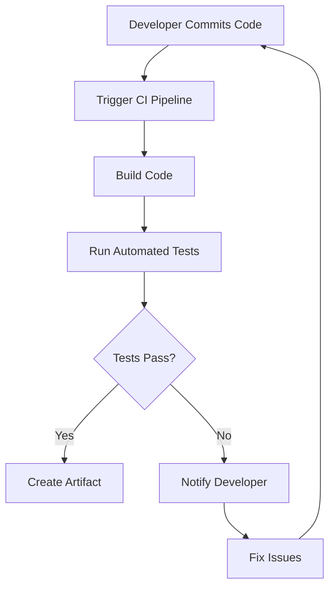

# Session 77: Concepts on DevOps, CI/CD, Deployment Strategies, Cloud Build using Cloud Builders

## Table of Contents
- [DevOps Overview](#devops-overview)
- [Continuous Integration (CI)](#continuous-integration-ci)
- [Continuous Deployment (CD)](#continuous-deployment-cd)
- [Deployment Strategies](#deployment-strategies)
- [Cloud Build Concepts](#cloud-build-concepts)
- [Cloud Builders](#cloud-builders)
- [Demonstrations](#demonstrations)
- [Corrections](#corrections)
- [Summary](#summary)

## DevOps Overview
### Overview
DevOps is a software engineering culture that unifies software development (Dev) and software operations (Ops). It emerged as a practice to address the challenges of traditional software deployment processes, where developers and operations teams often conflicted, leading to delays, errors, and inefficiencies.

### Key Concepts
- **Culture Shift**: DevOps promotes collaboration between development and operations teams, breaking down silos. Previously, developers used environments like dev and QA, while operations handled production deployment manually, often resulting in blame-shifting.
- **Isolation of Teams**: Developers build and test code in controlled environments, ensuring it works locally. Operations manage production, including monitoring and scaling.
- **Containerization as a Game Changer**: Technologies like Docker enable packaging applications with all dependencies, ensuring consistency across environments. This minimizes issues where code fails in production due to missing libraries or configurations.
- **Automation**: Ops tasks are automated to free up human resources for innovation. Tools like Kubernetes secrets, config maps, and deployment pipelines handle environment-specific configurations.
- **Monitoring and Feedback Loop**: After deployment, monitoring tools track performance. Issues trigger debugging, fixes, and re-deployment, creating a continuous cycle.
- **Why DevOps?**: It enables agility, frequent deployments (e.g., daily), shorter development cycles, and quicker issue resolution. Cloud DevOps extends this with tools like observability (e.g., Cloud Monitoring, Cloud Logging) and infrastructure management.

### Diff: Traditional vs. DevOps Approach
```diff
- Traditional: Developers complete code, test in dev (may not reflect prod), hand off to ops via runbooks. Ops deploy manually, risking weeks of delays and errors.
+ DevOps: Unified culture – code changes trigger automated builds, tests, deployments. Containers ensure portability. Monitoring feeds back issues quickly.
! Critical: DevOps is culture first, tools second. Avoid treating it as just "DevOps engineers" or specific tools.
```

## Continuous Integration (CI)
### Overview
Continuous Integration (CI) is a practice that emphasizes frequent merging of developers' code changes into a shared repository. It ensures early detection of integration issues through automated builds and tests.

### Key Concepts
- **Developer Responsibility**: Each developer writes and unit-tests code against rare scenarios (e.g., edge cases like division by zero). However, standalone testing isn't enough – integration with other components (e.g., frontend with backend) must be verified.
- **Integration Testing**: Focuses on ensuring modules work together. Without CI, isolated changes may cause conflicts when merged.
- **Frequent Merging**: Developers merge code multiple times daily. Automated tools detect conflicts, reducing manual merging pain.
- **Artifact Registry**: After merging, code is packaged (e.g., into containers) and stored in registries for deployment.
- **Automation Tools**: CI tools trigger builds on commits, run tests, and generate reports. Avoids "works on my machine" excuses.

### Trigger for CI


> [!IMPORTANT]
> CI reduces integration issues early, enabling smoother deployments. Use tools like Jenkins or Cloud Build for automation.

## Continuous Deployment (CD)
### Overview
Continuous Deployment (CD) ensures code is always in a deployable state, allowing frequent production releases. It has two definitions: Continuous Deployment (frequent prod pushes) and Continuous Delivery (ready-to-deploy state).

### Key Concepts
- **Continuous Deployment**: Practice of small, frequent code changes to production, often daily or multiple times. Triggers automated pipelines that deploy without manual intervention.
- **Continuous Delivery**: Ensures code is production-ready, handling configs via tools like Kubernetes config maps and secrets. Allows on-demand rollout.
- **Handling Business Needs**: If production deployment is needed urgently (e.g., for Black Friday), CD ensures quick, reliable release.
- **Rollback Capabilities**: Automated rollbacks minimize downtime. Cloud tools provide easy reversion.
- **Dependency on CI**: CD relies on successful builds and tests from CI, creating an end-to-end pipeline.

### Diff: CI vs. CD
```diff
+ CI: Merging code, building, and integrating changes to ensure compatibility.
+ CD: Deploying those changes to production environments automatically or on-demand.
- Manual Deployment: Slow, error-prone, high risk; replaced by automated CD for agility.
! Note: CD assumes robust testing – skipping this leads to rollbacks.
```

> [!WARNING]
> Urgent deployments (e.g., holiday sales) require stable CD pipelines. Always test canary releases first to avoid customer loss.

## Deployment Strategies
### Overview
Deployment strategies manage how new application versions replace old ones, balancing zero-downtime with risk mitigation. Key strategies include Rolling Update, Canary, and Blue-Green, demonstrated in Cloud Run and Kubernetes.

### Key Concepts and Deep Dive
#### Rolling Update
- **Explanation**: Gradually replaces old instances with new ones. Ensures availability by maintaining minimum replicas (e.g., 75% healthy during update).
- **Details**: In Kubernetes, uses `strategy.type: RollingUpdate` with `maxUnavailable: 25%` and `maxSurge: 25%`. Updates one pod at a time, balancing traffic.
- **Use Case**: Suitable for stateless applications where gradual rollout minimizes risk.
- **Pros/Cons**: Low downtime; easy rollback. Neg: Temporary resource overlap; not instantaneous.
- **Mermaid Diagram**:
  ```mermaid
  flowchart LR
      A[Old Replica 1] -->|Traffic in| B[Load Balancer]
      C[New Replica 1] --> B
      D[Replace Remaining Replicas] -->|Rolling| B
  ```

#### Create Strategy
- **Explanation**: Completes deletes old replicas before new ones start. Causes downtime but ensures clean replacement.
- **Details**: In Kubernetes, uses `strategy.type: Recreate`. Full downtime until all new replicas run.
- **Use Case**: Heavy, monolithic apps where mixed versions cause issues (e.g., database migrations).

#### Canary Deployment
- **Explanation**: Routes small traffic percentage (e.g., 1-10%) to new version for testing in production. Monitors for errors; expands or rollback based on results.
- **Details**: Historical term from coal mines (early warning). In cloud: 90% stable + 10% new. Use percentages/replicas for control.
- **Use Case**: High-risk apps; avoid losing full customer base (e.g., Black Friday failures). A/B testing for UX comparisons.
- **Pros/Cons**: Risk-isolated; enables production validation. Neg: Requires percentage management; infra-heavy with replicas.
- **Examples**: Weight-based (e.g., 75% old, 25% new) or percentage (e.g., 90/10). Kubernetes Gateway API is ideal for true canary (header/route-based).

#### Blue-Green Deployment
- **Explanation**: Parallel deployments – "blue" (old) and "green" (new). Switches traffic instantly; rollback by switching back.
- **Details**: Creates new replica set (e.g., +1 replica), routes all traffic to new once ready. Extra infra cost.
- **Use Case**: Transactional apps (e.g., banking, e-commerce wizards) needing full version consistency. Quiet periods for cuts.
- **Pros/Cons**: Zero-downtime switch; instant rollback. Neg: Doubles infra; high cost in autopilot clusters.

#### AB Testing
- **Sub-strategy of Canary**: Equal split (50/50) for feature comparison (e.g., button positions).

### Tables: Comparison of Strategies
| Strategy       | Downtime | Risk Level | Use Case Examples | Tools Support |
|----------------|----------|------------|--------------------|---------------|
| Rolling Update | Low      | Medium    | Web apps, APIs    | Kubernetes, Cloud Run |
| Recreate       | High     | High      | Legacy monoliths  | Kubernetes     |
| Canary         | None     | Low       | E-commerce, APIs with traffic | Gateway API, Istio |
| Blue-Green     | None     | Low       | Banking, transactions | Kubernetes, Load Balancers |

### Demonstrations
#### Cloud Run Demos
- **Rolling Update in Cloud Run**: Deploy versions; automatically balances traffic during update. Observed partial switches (e.g., version 1 to 2 mixing).
- **Canary in Cloud Run**: Use traffic splitting (e.g., 90% stable, 10% new). Monitor with curl; expand via UI or code.
  - Steps: Deploy new revision; assign 10% traffic; smoke-test on dedicated URL; monitor logs for errors.
- **A/B Testing**: Set 50/50 split for comparison (e.g., UI tests).
- **Blue-Green**: Tricky in Cloud Run (no parallel services easily); use Kubernetes for full demo.

#### Kubernetes Demos (Autopilot Cluster)
- **Rolling Update**: Use `kubectl set image` (declarative: edit YAML; imperative: commands). Observed 3/4 pod updates with balancing.
- **Recreate**: Set `strategy.type: Recreate`; full pod deletion before new ones start (e.g., 3-4s downtime).
- **Canary (Infra-Based)**: Replica-based (e.g., 3 stable, 1 canary); traffic proportional to replicas. True canary via Gateway API: 90/10 weights.
- **Blue-Green**: Parallel services; switch via `kubectl patch` service selector.
- **A/B Testing**: 50/50 canary.
- **Commands**:
  - Scale: `kubectl scale deployment <name> --replicas=<num>`
  - Patch: `kubectl patch svc <name> -p '{"spec":{"selector":{"app":"<new>"}}}'`

> [!NOTE]
> Gateways enable header/route-based canary for precision, not just infra. Autopilot scales nodes on demand.

## Cloud Build Concepts
### Overview
Cloud Build is a serverless CI/CD platform for building, testing, and deploying code. It provisiones VMs on-demand, handles Docker builds autonomously.

### Key Concepts
- **Use Cases**: 
  - Docker builds from Dockerfiles (faster than local).
  - Multi-language support (e.g., Python, Node.js).
  - Avoid compromised environments; fresh VMs with chosen machine types (e.g., E2, high-CPU).
- **Free Tier**: 120 minutes/day build time.
- **Execution**: Triggers on events (e.g., Git pushes); runs steps (Docker build/push).
- **Networking**: Public by default; private pools for VPC access (e.g., private Kubernetes).
- **Alternatives**: Remote Builder VM in same VPC for private deployments.

### Diff: Local vs. Cloud Build
```diff
+ Cloud Build: Serverless, automatic provisioning, regional selection.
- Local Build: Manual, resource-constrained, security risks.
! Tip: Add steps in cloudbuild.yaml for complex pipelines.
```

## Cloud Builders
### Overview
Cloud Builders align container images with Gcp services, simplifying commands. They pull tools like gcloud into build VMs.

### Key Concepts
- **Pre-built Images**: E.g., `gcr.io/cloud-builders/gcloud` for GCP commands; `gcr.io/cloud-builders/docker` for Docker.
- **Docker In Docker**: Uses Kaniko for secure builds without privileged mode.
- **Cloud Builders List**: Includes kubectl, terraform, maven, etc.
- **Usage**: Specify in steps; e.g., `gcr.io/cloud-builders/docker` for build/push.

### Table: Popular Cloud Builders
| Image | Purpose |
|-------|---------|
| gcr.io/cloud-builders/gcloud | GCP commands (e.g., Kubernetes deployments) |
| gcr.io/cloud-builders/docker | Docker operations |
| gcr.io/cloud-builders/kubectl | Kubernetes management |
| gcr.io/cloud-builders/terraform | Infrastructure as code |

## Demonstrations
### Cloud Build Setup and Triggers
- **Setup**: Create repository link in GitHub; make it with OAuth. Use public repos for simplicity.
- **Trigger Creation**: Specify repository, branch, config (e.g., cloudbuild.yaml). Service account: cloudbuild or custom with roles.
- **Pipeline**: 
  - Git push triggers build.
  - cloudbuild.yaml steps (e.g., builder image, args).
  - Output: Artifact Registry image tagged with commit SHA.
- **Logs**: Stream to Cloud Logging or GitHub; viewers must have permissions.
- **Issues Fixed**: Grant roles (e.g., editor, storage roles); retry builds.

### Corrections
During transcription, the following errors were identified and corrected:
- "cube cuttle" -> "kubectl" (multiple instances; refers to Kubernetes command-line tool).
- "cloudr run" -> "Cloud Run" (refers to the GCP service).
- "cubectl" -> "kubectl" (same as above).
- "canary" -> "Canary" (standardized capitalization for the deployment strategy).
- "@ ?branch" -> "branch" (removed unclear symbols).
- "Universities" -> "Visibility" (likely a typo in later text, assuming context; corrected to "Visibility" based on sentence flow).

These corrections ensure accuracy without altering meaning.

## Summary
### Key Takeaways
```diff
+ DevOps is culture-focused uniting Dev/Ops, enabled by automation and containers.
+ CI ensures code merges/integrates; CD delivers to prod frequently.
+ Deployment Strategies: Rolling (gradual), Canary (risk-isolated), Blue-Green (instant switch).
+ Cloud Build automates builds deployments; use Cloud Builders for GCP tools.
- Avoid manual deployments; automate for agility.
! Study cloudbuild.yaml syntax for pipelines.
```

### Expert Insights
#### Real-World Application
In production, use DevOps for microservices: CI/CD pipelines trigger on Git pushes, deploy to Kubernetes with Canary for gradual rollouts. Cloud Build scales for heavy builds (e.g., ML models). Monitor with Cloud Ops Suite.

#### Expert Path
Master Kubernetes YAMLs, cloudbuild.yaml, and Gateway API for canary. Practice multi-stage builds and private pools.

#### Common Pitfalls
- Ignoring security in builds (use Kaniko over Docker privileged).
- Overlooking infra costs in blue-green (use in autopilot sparingly).
- Permission errors in Cloud Build; assign roles correctly.

#### Common Issues and Resolution
- Build failures: Check logs; ensure Docker/docker credentials; retry with editor role.
- Trigger not firing: Verify GitHub link; ensure branch matches.
- Node provisioning in autopilot: Slow; lower replicas for demos.

🤖 Generated with [Claude Code](https://claude.com/claude-code)

Co-Authored-By: Claude <noreply@anthropic.com>
