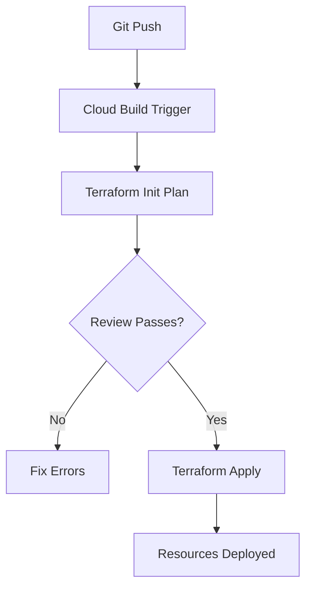

# Session 79: Terraform Concepts - CI/CD on Infra, Terraform Modules

- [Overview](#overview)
- [Infrastructure Provisioning with Terraform and Cloud Build](#infrastructure-provisioning-with-terraform-and-cloud-build)
- [Fixing Terraform Initialization Issues](#fixing-terraform-initialization-issues)
- [Parameterized Configurations](#parameterized-configurations)
- [Terraform Modules](#terraform-modules)
- [Dependency Management](#dependency-management)
- [Modularizing Infra Code](#modularizing-infra-code)
- [Outputs and Centralized State](#outputs-and-centralized-state)
- [CI/CD Integration](#cicd-integration)
- [Summary](#summary)

## Overview

Session 79 focuses on advanced Terraform concepts, integrating Terraform with Google Cloud Build for CI/CD pipelines, and managing infrastructure as code (IaC) through modules. We'll cover fixing common issues in automated deployments, parameterizing configurations, dependency management, and scaling IaC with modules.

## Infrastructure Provisioning with Terraform and Cloud Build

### Overview
Terraform provisions and manages infrastructure across cloud providers via declarative configuration files. Paired with Google Cloud Build, it enables CI/CD for infra deployment by automating builds and tests triggered from Git repositories.

### Key Concepts/Deep Dive
Cloud Build acts as the CI/CD engine, executing Terraform commands (init, plan, apply) upon Git pushes. This allows teams to version control infra code and deploy changes automatically without direct cloud console access.

#### Common Issues and Fixes
When integrating Terraform with Cloud Build, errors like "project not defined" occur due to missing provider blocks or unset project IDs. The solution involves:
- Adding a Google provider block in Terraform config.
- Using built-in Cloud Build variables for project ID.

#### Cloud Build Pipeline Setup
Use a `cloudbuild.yaml` file to define the pipeline steps:

```yaml
steps:
- name: 'hashicorp/terraform:1.12'
  env:
  - TF_INPUT=0
  args:
  - 'init'
- name: 'hashicorp/terraform:1.12'
  env:
  - TF_INPUT=0
  - TF_VAR_project_id=$PROJECT_ID
  args:
  - 'plan'
- name: 'hashicorp/terraform:1.12'
  env:
  - TF_INPUT=0
  - TF_VAR_project_id=$PROJECT_ID
  args:
  - 'apply'
  - '-auto-approve'
```

This ensures Terraform uses the correct project and avoids interactive prompts.

#### Terraform State Management
Terraform maintains state in `.terraform.state` files. For CI/CD, use a centralized backend like Google Cloud Storage (GCS) buckets to store state remotely:

```terraform
terraform {
  backend "gcs" {
    bucket = "terraform-state-bucket"
    prefix = "terraform/state"
  }
}
```

This enables shared state across team members and prevents state drift. Enable versioning and retention on the bucket for state history.

> [!IMPORTANT]
> Always commit and version Terraform configurations, but exclude `.terraform` directories and state files.

#### Lab Demos: Setting Up Cloud Build for Terraform
1. Create a GCS bucket for state storage with versioning enabled.
2. Initialize a Git repository with Terraform configs (main.tf, provider.tf).
3. Configure Cloud Build triggers on Git pushes.
4. Add provider block with project ID from environment variables.
5. Deploy and monitor via Cloud Build logs.

## Fixing Terraform Initialization Issues

### Key Concepts/Deep Dive
Errors like "project is not set" arise when Terraform lacks project context. Use environment variables or built-in Cloud Build substitutions.

Fix by adding provider config referencing `$PROJECT_ID`:

```terraform
provider "google" {
  project = var.project_id
}
```

For local testing, mimic Cloud Build by unsetting the project and running apply.

> [!NOTE]
> Test locally before pushing to CI/CD to catch issues early.

## Parameterized Configurations

### Overview
Hardcoded values in Terraform configs limit reusability. Use variables, locals, and conditional logic to make configs flexible for multiple environments.

### Key Concepts/Deep Dive
Define variables in `variables.tf`:

```terraform
variable "bucket_name" {
  description = "Name of the GCS bucket"
  type        = string
}

variable "location" {
  description = "Location for the bucket"
  type        = string
  default     = "US"
}
```

Pass values via `.tfvars` files or command-line flags (`-var-file`):

```bash
terraform apply -var-file=dev.tfvars
```

This supports multiple environments without code changes.

#### Environments and Variable Files
Use separate `.tfvars` files for dev, prod, etc.:

- `dev.tfvars`: Lower-cost regions, test settings.
- `prod.tfvars`: High-availability configs.

#### Lab Demos: Parameterizing a Bucket Creation
1. Define variables for bucket name, location, and storage class.
2. Create environment-specific `.tfvars` files.
3. Run `terraform plan` with `-var-file=prod.tfvars` to compare configurations without changes.

## Terraform Modules

### Overview
Modules organize Terraform configs into reusable components, promoting DRY (Don't Repeat Yourself) principles. A module can be a single directory with `.tf` files.

### Key Concepts/Deep Dive
Module structure example:

```
modules/
  gcs/
    main.tf
    variables.tf
    outputs.tf
```

Reference modules in root code:

```terraform
module "gcs_bucket" {
  source      = "./modules/gcs"
  bucket_name = var.bucket_name
}
```

Modules are initialized with `terraform init`.

#### Module Composition
- **Root Module**: Entry point, references sub-modules.
- **Child Modules**: Focused on specific resources (e.g., VPC, GCS).

#### Publishing Modules
Share via Git repositories or Terraform Registry. Use version tags for stability.

#### Lab Demos: Creating a GCS Module
1. Structure a `modules/gcs` directory with `main.tf` for bucket resource.
2. Define inputs/outputs in `variables.tf` and `outputs.tf`.
3. Call the module from root `main.tf`.
4. Test with `terraform apply` and verify GCS bucket creation.

## Dependency Management

### Overview
Terraform manages resource dependencies implicitly via references or explicitly with `depends_on`.

### Key Concepts/Deep Dive
Explicit dependencies ensure order:

```terraform
resource "google_compute_subnetwork" "subnet" {
  # ...
  depends_on = ["google_compute_network.vpc"]
}
```

Implicit dependencies use resource references (e.g., `network = google_compute_network.vpc.self_link`).

#### Parallel vs. Sequential Execution
- Independent resources (e.g., multiple GCS buckets) run in parallel.
- Dependent resources (e.g., VM after subnet) sequence automatically based on references.

| Dependency Type | Example | Use Case |
|-----------------|---------|----------|
| Implicit | Ref resource attributes | Recommended for readability |
| Explicit | `depends_on` block | Override defaults or complex scenarios |

#### Lab Demos: Managing VPC and VM Dependencies
1. Create VPC module with explicit `depends_on` for subnet.
2. Add VM resource depending on subnet.
3. Run `terraform apply` and observe sequential creation.
4. Test by commenting dependencies and re-running to see failures.

## Modularizing Infra Code

### Overview
Break down monolithic configs into modules for VPC, subnets, VMs, firewalls, etc. This improves maintainability and team collaboration.

### Key Concepts/Deep Dive
Example module tree:

```
terraform/
  main.tf          # Root module calls
  variables.tf
  terraform.tfvars
  modules/
    vpc/
    subnet/
    vm/
    firewall/
```

Root `main.tf` orchestrates:

```terraform
module "vpc" {
  source = "./modules/vpc"
  # Inputs...
}
```

#### Best Practices
- Use consistent naming (e.g., hyphens for resources).
- Include outputs for cross-module references (e.g., VM IP).
- Format code with `terraform fmt --recursive`.

#### Lab Demos: Full Infra Deployment
1. Implement modules for VPC, subnet, compute VM, firewall.
2. Wire outputs (e.g., subnet ID) as inputs to dependent modules.
3. Deploy via Cloud Build trigger.
4. Verify resources in GCP console and capture outputs in logs.

## Outputs and Centralized State

### Overview
Outputs expose resource attributes post-deployment. Centralized state via GCS ensures consistency in CI/CD.

### Key Concepts/Deep Dive
Define outputs for essential info:

```terraform
output "vm_ip" {
  value = google_compute_instance.vm.network_interface[0].access_config[0].nat_ip
}
```

In Cloud Build, outputs display in console/logs post-apply.

For state:
- Use GCS backend with versioning for rollbacks.
- Set retention policies to protect historical states.

#### Pitfalls
- Avoid hardcoding outputs; reference dynamically.
- Secure state files; restrict bucket access.

> [!CAUTION]
> Losing state file can lead to resource orphans. Always backup and version.

#### Lab Demos: Exporting VM Attributes
1. Add outputs for VM external IP and name.
2. Run `terraform output` post-deploy.
3. Push changes and verify outputs in Cloud Build logs.

## CI/CD Integration

### Overview
Integrate Terraform in Cloud Build for automated infra pipelines, enforcing code reviews and tests.

### Key Concepts/Deep Dive
Trigger on Git events:
- **Pull Requests**: Plan for preview.
- **Pushes**: Apply for deployments.

Use service accounts with minimal IAM roles (e.g., Storage Admin for GCS, Compute Admin for VMs).

#### Workflow


#### Environment-Specific Deployments
Use branches or tags to deploy to dev/prod environments.

## Summary

### Key Takeaways
```diff
+ Terraform modules promote reusability and organization in IaC.
+ Use centralized state backends (e.g., GCS) for team collaboration in CI/CD.
+ Parameterize configs for multi-environment flexibility.
+ Manage dependencies explicitly or implicitly to ensure correct resource ordering.
- Avoid hardcoding values; leverage variables and outputs for dynamic configurations.
! Always test locally before CI/CD deployment to catch errors early.
📝 Version control infra code but exclude sensitive state files.
```

### Expert Insight

#### Real-world Application
In production, Terraform modules and Cloud Build enable "Infrastructure as Code" at scale. Teams deploy multi-region infra via Git pipelines, with state locking preventing concurrent conflicts. Outputs integrate with monitoring tools for dynamic inventories.

#### Expert Path
- Master advanced Terraform features like data sources and provisioners.
- Implement multi-cloud deployments with conditional logic.
- Automate testing with Terratest or InSpec in CI/CD pipelines.

#### Common Pitfalls
- Forgetting to initialize modules, leading to path errors.
- Overusing explicit `depends_on`; prioritize implicit references for cleaner code.
- Ignoring naming conventions (e.g., underscores not allowed in some GCP resources).
- Mishandling state files, resulting in drift or loss.

#### Lesser Known Things
- Terraform's locking mechanism uses backend providers to prevent stale state.
- The `local-exec` provisioner runs commands on the deployment machine, useful for post-deploy scripting.
- Cross-module references via outputs enable complex, interdependent infra without monolithic files.

*Note: Corrected numerous instances of "terapform" to "terraform" throughout the content for accuracy.*
