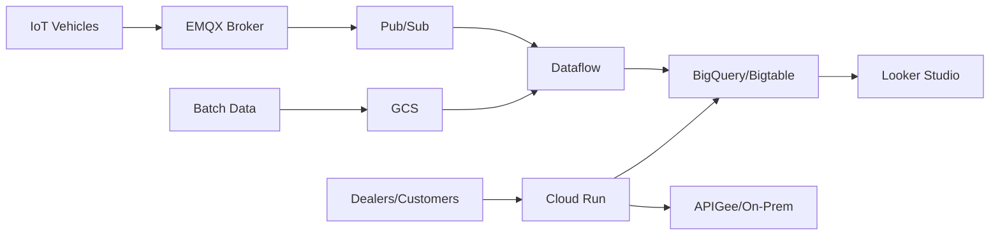
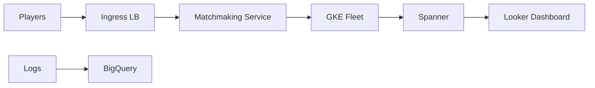

# Session 87: TerramEarth and Mountkirk Games Case Studies Demystification

## Table of Contents
- [Importance of Case Studies](#importance-of-case-studies)
- [TerramEarth Case Study Overview](#terramearth-case-study-overview)
- [TerramEarth Company Overview](#terramearth-company-overview)
- [TerramEarth Solution Concept](#terramearth-solution-concept)
- [TerramEarth Existing Technical Environment](#terramearth-existing-technical-environment)
- [TerramEarth Business Requirements](#terramearth-business-requirements)
- [TerramEarth Technical Requirements](#terramearth-technical-requirements)
- [TerramEarth Executive Summary](#terramearth-executive-summary)
- [TerramEarth Architecture Diagram](#terramearth-architecture-diagram)
- [TerramEarth Terraform Generation](#terramearth-terraform-generation)
- [Mountkirk Games Case Study](#mountkirk-games-case-study)
- [Mountkirk Games Overview](#mountkirk-games-overview)
- [Mountkirk Games Solution Concept](#mountkirk-games-solution-concept)
- [Mountkirk Games Existing Technical Environment](#mountkirk-games-existing-technical-environment)
- [Mountkirk Games Business Requirements](#mountkirk-games-business-requirements)
- [Mountkirk Games Technical Requirements](#mountkirk-games-technical-requirements)
- [Mountkirk Games Executive Summary](#mountkirk-games-executive-summary)
- [Mountkirk Games Architecture Diagram](#mountkirk-games-architecture-diagram)
- [Summary](#summary)

## Importance of Case Studies

### Overview
Case studies are critical for GCP certification exams (PCA) and interview preparation. They cover real-world migration and design scenarios on Google Cloud. Questions from case studies can form up to 40% of exam scores, with each case study potentially yielding 1-20 questions.

### Key Concepts/Deep Dive
- **Exam Relevance**: Case studies include EHR (healthcare), TerramEarth (manufacturing), Mountkirk Games (gaming), Helicopter Racing League (simulations). Download from official exam guide for verbatim content.
- **Setup in Exam**: Full screen divided for question and case study PDF (3 pages). Read case study multiple times due to time constraints.
- **Real-World Application**: Use as project references on resumes for cloud experience. Mention as confidential client projects with full end-to-end implementation details (requirement gathering, Terraform, architecture).
- **AI Integration**: Leverage LLM tools like ChatGPT or Claude for Terraform code and architecture diagrams generation, validating outputs for correctness.
- **Migration Focus**: All case studies involve moving to Google Cloud, highlighting migration strategies and hybrid environments.

### Lab Demos
- Use open-source tools like EMQX (MQTT broker) as IoT Core replacement.
- Test large language models for architecture and Terraform: paste full case study text, prompt for Google Cloud-specific designs, validate accuracy.

## TerramEarth Case Study Overview

### Overview
TerramEarth manufactures heavy equipment (tractors, machinery) for mining and agriculture industries. They have 500 dealers/service centers in 100 countries, focusing on productivity. The case study involves hybrid cloud migration with IoT data processing and analytics.

### Key Concepts/Deep Dive
- **Core Business**: Heavy equipment with IoT sensors collecting telemetry data (engine heat, tire pressure) for fleet management and predictive maintenance.
- **Data Volume**: 2 million vehicles, 500 MB data per day per vehicle, generating ~1 petabyte daily (30 petabytes monthly).
- **Hybrid Architecture**: On-premise and Google Cloud components, migrating legacy systems.

## TerramEarth Company Overview

### Overview
TerramEarth operates globally in mining and agriculture sectors. Mission: build equipment that maximizes customer productivity. Key stats: 2 million vehicles in operation, 20% annual growth.

### Key Concepts/Deep Dive
- **Scale**: 500 dealers/service centers across 100 countries.
- **Industry**: Heavy machinery manufacturing (e.g., like CAT, JCB brands).
- **Challenge**: Equipment downtime impacts productivity; IoT enables predictive maintenance.

## TerramEarth Solution Concept

### Overview
Vehicles collect telemetry from sensors, streaming critical data (30 fields for real-time) while uploading non-critical data daily via USB/home base. Data flows through Pub/Sub to Dataflow to BigQuery/Bigtable for analytics.

### Key Concepts/Deep Dive
- **Data Streams**:
  - Real-time: Critical metrics (e.g., engine heat, tire pressure) via MQTT to Pub/Sub.
  - Batch: Compressed sensor data (120 fields total) uploaded via Wi-Fi/USB to GCS.
- **Processing Path**:
  - Pub/Sub → Dataflow → BigQuery/Bigtable → Looker Studio for analytics/BI.
- **Requirements Fit**:
  - CDK/EMQX replaces discontinued IoT Core for MQTT protocol handling.
  - GCS for batch ingestion.
  - Multi-regional BigQuery/Bigtable for global access.
- **Big Data Scaling**: Handles petabyte-scale data; avoid Pods/MySQL due to scale limitations.

### Tables

| Data Type | Source | Processing | Destination | Notes |
|-----------|--------|------------|-------------|-------|
| Real-time Critical | Vehicle Sensors | Pub/Sub → Dataflow | BigQuery/Bigtable | JSON payload with 30 fields |
| Batch Non-Critical | USB Upload | GCS → Dataflow | BigQuery/Bigtable | Daily compressed uploads |
| Analytics Output | BigQuery | Looker Studio | Dealers/Customers | Predictive maintenance dashboards |

### Lab Demos
- Simulate IoT data flow: Use EMQX broker to receive sensor JSON (engine heat: 50°C, tire pressure: 220 Pa). Publish to Pub/Sub, process via Dataflow to BigQuery.
- Query BigQuery for maintenance predictions using BigQuery ML.

```yaml
# Sample sensor JSON payload
{
  "vehicle_id": "VEH-12345",
  "engine_heat_celsius": 50,
  "tire_pressure_pa": 220000,
  "fuel_level_percent": 85,
  "timestamp": "2024-03-30T12:00:00Z"
}
```

## TerramEarth Existing Technical Environment

### Overview
Data aggregation and analytics reside in Google Cloud, serving clients globally. Legacy inventory/logistics systems on-premise connected via interconnect. Web front-end in Google Cloud for stock management.

### Key Concepts/Deep Dive
- **Cloud Components**: Data aggregation/analysis in GCP (e.g., BigQuery, Dataflow) with cross-region multi/single-region setups for compliance.
- **On-Premise Components**: Two manufacturing plants with sensors feeding legacy systems via interconnect (10-200 Gbps dedicated interconnect preferred over VPN for volume).
- **Hybrid Connectivity**: Cloud Interconnect handles huge data transfers; avoids partner interconnect if close to Google PoP.
- **Web Front-End**: Cloud Run/MIG/GKE in GCP for dealers/customers; connects to spanner/BigQuery via direct VPC access or serverless connector.
- **Legacy Migration**: App modernization via APIGee (API abstraction) or Cloud Endpoints; migrate to microservices/APIs.

### Code/Config Blocks
```yaml
# Sample Cloud Interconnect config (via gcloud)
gcloud compute interconnects create my-interconnect \
  --description="Dedicated interconnect for TerramEarth" \
  --location=us-central1 \
  --requested-link-count=2 \
  --requested-link-type=DEDICATED
```

### Tables

| Component | Location | Technology | Connectivity | Purpose |
|-----------|----------|------------|--------------|---------|
| Data Aggregation | GCP | Dataflow | Multi-region | Process telemetry |
| Legacy Inventory | On-premise | Monolithic App | Interconnect | Stock/Management |
| Web Front-End | GCP | Cloud Run | Serverless VPC | User Interface |

## TerramEarth Business Requirements

### Overview
Predict/maintain vehicle issues with just-in-time repairs. Reduce costs via serverless/serverless products and seasonality adaptation.

### Key Concepts/Deep Dive
- **Predictive Maintenance**: Real-time stream analytics for fault detection (e.g., clutch failure based on patterns). Store in BigQuery ML; notify dealers for repairs.
- **Seasonality**: Agribusiness downtime; scale resources down (serverless auto-scales to zero traffic).
- **Cost Optimization**: Use serverless (Cloud Run, BigQuery) over VMs; enable commitments/discounts for consistent loads.

### Lab Demos
- BigQuery ML regression: Predict downtime using sensor data.
- Deploy Cloud Run app with HPA; simulate traffic drops to scale to zero.

## TerramEarth Technical Requirements

### Overview
Multi-platform API exposure (APIGee/Endpoints), infrastructure monitoring, secret management.

### Key Concepts/Deep Dive
- **APIs for Partners**: Expose legacy via APIGee (monetizes API calls) or Endpoints (GCP-native).
- **Developer Workflow**: Remote CI/CD for Dataflow jobs; separate dev/prod projects. Use groups/groups for RBAC.
- **Post-Commit Hooks**: Amend commits if needed for linting (after pre-commit validation).
- **Self-Service Portal**: Use CloudBolt or custom app for project/resource requests.
- **Secret Management**: Key Management Service (KMS) for keys; Secret Manager for secrets with IAM roles.
- **Monitoring**: Cloud Monitoring/Trace/Debugger; Network Intelligence for connectivity/flow analysis.

### Code/Config Blocks
```yaml
# IAM groups setup
resource "google_iam_group" "developers" {
  name = "terramearth-developers@terramearth.com"
  description = "Developers group"
}

resource "google_iam_group_membership" "developers" {
  group = "terramearth-developers@terramearth.com"
  members = ["user:alice@terramearth.com"]
}
# Roles: dataflow.developer, bigquery.data_editor, logs.viewer
```

### Tables

| Action | Groups | Roles | Scope |
|--------|--------|-------|------|
| Development | terraearth-developers@terramearth.com | Dataflow Developer, Composer User | Prod/Staging |
| Data Science | terraearth-datasci@terramearth.com | Vertex AI User | ML Experiments |
| Admins | terraearth-admins@terramearth.com | Owner | All |

## TerramEarth Executive Summary

### Overview
Competitive advantage via service excellence; migrate legacy to cloud for fleet management/analytics. Five-year plan: APIs for partners, autonomous operations, legacy migration.

### Key Concepts/Deep Dive
- **Migration Benefits**: Post-migration analytics insights for vehicle health/machine learning.
- **Legacy Migration**: Use Migrate for Compute/Containerization; VMs → GKE autopilot/Cloud Run.
- **Discounts**: Committed Use Discount (1-3 years for BigQuery/Dataflow), Spend-based for savings forecast.
- **Storage**: GCS for ingestion; Bigtable/BigQuery regionally/multi-regionally.

## TerramEarth Architecture Diagram

### Overview
Hybrid architecture with IoT ingestion, serverless processing, and global analytics.

### Key Concepts/Deep Dive
- **Flow**: Vehicles → EMQX → Pub/Sub → Dataflow → BigQuery; GCS → Dataflow; Dealers → Cloudfront/run → BigQuery/APIs.



## TerramEarth Terraform Generation

### Overview
Generate Terraform for VPC, subnets, Cloud Run, BigQuery; validate LLM outputs.

### Code/Config Blocks
```hcl
# Sample generated Terraform snippet
resource "google_compute_network" "vpc" {
  name                    = "terramearth-vpc"
  auto_create_subnetworks = false
}

resource "google_cloud_run_service" "web_front_end" {
  name     = "terramearth-frontend"
  location = "us-central1"
  template {
    spec {
      containers {
        image = "gcr.io/terramearth/frontend:v1"
      }
    }
  }
}
# Note: LLM-generated; adapt regions/roles as needed
```

## Mountkirk Games Case Study

### Overview
Mobile and expanding to multi-platform session-based multiplayer games. Migrating on-premise to Google Cloud.

## Mountkirk Games Overview

### Overview
Online multiplayer games (mobile expanding). Retros first-person shooter with geolocation arenas, leaderboard. Successfully migrated on-premise to GCP.

### Key Concepts/Deep Dive
- **Platforms**: Mobile → Xbox/console via open-source Agones (ex-Agones).
- **Game Type**: FPS with arenas, simultaneous players, real-time leaderboards.
- **Migration**: Lift-and-shift via Migrate for Compute Engine.

## Mountkirk Games Solution Concept

### Overview
Backend on GKE with multi-cluster ingress, spanner multi-region for sync. CDN for assets.

### Key Concepts/Deep Dive
- **Architecture**: GKE regional clusters → Ingress (anycast IP) → Closest arena → Spanner global → BigQuery analytics.
- **Scaling**: HPA/cluster autoscaler; scale-to-zero via KEDA (Kubernetes Event-Driven Autoscaler).
- **Components**: Pub/Sub for events; GCS for assets; BigQuery for logs analysis.

### Tables

| Component | Technology | Region | Purpose |
|-----------|------------|--------|---------|
| Compute | GKE Regional | Multi | Game Servers |
| Sync | Spanner Multi-Region | Global | Leaderboards |
| Assets | GCS + CDN | Global | Static Content |

## Mountkirk Games Existing Technical Environment

### Overview
Migrated on-premise via lift-and-shift to VMs/MIG. Separate prod/dev/testing projects; ingress creates consolidated.

### Key Concepts/Deep Dive
- **Migration**: VM lift-and-shift; organizational policies at folder level.
- **Projects**: Prod folder (FPS + Legacy), Consolidation for low-traffic legacy.
- **VPN/Interconnect**: For data transfers if applicable.

## Mountkirk Games Business Requirements

### Overview
Multi-platform support via Agones. Rapid feature iteration (CI/CD). Minimize latency (matchmaking). Scale dynamically.

### Key Concepts/Deep Dive
- **Matchmaking**: Cloud Run service assigns players by skill/arena via Spanner query.
- **Features**: Bugs/new features via GitHub/Cloud Build/Deploy.

### Lab Demos
- Agones Fleet: Deploy game server pods (pods=game servers).
- Matchmaking: Cloud Run queries Spanner for IP assignment.

## Mountkirk Games Technical Requirements

### Overview
ASC graphics processing (GPUs), structured logs for analysis, minimal latency, CI/CD, dynamic scaling.

### Key Concepts/Deep Dive
- **GPUs**: Node pools with GPU for server-side rendering; client machines handle GPU locally.
- **Logs**: Kubernetes logs → Cloud Logging → Sink → GCS/BigQuery; process via Dataflow for future analysis.
- **Latency**: Premium tier, multi-cluster ingress, caching (Memorystore Redis).
- **CI/CD**: GitHub → Cloud Build (build images) → GKE Deploy.
- **Scaling**: Event-driven (KEDA) autoscaling.

### Code/Config Blocks
```yaml
# KEDA scale-to-zero
apiVersion: keda.sh/v1alpha1
kind: ScaledObject
metadata:
  name: game-server-scaler
spec:
  scaleTargetRef:
    name: game-fleet
    kind: Agones.gameserver
  triggers:
  - type: prometheus
    metadata:
      serverAddress: http://prometheus:9090
      metricName: player_count
      query: avg_over_time(player_count[5m])
      threshold: "0"
```

## Mountkirk Games Executive Summary

### Overview
Successful first GCP migration enabled analytics; full cloud migration, modernize legacy to containers.

### Key Concepts/Deep Dive
- **Iterative Deployments**: Cloud-native CI/CD for rapid bug/feature fixes.
- **Discounts**: SUD/CUD for sustained loads.

## Mountkirk Games Architecture Diagram

### Overview
Client matchmaking → IP assignment → GKE Agones servers → Logging/analytics.

### Key Concepts/Deep Dive
- **Flow**: Client → Load Balancer → Matchmaking (Cloud Run) → Game IP → Logs → BigQuery/Spanner.



## Summary

### Key Takeaways
```diff
+ Case studies enable exam success (40% questions) and resume projects
+ TerramEarth: IoT/Big Data (Pub/Sub/Dataflow/BigQuery) in hybrid cloud
+ Mountkirk Games: Multi-platform gaming (GKE/Agones/Spanner) with scaling
- Avoid manual scaling; prefer serverless for seasonality
! Validate AI-generated Terraform/architectures for accuracy
```

### Expert Insight

#### Real-world Application
Use case studies for portfolio projects: Implement end-to-end Terraform/Cloud Deploy for IoT analytics or game servers. Apply in interviews as POC demos (e.g., BigQuery ML for predictions).

#### Expert Path
Master GCP exams via case studies; specialize in migration (Lift-and-shift → Refactor). Use AI for rapid prototyping; advance to multi-cloud (AWS/IoT Core alternatives: EMQX, Agones).

#### Common Pitfalls
- Ignoring scale (TBs → PBs requires BigQuery, not Cloud SQL); rectify: Verify data volumes against service limits.
- Terminates footprint: Use requests/Roles; issue: IAM groups/Policy violations.
- AI hallucinations: Always test code; risk: Inaccurate designs. Override with docs.
