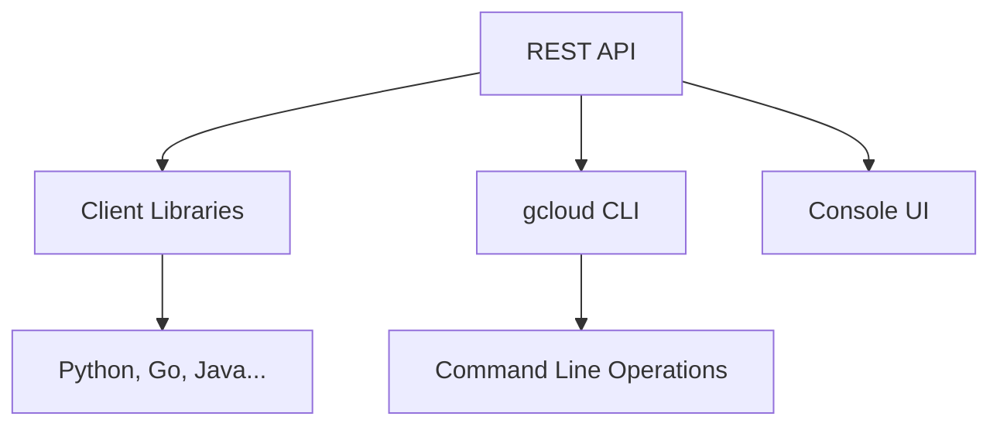
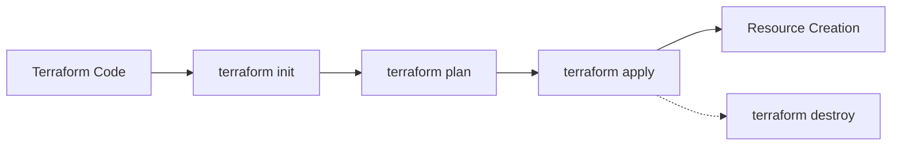
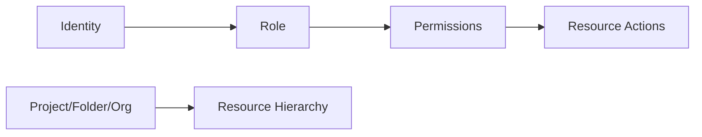

<details open>
<summary><b>Day 02 - Cloud SDK, Rest API - Curl, Postman, Terraform, Quiz, Cloud IAM - Identity, Roles Concept (KK-CS45-script-v2-Inst-v3)</b></summary>

# Day 02: Cloud SDK, Rest API - Curl, Postman, Terraform, Quiz, Cloud IAM - Identity, Roles Concept

## Table of Contents

- [Cloud SDK, Client Libraries, and REST API as Methods for Resource Provisioning](#cloud-sdk-client-libraries-and-rest-api-as-methods-for-resource-provisioning)
  - [Overview of Provisioning Methods](#overview-of-provisioning-methods)
  - [Cloud SDK (gcloud CLI)](#cloud-sdk-gcloud-cli)
  - [Client Libraries](#client-libraries)
  - [REST API](#rest-api)
- [Infrastructure as Code with Terraform](#infrastructure-as-code-with-terraform)
  - [Terraform Overview](#terraform-overview)
  - [Installing and Using Terraform](#installing-and-using-terraform)
  - [Creating Resources with Terraform](#creating-resources-with-terraform)
- [Quiz: Cloud Shell Persistence and gcloud Config](#quiz-cloud-shell-persistence-and-gcloud-config)
- [Cloud Identity and Access Management (IAM)](#cloud-identity-and-access-management-iam)
  - [IAM Overview](#iam-overview)
  - [Identity Types](#identity-types)
  - [Service Accounts](#service-accounts)
  - [Roles and Permissions](#roles-and-permissions)

## Cloud SDK, Client Libraries, and REST API as Methods for Resource Provisioning

### Overview of Provisioning Methods

Google Cloud provides multiple avenues for resource provisioning, with REST API serving as the foundational layer that underpins all other methods. This multi-layered approach allows developers and administrators to choose the most suitable tool based on their programming expertise and automation needs.



> [!IMPORTANT]
> REST API is the "mother of all" Google Cloud interfaces. CLI, UI, and client libraries all ultimately invoke REST APIs behind the scenes.

### Cloud SDK (gcloud CLI)

The Google Cloud SDK provides a command-line interface for comprehensive resource management. It offers consistent commands across all Google Cloud services and enables both interactive and automated operations.

#### Key Commands Covered

**Storage Operations:**
- `gcloud storage buckets create BUCKET_NAME` - Creates a new GCS bucket
- `gcloud storage buckets list` - Lists all buckets in the project

**Compute Engine:**
- `gcloud compute instances create INSTANCE_NAME` - Creates a VM instance
- `gcloud compute instances delete INSTANCE_NAME` - Deletes a VM instance
- `gcloud compute instances list` - Lists all VM instances

#### SDK Installation and Setup

1. Download the Cloud SDK from cloud.google.com/sdk
2. Install on Windows/Mac/Linux
3. Authenticate using `gcloud auth login`
4. Set default project: `gcloud config set project PROJECT_ID`

> [!NOTE]
> The Cloud SDK includes gcloud, gsutil, and bq CLI tools. gsutil is the legacy tool for Cloud Storage, while gcloud storage commands are recommended for new implementations.

### Client Libraries

Client libraries provide programmatic access to Google Cloud services through popular programming languages. They abstract REST API complexity while maintaining full functionality.

#### Supported Languages
- Python
- Go
- Java
- Node.js
- Ruby
- PHP
- C++
- C#

#### Python Example: Creating a GCS Bucket

```python
from google.cloud import storage

def create_gcs_bucket(bucket_name):
    storage_client = storage.Client()
    bucket = storage_client.bucket(bucket_name)
    new_bucket = storage_client.create_bucket(bucket)

    print(f"Bucket {bucket_name} created.")
    return new_bucket
```

**Installation:**
```bash
pip install google-cloud-storage
```

**Execution:**
```bash
python gcs_script.py
```

> [!TIP]
> Use ChatGPT, Gemini, or Vertex AI to generate client library code snippets, especially when you're new to a programming language.

### REST API

REST APIs provide the lowest-level access to Google Cloud services. Every operation performed through CLI, console, or client libraries ultimately calls REST APIs.

#### Key Concepts

- **Endpoints:** Service-specific URLs (e.g., `storage.googleapis.com`, `compute.googleapis.com`)
- **Authentication:** Bearer tokens or API keys
- **HTTP Methods:** GET, POST, PUT, DELETE, PATCH
- **Data Format:** JSON payloads

#### Three Ways to Interact with REST APIs

1. **Google API Explorer (Built-in)**
   - Navigate to APIs & Services > API Explorer in Google Cloud Console
   - Select service (e.g., Cloud Storage)
   - Choose operation (e.g., storage.buckets.insert)
   - Fill in required parameters (project ID, bucket details)
   - Execute with OAuth authentication

2. **curl Command**
   ```bash
   # Obtain access token
   ACCESS_TOKEN=$(gcloud auth print-access-token)
   
   # Create bucket via REST API
   curl -X POST \
     -H "Authorization: Bearer $ACCESS_TOKEN" \
     -H "Content-Type: application/json" \
     -d '{
       "name": "cloud-architect-rest-api-v1",
       "location": "US"
     }' \
     https://storage.googleapis.com/storage/v1/b?project=[PROJECT_ID]
   ```

3. **Postman GUI Tool**
   - Import REST API endpoint
   - Set HTTP method (POST for creation)
   - Add Authorization (Bearer Token)
   - Configure JSON body
   - Send request and view response

#### Obtaining Bearer Tokens

```bash
gcloud auth print-access-token
```

**Insert the token in Authorization header:**
```
Authorization: Bearer ya29.xxx...
```

> [!WARNING]
> REST APIs require proper authentication and API enablement. Services must be enabled in the project before API calls succeed.

## Infrastructure as Code with Terraform

### Terraform Overview

Terraform enables infrastructure as code (IaC) by defining resources using HashiCorp Configuration Language (HCL). It's the de facto standard for infrastructure provisioning, supporting both creation and destruction of resources.



### Installing and Using Terraform

**Installation:** Download from terraform.io/downloads

**Basic Workflow:**
```bash
terraform init    # Initialize providers
terraform plan    # Dry-run validation
terraform apply   # Execute changes
terraform destroy # Remove resources
```

#### Key Concepts

- **Providers:** Cloud service integrations (AWS, Azure, GCP)
- **Resources:** Infrastructure components (VMs, buckets, networks)
- **State:** Tracks deployed resources
- **Modules:** Reusable configuration blocks

### Creating Resources with Terraform

#### Google Cloud Storage Bucket

```hcl:main.tf
terraform {
  required_providers {
    google = {
      source = "hashicorp/google"
      version = "~> 4.0"
    }
  }
}

provider "google" {
  project = "your-project-id"
  region  = "us-central1"
}

resource "google_storage_bucket" "example" {
  name          = "cloud-architect-terraform-v1"
  location      = "US"
  storage_class = "STANDARD"
}
```

**Commands:**
```bash
terraform init
terraform plan
terraform apply  # Answer 'yes' or use --auto-approve
terraform destroy
```

#### Google Compute Engine VM

```hcl:main.tf
resource "google_compute_instance" "vm" {
  name         = "terraform-vm"
  machine_type = "n2-standard-2"
  zone         = "us-central1-a"

  boot_disk {
    initialize_params {
      image = "debian-cloud/debian-11"
    }
  }

  network_interface {
    network = "default"
    access_config {}
  }
}
```

#### Terraform vs. Manual Methods

| Method | Terraform | Console | CLI | API |
|--------|-----------|---------|-----|-----|
| Repeatable | ✅ | ❌ | ❌ | ❌ |
| Version Control | ✅ | ❌ | ❌ | ❌ |
| Automated | ✅ | ❌ | ✅ | ✅ |
| Multi-resource | ✅ | ❌ | ✅ | ❌ |

> [!NOTE]
> Terraform Snippets can be copied directly from Google Cloud Console under VM/Network/Bucket creation wizards via "Equivalent Code" > "Terraform".

## Quiz: Cloud Shell Persistence and gcloud Config

### Cloud Shell Custom Utility Installation

**Question:** Where should you install a custom utility in Cloud Shell for week-long persistence?

**Answer:** `/home/[username]`

**Explanation:**
- `/home/$USER` persists across sessions (5GB storage)
- `/opt` is for optional components, not persistent
- `/tmp` is temporary storage
- Cloud Shell operates on a persistent VM that maintains home directory contents

### Default Region Configuration

**Question:** How to set `europe-west1` as the default region for all gcloud commands?

**Answer:** `gcloud config set compute/region europe-west1`

**Options Analysis:**
- Console navigation → Does not set CLI defaults
- `gcloud config set compute/zone ZONE_NAME` → Incorrect; sets zone, not region
- `gcloud config set compute/region REGION_NAME` → ✅ Correct
- VPN setup → Overkill for CLI configuration

> [!TIP]
> Use gcloud config commands for CLI persistence. Console settings apply only to GUI operations.

## Cloud Identity and Access Management (IAM)

### IAM Overview

Cloud IAM implements the principle "who can do what on which resources." It controls access through identities (users/service accounts), roles (permission bundles), and resources (GCP services).



> [!IMPORTANT]
> IAM operates at multiple levels: project, folder, and organization. Identity management varies by organization type.

### Identity Types

Google Cloud supports multiple identity sources for seamless authentication.

#### 1. Personal Gmail Account
- **Format:** `user@gmail.com`
- **Use Case:** Individual learning/self-study
- **Capabilities:** Console access, API calls, full GCP service access
- **Limitations:** No organizational control, deactivation challenges

#### 2. Google Workspace Account
- **Format:** `user@company.com`
- **Use Case:** Startups using Google Workspace
- **Capabilities:** Full GCP access, collaborative tools (Gmail, Drive, Meet)
- **Example:** `mahesh@tata.com`
- **Advantages:** Integrated with Gmail, Drive, etc.

#### 3. Cloud Identity (Domain-Owned)
- **Format:** `user@company.com`
- **Use Case:** Large enterprises with Microsoft/Azure infrastructure
- **Capabilities:** GCP console/API access
- **Migration Path:** Active Directory → Google Cloud Identity
- **Tools:** Google Cloud Directory Sync (Windows) or tools like LDAP Sync

#### 4. Migrated Active Directory
- **Process:** Sync users/groups from AD/Azure AD using Directory Sync
- **Authentication:** SAML SSO (Single Sign-On)
- **Example:** Windows Active Directory → Cloud Identity → GCP access
- **Benefits:** Single source of truth remains AD

#### 5. Google Groups
- **Format:** `group@googlegroups.com` or organization-scoped
- **Use Case:** Team access management
- **Capabilities:** Grant roles to groups; members inherit permissions

> [!WARNING]
> Identities must be verified with Google (Gmail, Workspace, Cloud Identity). Non-Google domains (e.g., Microsoft) cannot access GCP without proper migration.

### Service Accounts

Service accounts are identities for non-human entities: VMs, applications, scripts.

#### Characteristics
- **Email Format:** `service-account-name@gcp-project.iam.gserviceaccount.com`
- **Use Cases:** VM-to-service communication, automated scripts
- **Capabilities:** API access only (no console login)
- **Creation:**
  ```bash
  gcloud iam service-accounts create SERVICE_ACCOUNT_NAME
  ```

#### Example: Compute Engine Service Account
```bash
gcloud iam service-accounts create gce-sa \
  --display-name "GCE Service Account" \
  --description "Service account for VMs"
```

**Default Service Account (Dangerous):**
- Email: `PROJECT_NUMBER-compute@developer.gserviceaccount.com`
- Permissions: Project Editor (too broad)
- **Recommendation:** Create custom service accounts with minimal permissions

### Roles and Permissions

Roles determine what actions identities can perform on resources.

#### Role Types

1. **Basic/Primitive Roles** (Avoid in Production)
   - `Owner`: Full control (9,910+ permissions)
   - `Editor`: All except IAM management (~8,700 permissions)
   - `Viewer`: Read-only access
   - **Problems:** Too broad, security risks

2. **Predefined Roles** (Recommended)
   - Service-specific, granular permissions
   - Example: `Storage Admin` (55 permissions for GCS)
   - Example: `Compute Admin` for VM management
   - Maintained by Google

3. **Custom Roles** (When Predefined Insufficient)
   - Create custom permission bundles
   - Use cases: Remove specific permissions, combine services
   - **Maintenance Overhead:** You manage custom roles

#### Permission Format
```
service.resource.action
```
Examples:
- `storage.buckets.create`
- `compute.instances.start`
- `bigquery.jobs.create`

#### Key IAM Policies

- **Principle of Least Privilege:** Grant minimum required access
- **Role Assignment:** Assign roles to identities at project/folder/org level
- **Service Account Keys:** Avoid downloading keys; use default credentials when possible

#### Common Role Examples

| Service | Role | Permissions |
|---------|------|-------------|
| Storage | Storage Admin | 55 permissions (create, read, update, delete buckets/objects) |
| Compute | Compute Viewer | 6 permissions (list, get instances) |
| BigQuery | BigQuery User | 1 permission (jobs.create) |

> [!TIP]
> Always prefer predefined roles over basic roles. Custom roles only when business requirements demand specific permission combinations.

---

## Summary

### Key Takeaways

```diff
+ Cloud SDK provides unified CLI for all GCP services
+ REST APIs are the foundation beneath all GCP interfaces
+ Terraform enables version-controlled infrastructure management
+ IAM uses identities + roles + resources for access control
+ Service accounts enable automated, authenticated API access
+ Predefined roles provide secure, task-specific permissions
- Avoid basic roles (Owner/Editor) in production environments
- Manual configurations don't persist across environments
- REST API calls require proper authentication and API enablement
! Always test infrastructure changes in development first
```

### Quick Reference

**Cloud SDK Commands:**
```bash
# Storage
gcloud storage buckets create my-bucket
gcloud storage buckets list

# Compute
gcloud compute instances create vm-name --machine-type=n2-standard-2
gcloud auth print-access-token  # For REST API authentication

# IAM
gcloud iam service-accounts create sa-name
gcloud config set compute/region us-central1
```

**Terraform Workflow:**
```hcl
# Basic structure
provider "google" { project = "my-project" }
resource "google_storage_bucket" "bucket" { name = "my-terraform-bucket" }
```

```bash
terraform init
terraform plan
terraform apply  # --auto-approve for non-interactive
terraform destroy
```

**REST API Tools:**
- Google API Explorer: APIs & Services > API Explorer
- Curl: `curl -H "Authorization: Bearer $(gcloud auth print-access-token)"`
- Postman: Import API endpoints, set Bearer token authentication

**IAM Best Practices:**
- Use Google Workspace/Cloud Identity for organizational users
- Create custom service accounts for applications
- Implement least privilege with predefined roles
- Use groups for team-based access management
- Never share service account keys

### Expert Insight

**Real-world Application:** In enterprise environments, combine Cloud Identity with Active Directory sync for unified authentication across hybrid clouds. Terraform modules reduce infrastructure deployment time by 80%, enabling rapid scaling of identical environments.

**Expert Path:** Mastering GCP starts with IAM and CLI proficiency. Focus on predefined roles for security, learn terraform state management, and integrate CI/CD pipelines with service account authentication.

**Common Pitfalls:** Overusing Owner roles leads to security incidents; forgetting to destroy Terraform resources accumulates unexpected costs; missing API enablement causes cryptic failures; downloading service account keys increases breach risk.

**Lesser-Known Facts:** Service accounts cannot access Google Cloud Console by design; IAM policies evaluate permissions in real-time, not cached; custom roles can include both inclusions and exclusions; Cloud Identity Premium enables password synchronization from AD without revealing hashes.

**Advantages and Disadvantages:**

| Method | Advantages | Disadvantages |
|--------|------------|---------------|
| gcloud CLI | Scriptable, fast, comprehensive | Requires local SDK installation |
| Client Libraries | Language-native, error handling | Programming knowledge required |
| REST API | Unconstrained, raw power | Manual authentication handling |
| Terraform | Idempotent, version-controlled | Learning curve, state management complexity |
| Console UI | Visual, accessible to beginners | Not repeatable, no automation |
| Basic Roles | Simple, quick assignment | Security risks, too broad permissions |
| Predefined Roles | Secure, task-specific | May lack niche permissions |
| Custom Roles | Precise control | Maintenance overhead, potential misconfigurations |

</details>