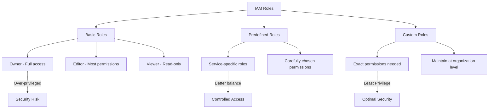

<details open>
<summary><b>Session 3: Demo on Principal of Least Privilege, IAM Policy Binding, What & Why Organization (KK-CS45-script-v2-Inst-v3)</b></summary>

# Session 3: Demo on Principal of Least Privilege, IAM Policy Binding, What & Why Organization

## Table of Contents
- [Overview](#overview)
- [Principle of Least Privilege](#principle-of-least-privilege)
- [IAM Roles Deep Dive](#iam-roles-deep-dive)
  - [Basic Roles](#basic-roles)
  - [Predefined Roles](#predefined-roles)
  - [Custom Roles](#custom-roles)
  - [Role Assignment and Symptoms](#role-assignment-and-symptoms)
- [IAM Policy Binding](#iam-policy-binding)
- [Organization Node & Resource Hierarchy](#organization-node--resource-hierarchy)
  - [Why Organization Node](#why-organization-node)
  - [Resource Hierarchy](#resource-hierarchy)
  - [Policy Inheritance](#policy-inheritance)
  - [Organization Policies](#organization-policies)
- [Real-world Demo Scenarios](#real-world-demo-scenarios)
  - [Scenario 1: Engineer Access Requirements](#scenario-1-engineer-access-requirements)
  - [Scenario 2: Project-level vs Bucket-level Access](#scenario-2-project-level-vs-bucket-level-access)
- [Summary](#summary)
  - [Key Takeaways](#key-takeaways)
  - [Quick Reference](#quick-reference)
  - [Expert Insight](#expert-insight)

## Overview

This session demonstrates the **principle of least privilege** through hands-on IAM role assignment and policy binding scenarios. You'll learn why basic roles are insufficient, how to create custom roles to achieve exact permissions needed, and understand the importance of organization-level resource hierarchy for scalable cloud governance.

> [!IMPORTANT]
> Principle of least privilege means granting only the minimum permissions required for users to perform their duties, reducing security risks from over-privileged accounts.

## Principle of Least Privilege

The principle of least privilege (PoLP) is a computer security concept where users are granted the minimum necessary access rights to complete required tasks. In GCP:

- **Avoid over-privilege**: Don't give owner role to developers
- **Layered approach**: Start with broad roles, then narrow down to custom roles
- **Regular audits**: Continuously review and remove unnecessary permissions

### Role Categories Overview



## IAM Roles Deep Dive

### Basic Roles

Basic roles provide broad access levels but often lead to over-privilege situations.

#### Owner Role
- **Purpose**: Full administrative access to all project resources
- **Notification**: **Email invitation sent** when assigned (unlike other roles)
- **Use Case**: Primary project administrators (limit to 1-2 people per project)
- **Risk**: Grants ~8,500+ permissions across all GCP services

#### Editor Role
- **Permission Count**: 8,693 permissions
- **Includes**: Basic viewer permissions + create/modify/delete capabilities
- **Demo Impact**: User could create/delete VMs and manage all storage buckets
- **Assessment**: ❌ **Over-privileged** - allows VM deletion and full bucket management

#### Viewer Role
- **Purpose**: Read-only access to all resources
- **Scope**: Can view configurations but perform no actions
- **Assessment**: ❌ **Under-privileged** - user cannot create resources

### Predefined Roles

Predefined roles are Google-managed role sets specific to services. They offer better granularity but may still be over-privileged.

#### Compute Engine Roles
- **Compute Admin**: ~868 permissions
- **Compute Instance Admin**: ~406 permissions (includes delete permission)
- **Assessment**: ❌ **Still over-privileged** - contains unwanted permissions

#### Storage Roles
- **Storage Admin**: Full bucket and object management
- **Storage Object Admin**: Can manage objects and bucket metadata
- **Storage Object Creator**: Can only create/upload objects
- **Permissions**: Only `storage.objects.create` permission
- **Assessment**: ✅ **Potential fit** for limited access scenarios

### Custom Roles

Custom roles allow exact permission combinations for least privilege implementation.

#### Creating Custom Roles
```bash
# Custom role for VM start/stop operations
Role Name: custom-compute-instance-admin-start-stop
Permissions:
- compute.instances.start
- compute.instances.stop
- compute.instances.get  # Needed to view VM details
```

**Key Characteristics:**
- **Permission Sources**: Hand-pick from ~8,000+ available permissions
- **Maintenance Overhead**: Google doesn't update custom roles automatically
- **Organization Level**: Create at org level for reuse across multiple projects

## Role Assignment and Symptoms

### Real-world Demo: Engineer Access Requirements

**Scenario**: Newly joined engineer "Mahesh" needs:
- ✅ Create, start, stop VMs
- ✅ Upload objects to buckets  
- ❌ Delete VMs (even if created by him)
- ❌ Create new buckets
- ❌ Delete uploaded objects

#### Trial 1: Editor Role
```diff
+ Can create VMs ✓
+ Can start/stop VMs ✓  
+ Can SSH to VMs ✓
+ Can upload to buckets ✓
- Can delete VMs ✗ (OVER-PRIVILEGED)
- Can view all IAM users/details ✗ 
- Can modify any resource ✗
```
**Result**: ❌ **Editor role rejected** - too many unnecessary permissions

#### Trial 2: Predefined Roles
- Compute Engine Admin + Storage Object Creator
- **Issue**: Compute Admin includes delete permissions
- **Issue**: Requires Service Account User role for VM creation
```diff
! Service Account Access Required
Permission: iam.serviceAccounts.actAs
Risk: High-privilege role warning
```

#### Trial 3: Custom Role + Predefined Role
- **Compute Engine**: Custom role (start/stop only)
- **Storage**: Storage Object Creator predefined role
- **Additional**: Service Account User role (actAs permission)

**Final Solution:**
- Custom Compute Role: `compute.instances.start`, `compute.instances.stop`
- Predefined Storage Role: `storage.objects.create`
- Service Account Role: `iam.serviceAccounts.actAs`

### Key Observations from Demo

1. **No Email Notifications**: Predefined/custom roles don't send invites (unlike Owner role)

2. **Propagation Delay**: Changes may take 7-10 minutes to take effect

3. **Project Star**: Use star feature for frequently accessed projects

4. **Role Verification**: Cross-check permissions using IAM → Roles → Filter

5. **Service Account Warnings**: UI shows warnings for missing service account roles

## IAM Policy Binding

IAM Policy Binding = Linking a **principal** (user, group, service account) to a **role**

### Command Examples

```bash
# Grant role at project level
gcloud projects add-iam-policy-binding PROJECT_ID \
  --member="user:email@example.com" \
  --role="roles/ROLE_NAME"

# Grant role at organization level  
gcloud organizations add-iam-policy-binding ORGANIZATION_ID \
  --member="user:email@example.com" \
  --role="roles/ROLE_NAME"

# Grant role at bucket level
gsutil iam ch user:email@example.com:objectCreator gs://BUCKET_NAME

# View current IAM policy
gcloud projects get-iam-policy PROJECT_ID --format=json
```

### Policy Simulator
GCP provides a policy simulator to test permission changes before applying:

- Shows permission differences when adding/removing roles
- Approves or rejects changes based on administrator decision
- Available in IAM console

## Organization Node & Resource Hierarchy

### Why Organization Node

Organization nodes provide centralized management for:
- **IAM Policies**: Centralized user/group management
- **Resource Organization**: Logical grouping (dev/test/prod projects)
- **Security Policies**: Organization-wide security constraints
- **Custom Roles**: Reusable across multiple projects

#### Create Organization Node
- Requires domain ownership verification
- Options:
  - Google Workspace customer
  - Cloud Identity customer  
  - New Workspace account (requires domain purchase)

### Resource Hierarchy

```
Organization
├── Folders (optional)
│   └── Projects
│       └── Resources (VMs, Buckets, etc.)
└── Projects (direct)
    └── Resources
```

**Key Rules:**
- ✅ Can create custom roles at organization level
- ✅ Can create custom roles at project level  
- ❌ **Cannot create custom roles at folder level**
- ❌ Cannot create resources at org/folder level (only projects)

### Policy Inheritance

Policies flow **top-down** and are **transitive**:

1. **Organization** → **Folders** → **Projects** → **Resources**
2. Users inherit permissions from higher levels
3. **Policy Inheritance**: Bob with Editor at project level → Editor access to all project resources

#### Overriding Policies
- Default: Policies flow down through inheritance
- Override: Projects/folders can **deny** or **allow exceptions**
- Example: Org-level "no external IPs" → Project-level override for specific needs

### Organization Policies

Organization policies enforce security/compliance constraints:

| Category | Example Policies | Purpose |
|---|---|---|
| **VM Security** | `constraints/compute.vmExternalIpAccess` | Prevent external IP assignment |
| **Storage Security** | `constraints/storage.publicAccessPrevention` | Prevent public bucket creation |  
| **IAM** | `constraints/iam.allowedPolicyMemberDomains` | Restrict identity domains |
| **API Controls** | `constraints/serviceuser.services` | Control API service usage |

> [!WARNING]
> Organization policies are applied at org/folder level and cannot be overridden without admin approval.

#### Demo: Organization Policy Effects

```diff
+ No external IPs policy enabled at org level
+ VMs created in compliant projects → No external IP assigned
+ VMs can only communicate internally
+ Security improvement against DDoS attacks
- Internet access requires NAT Gateway configuration (covered in networking module)

+ Public access prevention policy
+ Buckets cannot be made public
+ Existing public buckets → Automatically converted to private
+ Retroactive policy enforcement
```

## Real-world Demo Scenarios

### Scenario 1: Engineer Access Requirements

**Requirements Matrix:**

| Action | Required? | Editor | Compute Admin | Custom + Predefined |
|---|---|---|---|---|
| Create VM | ✅ | ✅ | ✅ | ✅ |
| Start VM | ✅ | ✅ | ✅ | ✅ |
| Stop VM | ✅ | ✅ | ✅ | ✅ |
| SSH VM | ✅ | ✅ | ✅ | ✅ |
| Delete VM | ❌ | ❌ (BLOCK) | ❌ (BLOCK) | ❌ (BLOCK) |
| Create Bucket | ❌ | ❌ | N/A | ❌ |
| Upload Objects | ✅ | ✅ | N/A | ✅ |
| Delete Objects | ❌ | ❌ | N/A | ❌ |

**Winner**: ✅ **Custom Compute Role + Storage Object Creator**

### Scenario 2: Project-level vs Bucket-level Access

#### Project-level Storage Object Creator
- **Scope**: All buckets in the project
- **Command**: `gcloud projects add-iam-policy-binding`  
- **Impact**: Can upload to ANY bucket in project
- **Demo**: Simple-gcp-user uploaded to assigned bucket ✅

```bash
# Inheritance allows access to all project buckets
User gets upload rights to all buckets under project
```

#### Bucket-level Storage Object Creator  
- **Scope**: Single specific bucket only
- **Command**: `gsutil iam ch user:objectCreator gs://bucket-name`
- **Impact**: Can ONLY upload to target bucket
- **Demo**: Direct URL access failed, upload succeeded after bucket policy

```bash
# Granular access control
gsutil iam ch user:email@example.com:objectCreator gs://specific-bucket
```

## Summary

### Key Takeaways

```diff
+ Principle of Least Privilege requires custom roles for exact permissions
+ Basic roles (Owner/Editor/Viewer) are insufficient for production use
+ Custom roles enable precise permission combinations  
+ Organization hierarchies provide scalable policy management
+ IAM policy binding = linking principals to roles
+ Service account "actAs" permission required for VM operations
! Avoid over-privilege from predefined roles like Storage Admin
! Monitor propagation delays (7-10 minutes) after role changes
! Organization policies enforce security at scale
```

### Quick Reference

#### Role Assignment Commands
```bash
# Project-level
gcloud projects add-iam-policy-binding PROJECT_ID \
  --member=user:email@example.com \
  --role=projects/PROJECT_ID/roles/CUSTOM_ROLE

# Organization-level  
gcloud organizations add-iam-policy-binding ORG_ID \
  --member=user:email@example.com \
  --role=organizations/ORG_ID/roles/CUSTOM_ROLE

# Bucket-level
gsutil iam ch user:email@example.com:objectCreator gs://BUCKET_NAME

# View IAM Policy
gcloud projects get-iam-policy PROJECT_ID --format=json > iam-policy.json
```

#### Permission Categories
- **Compute VM Management**: `compute.instances.*`
- **Storage Object Operations**: `storage.objects.*`
- **IAM Role Grants**: `resourcemanager.projects.setIamPolicy`

### Expert Insight

#### Real-world Application
In enterprise environments, implement a tiered IAM approach:
1. **Organization Level**: Core policies and reusable custom roles  
2. **Folder Level**: Environment-specific policies (dev/test/prod)
3. **Project Level**: Service-specific roles and access
4. **Resource Level**: Granular permissions for specific buckets/VMs

This creates scalable security frameworks supporting multiple teams, projects, and compliance requirements.

#### Expert Path
- Master `gcloud iam` commands for automation
- Focus on organization-level custom role creation for multi-project teams
- Learn policy simulator for change validation
- Understand service account delegation patterns for complex architectures

#### Common Pitfalls & Resolution

| Pitfall | Symptom | Resolution |
|---|---|---|
| **Over-privilege** | User can delete resources they created | Replace predefined roles with custom equivalents |
| **Propagation Delay** | Role changes not immediate | Wait 7-10 minutes, refresh sessions |
| **Service Account Issues** | "User does not have access to service account" | Grant `iam.serviceAccounts.actAs` role |
| **Public Buckets Unintentional** | Sensitive data exposed | Enable organization policy `constraints/storage.publicAccessPrevention` |
| **Folder Groups Without Org** | Cannot organize resources logically | Create organization node for hierarchical management |
| **Manual Permission Grants** | Inconsistent permissions across projects | Use organization-level custom roles |

#### Lesser-Known Facts
- IAM policy changes trigger notifications **only** for Owner role assignments
- Propagation delays occur because GCP caches policy decisions globally  
- Basic role names (Owner/Editor/Viewer) are misleading - they grant service-wide permissions
- Custom roles at organization level auto-appear in all project grant dialogs
- Organization policies can return previously public buckets to private status retroactively

#### Advantages & Disadvantages

**Advantages:**
- Custom roles provide surgical precision in permissions
- Organization hierarchy enables consistent policy enforcement across hundreds of projects
- Makes cloud resource organization comparable to traditional IT departmental structure

**Disadvantages:**
- Learning curve steeper than basic roles
- Custom role maintenance requires ongoing updates as Google adds new permissions
- Organization setup requires domain ownership and additional configuration steps

</details>