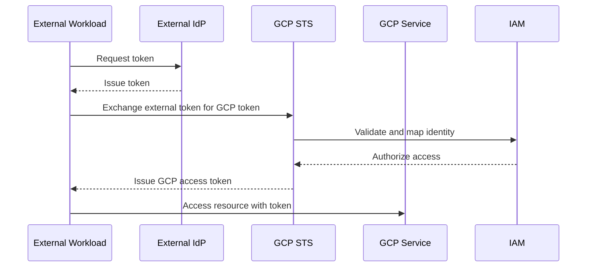
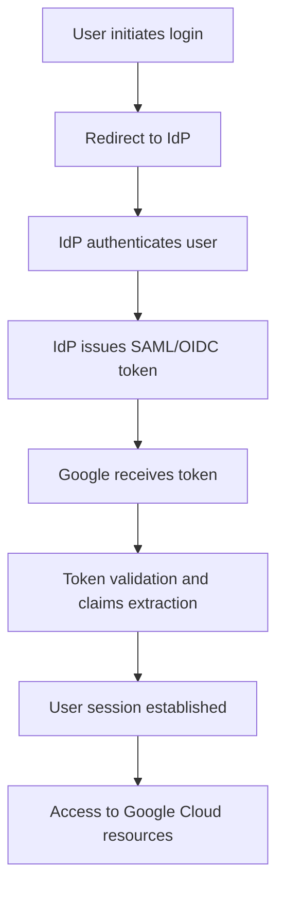

<details open>
<summary><b>Day 07 - Workload Identity Federation, GCDS, SSO, Workforce Identity Federation, IAM Best Practises (KK-CS45-script-v2-Inst-v3)</b></summary>

# Day 07: Workload Identity Federation, GCDS, SSO, Workforce Identity Federation, IAM Best Practises

## Table of Contents

- [Workload Identity Federation](#workload-identity-federation)
  - [Overview](#overview)
  - [Key Concepts and Deep Dive](#key-concepts-and-deep-dive)
  - [Configuration Steps](#configuration-steps)
  - [Lab Demo: Setting Up Workload Identity Federation](#lab-demo-setting-up-workload-identity-federation)
- [Google Cloud Directory Sync (GCDS)](#google-cloud-directory-sync-gcds)
  - [Overview](#overview-1)
  - [Key Concepts and Deep Dive](#key-concepts-and-deep-dive-1)
- [Single Sign-On (SSO) via Workforce Identity Federation](#single-sign-on-sso-via-workforce-identity-federation)
  - [Overview](#overview-2)
  - [Key Concepts and Deep Dive](#key-concepts-and-deep-dive-2)
- [Resource Manager and Org Policies](#resource-manager-and-org-policies)
  - [Overview](#overview-3)
  - [Service Account Organization Policies](#service-account-organization-policies)
- [IAM Best Practices](#iam-best-practices)
  - [Overview](#overview-4)
  - [Key Concepts and Deep Dive](#key-concepts-and-deep-dive-3)
- [Summary](#summary)
  - [Key Takeaways](#key-takeaways)
  - [Quick Reference](#quick-reference)
  - [Expert Insights](#expert-insights)

## Workload Identity Federation

### Overview

Workload Identity Federation represents a revolutionary approach to cloud security in Google Cloud Platform (GCP), introducing federated identity principles to machine-to-machine authentication. Unlike traditional service account key-based methods, this mechanism enables external identities from various identity providers (IdPs) to securely access GCP resources without requiring long-lived credentials stored in code or configuration files.

The core innovation lies in eliminating static secrets that pose significant security risks. By leveraging short-lived tokens issued by external IdPs, organizations can achieve a more secure, scalable, and maintainable authentication model. This approach aligns with modern security paradigms that prioritize ephemeral credentials and zero-trust architectures.

### Key Concepts and Deep Dive

#### Identity Pools and Providers

**Identity Pools** serve as logical containers that organize external identities and map them to GCP service accounts. Each pool maintains a unique namespace to prevent conflicts across different environments or teams.

**Identity Providers** are the external systems that issue tokens for workloads. GCP supports multiple provider types:

- **AWS STS** for Amazon Web Services workloads
- **Azure Workload Identity** for Microsoft Azure environments
- **OIDC-compliant providers** for generic OpenID Connect implementations
- **GitHub Actions** for CI/CD pipelines

#### Authentication Flow



#### Token Exchange Process

Workload Identity Federation implements the OAuth 2.0 Token Exchange specification, enabling seamless credential transformation:

1. **External Token Acquisition**: Workloads obtain tokens from their native IdP
2. **Token Exchange**: External tokens are exchanged for GCP-compatible tokens via the Security Token Service (STS)
3. **Attribute Mapping**: External claims are mapped to GCP identities
4. **Authorization**: GCP evaluates permissions based on the mapped identity

#### Key Advantages

```diff
+ Zero static credentials in code reduced risk of secret exposure
+ Automatic credential rotation eliminates manual key management
+ Universal compatibility works across AWS, Azure, and custom OIDC providers
+ Enhanced auditability through centralized identity tracking
+ Simplified deployment supports hybrid and multi-cloud architectures
```

### Configuration Steps

#### Creating Identity Pools

Identity pools form the foundation of workload identity federation. They provide namespace isolation and support hierarchical organization structure.

#### Attaching Identity Pools to Projects

Pools can be associated with entire projects or specific folders, enabling granular access control across organizational hierarchies.

#### Configuring Providers

Provider configuration involves:

- **Provider Type Selection**: Choose from supported identity provider types
- **Attribute Mapping**: Define how external claims translate to GCP identities
- **Audience Configuration**: Specify token validation parameters
- **Principal Configuration**: Map external identities to GCP service accounts

#### Principal Mapping and Access Control

Principal mapping determines how external identities access GCP resources:

- **Direct Service Account Mapping**: External identities assume specific service accounts
- **Role-Based Access**: Mapped identities receive predefined GCP roles
- **Attribute-Based Access Control**: Permissions based on external claims

### Lab Demo: Setting Up Workload Identity Federation

#### Prerequisites

Ensure you have:

- Active Google Cloud project
- Required APIs enabled
- Appropriate IAM permissions

#### Step-by-Step Implementation

**1. Enable Required APIs**
```bash
gcloud services enable iamcredentials.googleapis.com
gcloud services enable sts.googleapis.com
```

**2. Create Workload Identity Pool**
```bash
gcloud iam workload-identity-pools create my-workload-pool \
  --location=global \
  --project=my-project-id
```

**3. Configure Provider (Using AWS as Example)**
```bash
gcloud iam workload-identity-pools providers create-aws my-aws-provider \
  --workload-identity-pool=my-workload-pool \
  --location=global \
  --account-id=123456789012 \
  --project=my-project-id
```

**4. Set Up Attribute Mapping**
```bash
gcloud iam workload-identity-pools providers update-aws my-aws-provider \
  --workload-identity-pool=my-workload-pool \
  --location=global \
  --attribute-mapping=google.subject=assertion.arn \
  --attribute-condition="assertion.arn.startsWith('arn:aws:sts::123456789012:assumed-role/')" \
  --project=my-project-id
```

**5. Grant IAM Permissions**
```bash
gcloud iam service-accounts add-iam-policy-binding myserviceaccount@my-project.iam.gserviceaccount.com \
  --role=roles/iam.workloadIdentityUser \
  --member="principalSet://iam.googleapis.com/projects/123456789/locations/global/workloadIdentityPools/my-workload-pool/attribute.aws_role/arn:aws:sts::123456789012:assumed-role/my-role"
```

**6. Configure Application Code**

For AWS workloads:
```python
import boto3
from google.auth import iam
from google.auth.transport.requests import Request

# Get AWS credentials
aws_creds = boto3.Session().get_credentials()

# Exchange for GCP token
creds = iam.Credentials(
    signer=aws_creds,
    service_account_email='myserviceaccount@my-project.iam.gserviceaccount.com',
    token_url='https://sts.googleapis.com/v1/token',
    additional_claims={
        'audience': '//iam.googleapis.com/projects/123456789/locations/global/workloadIdentityPools/my-workload-pool/providers/my-aws-provider'
    }
)

creds.refresh(Request())
```

#### Verification Steps

**1. Test Authentication**
```bash
gcloud auth application-default login --impersonate-service-account=myserviceaccount@my-project.iam.gserviceaccount.com
```

**2. Validate Token Exchange**
```bash
curl -H "Authorization: Bearer $(gcloud auth print-access-token)" \
  https://iamcredentials.googleapis.com/v1/projects/-/serviceAccounts/myserviceaccount@my-project.iam.gserviceaccount.com:generateAccessToken
```

## Google Cloud Directory Sync (GCDS)

### Overview

Google Cloud Directory Sync (GCDS) bridges the gap between Windows Active Directory and Google Cloud Identity, enabling seamless identity lifecycle management across hybrid environments. This synchronization tool ensures that changes in on-premises Active Directory are automatically reflected in Google Cloud Identity, maintaining consistent user attributes, group memberships, and organizational structures.

### Key Concepts and Deep Dive

#### Synchronization Architecture

GCDS operates as a bridge between disparate directory systems:

- **Source Directory**: Windows Active Directory (on-premises or cloud-hosted)
- **Target Directory**: Google Cloud Identity
- **Synchronization Engine**: Rules-based mapping and transformation logic

#### Key Capabilities

1. **User Account Synchronization**
   - Creation of Google accounts from AD users
   - Synchronization of core attributes (name, email, department)
   - Password hash synchronization for seamless authentication

2. **Group Membership Management**
   - Hierarchical group structure preservation
   - Dynamic group membership updates
   - Role-based access control mapping

3. **Organizational Unit Mapping**
   - Preservation of AD organizational structure
   - Custom mapping rules for complex hierarchies
   - Path-based organizational assignments

#### Configuration Process

**1. GCDS Installation and Setup**
```bash
# Download and install GCDS
wget https://dl.google.com/cloudsync/gcds/gcds-v4.5.0.exe
# Run installer with administrative privileges
```

**2. Directory Connection Configuration**
```yaml
# configuration.yaml
source:
  type: active_directory
  domain: example.com
  username: gcds-service@example.com

target:
  type: google_cloud_identity
  customer_id: C01234567

sync_rules:
  - user_filter: "(objectClass=user)"
    attribute_mapping:
      primaryEmail: "userPrincipalName"
      name.givenName: "givenName"
      name.familyName: "sn"
```

**3. Synchronization Rules Definition**
- Include/exclude filters for selective synchronization
- Attribute transformation rules for data normalization
- Conflict resolution policies for handling discrepancies

#### Implementation Considerations

```diff
! Complex mapping rules require careful planning
! Password synchronization policies must comply with security standards
! Network connectivity between AD and Google Cloud is critical
```

> [!NOTE]
> GCDS operates in a one-way synchronization model, from AD to Google Cloud Identity. Changes made directly in Google Cloud Identity may be overwritten during the next sync cycle.

## Single Sign-On (SSO) via Workforce Identity Federation

### Overview

Workforce Identity Federation extends the principles of Workload Identity Federation to human users, enabling seamless single sign-on (SSO) across diverse identity providers. This mechanism allows organizations to leverage existing identity investments while maintaining unified access to Google Cloud resources, eliminating password synchronization and reducing administrative overhead.

### Key Concepts and Deep Dive

#### Supported Identity Providers

GCP supports multiple SSO protocols for workforce identity federation:

| Provider Type | Protocol | Use Cases |
|---------------|----------|-----------|
| Microsoft Azure AD | SAML/OIDC | Enterprise Azure environments |
| Okta | SAML/OIDC | Third-party identity management |
| Ping Identity | SAML | Enterprise federation |
| Custom OIDC | OIDC | Custom identity implementations |
| ADFS | SAML | Windows Server environments |

#### Authentication Flow



#### Key Features

**Protocol Support**
- **SAML 2.0**: Industry-standard XML-based federation protocol
- **OIDC**: Modern JSON Web Token-based authentication flow
- **SCIM**: User lifecycle management and provisioning

**Integration Methods**
- **SP-initiated SSO**: Login initiated from Google services
- **IdP-initiated SSO**: Login initiated from external identity provider
- **SAML metadata exchange**: Automated configuration through XML metadata

**Advanced Capabilities**
- **Multi-factor Authentication**: Leverage IdP MFA capabilities
- **Just-in-Time Provisioning**: Automatic user account creation
- **Attribute Mapping**: Custom claims mapping to user profile attributes

#### Configuration Process

**1. Workforce Identity Pool Setup**
```bash
gcloud iam workforce-identity-pools create my-workforce-pool \
  --location=global \
  --display-name="My Workforce Pool" \
  --project=my-project-id
```

**2. Provider Configuration (SAML Example)**
```bash
gcloud iam workforce-identity-pools providers create-saml my-saml-provider \
  --workforce-identity-pool=my-workforce-pool \
  --location=global \
  --idp-metadata-path=saml-metadata.xml \
  --attribute-mapping="google.subject=assertion.subject" \
  --project=my-project-id
```

**3. User Access Policy Configuration**
```yaml
# workforce_identity_config.yaml
access_policy:
  allowed_domains:
    - example.com
  session_duration: 8h
  mfa_requirement: required

attribute_mapping:
  email: assertion.email
  department: assertion.department
  manager: assertion.manager
```

## Resource Manager and Org Policies

### Overview

Google Cloud Resource Manager provides the foundational framework for organizing and governing cloud resources across organizational hierarchies. Organization policies extend this governance model by enforcing mandatory constraints at various levels of the resource hierarchy, ensuring consistent security postures and compliance requirements.

### Service Account Organization Policies

#### Key Organization Policies for Service Accounts

**1. Domain-Restricted Sharing**
```yaml
# Organization Policy Configuration
policies:
  - constraint: constraints/iam.allowedPolicyMemberDomains
    listPolicy:
      allowedValues:
        - example.com
        - trusted-domain.org
```

**2. Service Account Key Restrictions**
```yaml
policies:
  - constraint: constraints/iam.disableServiceAccountKeyCreation
    booleanPolicy:
      enforced: true
```

**3. Service Account Key Rotation**
```yaml
policies:
  - constraint: constraints/iam.serviceAccountKeyExpiryHours
    listPolicy:
      allowedValues:
        - "168"  # 7 days
```

> [!IMPORTANT]
> Organization policies cascade down the resource hierarchy. Policies set at the organization level apply to all projects and folders unless explicitly overridden at lower levels.

## IAM Best Practices

### Overview

Effective IAM implementation in Google Cloud requires a systematic approach that balances security requirements with operational efficiency. These best practices establish a comprehensive governance framework for identity and access management across complex cloud architectures.

### Key Concepts and Deep Dive

#### Principle of Least Privilege Implementation

```diff
+ Implement default "deny all" access control
- Avoid primitive roles (Editor, Owner)
+ Use custom roles with minimal required permissions
+ Implement resource-level IAM policies
+ Regular access reviews and audits
```

#### Service Account Management

**Key Principles**
- Use Google-managed service account keys when possible
- Enable automatic key rotation for user-managed keys
- Implement short-lived credentials via STS
- Attach service accounts directly to resources

**Security Controls**
```yaml
# Service Account Security Configuration
service_accounts:
  - name: compute-service-account
    key_rotation:
      enabled: true
      max_age_days: 30
    labels:
      environment: production
      team: devops
```

#### Conditional IAM Policies

Enable granular access control based on context:

```yaml
conditional_policies:
  - title: "IP-based Access Restriction"
    expression: |
      request.ip in ["192.168.1.0/24", "10.0.0.0/8"]

  - title: "Time-based Access"
    expression: |
      request.time.getHours() >= 9 && request.time.getHours() <= 17

  - title: "Device-based Access"
    expression: |
      resource.type == "compute.googleapis.com/Instance" &&
      resource.labels.environment == "production"
```

#### Audit Logging and Monitoring

**Critical Audit Events**
- Authentication events (successful/failed logins)
- Authorization decisions (permission grants/denies)
- Service account key usage
- Policy changes

**Monitoring Configuration**
```bash
# Enable IAM audit logs
gcloud logging sinks create iam-audit-sink \
  storage.googleapis.com/projects/my-project/buckets/iam-audit-logs \
  --log-filter='logName:"logs/cloudaudit.googleapis.com%2Factivity"'
```

#### Organizational Governance

**Hierarchy-Based Access Control**
```
Organization
├── Folders (Departments)
│   ├── Projects (Applications)
│   │   ├── Resources (VMs, Storage, etc.)
```

**Policy Inheritance Rules**
- Policies cascade down the hierarchy
- Child resources can have additional constraints
- Organization-level policies cannot be relaxed at lower levels

#### Common Security Pitfalls

> [!WARNING]
> **Over-permissive roles**: Using broad roles like Editor instead of specific custom roles
> **Long-lived service account keys**: Storing keys in code repositories or configuration files
> **Missing audit logging**: Inability to track access patterns and security incidents
> **Inadequate separation of duties**: Single accounts with access to both development and production

## Summary

### Key Takeaways

```diff
+ Workload Identity Federation eliminates static credentials for machine-to-machine authentication
+ GCDS enables seamless synchronization between Active Directory and Google Cloud Identity
+ Workforce Identity Federation provides enterprise-grade SSO capabilities
+ Organization policies enforce mandatory security constraints across resource hierarchies
+ Comprehensive audit logging is essential for IAM governance and compliance

+ Default "deny all" approach with explicit permission grants
- Primitive roles must be replaced with custom roles for least privilege
+ Short-lived credentials and automatic rotation reduce security risks
- Service account keys should never be stored in code or configuration files
+ Conditional policies enable context-aware access control
+ Regular access reviews prevent permission creep
```

### Quick Reference

#### Core Commands

```bash
# Create workload identity pool
gcloud iam workload-identity-pools create POOL_NAME --location=global

# Configure OIDC provider
gcloud iam workload-identity-pools providers create-oidc PROVIDER_NAME \
  --workload-identity-pool=POOL_NAME \
  --issuer-uri=https://token.actions.githubusercontent.com \
  --attribute-mapping=google.subject=assertion.sub

# Enable audit logging
gcloud logging sinks create iam-audit-sink \
  storage.googleapis.com/projects/PROJECT_ID/buckets/audit-logs \
  --log-filter='logName:"logs/cloudaudit.googleapis.com%2Factivity"'
```

#### Important URLs and Resources

- **IAM Documentation**: https://cloud.google.com/iam/docs
- **Workload Identity Federation Guide**: https://cloud.google.com/iam/docs/workload-identity-federation
- **Organization Policies**: https://cloud.google.com/resource-manager/docs/organization-policy/overview
- **Security Best Practices**: https://cloud.google.com/security/best-practices

#### Role Comparison Table

| Role Type | Scope | Use Case | Best Practice |
|-----------|-------|----------|---------------|
| Primitive | Broad (Project) | Quick setup | Replace with custom roles |
| Predefined | Specific service | Standard operations | Fine-tune permissions |
| Custom | Granular | Least privilege | Preferred approach |

### Expert Insights

#### Real-World Application
In production environments, Workload Identity Federation enables secure cross-cloud access patterns. Organizations typically implement centralized identity pools per business unit while maintaining strict organizational policies. GCDS synchronization ensures consistent user lifecycle management across hybrid infrastructures.

#### Expert Path
Master IAM by starting with organizational design principles. Focus on custom role creation using permission analyzers to identify over-permissive assignments. Implement automated credential rotation and establish comprehensive audit logging aggregation for security monitoring.

#### Common Pitfalls
- **Insufficient testing of conditional policies** leading to unexpected access denials
- **Overriding organization policies** at project level, creating security gaps
- **Ignoring service account labeling** complicating resource governance
- **Manual credential management** increasing risk of secret exposure

#### Lesser-Known Facts
- Workload identity pools support up to 100 providers per pool, enabling complex multi-cloud scenarios
- IAM deny policies take precedence over allow policies, providing defense-in-depth capabilities
- Resource-level IAM policies can be inherited but not escalated beyond organizational constraints

#### Advantages
- **Zero-Trust Architecture**: Ephemeral credentials and continuous validation
- **Multi-Cloud Flexibility**: Unified identity management across cloud platforms
- **Operational Efficiency**: Automated synchronization reduces manual administrative tasks
- **Compliance Readiness**: Comprehensive audit trails support regulatory requirements

#### Disadvantages
- **Complexity**: Requires careful planning and testing of identity mappings
- **Migration Challenges**: Legacy systems may require significant refactoring
- **Monitoring Overhead**: Detailed audit logging generates substantial log volumes
- **Cost Considerations**: Advanced IAM features incur additional licensing expenses

</details>