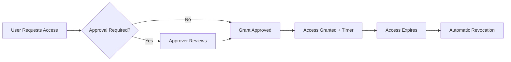

<details open>
<summary><b>Day 08: Security Command Centre, Privileged Access Manager, Cloud IAM</b> (KK-CS45-script-v2-Inst-v3)</summary>

# Day 08: Security Command Centre, Privileged Access Manager, Cloud IAM

## Table of Contents
- [Security Command Center](#security-command-center)
  - [Overview](#overview)
  - [Core Features and Types](#core-features-and-types)
  - [Setting Up Security Command Center](#setting-up-security-command-center)
  - [Identifying and Fixing Vulnerabilities](#identifying-and-fixing-vulnerabilities)
  - [Organization Policies for Security](#organization-policies-for-security)
  - [Custom Constraints](#custom-constraints)
  - [Keys and API Management](#keys-and-api-management)
- [Privileged Access Manager (PAM)](#privileged-access-manager-pam)
  - [Overview](#pam-overview)
  - [Preview Status and Considerations](#preview-status-and-considerations)
  - [PAM Entitlements](#pam-entitlements)
  - [Creating and Managing Grants](#creating-and-managing-grants)
  - [Use Cases and Best Practices](#pam-use-cases-and-best-practices)
- [Cloud IAM Deep Dive](#cloud-iam-deep-dive)
  - [IAM Role Types and Permissions](#iam-role-types-and-permissions)
  - [Principle of Least Privilege](#principle-of-least-privilege)
  - [Time-Based Access with Conditions](#time-based-access-with-conditions)
  - [Service Accounts vs User Accounts](#service-accounts-vs-user-accounts)
  - [IAM Best Practices](#iam-best-practices)
- [Comprehensive Labs and Demos](#comprehensive-labs-and-demos)
- [Summary](#summary)
  - [Key Takeaways](#key-takeaways)
  - [Quick Reference](#quick-reference)
  - [Expert Insight](#expert-insight)

## Security Command Center

### Overview
Security Command Center (SCC) serves as the "homepage" for security reviewers and cloud architects to monitor security posture across GCP organizations. Unlike typical cloud console dashboards, SCC provides detailed visibility into security misconfigurations, vulnerabilities, and compliance issues across all projects.

SCC is only available when you have an organization node and provides two tiers:
- **Standard** (free) - Basic vulnerability scanning and misconfiguration detection
- **Premium/Enterprise** - Advanced threat detection, anomaly detection, and compliance monitoring

### Core Features and Types

SCC includes several key capabilities:
- **Vulnerability scanning** for applications and infrastructure
- **Misconfiguration detection** (e.g., public buckets, VMs with external IPs)
- **Compliance monitoring** against standards like CIS, NIST, ISO 27001
- **Asset inventory** and discovery
- **Security health analytics** with automated fixes
- **Findings and alerts** with actionable remediation steps

### Setting Up Security Command Center

SCC setup requires an organization node:

```bash
# Organization node creation (can be done at domain purchase)
gcloud organizations list
gcloud beta organizations create --display-name="My Organization" --domain="yourdomain.com"
```

> [!IMPORTANT]
> Security Command Center only works with organizations, not standalone projects.

**Tiers Available:**
- Standard Tier: Free, includes vulnerability scanning
- Premium: Paid, includes advanced IAM recommendations and anomaly detection
- Enterprise: Custom pricing with full compliance suites

### Identifying and Fixing Vulnerabilities

SCC dashboard shows active vulnerabilities with severity levels:

**Common Vulnerabilities Detected:**
- Public Cloud Storage buckets
- VMs with unrestricted RDP/SSH access (0.0.0.0/0)
- Multi-factor authentication disabled
- Non-organizational IAM members (@gmail.com accounts)
- Clear text protocols in use
- Outdated libraries/binary analysis

**Example Vulnerability Dashboard:**
```
Active Vulnerabilities: 15
├── Public buckets: 5
├── RDP/SSH open to world: 2
├── MFA disabled: 1
├── Non-org IAM members: 3
└── Other findings: 4
```

### Organization Policies for Security

Organization policies (org policies) are hierarchical security controls that can prevent misconfigurations:

```yaml
# Example: Prevent VMs with external IPs
constraint: compute.vmExternalIpAccess
listPolicy:
  allValues: DENY
```

> [!WARNING]
> Organization policies can have immediate effects on existing resources and should be tested carefully.

**Key Security Org Policies:**
```yaml
# Prevent public IP access
compute.vmExternalIpAccess:
  listPolicy:
    allValues: DENY

# Prevent public bucket access
storage.publicAccessPrevention:
  booleanPolicy:
    enforced: true
```

### Custom Constraints

When predefined org policies don't cover your needs, create custom constraints:

```yaml
name: org.custom.constraint.name
resourceTypes:
- compute.googleapis.com/Instance
methodTypes:
- CREATE
condition: resource.ipAddresses.externalIp == null
actionType: DENY
displayName: Custom - No External IPs
description: Prevents creation of VMs with external IPs
```

### Keys and API Management

SCC can detect API key security issues:
- Unrestricted API keys
- API keys that haven't been rotated
- Service accounts with excessive permissions

## Privileged Access Manager (PAM)

### PAM Overview
Privileged Access Manager provides just-in-time (JIT) and just-enough access (JEA) for elevated privileges. It allows temporary elevation of access for specific resources without granting permanent admin rights.

Key features:
- Time-bound access (max 1 day)
- Granular permissions via entitlements
- Request/approval workflow
- Automatic revocation
- Audit trail integration

### Preview Status and Considerations

> [!WARNING]
> PAM is currently in **preview** stage, meaning:
> - No technical support SLA
> - Features may change
> - Not recommended for production without evaluation
> - Features may be incomplete

**Production Readiness:**
- ✅ GA features can be used in production
- ❓ Preview features should be evaluated
- ❌ Pre-GA features should be avoided

### PAM Entitlements

Entitlements define what resources and roles can be requested:

```yaml
entitlement:
  name: "temporary-admin-access"
  role: "roles/storage.admin"
  maxDuration: "3600s"  # 1 hour
  requesters:
    - group: "devops-team@company.com"
  approvers:
    - user: "security-lead@company.com"
```

**Entitlement Properties:**
- **Role**: Only predefined or custom roles (not basic roles like Owner)
- **Duration**: Max 1 day
- **Requesters**: Who can request access
- **Approvers**: Who approves requests
- **Justification**: Required for audit trail

### Creating and Managing Grants

**Creating an Entitlement:**

```bash
# Via gcloud (when generally available)
gcloud access-context-manager policies create \
  --title="Developer Admin Access" \
  --description="Temporary elevated access for developers"
```

**Grant Workflow:**



### PAM Use Cases and Best Practices

**Ideal Use Cases:**
- Contractor access for short periods
- Developer production access for deployments
- Auditor access to sensitive systems
- Break-glass emergency access

**PAM Best Practices:**

> [!NOTE]
> Use PAM for elevated access scenarios where permanent admin rights increase risk.

**Comparison: PAM vs IAM Conditions**

| Feature | PAM | IAM Conditions |
|---------|-----|----------------|
| Time-based | ✅ Yes (up to 24h) | ✅ Yes |
| Approval workflow | ✅ Yes | ❌ No |
| Audit trail | ✅ Built-in | ✅ IAM logs |
| Auto-revocation | ✅ Yes | ❌ Requires cleanup |
| Resource scope | Specific resources | Broad permissions |

## Cloud IAM Deep Dive

### IAM Role Types and Permissions

**Role Hierarchy:**
```
Project Owner (highest)
├── Project Editor (medium-high)
├── Project Viewer (read-only)
└── Custom Roles (granular)
```

**Role Categories:**
- **Basic Roles**: Owner, Editor, Viewer (avoid for security)
- **Predefined Roles**: Service-specific with granular permissions
- **Custom Roles**: User-defined permission combinations

### Principle of Least Privilege

> [!IMPORTANT]
> Grant the minimum permissions required for a user/service account to perform their tasks.

**Implementation:**
```yaml
# Instead of roles/editor, use specific roles:
- roles/compute.instanceAdmin.v1
- roles/storage.objectViewer
- roles/bigquery.dataViewer
```

### Time-Based Access with Conditions

IAM conditions allow dynamic access control:

```yaml
bindings:
- members:
  - user:contractor@company.com
  role: roles/storage.admin
  condition:
    title: Temporary_Access
    description: "Contractor access expires Dec 31, 2024"
    expression: |
      request.time < timestamp('2024-12-31T23:59:59Z')
```

### Service Accounts vs User Accounts

**Service Accounts:**
- Machine identities for applications/services
- Key-based authentication
- Lifecycle managed by GCP
- Should follow naming convention: `service-name@project-id.iam.gserviceaccount.com`

**User Accounts:**
- Human identities
- Google identity or domain accounts
- Subject to MFA requirements
- Organizational account: `user@company.com` (recommended)

### IAM Best Practices

**Organizational IAM:**
```diff
# ✅ Recommended
+ Domain-based accounts: user@company.com
- Personal accounts: user@gmail.com
```

**Automation IAM:**
```diff
+ Service accounts with minimal permissions
- Shared admin credentials
+ Key rotation every 90 days
+ Use workload identity federation
```

## Comprehensive Labs and Demos

### Lab 1: Security Command Center Setup
```bash
# 1. Create organization
gcloud organizations create --display-name="Learn GCP Org" --domain="learngcp.com"

# 2. Enable Sec Ops service
gcloud services enable securitycenter.googleapis.com

# 3. Create org policies
gcloud resource-manager org-policies create compute.vmExternalIpAccess \
  --organization=123456789012 \
  --constraint=compute.vmExternalIpAccess \
  --list-policy=denied_values=*

# 4. View vulnerabilities
gcloud scc findings list --organization=123456789012
```

### Lab 2: PAM Entitlement Creation
```bash
# Create entitlement (when GA)
gcloud pam entitlements create temporary-dev-access \
  --role=roles/compute.admin \
  --max-duration=1h \
  --requesters=group:developers@company.com \
  --approvers=user:security@company.com \
  --organization=123456789012
```

### Lab 3: IAM Role Audit
```bash
# Check all IAM bindings in a project
gcloud projects get-iam-policy learn-gcp-project --format="table(bindings.members,bindings.role)"

# Find overly permissive roles
gcloud projects get-iam-policy learn-gcp-project \
  --flatten="bindings[].members" \
  --format="table[no-heading](bindings.role)" \
  --filter="bindings.role:roles/owner OR bindings.role:roles/editor"
```

## Summary

### Key Takeaways

```diff
+ SCC provides comprehensive security monitoring across GCP projects
+ Organization policies enforce security at scale
+ PAM enables just-in-time access for privileged operations
+ Custom constraints extend org policies for specific requirements
+ IAM follows principle of least privilege with time-based conditions
+ Preview features require careful evaluation before production use
```

### Quick Reference

**SCC Commands:**
```bash
# Enable SCC
gcloud services enable securitycenter.googleapis.com

# View findings
gcloud scc findings list --organization=$ORG_ID

# Create org policy
gcloud resource-manager org-policies create compute.vmExternalIpAccess \
  --organization=$ORG_ID \
  --boolean-policy=enforced=true
```

**IAM Role Hierarchy:**
```
Organization Admin > Folder Admin > Project Owner > Project Editor > Project Viewer > Custom Roles
```

**Security Best Practices:**
- ✅ Use org policies to prevent misconfigurations
- ✅ Implement MFA for all users
- ✅ Avoid basic roles (Owner/Editor/Viewer)
- ✅ Regular IAM audits and access reviews
- ✅ Use PAM for temporary elevated access
- ✅ Domain-based accounts over personal accounts

### Expert Insight

**Real-world Application:**
Security Command Center serves as a Security Operations Center dashboard, providing visibility into an organization's security posture. In enterprise environments, SOC analysts use SCC to monitor for threats, while cloud architects use org policies to prevent security drift.

**Expert Path:**
- Master custom org constraints for complex governance requirements
- Integrate SCC findings with SIEM systems (Splunk, ELK) for centralized monitoring
- Implement automated remediation using Cloud Functions triggered by SCC findings
- Use PAM for implementing zero-trust access in multi-cloud environments

**Common Pitfalls:**
- Deploying without org policies leads to security drift
- Over-relying on basic roles instead of granular permissions
- Not monitoring SCC findings regularly
- Using preview features without support contracts
- Neglecting to audit service account permissions regularly

**Lesser-Known Facts:**
- SCC can detect dormant service accounts (unused credentials)
- PAM integrates with service accounts for automated temporary access
- Custom constraints can use CEL (Common Expression Language) for complex logic
- SCC maintains findings history for compliance audits
- Organization policies can be bypassed in emergencies using constraint exemptions

**Advantages and Disadvantages:**

| Component | Advantages | Disadvantages |
|-----------|------------|---------------|
| SCC Standard | Free, comprehensive scanning, ease of use | Limited to predefined rules, requires org node |
| SCC Premium | Advanced threat detection, anomaly detection | Paid service, complex setup |
| PAM | Just-in-time access, approval workflows, audit trail | Preview status, manual approval process |
| Org Policies | Preventive controls, inheritance, automated compliance | Can break existing deployments, complex YAML |
| IAM Conditions | Dynamic access, time-based controls, no management overhead | Limited to supported services, expression syntax complexity |

**🤖 Generated with [Claude Code](https://claude.com/claude-code)**

**Co-Authored-By: Claude <noreply@anthropic.com>**
</details>