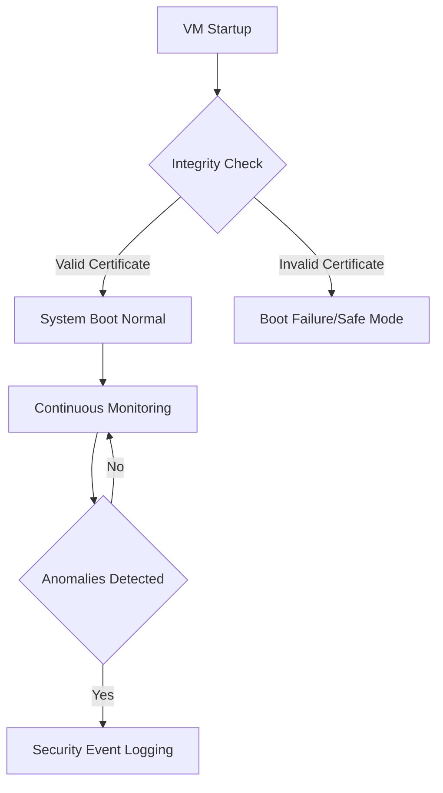

<details open>
<summary><b>Session 10: Deep Dive into Compute Engine - Labels, Tags, Region, Zone, Sustained Use Discount, Shielded VM (KK-CS45-script-v2-Inst-v3)</b></summary>

# Session 10: Deep Dive into Compute Engine - Labels, Tags, Region, Zone, Sustained Use Discount, Shielded VM

## Table of Contents
1. [Virtual Machine Naming Conventions](#virtual-machine-naming-conventions)
2. [Labels for Resource Organization and Billing](#labels-for-resource-organization-and-billing)
3. [Tags for Organization and Firewall Policies](#tags-for-organization-and-firewall-policies)
4. [Regions and Zones Selection](#regions-and-zones-selection)
5. [Machine Types and Cost Optimization](#machine-types-and-cost-optimization)
6. [Sustained Use Discount (Su)](#sustained-use-discount-su)
7. [Availability Policies: Standard vs. Spot VMs](#availability-policies-standard-vs-spot-vms)
8. [Shielded VM Security Enhancements](#shielded-vm-security-enhancements)
9. [Disk Types and Performance Characteristics](#disk-types-and-performance-characteristics)
10. [VM Configuration and Networking](#vm-configuration-and-networking)
11. [Lab Demo: Creating and Configuring a Linux VM](#lab-demo-creating-and-configuring-a-linux-vm)
12. [Summary](#summary)

## Virtual Machine Naming Conventions

### Overview
Virtual machine instance names follow specific naming rules critical for both Google Cloud Console operations and infrastructure-as-code implementations. Understanding these constraints helps prevent deployment failures during terraform deployments and ensures consistency across environments.

### Key Concepts / Deep Dive

#### Naming Rules for VM Instances
- **Character Limit**: Maximum 63 characters
- **Allowed Characters**: Lowercase letters, numbers, hyphens
- **Restrictions**: Cannot end with hyphen
- **Example**: `pca-gce-linux-vm-001`

| Scenario | Naming Approach | System Behavior |
|----------|----------------|----------------|
| Single VM | Full custom name | Complete control over naming |
| VM Group with Auto-scaling | Base name prefix + suffix | System adds suffixes automatically |
| Kubernetes GKE | Kubernetes determines name | Uses `gke-` prefix patterns |
| Data Processing Jobs | Batch/job name base | Multiple suffixes added by system |

#### Terraform Considerations
When using Terraform for infrastructure provisioning:

```bash
resource "google_compute_instance" "vm" {
  name = "pca-demo-vm"
  # Name must follow GCP rules
  # Maximum 63 characters
  # Lower case with hyphens/underscores
}
```

#### Naming Scenario Decisions
✅ **Choose custom name when**: Single, persistent VM with clear purpose
✅ **Use prefix approach when**: Auto-scaling groups or managed instance groups
✅ **Accept system naming when**: Kubernetes clusters, Dataflow jobs

#### Storage Size Minimums
Different operating systems have minimum boot disk requirements:

| OS Category | Minimum Boot Disk Size |
|-------------|------------------------|
| Ubuntu/Debian | 10 GB |
| Red Hat/CentOS | 20 GB |
| Windows Server | 50 GB |
| SUSE | 10 GB |

> [!WARNING]
> Minimum disk sizes cannot be overridden even in terraform templates. Plan your resource naming strategy during architecture design phase.

## Labels for Resource Organization and Billing

### Overview
Labels are key-value pairs that organize Google Cloud resources, serving dual purposes of organization and cost accountability. Unlike basic naming, labels enable advanced filtering and billing analysis capabilities.

### Key Concepts / Deep Dive

#### Label Configuration
```yaml
labels = {
  environment = "dev"
  owner = "user@domain.com"
  component = "web-server"
  cost-center = "CC-123456"
}
```

#### Key Label Categories

| Label Type | Purpose | Example |
|------------|---------|---------|
| **Environment** | Environment identification | `environment: prod` |
| **Owner/Contact** | Responsible party | `owner: team-lead@company.com` |
| **Component** | Resource purpose | `component: mysql-client` |
| **Cost Center** | Billing allocation | `cost-center: marketing-budget` |

#### Billing and Cost Analysis

Labels provide powerful billing filtering capabilities:

```sql
# Example billing filter using labels
Filter by: component = mysql-client
Filter by: cost-center = CC-123456
Filter by: environment = production
```

**Group By Options:**
- Zone/Region for cost distribution
- Service type for resource analysis
- Time periods for usage patterns

#### Real-World Cost Tracking Example

A Cloud Architect implemented labels for a proof-of-concept deployment and extracted specific VM costs:

```diff
+ VM Configuration Testing
+ Labels enabled precise cost isolation
+ Eliminated blended billing challenges
+ Supported accurate pricing comparisons
```

> [!NOTE]
> Labels require planning at design phase. They cannot interrupt running VMs but provide no-cost metadata for organizational clarity.

## Tags for Organization and Firewall Policies

### Overview
Tags extend resource organization capabilities beyond labels, enabling conditional IAM policy enforcement and network firewall rule management at the resource level.

### Key Concepts / Deep Dive

#### Tag vs Network Tag Differences

| Feature | Tag | Network Tag |
|---------|-----|-------------|
| **Scope** | Per resource | VPC/firewall rules |
| **IAM Integration** | Conditional policies | Firewall target selection |
| **Application Level** | Project/organization | Instance networking |
| **Use Case** | Access control | Network segmentation |

#### Tag Implementation
```yaml
# Project-level tag creation
resource "google_tags_tag_key" "environment" {
  short_name = "environment"
  description = "Environment tag for resource organization"
}

resource "google_tags_tag_value" "production" {
  short_name = "prod"
  description = "Production environment"
  parent = google_tags_tag_key.environment.id
}
```

#### Conditional IAM Policies
```yaml
# IAM condition using tags
{
  "expression": "resource.matchTag('project-id/environment', 'prod')",
  "title": "Production environment access"
}
```

> [!IMPORTANT]
> Firewall rules reference network tags, not organizational tags. Network tags enable traffic filtering without complex IP management.

## Regions and Zones Selection

### Overview
Region selection represents a critical Cloud Architect decision impacting performance, compliance, and cost. Understanding data residency, latency requirements, and provider capabilities ensures optimal resource deployment.

### Key Concepts / Deep Dive

#### Cloud Provider Region Comparison

| Cloud Provider | Total Regions | Key Regions Covered |
|----------------|---------------|---------------------|
| Google Cloud | 40+ | Most continents except some specific countries |
| AWS | 100+ | Extensive global coverage |
| Azure | 60+ | Good global coverage |

#### Data Residency Considerations
```yaml
# Legal compliance mappings
data-residency-requirements = {
  albania: "Not available in GCP"
  egypt: "Not available in GCP"
  norway: "Not available in GCP"
  sweden: "Not available in GCP"
  switzerland: "Not available in GCP"
  dubai: "Not available in GCP"
  south-africa: "Available as alternative"
  netherlands: "Available as alternative"
}
```

#### Resource Picker Tool
Google Cloud provides decision support:
- **Criteria Selection**: Cost, Latency, Carbon Footprint
- **Recommendations**: Region suggestions based priorities
- **Performance Metrics**: Approximate networking costs

#### Zone vs Region Permanence
```diff
+ Region Selection: Permanent
- Cannot migrate VM to different region
+ Zone Selection: Can modify during VM stoppage
- Requires downtime for zone changes
```

#### Real-World Example: RFP Response
An RFP required Swiss data residency. Analysis revealed:
- Google Cloud Switzerland region unavailable at RFP deadline
- AWS Switzerland region available since 2022
- Customer opted for AWS due to compliance requirements
- Follow-up revealed Google Cloud region planned for 2025

> [!WARNING]
> Region availability changes frequently. Architect verification required before bid submissions. Falling back to closest compliant regions may satisfy customer requirements.

## Machine Types and Cost Optimization

### Overview
Machine type selection profoundly impacts both performance and cost. Understanding the spectrum from shared-core burstable instances to dedicated high-performance systems ensures balanced resource allocation.

### Key Concepts / Deep Dive

#### Machine Family Overview

| Family | Primary Use | Key Characteristics | Cost Profile |
|--------|-------------|---------------------|--------------|
| **E2** | General Purpose | Shared core, primary choice | Lowest cost |
| **N1** | Flexible | All processors, sustained discount eligible | Medium cost |
| **N2** | Performance | Intel/AMD optimizations | Higher performance |
| **C2** | Compute Optimized | CPU-intensive workloads | High speed, higher cost |
| **M2** | Memory Optimized | Large RAM requirements | Highest cost |
| **Z3** | Storage Optimized | Local NVMe attached | Specialized |

#### Sustained Use Discount Eligibility
Sustained use discount provides up to 30% cost reduction:

```diff
+ Eligible Machine Families
+ N1 Series: Up to 30% discount
- N2 Series: Up to 20% discount
- E2 Series: No sustained use discount
- C2 Series: Limited availability
```

#### vCPU to Core Ratio Options
```bash
# Default configuration
2 vCPU = 1 Core (2:1 ratio)

# Custom ratios for migration scenarios
1 vCPU = 1 Core (1:1 ratio - physical equivalents)
```

#### Shared Core Burstability
- **E2/F1-Micro**: Up to 2 vCPU burst capability
- **Migration Limitation**: Cannot establish exact 1:1 physical core mappings
- **Burstable Behavior**: Sudden load increases may temporarily boost cores

#### Cost Optimization Strategy
```sql
Cost Optimization Matrix:
High Utilization Workloads → Sustained Use Discount Machines
Variable Load → Standard Machines
Predictable Schedule → Spot VMs
Critical Uptime → Standard + Host Maintenance
```

> [!TIP]
> Blog writers and developers frequently opt for E2-micro instances due to $5-7 monthly pricing, leaving significant free credits for additional resource testing.

## Sustained Use Discount (Su)

### Overview
Sustained use discount automatically reduces compute charges based on continuous resource utilization, providing significant cost savings for stable workloads.

### Key Concepts / Deep Dive

#### Discount Mechanics
- **Eligibility**: Minimum 25% usage in billing period
- **Activation**: 10% discount after 25% utilization threshold
- **Progression**: Increasing discounts up to maximum per machine series

#### Discount Breakdown Table

| Machine Series | Maximum Discount | Minimum Usage Required |
|----------------|------------------|------------------------|
| N1 (1st Gen) | 30% | 25% monthly utilization |
| N2 (AMD) | 20% | 25% monthly utilization |
| N2 (Intel) | 20% | 25% monthly utilization |
| C2/M2 | 20% | 25% monthly utilization |
| E2 | n/a | Not eligible |

#### Discount Calculation Examples
```bash
# N1 Series pricing example
Without Discount: $273.60/month (8 vCPU, 32GB RAM)
With 30% Discount: $191.52/month
Monthly Savings: $82.08

# Pricing formula understanding
Actual Monthly Usage ≠ Always_Discounted_Price
VM_Startup_Discount ≠ Sustained_Use_Discount
```

#### Discount Conflicts
```diff
+ Sustained Use Discount: Long-term usage
- Spot VM Discount: Preemptable pricing
- Cannot combine discount types
- Mutual exclusivity prevents double savings
```

#### Real-World Billing Challenges
Invoiced costs often differ from calculator estimates due to:
- **Unaccounted Network Charges**: Cross-region traffic
- **Storage IO Operations**: Additional read/write costs
- **Incomplete Assessment**: Missing egress data calculations

> [!NOTE]
> Sustained use discount requires 15 days continuous runtime minimum. Shorter usage periods receive no discounting benefits.

## Availability Policies: Standard vs. Spot VMs

### Overview
Availability policies determine VM termination behavior and pricing models. Standard VMs ensure continuity, while Spot (preemptable) VMs offer massive cost savings with termination risks.

### Key Concepts / Deep Dive

#### VM Availability Policies Comparison

| Policy | Termination Risk | Cost Advantage | Migration Behavior | Use Cases |
|--------|-----------------|----------------|-------------------|-----------|
| **Standard** | Minimal (hardware failure only) | No discount | Automatic migration | Production workloads |
| **Spot/Preemptable** | High (on-demand termination) | 80-91% savings | Manual restart required | Development, batch processing |

#### Automatic Restart Configurations

| Configuration | Standard VM | Spot VM |
|----------------|-------------|---------|
| **Host Maintenance** | Migrate VM (zero downtime) | Terminate VM |
| **Instance Recovery** | Automatic restart | Terminate only |
| **Guest OS Updates** | Allow automated reboots | Terminate VM |

```bash
# Spot VM termination options
On Host Maintenance: Terminate
On Instance Failure: Terminate
On Termination: Keep disk (default)
On Termination: Delete VM + disk
```

#### Runtime Duration Control
```yaml
# Maximum runtime scheduling
scheduled-termination:
  duration: "2 hours"
  behavior: "terminate-vm"
  disk-action: "delete-disk"
```

#### Fault Tolerance Design

Developers require VM redundancy to withstand Spot termination:

```
Scenario: Video processing workload
- 10+ parallel processing VMs required
- 2 VM concurrent termination acceptable
- System remains operational with 8 remaining instances
- Automated restart scripts compensate lost processing capacity
```

#### Spot Pricing Examples

| Configuration | Standard Monthly | Spot Monthly | Cost Savings |
|---------------|------------------|--------------|--------------|
| 32 vCPU, N2 | $947.52 | $320.00 | 66% savings |
| 64 vCPU, N2 | $1,895.04 | $640.00 | 66% savings |

#### Runtime Duration Commitment
```diff
+ Scheduled termination: Explicit user-defined cutoff
- Hard maximum: Infinite until preempted
+ Cost predictability: Known termination window
+ Resource planning: Controlled environment cleanup
```

> [!WARNING]
> Never deploy critical uptime-dependent workloads on Spot VMs. Database servers, monitoring systems, and customer-facing applications require Standard VM configurations.

## Shielded VM Security Enhancements

### Overview
Shielded VMs provide comprehensive security hardening, protecting virtual machines from rootkit, malware, and boot-level compromise attempts through advanced integrity monitoring.

### Key Concepts / Deep Dive

#### Shielded VM Security Components

| Component | Security Function | Boot Protection | Runtime Monitoring |
|-----------|-------------------|----------------|-------------------|
| **Secure Boot** | Firmware/Bootloader integrity | ✅ | Continuous |
| **Virtual TPM** | Cryptographic key storage | ✅ | ✅ |
| **Integrity Monitoring** | Real-time security verification | ✅ | ✅ |

#### Secure Boot Operation Flow



#### Virtual TPM (vTPM) Capabilities
- **Cryptographic Operations**: Secure key generation and storage
- **Attestation**: Verify VM integrity remotely
- **Key Management**: Separate from primary hardware TPM
- **Migration Safety**: Keys transfer during live migration

#### Integrity Monitoring Features
- **File Integrity**: Detects unauthorized file modifications
- **Process Integrity**: Monitors running process integrity
- **Network Activity**: Logs suspicious network patterns
- **Configuration Drift**: Alerts on policy violations

#### Hardware Support Requirements
```yaml
shielded-vm-support:
  amd-cpus: ✅
  arm-cpus: ❌
  intel-cpus: ❌

architecture-constraint:
  confidential-computing: amd-only
  secure-boot: amd-preferred
```

#### Default Security State
Shielded VM protection enabled by default on all new VM instances:
- No additional cost implications
- Automatic security hardening
- Physical hardware virtualization security

> [!IMPORTANT]
> Security consultants specify Shielded VM requirements when handling sensitive workloads. Features automatic protection against sophisticated boot sector attacks and supply chain targeted malware.

## Disk Types and Performance Characteristics

### Overview
Persistent disk selection significantly impacts I/O performance and cost efficiency. Understanding SSD, standard HDD, and extreme disk characteristics enables optimal storage architecture decisions.

### Key Concepts / Deep Dive

#### Persistent Disk Types Comparison

| Disk Type | IOPS Read | IOPS Write | Throughput Read | Throughput Write | Use Case |
|-----------|-----------|------------|-----------------|------------------|----------|
| **Standard HDD** | 3,000 | 3,000 | 180 MB/s | 180 MB/s | Archive, backup |
| **Balanced SSD** | 15,000 | 9,750 | 240 MB/s | 240 MB/s | General purpose |
| **SSD** | 100,000 | 30,000 | 1,2 TB/s | 500 MB/s | High performance |
| **Extreme** | 500,000 | 150,000 | 2.5 TB/s | 2.5 TB/s | Ultra high performance |

```bash
# Provisioning cost scaling
1 TB Standard HDD: $40
1 TB Balanced SSD: $78
1 TB SSD: $125
1 TB Extreme: Varies based minimum size (400 GB minimum)
```

#### Local SSD Performance Analysis

```diff
+ Local SSD Characteristics
+ 170,000 IOPS read/write operations
+ 1,200 MB/s throughput
+ Ultra-low latency networking: 1ms-2ms typical
- Hardware attachment limitation
- VM termination causes data loss
- No sustained use discount eligibility
```

#### Disk Size Performance Scaling
Increased capacity directly enhances performance metrics:
- Balanced SSD: 500 MB → 12,800 IOPS, 800 MB/s throughput
- Standard HDD: 500 MB → 1,800 IOPS, 240 MB/s throughput

#### VM Boot Disk Requirements
```yaml
boot-disk-specifications:
  ubuntu-mySQL: "Linux-based, standard disk type"
  windows-database: "Windows-compatible, minimum 50GB"
  redhat-webserver: "Enterprise Linux, 20GB minimum"
```

#### Hyperdisk Performance Tiers
- **Hyperdisk Throughput**: Latency-optimized SSD replacement
- **Hyperdisk Extreme**: Extreme performance, matches extreme SSD capabilities
- **Capacity Constraints**: 1 TB minimum storage requirement

> [!TIP]
> Most workloads achieve optimal performance-cost balance with balanced persistent disks. Extreme disks warrant consideration only for high-frequency trading or real-time analytics demanding sub-millisecond response times.

## VM Configuration and Networking

### Overview
VM configuration encompasses service accounts, access management, and startup automation. Proper configuration enables secure, automated deployments while preventing operational vulnerabilities.

### Key Concepts / Deep Dive

#### Service Account Selection Best Practices
```diff
+ google-compute-engine-default: Avoid usage (too permissive)
- pca-demo-sa@project.iam.gserviceaccount.com: Use custom accounts
- Limited scope service accounts preferred
```

#### Firewall Rule Considerations
```bash
# Appropriate firewall rule configuration
Priority: Explicit traffic allowance
Target Sources: Authorized IP ranges only
Network Exposure: Minimal required ports
```

#### Startup Script Automation
```bash
#!/bin/bash
# Automated VM bootstrapping example
apt-get update && apt-get upgrade -y
apt-get install nginx -y
systemctl enable nginx
systemctl start nginx
```

#### Observability Agent Installation
- **Ops Agent**: Comprehensive monitoring and logging
- **Costs**: Additional $0.033/hour per VM
- **Capabilities**: CPU, memory, disk monitoring

#### Two-Factor Authentication VM Access
```bash
# Enhanced SSH security
gcloud compute ssh instance-name --tunnel-through-iap
# Requires project IAM tunnelling permissions
```

#### Deletion Protection Implementation
```yaml
# Terraform configuration example
resource "google_compute_instance" "vm" {
  deletion_protection = true
  # Prevents accidental deletions
}
```

> [!WARNING]
> External IP addresses create significant security exposure. Production deployments exclusively utilize internal network configurations.

## Lab Demo: Creating and Configuring a Linux VM

### Step-by-Step VM Provisioning

#### 1. Instance Creation Configuration
```bash
# Basic VM creation command
gcloud compute instances create pca-demo-vm \
  --machine-type=e2-medium \
  --zone=us-central1-a \
  --network-tier=PREMIUM \
  --maintenance-policy=MIGRATE \
  --image=projects/ubuntu-os-cloud/global/images/ubuntu-2004-focal-v20240926 \
  --boot-disk-size=10GB \
  --boot-disk-type=pd-standard \
  --boot-disk-device-name=pca-demo-vm
```

#### 2. Label and Metadata Assignment
```bash
# Label assignment during creation
--labels=environment=dev,owner=user@domain.com,component=web-server
```

#### 3. Startup Script Implementation
```bash
# Startup script configuration
#!/bin/bash
apt-get update
apt-get install -y nginx
echo "Welcome to PCA GCP Demo" > /var/www/html/index.html
```

#### 4. Firewall Rule Access Configuration
```bash
# Port access configuration
gcloud compute firewall-rules create allow-http-traffic \
  --direction=INGRESS \
  --priority=1000 \
  --network=default \
  --action=ALLOW \
  --rules=tcp:80 \
  --source-ranges=0.0.0.0/0 \
  --target-tags=http-server
```

#### 5. VM Lifecycle Management
```bash
# VM state transitions
gcloud compute instances start pca-demo-vm
gcloud compute instances stop pca-demo-vm
gcloud compute instances delete pca-demo-vm --delete-disks=all
```

#### 6. Cost Monitoring Verification
```bash
# Sustained use discount verification
gcloud compute instances list --filter="name:pca-demo-vm" --format="table(name,status,disks[].source.basename():label=BOOT_DISK,sizeGb)"
```

## Summary

### Key Takeaways
```diff
+ VM naming follows 63-character lowercase alphanumeric pattern with hyphens
+ Labels enable billing cost analysis and resource organization
+ Tags support conditional IAM policies and network segmentation
+ Region selection critical for compliance, latency, and cost optimization
+ Sustained use discount provides 20-30% savings on continuous workloads
+ Shielded VMs offer hardware-backed security protection
+ Disk type selection impacts IOPS, throughput, and total cost
+ Spot VMs deliver major cost reductions with termination risks
```

### Quick Reference

#### Machine Type CPU/Memory Configurations
```yaml
# Common VM configurations
e2-micro: 0.2 vCPU, 1 GB RAM (~$5/month)
e2-medium: 2 vCPU, 4 GB RAM (~$25/month)
n1-standard-8: 8 vCPU, 30 GB RAM (~$220/month with sustained discount)
```

#### Discount Eligibility Matrix
```bash
# Discount availability
N1 Series: Sustained Use (30% max)
N2/C2/M2: Sustained Use (20% max)
E2 Series: No sustained discounts
Spot VMs: No sustained discounts (80-91% direct savings)
```

#### Essential Commands
```bash
# Instance management
gcloud compute instances list
gcloud compute instances start INSTANCE
gcloud compute instances stop INSTANCE

# Disk management
gcloud compute disks create DISK_NAME --size=500GB --type=pd-ssd
gcloud compute instances attach-disk INSTANCE --disk=DISK_NAME

# Label management
gcloud compute instances add-labels INSTANCE --labels=key1=value1,key2=value2
```

### Expert Insight

#### Real-World Application
Enterprise environments leverage multi-region strategies balancing:
- **Compliance Requirements**: Data residency laws
- **Performance Optimization**: Latency-sensitive workloads
- **Cost Efficiency**: Sustained use discounts
- **Disaster Recovery**: Regional high availability

#### Expert Path
Master cloud architecture by focusing:
1. **Cost Optimization**: Deep dive into pricing calculators and Google Cloud's ROI
2. **Security Fundamentals**: Understanding Shielded VM capabilities and security assessment
3. **Infrastructure Automation**: Terraform resource management and template development
4. **Monitoring Analytics**: Cloud Monitoring advanced configurations

#### Common Pitfalls
```diff
- Avoid sporadic VM deletion/creation cycles preventing sustained discount eligibility
- Never deploy production databases on preemptable instances
! Double-check region availability before RFP submissions
- Prevent explosive storage costs through local SSD over-provisioning
- Maintain consistent labeling conventions across teams
```

#### Lesser-Known Facts
- External IP addresses cannot be zone-specific - they function regionally
- Two-letter zone codes never conflict (us, eu, asia prefixes ensure uniqueness)
- F1 instances disappeared due to insufficient performance test scenario
- E2 offers better amortized costs compared to N1 across usage patterns

---

🤖 Generated with [Claude Code](https://claude.com/claude-code)

Co-Authored-By: Claude <noreply@anthropic.com>
</details>