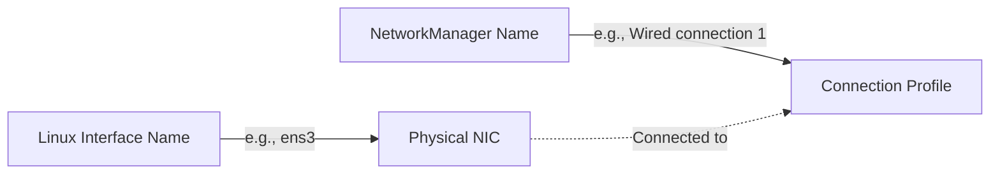
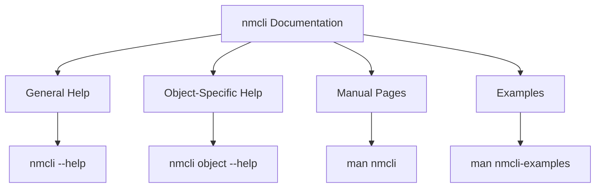

# Section 13: Introduction to nmcli

<details open>
<summary><b>Section 13: Introduction to nmcli (KK-CS45-script-v2-Inst-v1)</b></summary>

## Table of Contents

- [13.1 Introduction to nmcli](#131-introduction-to-nmcli)
- [13.2 Using nmcli to Analyze Network Connections](#132-using-nmcli-to-analyze-network-connections)
- [13.3 Modifying Static IP Connections with nmcli](#133-modifying-static-ip-connections-with-nmcli)
- [13.4 Configuring a DHCP Network Connection with nmcli](#134-configuring-a-dhcp-network-connection-with-nmcli)
- [13.5 Editing Network Connections with the nmcli Shell](#135-editing-network-connections-with-the-nmcli-shell)
- [13.6 Scanning Wireless Networks with nmcli](#136-scanning-wireless-networks-with-nmcli)
- [13.7 nmcli Help and Manual Pages](#137-nmcli-help-and-manual-pages)
- [Summary Section](#summary-section)

---

## 13.1 Introduction to nmcli

### Overview
Nmcli is the NetworkManager command-line interface, a powerful and commonly used tool for analyzing, modifying, and troubleshooting network connections on Linux systems that run NetworkManager. This module introduces the basic nmcli commands, their syntax options, and important distribution considerations.

### Key Concepts/Deep Dive

#### What is nmcli?
- **NetworkManager CLI**: The command-line interface for NetworkManager
- **Cross-Distribution Support**: Used by Fedora, Red Hat Enterprise Linux, CentOS, Debian, and Ubuntu Desktop
- **Dual Usage Modes**: Can be used as a single command tool or with its built-in interactive interface

#### Core nmcli Commands

| Command | Abbreviation | Purpose |
|---------|-------------|---------|
| `nmcli` | - | Display basic network configuration |
| `nmcli con show` | `nmcli c s` | Show available NetworkManager connections |
| `nmcli connection modify` | `nmcli con mod` / `nmcli c m` | Modify connections in Bash shell |
| `nmcli con down` | `nmcli c d` | Deactivate network interface |
| `nmcli con up` | `nmcli c u` | Activate network interface |
| `nmcli con edit` | `nmcli c e` | Open nmcli interactive shell |

#### Critical Distinctions
- **Modify vs Edit**:
  - `nmcli con mod` = Modify in Bash shell
  - `nmcli con edit` = Edit in interactive nmcli shell
- **Activation Required**: Changes require deactivation and reactivation of the network interface

#### Distribution Considerations

> [!IMPORTANT]
> Not all Linux distributions use NetworkManager by default

**Distributions Using NetworkManager**:
- Fedora, RHEL, CentOS
- Debian/Ubuntu Desktop editions
- Ubuntu (with manual installation via snap or apt)

**Distributions NOT Using NetworkManager**:
- Debian servers (use networking service)
- Ubuntu servers (use Networkd)
- SUSE and OpenSUSE (default configuration)

### Code Examples

```bash
# Basic nmcli usage
nmcli

# Show connections with abbreviations
nmcli c s
nmcli cs

# Connection management
nmcli con modify "Wired connection 1" ipv4.address 192.168.1.100/24
nmcli c d "Wired connection 1"
nmcli c u "Wired connection 1"

# Interactive shell
nmcli con edit "Wired connection 1"
```

---

## 13.2 Using nmcli to Analyze Network Connections

### Overview
This module demonstrates how to analyze network connections using nmcli, covering color-coded status indicators, the relationship between Linux interface names and NetworkManager names, and various commands for viewing detailed network information.

### Key Concepts/Deep Dive

#### Color-Coded Status Indicators
- **Green**: Interface is running properly ✅
- **Yellow**: Warning or interface hasn't come up yet ⚠️
- **Red**: Interface is not working properly ❌

> [!NOTE]
> Understanding the color coding is essential for quick network troubleshooting

#### Linux vs NetworkManager Naming



#### Key Analysis Commands

| Command | Information Provided |
|---------|---------------------|
| `nmcli` | Basic configuration overview |
| `nmcli device show` | Complete device information with descriptive keys |
| `nmcli connection show` | NetworkManager connection profiles |
| `nmcli con show --active` | Active connections only |

#### Detailed Information Mapping

From `nmcli device show`, key properties include:
- `GENERAL.HWADDR`: MAC address
- `IP4.ADDRESS`: IPv4 address information
- These property names correspond to arguments used in nmcli commands

#### Connection Status Visualization
- **Brightness Levels** indicate usage frequency:
  - Bright green: Currently active connections
  - Normal: Recently used connections
  - Dimmed: Old/unused connections

### Lab Demonstration

```bash
# View basic network info
nmcli

# Get detailed device information
nmcli device show

# View connection profiles
nmcli connection show
nmcli con show          # Abbreviated

# View on systems with multiple connections
nmcli cs                # Shortest abbreviation
```

### Expert Notes
- Abbreviate commands aggressively: `connection` → `con` → `c`
- Different distributions may show different connection naming conventions
- Historical connections remain visible, helping track network configuration changes

---

## 13.3 Modifying Static IP Connections with nmcli

### Overview
This hands-on lab demonstrates how to modify static IP addresses directly in the Bash shell using nmcli commands, covering all essential TCP/IP configuration parameters including IP address, gateway, DNS servers, and DNS search domains.

### Key Concepts/Deep Dive

#### NetworkManager Name Resolution
Understanding the distinction between Linux names and NetworkManager names is crucial:
- Linux name: `ens3`, `eth0`
- NetworkManager name: `Wired connection 1`
- Names with spaces require double quotes

#### Static IP Configuration Parameters

| Parameter | nmcli Argument | Purpose |
|-----------|---------------|---------|
| Method | `ipv4.method` | `manual` for static, `auto` for DHCP |
| IP Address | `ipv4.address` | IP/mask in CIDR notation |
| Gateway | `ipv4.gateway` | Default gateway address |
| DNS Server | `ipv4.dns` | Primary DNS server |
| DNS Search | `ipv4.dns-search` | Domain search suffix |

#### Command Structure with Line Continuation

```bash
nmcli connection modify "Wired connection 1" \
    ipv4.method manual \
    ipv4.address 10.0.2.152/24 \
    ipv4.gateway 10.0.2.1 \
    ipv4.dns 10.0.2.1
```

#### Activation Process
After modifications, the interface must be deactivated and reactivated:

```bash
nmcli connection down "Wired connection 1"
nmcli connection up "Wired connection 1"
```

> [!WARNING]
> Changes are not applied until the interface is brought down and up

### Complete Lab Walkthrough

```bash
# 1. Verify current configuration
nmcli

# 2. Modify IP configuration
nmcli c m "Wired connection 1" ipv4.method manual ipv4.address 10.0.2.152/24 ipv4.gateway 10.0.2.1 ipv4.dns 10.0.2.1

# 3. Activate changes
nmcli c d "Wired connection 1"
nmcli c u "Wired connection 1"

# 4. Add DNS search domain
nmcli c m "Wired connection 1" ipv4.dns-search "example.local"

# 5. Reactivate to apply DNS search
nmcli c d "Wired connection 1"
nmcli c u "Wired connection 1"
```

### Important Reminders
- No output indicates successful command execution
- The `-` prefix can be used to remove values (covered in next module)
- Backslashes allow splitting long commands across multiple lines

---

## 13.4 Configuring a DHCP Network Connection with nmcli

### Overview
This module shows how to configure DHCP connections using nmcli, including setting the method to automatic, understanding multiple IP address scenarios, and removing unwanted static addresses to clean up network configurations.

### Key Concepts/Deep Dive

#### DHCP Configuration Simplicity
Unlike static configuration requiring multiple parameters, DHCP needs only:

```bash
nmcli connection modify "Wired connection 1" ipv4.method auto
```

#### Multiple IP Address Management

When transitioning from static to DHCP, systems may end up with multiple addresses:

```diff
+ 10.0.2.108    (DHCP - Primary, marked as 'dynamic')
- 10.0.2.152    (Static - Secondary)
- 10.0.2.153    (Static - Tertiary)
```

#### Using the `ip a` Command for Verification
The `ip a` command provides additional details that nmcli doesn't show:
- Address scope and type (dynamic vs static)
- Primary vs secondary address designation
- Address assignment order

#### Removing Unwanted Addresses

```bash
nmcli connection modify "Wired connection 1" -ipv4.address 10.0.2.153/24
```

> [!NOTE]
> The minus sign (`-`) before the parameter removes the specified value

### Lab Demonstration

```bash
# Configure DHCP
nmcli c m "Wired connection 1" ipv4.method auto

# Activate
nmcli c d "Wired connection 1"
nmcli c u "Wired connection 1"

# Verify with detailed output
ip a

# Remove secondary static IP
nmcli c m "Wired connection 1" -ipv4.address 10.0.2.153/24

# Reactivate
nmcli c d "Wired connection 1"
nmcli c u "Wired connection 1"
```

### Key Insights
- DHCP is the default for most desktop/workstation installations
- Manual DHCP configuration is rarely needed except for troubleshooting
- The first assigned static address typically becomes the primary IP
- Clean up unnecessary addresses to avoid confusion

---

## 13.5 Editing Network Connections with the nmcli Shell

### Overview
This module introduces the nmcli interactive shell, which provides an efficient way to make multiple configuration changes to a network connection without repeatedly typing the full nmcli command prefix.

### Key Concepts/Deep Dive

#### Accessing the Interactive Shell

```bash
nmcli connection edit "Wired connection 1"
# Abbreviated: nmcli c e "Wired connection 1"
```

#### Shell Features
- **Context-Aware**: Automatically focuses on a specific connection
- **Command Shortening**: No need to prefix with `nmcli`
- **Smart Suggestions**: Offers to set related parameters automatically
- **Default Values**: Items in brackets are defaults (press Enter to accept)

#### Interactive Commands

| Command | Abbreviation | Purpose |
|---------|-------------|---------|
| `set` | `s` | Set a parameter value |
| `remove` | `r` | Remove a parameter value |
| `save` | - | Save and activate changes |
| `quit` | `q` | Exit the interactive shell |

#### Workflow Comparison

**Bash Shell Method**:
```bash
nmcli connection modify "Connection" parameter value
nmcli connection down "Connection"
nmcli connection up "Connection"
```

**Interactive Shell Method**:
```
nmcli connection edit "Connection"
set parameter value
save
quit
```

### Complete Interactive Session

```bash
$ nmcli connection edit "Wired connection 1"
=== EDITOR ===
(...editing 802-3-ethernet connection...)

nmcli> remove ipv4.address 10.0.2.152/24
nmcli> set ipv4.address 10.0.2.52/24
[Would you also like to set 'ipv4.method' to 'manual'? (yes/no) [yes]]
nmcli> save
Connection successfully saved and activated
nmcli> quit
```

### Critical Differences
> [!IMPORTANT]
> - Interactive shell auto-activates changes (no manual down/up needed)
> - Setting a static IP in interactive shell automatically suggests setting method to manual

---

## 13.6 Scanning Wireless Networks with nmcli

### Overview
This module demonstrates nmcli's wireless capabilities, showing how to scan for available Wi-Fi networks, interpret signal strength indicators, understand wireless standards, and connect to wireless networks.

### Key Concepts/Deep Dive

#### Wireless Network Scanning

```bash
nmcli device wifi
# Abbreviated: nmcli dev wifi
```

#### Signal Strength Visualization
- **Green with high bars**: Excellent signal strength
- **Progressive color changes**: Indicate decreasing signal quality
- Visual bar graphs provide quick signal assessment

#### Wireless Standards and Channels

| Network | Standard | Frequency | Channel |
|---------|----------|-----------|---------|
| Unknown_Network_5 | 802.11ac | 5 GHz | 48 |
| Unknown_Network_2.4 | 802.11g | 2.4 GHz | 6 |

#### Connecting to Wireless Networks

```bash
nmcli device wifi connect "SSID_Name" password "password_here" name "Profile-Name"
# Abbreviated: nmcli dev wifi con "SSID" password "pass" name "profile"
```

### Complete Wireless Workflow

```bash
# Scan for networks
nmcli dev wifi

# Connect to a network
nmcli dev wifi con "Unknown_Network_2.4" password "MyPassword123" name "MyWiFi"

# Verify connection
nmcli connection show
```

### Server Considerations
> [!WARNING]
> Wireless network cards are uncommon on servers. This functionality is primarily relevant for:
> - Desktop workstations
> - Laptop systems
> - IoT devices
> - Development/testing environments

---

## 13.7 nmcli Help and Manual Pages

### Overview
This final module emphasizes the importance of nmcli documentation resources, providing guidance on accessing help files, manual pages, and example documentation to explore the full capabilities of this extensive command.

### Key Concepts/Deep Dive

#### Help Documentation Hierarchy

| Command | Scope |
|---------|-------|
| `nmcli --help` | General command overview |
| `nmcli connection --help` | Connection-specific options |
| `nmcli radio --help` | Radio control options |
| `man nmcli` | Comprehensive manual page |
| `man nmcli-examples` | Practical examples |
| `man nm-settings-nmcli` | NetworkManager settings reference |

#### Color Options
The `-c` flag enables colored output, consistent with other modern Linux tools like `ip`:

```bash
nmcli -c connection show
```

#### Documentation Structure



### Key Documentation Resources

1. **nmcli-examples man page** contains practical, real-world examples
2. **Object-specific help** provides targeted information without overwhelming detail
3. **Manual pages** offer in-depth descriptions of all options and behaviors

### Recommended Learning Path
1. Start with `nmcli --help` for overview
2. Explore `man nmcli-examples` for practical usage
3. Use object-specific help for detailed parameter information
4. Reference `man nm-settings-nmcli` for advanced configuration options

---

## Summary Section

### Key Takeaways

```diff
+ nmcli is the NetworkManager CLI for comprehensive network management
+ Use abbreviations aggressively: connection → con → c
+ Always verify Linux name vs NetworkManager name for interfaces
+ Static IP: ipv4.method manual with full parameter specification
+ DHCP: ipv4.method auto (simplified configuration)
+ Interactive shell (nmcli con edit) for multiple changes efficiently
+ Wireless scanning and connection available but primarily for desktops
+ Leverage extensive documentation: help files, man pages, examples
- Not all distributions use NetworkManager by default
- Changes require interface deactivation/reactivation (except interactive shell)
- Color coding: green=good, red=bad for quick status assessment
```

### Quick Reference

```bash
# Basic commands
nmcli                                    # Show network status
nmcli c s                               # Show connections
nmcli dev show                          # Detailed device info

# Static IP configuration
nmcli c m "Name" ipv4.method manual ipv4.address IP/MASK ipv4.gateway GW ipv4.dns DNS
nmcli c d "Name" && nmcli c u "Name"    # Activate changes

# DHCP configuration
nmcli c m "Name" ipv4.method auto
nmcli c d "Name" && nmcli c u "Name"

# Interactive editing
nmcli c e "Name"                        # Enter interactive shell
# Inside shell: set/remove parameters, save, quit

# Wireless operations
nmcli dev wifi                          # Scan networks
nmcli dev wifi con "SSID" password "PASS" name "Profile"

# Help and documentation
nmcli --help
nmcli connection --help
man nmcli
man nmcli-examples
```

### Expert Insights

#### Real-world Application
- **Server Management**: Use nmcli on RHEL/CentOS servers for static IP configuration
- **Troubleshooting**: Quick network status assessment with color-coded output
- **Automation**: Script network configuration changes across multiple systems
- **Remote Administration**: Manage network settings on remote systems without GUI access

#### Expert Path
- Master all nmcli objects beyond just `connection`
- Learn `nm-settings-nmcli` for advanced connection properties
- Explore radio control for managing wireless/wwan interfaces
- Practice with complex scenarios: bonding, bridging, VLANs
- Create reusable configuration scripts for common tasks

#### Common Pitfalls
- **Forgetting to activate changes**: Always down/up interfaces after modifications
- **Incorrect interface naming**: Verify NetworkManager names vs Linux names
- **Missing quotes**: Use double quotes for names with spaces
- **Overlooking DNS search domains**: Essential for Active Directory/domain environments
- **Ignoring distribution differences**: Not all systems use NetworkManager

#### Lesser-Known Facts
- The interactive shell can handle 802.1x authentication configuration
- Multiple DNS servers can be specified with repeated `ipv4.dns` arguments
- Historical connection profiles persist and can be reactivated
- Channel overlap detection helps optimize wireless performance
- The `-c` color flag works consistently across nmcli and ip commands

</details>