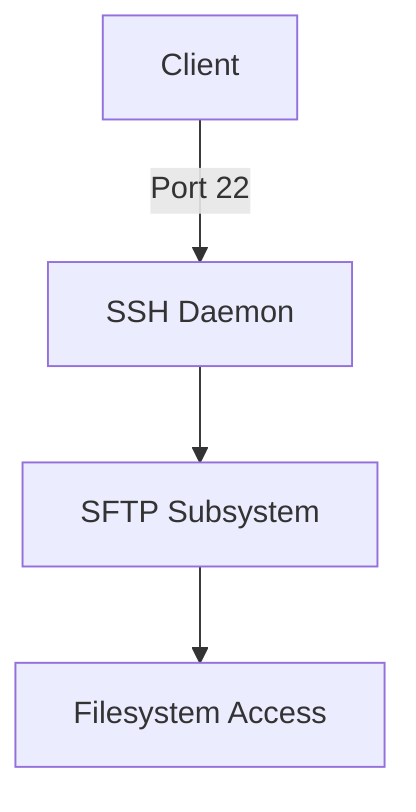
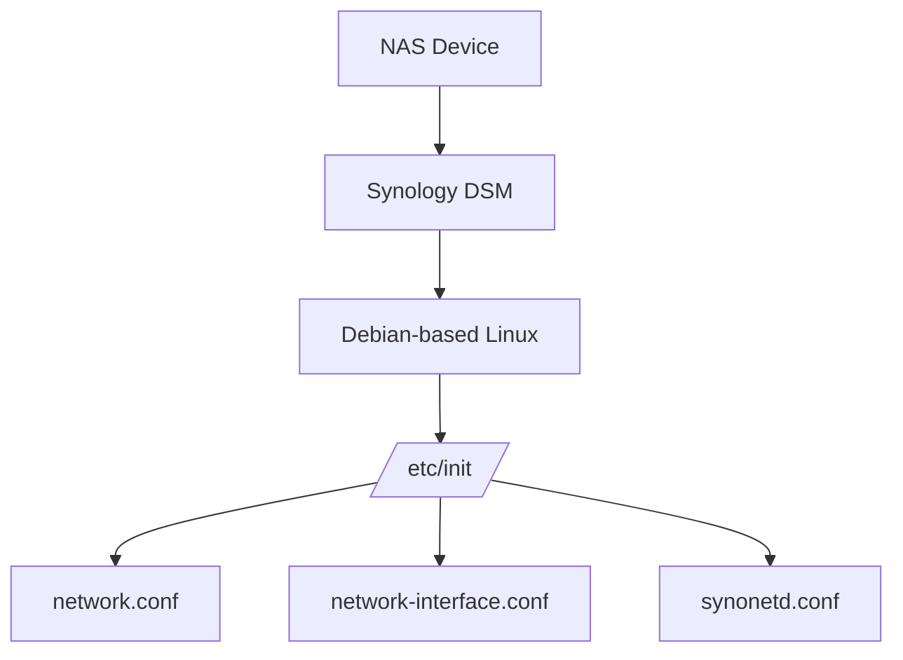

# Section 16: SFTP and Remote File Transfer Protocols

<details open>
<summary><b>Section 16: SFTP and Remote File Transfer Protocols (KK-CS45-script-v2-Inst-v1)</b></summary>

## Table of Contents

- [16.1 SFTP Overview](#161-sftp-overview)
- [16.2 Working with SFTP Locally](#162-working-with-sftp-locally)
- [16.3 Working with SFTP over the Internet](#163-working-with-sftp-over-the-internet)
- [16.4 SMB](#164-smb)
- [16.5 Additional Remote Connectivity Tools](#165-additional-remote-connectivity-tools)
- [Summary](#summary)

---

## 16.1 SFTP Overview

### Overview

This module introduces the Secure File Transfer Protocol (SFTP) as a secure method for remote file uploads and retrieval. SFTP builds upon SSH infrastructure, providing enhanced functionality compared to its predecessor SCP, including support for multiple file and directory transfers within a single session.

### Key Concepts

#### FTP Protocol Evolution

| Protocol | Port | Security | Status |
|----------|------|----------|--------|
| FTP | 21 (control), 20 (data) | None | Deprecated |
| FTPS | 990 (control), 989 (data) | SSL/TLS | Less common |
| SFTP | 22 (SSH) | SSH encryption | Recommended |
| SCP | 22 (SSH) | SSH encryption | Legacy |

#### SFTP vs SCP Comparison

```diff
+ SFTP Advantages:
+   - Resume interrupted file transfers
+   - Interactive shell environment
+   - Multiple file/directory operations per session
+   - Extensive command set for file management
- SCP Advantages:
-   - Historically faster on low-bandwidth connections
-   - Better data interception protection
-   - Simpler single-file transfers
```

#### Protocol Architecture



### Important Points

- **FTP Deprecation**: Original FTP lacks encryption and is not recommended for use
- **Dynamic Ports**: Modern FTP implementations use dynamic high-numbered ports for data transfer
- **SFTP Maturity**: SFTP has improved significantly, offering security and functionality
- **SSH Integration**: SFTP leverages existing SSH infrastructure (port 22)
- **Interactive Environment**: Users enter an SFTP shell with Linux-like commands

---

## 16.2 Working with SFTP Locally

### Overview

This module demonstrates practical SFTP usage between local network systems, showing the complete workflow from server setup through file transfers, directory management, and session commands.

### Key Concepts

#### Connection Setup

```bash
# Connect to SFTP server
sftp user@10.0.2.54

# Connect with specific SSH key
sftp -i /path/to/key user@hostname
```

#### SFTP Interactive Commands

| Command | Description | Local Equivalent |
|---------|-------------|------------------|
| `ls` | List remote directory | `ls` |
| `lls` | List local directory | `ls` |
| `get` | Download file from remote | N/A |
| `put` | Upload file to remote | N/A |
| `mkdir` | Create remote directory | `mkdir` |
| `lmkdir` | Create local directory | `mkdir` |
| `cd` | Change remote directory | `cd` |
| `lcd` | Change local directory | `cd` |
| `pwd` | Show remote working directory | `pwd` |
| `lpwd` | Show local working directory | `pwd` |
| `rm` | Remove remote file | `rm` |
| `rmdir` | Remove remote directory | `rmdir` |
| `reget` | Resume interrupted download | N/A |
| `?` or `help` | Show command list | N/A |

#### Lab Demo: Local SFTP Session

```bash
# Server side (Fedora)
ssh root@fedora-server
cd /home/user
ls  # Shows: bigimage.iso, document.md, test.txt

# Client side (Debian)
sftp user@10.0.2.54
# Enter password when prompted
sftp> ls
sftp> get bigimage.iso
# Transfer speed: 180 MB/s
sftp> mkdir isos
sftp> lls  # List local directory
sftp> put debian.iso
# Transfer speed: 216 MB/s
sftp> cd isos
sftp> put debian.iso  # Upload to subdirectory
sftp> reget bigimage.iso  # Resume failed transfer
sftp> bye  # or quit, or Ctrl+D
```

#### Resume Capability

```diff
! Interrupted transfers can be resumed with 'reget'
! Only transfers remaining portion of file
! Saves bandwidth on large file transfers
```

### Expert Notes

- Tab completion works in SFTP shell for filenames
- Passwordless connections require SSH keys on each target system
- Consider using separate SSH keys for different projects or customers

---

## 16.3 Working with SFTP over the Internet

### Overview

This module extends SFTP usage to cloud environments, demonstrating connections to AWS instances, key-based authentication for remote systems, and performance considerations for internet-based transfers.

### Key Concepts

#### Cloud Connection with SSH Keys

```bash
# Connect to AWS Ubuntu instance
sftp -i "/path/to/keys/lnsf_key" ubuntu@52.14.49.134

# The -i flag specifies non-default SSH key location
# Keys often stored outside ~/.ssh/ for project organization
```

#### Local vs Remote Command Execution

Two methods for executing local commands while in SFTP:

1. **Prepend with 'l'**: `lls`, `lmkdir`, `lpwd`
2. **Use exclamation point**: `!ls`, `!mkdir test1`, `!pwd`

```bash
sftp> lls                    # Method 1 - list local files
sftp> !ls                    # Method 2 - list local files
sftp> !mkdir test1           # Create local directory
sftp> exclamation ls         # Verify directory creation
```

#### Performance Considerations

```diff
- Internet transfers significantly slower than LAN
- Typical home upload: 20 Mbps maximum
- Cloud instances: 9.5 KB/s for small files (limited baseline)
- LAN transfers: 180-216 MB/s achievable
```

#### Lab Demo: AWS SFTP Session

```bash
# Connect to cloud instance
sftp -i "keys/lnsf_key" ubuntu@52.14.49.134
sftp> ls                     # Empty directory
sftp> mkdir isos
sftp> lls                    # View local Terraform files
sftp> put lnsf-debian-11.tf  # Upload configuration
# Upload speed: 9.5 KB/s
sftp> ls                     # Verify upload
sftp> Ctrl+D                 # Exit SFTP

# Verify with SSH
ssh -i "keys/lnsf_key" ubuntu@52.14.49.134
ls                           # Shows: isos/, lnsf-debian-11.tf
cat lnsf-debian-11.tf        # View Terraform code
```

#### GUI Alternative: FileZilla

- Cross-platform SFTP client
- FileZilla Pro required for AWS S3 bucket connections
- Site Manager for saved connections
- Visual interface showing local and remote systems side-by-side

### Important Points

- Internet connections introduce latency and bandwidth limitations
- SSH keys must be specified with full path when outside default location
- Both SFTP and SSH use the same authentication mechanisms
- Command line SFTP works universally across systems with OpenSSH

---

## 16.4 SMB

### Overview

This module covers the Server Message Block (SMB) protocol for file and print sharing, demonstrating connections to Network-Attached Storage (NAS) devices and cross-platform file sharing between Linux and Windows environments.

### Key Concepts

#### SMB Protocol Characteristics

- **Age**: Long-standing protocol, comparable to instructor's age
- **Primary Use**: Windows file/print sharing
- **Cross-Platform**: Available on NAS devices, macOS, and Linux
- **Network Browsing**: Supports resource discovery on networks

#### Connection Naming Conventions

| Platform | Format | Example |
|----------|--------|---------|
| Windows | `\\hostname\share` | `\\NASBOX-218\Data-Master` |
| macOS | `smb://hostname/share` | `smb://NASBOX-218/Data-Master` |
| Linux | `//hostname/share` | `//10.42.0.249/Data-Master` |

#### Lab Demo: SMB Connection to NAS

```bash
# Basic connection (inherits current user)
smbclient //10.42.0.249/Data-Master
# Prompted for WORKGROUP/dpro's password

# Connection with explicit user
smbclient //NASBOX-218.local/Data-Master -U dpro
smbclient \\\\NASBOX-218.local\\Data-Master -U dpro  # Alternative format

# Interactive SMB shell commands
smb: \> ls                    # List directory contents
smb: \> cd test               # Change directory
smb: \> mkdir new_directory   # Create directory
smb: \> put new_file.txt      # Upload file (9.8 KB/s)
smb: \> get filename          # Download file
smb: \> rm filename           # Remove file
smb: \> rmdir directory       # Remove directory (no -r option)
smb: \> ? or help             # Show all commands
smb: \> Ctrl+D                # Exit session
```

#### Local Command Execution in SMB

```bash
smb: \> !ls                   # Execute local command
smb: \> lcd test1000          # Local change directory
smb: \> !vim new_file.txt     # Create file locally
smb: \> !pwd                  # Show local path
```

#### NAS Device Architecture



#### Available NAS Services

| Service | Purpose | Default Status |
|---------|---------|----------------|
| SMB | Windows file sharing | Enabled |
| AFP | Apple file sharing | Available |
| NFS | Unix/Linux file sharing | Available |
| FTP | Standard FTP | Disabled |
| SFTP | Secure FTP over SSH | Enabled |
| TFTP | Trivial FTP | Not set up |
| rsync | File synchronization | Not set up |
| SSH | Remote shell access | Enabled |

### Important Notes

- SMB requires case-sensitive share names
- Some NAS systems may not support `rm -r`; use `rmdir` instead
- Synology NAS runs a customized, slimmed-down Debian Linux
- Older Linux commands like `ifconfig` and `hostname` available on NAS
- Modern commands like `hostnamectl` may not be present

---

## 16.5 Additional Remote Connectivity Tools

### Overview

This module introduces modern remote connectivity solutions beyond traditional command-line tools, covering terminal emulators with advanced features, remote desktop solutions, and web-based access methods.

### Key Concepts

#### Tabby Terminal Emulator

**Features:**
- Multi-tab terminal interface
- Profile-based SSH connections
- Split-screen functionality
- Vault encryption for stored credentials
- Cross-platform (Windows, macOS, Linux)

**Configuration:**

```bash
# Profile setup process
Settings → Profiles & Connections → New Profile
- Type: SSH Connection
- Name: SSH to debserver
- Color: Custom tab color (e.g., #1199cc)
- Connection: Direct/Proxy/Jump host options
- Host: 10.0.2.51
- Port: 22 (default)
- Username: user
- Password: Stored in encrypted vault
```

**Security Architecture:**

```diff
+ AES encrypted vault for credentials
+ Master passphrase required on startup
+ Individual password management
+ Automatic login from profiles
- Resource intensive (Electron-based)
- High GPU utilization
- May struggle on lower-end systems
```

#### NoMachine Remote Desktop

- Real-time GUI remote control
- Cross-platform support (Linux, Windows, macOS)
- Appears as local desktop environment
- Keyboard shortcuts: `Ctrl+Alt+F` for window control

#### Tilix Terminal Emulator

- GTK+3-based terminal
- Screen splitting capabilities
- Multiple layouts per window
- Similar resource usage to GNOME Terminal
- No built-in SSH functionality

#### Remote Access Solutions Comparison

| Tool | Type | Platform | Key Feature |
|------|------|----------|-------------|
| Tabby | Terminal | Cross-platform | Profile management |
| NoMachine | Remote Desktop | Cross-platform | Real-time GUI control |
| Tilix | Terminal | Linux | Screen splitting |
| VNC (RealVNC, TightVNC) | Remote Desktop | Cross-platform | Simple remote access |
| Remmina | Remote Desktop | Linux | Multi-protocol support |
| Apache Guacamole | Web Gateway | Browser-based | HTML5 remote access |

### Expert Recommendations

- Choose terminal emulators based on system resources
- Consider Tabby for managing multiple SSH connections
- Use NoMachine for GUI-based remote administration
- Evaluate Apache Guacamole for browser-based access requirements
- Keep abreast of emerging remote connectivity tools throughout IT career

---

## Summary

### Key Takeaways

```diff
+ SFTP provides secure, feature-rich file transfer over SSH
+ Multiple protocols exist for file sharing: FTP (deprecated), FTPS, SFTP, SCP, SMB
+ SFTP offers resume capability and interactive shell environment
+ SMB enables cross-platform file sharing, especially with Windows/NAS
+ Modern tools like Tabby and NoMachine enhance remote connectivity
! Always use encrypted protocols (SFTP over FTP, SSH keys over passwords)
! Consider bandwidth limitations when working over internet connections
- Avoid FTP in production environments
```

### Quick Reference

```bash
# SFTP Commands
sftp user@host                    # Connect
get file                          # Download
put file                          # Upload
reget file                        # Resume download
lls / !ls                         # Local listing
lmkdir / !mkdir                   # Local directory creation

# SMB Commands
smbclient //host/share -U user    # Connect
put/get file                      # File transfer
lcd directory                     # Local directory change

# Common Exit Methods
bye / quit / Ctrl+D              # Exit SFTP
Ctrl+D                           # Exit SMB
```

### Expert Insights

#### Real-world Application

```diff
! Use SFTP for automated backup scripts between servers
! Configure SMB mounts for seamless NAS integration in Linux
! Implement Tabby profiles for consistent multi-server management
! Deploy NoMachine for remote GUI application support
```

#### Expert Path

```diff
+ Master SSH key management for passwordless SFTP
+ Understand protocol selection based on security requirements
+ Explore automation possibilities with SFTP batch mode
+ Investigate performance tuning for large file transfers
```

#### Common Pitfalls

```diff
- Forgetting to handle interrupted transfers (use reget)
- Using FTP instead of SFTP for sensitive data
- Not accounting for case sensitivity in SMB share names
- Storing unencrypted credentials in terminal emulators
```

#### Lesser-Known Facts

```diff
! Synology NAS runs a customized Debian Linux internally
! SFTP can resume transfers that SCP cannot
! Tabby uses AES encryption for credential storage
! Modern NAS devices support multiple protocols simultaneously
```

</details>