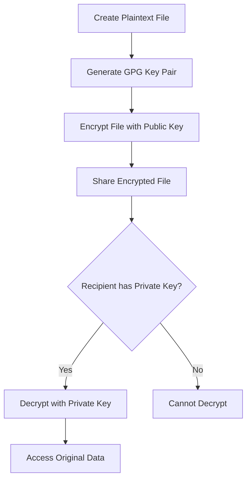
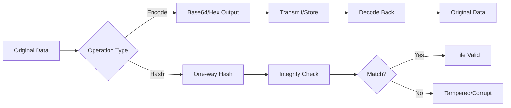

# Section 16: Linux File Permissions, Ownership, and Cryptography

<details open>
<summary><b>Section 16: Linux File Permissions, Ownership, and Cryptography (KK-CS45-script-v2-Inst-v1)</b></summary>

## Table of Contents

- [16.1 chmod - File Permissions](#161-chmod---file-permissions)
- [16.2 chown and chgrp - File Ownership](#162-chown-and-chgrp---file-ownership)
- [16.3 Encryption in Linux](#163-encryption-in-linux)
- [16.4 Linux Encoding and Hashing](#164-linux-encoding-and-hashing)
- [Summary](#summary)

---

## 16.1 chmod - File Permissions

### Overview

The `chmod` (change file mode bits) command is essential for managing file permissions in Linux. It controls access to files and directories by modifying read, write, and execute permissions for three entities: user (owner), group, and other (public). Understanding chmod is fundamental to Linux security.

### Key Concepts/Deep Dive

#### Permission Types

Linux uses three basic permission types:
- **Read (r)**: View file contents or list directory contents
- **Write (w)**: Modify file contents or create/delete files in directories
- **Execute (x)**: Run scripts/programs or access directory contents

#### Linux Entities (UGO)

Permissions apply to three entities:
- **User (u)**: The file owner (default: creator)
- **Group (g)**: Users belonging to the file's group
- **Other (o)**: Everyone else (also called "public")

#### Permission Symbols in ls -l Output

```bash
-rwxr-xr-x 1 user user 45 Jan 15 10:30 script.sh
│└─┬─┘└─┬─┘└─┬─┘
│  │    │    └── Other (public) permissions
│  │    └─────── Group permissions
│  └──────────── User (owner) permissions
└─────────────── File type: '-' = file, 'd' = directory
```

#### Symbolic Permission Modification

Add/remove permissions individually:
```bash
chmod +x script.sh    # Add execute for all (user, group, other)
chmod u+x script.sh   # Add execute for user only
chmod go-w file.txt   # Remove write from group and other
chmod a=r file.txt    # Set all entities to read-only
```

#### Octal (Numeric) Permission System

Each permission has a numeric value:
- **Read = 4**
- **Write = 2**
- **Execute = 1**

Common permission combinations:
| Number | Permissions | Description |
|--------|-------------|-------------|
| 7 | rwx | Full access |
| 6 | rw- | Read and write |
| 5 | r-x | Read and execute |
| 4 | r-- | Read only |
| 0 | --- | No permissions |

#### Complete Permission Examples

```bash
# 755 = rwxr-xr-x (standard for executables/scripts)
chmod 755 script.sh

# 644 = rw-r--r-- (standard for regular files)
chmod 644 document.txt

# 700 = rwx------ (private to owner only)
chmod 700 private.key

# 750 = rwxr-x--- (owner full, group read/execute, other none)
chmod 750 shared_script.sh
```

#### Lab Demonstration: File Permissions

```bash
# Create working directory and test script
mkdir work && cd work
vim test1.sh
# Add: echo "This is a test. This is only a test."

# Attempt to run (will fail - no execute permission)
./test1.sh
# Output: Permission denied

# Check current permissions
ls -l test1.sh
# Shows: -rw-r--r-- (no execute permission)

# Add execute permission
chmod +x test1.sh
ls -l test1.sh
# Shows: -rwxr-xr-x (executable - appears green in terminal)

# Run the script successfully
./test1.sh
# Output: This is a test. This is only a test.

# Create second script and set restrictive permissions
cp test1.sh test2.sh
chmod 700 test2.sh
ls -l
# test1.sh: -rwxr-xr-x (755)
# test2.sh: -rwx------ (700)

# Test access restrictions
./test2.sh          # Works for owner
cat test2.sh        # Fails for other users

# Lock yourself out (demonstration)
chmod 000 test2.sh
./test2.sh          # Permission denied even for owner!
ls -l test2.sh      # Shows: ---------- (no permissions visible)

# Restore permissions
chmod 744 *.sh      # Apply to all .sh files
ls -l
# Shows: -rwxr--r-- for both files
```

#### Security Implications

> [!IMPORTANT]
> Even owners can lock themselves out with overly restrictive permissions. Always ensure you maintain access to your files.

```bash
# Common security mistakes to avoid
chmod 000 file.txt    # Locks everyone out including yourself
chmod 777 file.txt    # Gives full access to everyone (security risk)
chmod 666 file.txt    # Allows anyone to modify the file
```

#### Online Chmod Calculator

Visit chmod-calculator.com for an interactive permission calculator that shows both numeric and symbolic representations.

---

## 16.2 chown and chgrp - File Ownership

### Overview

Linux file ownership consists of two components: user ownership (who created/owns the file) and group ownership (which group has collective access). The `chown` and `chgrp` commands allow modification of these ownership attributes, enabling fine-grained access control beyond basic permissions.

### Key Concepts/Deep Dive

#### Understanding Dual Ownership

Every file in Linux has two ownership attributes:
1. **User Ownership**: The individual account that owns the file
2. **Group Ownership**: A group that shares access to the file

```bash
ls -l
-rwxr-xr-x 1 user user 45 Jan 15 10:30 test.sh
               │    └── Group owner
               └──── User owner
```

#### Default Ownership Assignment

When creating files:
- User ownership defaults to the creating user
- Group ownership defaults to the user's primary group
- Both typically share the same name (e.g., user:user)

```bash
id user
# Output shows: uid=1000(user) gid=1000(user)
```

#### The chgrp Command

Change group ownership:
```bash
chgrp ops test1.sh
ls -l test1.sh
# Shows: -rwxr-xr-x 1 user ops 45 Jan 15 10:30 test1.sh
```

#### The chown Command

Change user ownership:
```bash
chown root test1.sh
ls -l test1.sh
# Shows: -rwxr-xr-x 1 root ops 45 Jan 15 10:30 test1.sh
```

#### Combined Ownership Changes

Change both user and group simultaneously:
```bash
chown user:user test1.sh     # Restore original ownership
chown dpro:libvirt-qemu file.img  # Set specific user and group
```

#### Principle of Least Privilege in Action

```bash
# Scenario: Restricting access by changing ownership
chown root test1.sh          # Change owner to root
chmod 750 test1.sh           # Owner: rwx, Group: r-x, Other: ---

# Result for regular user:
./test1.sh                   # Permission denied
cat test1.sh                 # Works (read permission for group)
vim test1.sh                 # Read-only warning (no write)
```

#### Special System Groups

Linux uses system groups for specialized access:
- **libvirt-qemu**: KVM virtualization access
- **docker**: Container management
- **sudo/wheel**: Administrative privileges

Example from production:
```bash
ls -l /var/lib/libvirt/images/
-rw------- 1 root libvirt-qemu  8589934592 Jan 15 09:30 ubuntu.qcow2
-rw-r--r-- 1 dpro dpro          5368709120 Jan 15 09:31 template.qcow2
```

#### Group Membership and Access

Users can belong to multiple groups:
```bash
# Add user to additional group
groupadd ops
usermod -aG ops user

# Verify membership
id user
# Shows: uid=1000(user) gid=1000(user) groups=1000(user),1004(ops)
```

> [!NOTE]
> Group membership changes may require logout/login or system restart to take full effect.

#### Real-World Ownership Scenarios

```bash
# KVM/QEMU virtualization example
# Template created by user
-rw-r--r-- 1 dpro dpro 2147483648 Jan 15 08:00 template.qcow2

# Clone created by system
-rw------- 1 root libvirt-qemu 2147483648 Jan 15 08:30 clone.qcow2

# User retains access via group membership
groups dpro
# Shows: ... libvirt-qemu ...
```

---

## 16.3 Encryption in Linux

### Overview

Encryption converts plaintext into ciphertext using cryptographic keys, ensuring data confidentiality. GNU Privacy Guard (GPG) provides robust file encryption capabilities in Linux, implementing the OpenPGP standard as a free alternative to commercial PGP solutions.

### Key Concepts/Deep Dive

#### Encryption Fundamentals

- **Plaintext**: Original, readable data
- **Ciphertext**: Encrypted, unreadable data
- **Key**: Cryptographic secret required for encryption/decryption
- **Recipients**: Authorized users who can decrypt the data

#### GPG Key Generation Process

```bash
# Install GPG if needed
sudo apt install gpg

# Generate a new key pair
gpg --gen-key

# Interactive prompts:
# 1. Real name: user1
# 2. Email: user@prowse.tech
# 3. Comment: (optional)
# 4. Passphrase: (secure password for key protection)
# 5. Move mouse for entropy generation
```

Key generation output:
```
gpg: key 0xABC123DEF456 marked as ultimately trusted
public and secret key created and signed.
pub   rsa3072 2024-01-15 [SC] [expires: 2026-01-15]
      ABC123DEF4567890ABCDEF1234567890ABCDEF12
uid                 [ultimate] user1 <user@prowse.tech>
sub   rsa3072 2024-01-15 [E]
```

#### File Encryption with GPG

```bash
# Create test file
echo "Test123" > test3.sh

# Encrypt file (interactive recipient selection)
gpg -e test3.sh

# Or specify recipient directly
gpg -e -r user1 test3.sh

# Result: test3.sh.gpg (encrypted file)
ls -l
# -rw-r--r-- 1 user user    8 Jan 15 10:00 test3.sh
# -rw-r--r-- 1 user user  512 Jan 15 10:00 test3.sh.gpg
```

#### File Decryption

```bash
# Decrypt file
gpg -d test3.sh.gpg

# Output shows:
gpg: encrypted with 3072-bit RSA key, ID ABC123DEF456, created 2024-01-15
      "user1 <user@prowse.tech>"
Test123
```

#### Multi-Recipient Encryption

Add multiple recipients for shared access:
```bash
gpg -e -r user1 -r bob test3.sh
# Both user1 and bob can decrypt the file
```

#### Root Account Limitations

> [!IMPORTANT]
> Root cannot decrypt user-encrypted files without the private key, demonstrating encryption's power for data protection.

```bash
# Attempt decryption as root without key
sudo gpg -d test3.sh.gpg
# Output: decryption failed: No secret key
```

#### GPG Encryption Workflow



#### Cipher Option

Alternative encryption syntax:
```bash
gpg -c file.txt    # Symmetric encryption (password-based)
gpg --cipher-algo AES256 -e file.txt  # Specify algorithm
```

#### Security Best Practices

- Never share private keys
- Use strong passphrases for key protection
- Set appropriate key expiration dates
- Regularly rotate encryption keys
- Consider key revocation procedures

---

## 16.4 Linux Encoding and Hashing

### Overview

Encoding and hashing serve distinct purposes in data handling. Encoding converts binary data to text representations (Base64, hex) for transmission/storage, while cryptographic hashing creates one-way fingerprints for integrity verification and secure password storage. Both are essential tools in Linux system administration.

### Key Concepts/Deep Dive

#### Encoding vs Encryption vs Hashing

| Characteristic | Encoding | Encryption | Hashing |
|----------------|----------|------------|---------|
| Reversibility | Yes | Yes (with key) | No |
| Purpose | Data representation | Confidentiality | Integrity/Verification |
| Output consistency | Always same | Varies with key/IV | Always different |
| Example | Base64: M→TQ== | AES encrypted data | SHA-256 hash |

#### Base64 Encoding

Convert binary/text to ASCII-safe format:
```bash
# Basic encoding
echo -n 'M' | base64
# Output: TQ==

echo -n 'test' | base64
# Output: dGVzdA==

# Decoding
echo -n 'dGVzdA==' | base64 --decode
# Output: test

# Generate random Base64 strings
openssl rand -base64 24
# Output: random 32-character Base64 string
```

#### RSA Key Generation (Encoding Example)

```bash
# Generate 512-bit RSA private key
openssl genrsa 512

# Generate stronger key (may take time)
openssl genrsa 4096
```

#### Cryptographic Hashing Fundamentals

Hashing characteristics:
- **One-way function**: Cannot reverse to original data
- **Deterministic**: Same input always produces different output (with salts)
- **Fixed output size**: Regardless of input length
- **Avalanche effect**: Small input changes produce vastly different outputs

#### Password Hashing in Linux

Linux stores passwords as hashes in `/etc/shadow`:
```bash
# View hash format
sudo cat /etc/shadow | grep user
# $y$j9T$abc123... (yescrypt format)
# $6$abc123... (SHA-512 format)
```

Hash identifiers:
- `$y$` = yescrypt (recommended)
- `$6$` = SHA-512
- `$5$` = SHA-256
- `$1$` = MD5 (deprecated)

#### Creating Password Hashes

```bash
# Using OpenSSL (SHA-512)
openssl passwd -6
# Enter password: test123
# Output: $6$rounds=656000$abc123...

# Using mkpasswd with specific methods
sudo apt install whois    # Install mkpasswd
mkpasswd --method=SHA-512 --rounds=4096
# Enter password: test123

# Using yescrypt
mkpasswd --method=yescrypt
# Enter password: test123
# Output: $y$j9T$rounds=abc123...
```

#### Bulk Password Updates

```bash
# Update password via chpasswd (requires root)
echo 'sysadmin:test123' | sudo chpasswd --crypt-method YESCRYPT

# Verify the change
sudo grep sysadmin /etc/shadow
# Shows updated hash
```

#### File Integrity with Checksums

Create and verify file checksums:
```bash
# Generate SHA-256 checksum
sha256sum test1.sh
# Output: abc123def456...  test1.sh

# Save checksum to file
sha512sum test1.sh > test1.sh.chk

# Verify integrity
sha256sum -c test1.sh.chk
# Output: test1.sh: OK

# Alternative algorithms
md5sum file.txt
sha1sum file.txt
sha512sum file.txt
```

#### Encoding/Hashing Workflow Diagram



#### Practical Applications

1. **Password Storage**: Never store plaintext passwords
2. **File Downloads**: Verify downloaded files haven't been modified
3. **API Keys**: Encode binary data for HTTP transmission
4. **Digital Signatures**: Combine hashing with encryption

#### Security Considerations

> [!WARNING]
> Never use encoding for security purposes - it's not encryption!

```bash
# This does NOT secure data
echo "password123" | base64    # Easily decoded

# This provides security
openssl passwd -6              # One-way hash
gpg -e file.txt                # Encryption
```

---

## Summary

### Key Takeaways

```diff
+ chmod manages file permissions with symbolic (+x) or octal (755) notation
+ chown/chgrp control file ownership for user and group entities
+ GPG provides strong file encryption that even root cannot bypass without keys
+ Base64 encoding converts binary to text but offers no security
+ Cryptographic hashes are one-way and always produce different outputs
+ File checksums verify integrity and detect tampering
+ The principle of least privilege applies to both permissions and ownership
- Never share private encryption keys or use weak permissions
- Always use strong hashing methods (yescrypt, SHA-512) for passwords
```

### Quick Reference

```bash
# Permission Management
chmod 755 file.sh          # rwxr-xr-x
chmod +x file.sh           # Add execute
chmod 700 file.txt         # Owner only access

# Ownership Management
chown user:group file      # Set both
chgrp group file           # Change group only

# Encryption (GPG)
gpg --gen-key              # Create key pair
gpg -e -r user file.txt    # Encrypt
gpg -d file.txt.gpg        # Decrypt

# Encoding
echo 'text' | base64       # Encode
echo 'dGV4dA==' | base64 --decode  # Decode

# Hashing
openssl passwd -6          # Create password hash
mkpasswd --method=yescrypt # Alternative method
sha256sum file.txt         # File checksum
```

### Expert Insight

**Real-world Application**: In production environments, proper permission and ownership management prevents unauthorized access while enabling necessary collaboration. GPG encryption protects sensitive data at rest, while checksums ensure software distribution integrity.

**Expert Path**: Master the interaction between permissions, ownership, and SELinux/AppArmor. Learn about ACLs (Access Control Lists) for fine-grained permissions beyond standard UGO. Practice key management with GPG agents and explore encrypted filesystems.

**Common Pitfalls**:
- Setting 777 permissions as a quick fix
- Forgetting that root respects file encryption
- Using MD5 for password hashing
- Not accounting for group membership changes requiring re-login

**Lesser-Known Facts**:
- The sticky bit (chmod +t) on directories prevents users from deleting others' files
- Setuid/setgid bits allow execution with file owner's permissions
- GPG supports key signing webs of trust for authentication
- Linux supports multiple password hashing schemes simultaneously

</details>