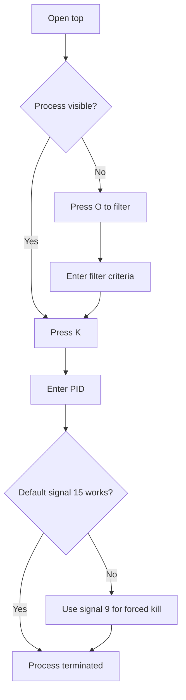

# Section 17: Viewing Processes

<details open>
<summary><b>Section 17: Viewing Processes (KK-CS45-script-v2-Inst-v1)</b></summary>

## Table of Contents
- [17.1 Viewing Processes](#171-viewing-processes)
- [17.2 Ending Processes with Commands](#172-ending-processes-with-commands)
- [17.3 Ending Processes with top](#173-ending-processes-with-top)
- [Summary](#summary)

---

## 17.1 Viewing Processes

### Overview
This module introduces the fundamental concepts of processes in Linux and demonstrates how to view running processes using the `ps` command and the `top` program. Understanding processes is essential as they underlie every program running in a Linux system.

### Key Concepts

#### Understanding Processes
- Processes are the fundamental units that make Linux function
- Every program running in Linux has an underlying process
- Process IDs (PIDs) are unique identifiers assigned to each process
- Process information is critical for system monitoring and troubleshooting

#### Using the `ps` Command

**Basic Usage:**
```bash
# Show current shell and ps processes only
ps

# Display all running processes
ps -e

# Display processes with extended information
ps -ef

# Display processes with user and detailed info
ps -aux
ps -auxc
```

**Important Process Viewing Options:**
| Option | Description | Use Case |
|--------|-------------|----------|
| `-e` | Show all processes | System-wide process overview |
| `-ef` | Extended format with parent PIDs | Detailed process relationships |
| `-aux` | User-oriented format with CPU/MEM | Resource monitoring |
| `-auxc` | Shows actual command names | Identifying true process names |

#### Filtering Process Results

**Using grep with ps:**
```bash
# Filter for specific processes
ps -e | grep firefox

# View all Firefox-related processes
ps -aux | grep firefox
```

**Key Observations:**
- The `-e` option shows the actual underlying process name (e.g., `firefox-esr`)
- Multiple processes may exist for a single application (one per tab/session)
- Primary process ID is typically listed first in `ps -aux` output

#### Using the `top` Program

**Starting top:**
```bash
top
```

**top Interface Components:**
1. **System Summary** (first 5 rows):
   - CPU usage statistics
   - RAM/memory information
   - Task count information

2. **Process List** (below header):
   - Process ID (PID)
   - User ownership
   - CPU percentage
   - Memory percentage
   - COMMAND (process name)

**Filtering in top:**
- Press `O` to add filters
- Example: `COMMAND=firefox` to filter Firefox processes
- Press `=` to remove filters

**Alternative top Programs:**
- `htop` - Enhanced version with better visuals
- `btop` - Modern, colorful alternative
- `bottom` - Rust-based system monitor

### Lab Demonstration: Viewing Processes

1. Open Firefox and navigate to a website
2. Run `ps -e | grep firefox` to find the main process
3. Run `ps -aux | grep firefox` to see all Firefox processes
4. Open `top` and use `O` + `COMMAND=firefox` to filter
5. Open the Files program and filter for `nautilus`

---

## 17.2 Ending Processes with Commands

### Overview
This module covers various command-line methods to terminate processes in Linux, including `kill`, `pkill`, and `killall` commands. These tools are essential for managing unresponsive applications and system performance issues.

### Key Concepts

#### The `kill` Command

**Basic Usage:**
```bash
# View process first
ps -aux | grep calc

# Terminate by process ID
kill 7272
```

**Important Notes:**
- Requires the exact process ID (PID)
- Sends SIGTERM (signal 15) by default for graceful termination
- Can be used with various signal numbers for different termination behaviors

#### The `pkill` Command

**Usage:**
```bash
# Kill by process name (more user-friendly)
pkill "firefox"

# Verify process is terminated
pgrep "firefox"
```

**Advantages:**
- Terminates processes by name instead of PID
- Can use `pgrep` to first verify matching processes
- Handles process name matching automatically

#### The `killall` Command

**Installation (if needed):**
```bash
sudo apt install psmisc
```

**Usage:**
```bash
# Kill all instances of a program
killall gnome-calculator
```

**Use Case:**
- Terminating multiple instances of the same application simultaneously
- Useful for application groups with multiple windows

### Lab Demonstration: Terminating Processes

**Using kill:**
1. Open Calculator program (`gnome-calculator`)
2. Find PID: `ps -aux | grep calc`
3. Terminate: `kill [PID]`

**Using pkill:**
1. Open Firefox browser
2. Verify process: `ps -aux | grep firefox`
3. Terminate: `pkill "firefox"`
4. Confirm: `pgrep "firefox"` (should return nothing)

**Using killall:**
1. Open multiple Calculator windows
2. Terminate all: `killall gnome-calculator`

### Quick Reference: Process Termination Commands

| Command | Method | Best Used For |
|---------|--------|---------------|
| `kill PID` | Terminate by process ID | Precise control over specific processes |
| `pkill name` | Terminate by name | User-friendly termination |
| `killall name` | Terminate all matching names | Multiple instances of same program |

---

## 17.3 Ending Processes with top

### Overview
This module demonstrates how to terminate processes directly from within the `top` program and introduces keyboard shortcuts for process management in the terminal. These skills provide efficient methods for handling unresponsive applications.

### Key Concepts

#### Terminating Processes in top

**Using the K Key:**
1. Open `top`
2. Navigate to problematic process (or use filter)
3. Press `K` to initiate kill
4. Enter the PID to terminate
5. Select signal type:
   - **Signal 15 (SIGTERM)**: Graceful termination (default)
   - **Signal 9 (SIGKILL)**: Immediate/ungraceful termination

**Signal Behavior:**
- Signal 15: Attempts graceful shutdown, may be blocked by other processes
- Signal 9: Forces immediate termination, use with caution

#### top Process Termination Workflow



**Important Safety Notes:**
- top automatically selects the highest CPU process
- Double-check PID before confirming termination
- Avoid terminating critical system processes (e.g., GNOME shell)
- Press `Escape` to cancel kill operation

#### Keyboard Shortcuts for Process Management

**Control + C:**
- Immediately terminates the active foreground process
- Process is removed from memory
- Example: Stop continuous ping

**Control + Z:**
- Stops (pauses) the active process
- Process remains in memory but suspended
- Can be resumed later

**Foreground Command (fg):**
```bash
# Resume a stopped process
fg
```

### Lab Demonstration: Process Termination Methods

**Using top to kill:**
1. Open Firefox browser
2. Start `top` and locate Firefox
3. Press `K`, enter Firefox PID, accept signal 15
4. Verify browser is closed

**Using keyboard shortcuts:**
1. Start continuous ping: `ping example.com`
2. Press `Ctrl+C` to terminate immediately
3. Restart ping
4. Press `Ctrl+Z` to stop process
5. Type `fg` to resume
6. Press `Ctrl+C` to fully terminate

### Common top Keyboard Commands

| Key | Action |
|-----|--------|
| `K` | Kill process |
| `O` | Add filter |
| `=` | Remove filter |
| `Q` | Quit top |
| `Escape` | Cancel current operation/clear filter |

---

## Summary

### Key Takeaways
```diff
+ Processes are fundamental to Linux operation - every program has an underlying process
+ Use ps -e for basic process listing and ps -aux for detailed information
+ Filter results with grep or use top's built-in filtering (O key)
+ Multiple termination methods available: kill (by PID), pkill (by name), killall (multiple instances)
+ top provides interactive monitoring and process termination capabilities
+ Keyboard shortcuts (Ctrl+C, Ctrl+Z) offer quick process control in terminals
+ Always verify process identity before termination to avoid system issues
```

### Quick Reference

**Process Viewing:**
```bash
ps -e                    # All processes
ps -aux                  # Detailed with user info
ps -aux | grep firefox   # Filter results
top                      # Interactive process viewer
```

**Process Termination:**
```bash
kill PID                 # Terminate by ID
pkill "name"             # Terminate by name
killall "name"           # Terminate all instances
```

**top Navigation:**
- `O` - Add filter
- `K` - Kill process
- `=` - Remove filter
- `Q` - Quit

### Expert Insight

**Real-world Application:**
In production environments, these tools are essential for:
- Troubleshooting application hangs and performance issues
- Managing resource-intensive processes that impact system stability
- Automating process management through scripts
- Remote system administration when GUI access is unavailable

**Expert Path:**
- Master signal handling (SIGTERM vs SIGKILL) for proper process cleanup
- Learn to interpret process states and resource usage patterns
- Develop scripts combining these commands for automated monitoring
- Explore advanced tools like `htop`, `glances`, or custom monitoring solutions

**Common Pitfalls:**
- Terminating wrong processes due to similar names
- Using SIGKILL (signal 9) when SIGTERM would suffice
- Not checking for child processes that may need separate termination
- Running commands without proper privileges (sudo)

**Lesser-Known Facts:**
- The `ps` command name comes from "process status"
- Different Linux distributions may show varying levels of detail in `ps` output
- Background processes (daemons) often have names ending in 'd' (e.g., systemd)
- Process IDs are recycled after termination, starting from the lowest available number

</details>