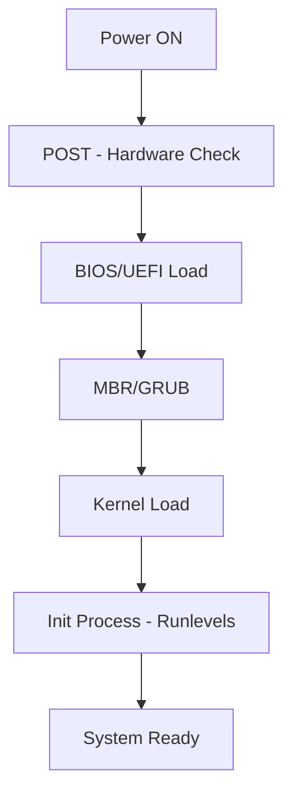

# Section 02: Linux Basics and Installation

<details open>
<summary><b>Section 02: Linux Basics and Installation (CL-KK-Terminal)</b></summary>

## Table of Contents
- [History and Concepts of Unix and Linux](#history-and-concepts-of-unix-and-linux)
- [Linux Distributions and Features](#linux-distributions-and-features)
- [Linux Booting Process](#linux-booting-process)
- [File System Structure in Linux](#file-system-structure-in-linux)
- [Virtualization for Linux Installation](#virtualization-for-linux-installation)
- [Installing Linux in a Virtual Machine](#installing-linux-in-a-virtual-machine)
- [Remote Access and Command Line Interface](#remote-access-and-command-line-interface)
- [Summary](#summary)

## History and Concepts of Unix and Linux

### Overview
This section provides an historical context and foundational concepts of Unix and Linux operating systems, explaining their development, purpose, and key differences. It covers how Unix evolved from academic projects and how Linux emerged as an open-source alternative.

### Key Concepts/Deep Dive
- **Origins of Unix and Linux**: Unix was developed in 1969 by Ken Thompson and Dennis Ritchie at Bell Labs (AT&T). Linux (GNU/Linux) is an open-source alternative built in 1991 by Linus Torvalds as a hobby project, using GNU tools to create a Unix-like system.
- **Differences Between Unix and Linux**: Unix is proprietary, while Linux is open-source (free to modify, distribute under GNU GPL). Linux is Unix-like but not Unix itself. Corrections: "yoonics" → "Unix", "leens" → "Linux".
- **Purpose of Linux**: Designed for versatility across devices (smartphones, servers, embedded systems). Supports multi-user, multi-tasking, hardware independence, and numerous file systems.
- **Kernel Role**: The kernel acts as an intermediary between hardware and software, processing instructions, managing resources (CPU, memory, peripherals), and enabling communication.

### Key Points
- Unix emerged due to limitations in available computer systems for academic work.
- Linux distributions (distros) like Fedora, Ubuntu, CentOS (RHEL-based), and openSUSE maintain code via the Free Software Foundation (FSF) under GNU principles.

## Linux Distributions and Features

### Overview
Exploring various Linux distributions (distros), their maintenance, and core features that make Linux suitable for diverse applications.

### Key Concepts/Deep Dive
- **Major Linux Distributions**: 
  - Fedora and openSUSE (maintained by communities, RHEL/CentOS-based).
  - Ubuntu and Mint (maintained by Canonical and Linux Mint team, Debian-based).
- **Features of Linux**:
  - Secure, stable, hardware-independent.
  - Multi-user, multi-tasking, customizable.
  - Widespread file system support.
  - Versatile for servers, desktops, embedded systems.
- **Application Scenarios**: Used in data centers, gaming consoles, satellites, and even the International Space Station due to reliability.

### Table: Comparison of Key Linux Distributions
| Distribution | Maintainer | Base | Use Case |
|--------------|------------|------|----------|
| Fedora | Red Hat Community | RHEL | Bleeding-edge features, developer-focused |
| Ubuntu | Canonical | Debian | User-friendly, desktop/server balance |
| CentOS/RHEL | Red Hat | RHEL | Enterprise-grade stability |
| openSUSE | Community | Independent | Balanced, SUSE tools |

> [!NOTE]  
> Choose a distro based on your needs—beginners may prefer Ubuntu for ease, while enterprises use RHEL for support.

## Linux Booting Process

### Overview
The Linux booting sequence involves hardware initialization, kernel loading, and system startup, differing slightly from Windows but following a standardized process.

### Key Concepts/Deep Dive
- **Booting Sequence**:
  1. **Power-On Self-Test (POST)**: Hardware self-checks (BIOS/UEFI verifies components).
  2. **BIOS/UEFI**: Initial firmware loads Master Boot Record (MBR) from primary hard disk.
  3. **MBR/GRUB**: Identifies partitions and OS locations. GRUB (GRand Unified Bootloader) replaces older LILO. Loads kernel image.
  4. **Kernel Initialization**: Loads initrd (temporary file system) for drivers, then full kernel. Runs init process for runlevels.
- **Runlevels**: Define system state (e.g., 0: halt, 1: single-user, 3: multi-user console, 5: graphical).
- **Key Components**:
  - CMOS battery: Maintains settings.
  - UEFI: Modern interface (vs. BIOS), supports mouse, advanced settings.

> [!IMPORTANT]  
> Understanding boot sequence aids in troubleshooting startup issues, like corrupted MBR or GRUB errors.

### Mermaid Flowchart: Linux Booting Process


## File System Structure in Linux

### Overview
Linux file system hierarchy standardizes directory organization, unlike Windows' scattered approach. The root (/) directory contains all files, with subdirectories serving specific purposes.

### Key Concepts/Deep Dive
- **Hierarchy Overview**: Starting from root (/), directories include:
  - `/bin`: Essential binaries (commands).
  - `/etc`: System configuration files.
  - `/var`: Variable data (logs, databases).
  - `/usr`: User applications.
  - `/home`: User home directories (e.g., /home/vikas).
  - `/boot`: Boot files.
  - `/swap`: Swap space (RAM extension).
  - `/proc`, `/sys`, `/dev`: Kernel/system info.
- **User Types**: Root user (admin), normal users (/home/%username%), system users.
- **Mounting and Partitions**: Logical Volume Management (LVM) for flexible partitions.

### Quick Directory Reference
- `/tmp`: Temporary files (like RAM swap).
- Permissions: Root controls global access; users have limited permissions.

> [!NOTE]  
> Unlike Windows (program files scattered), Linux keeps everything under root for consistency.

## Virtualization for Linux Installation

### Overview
Virtualization allows running Linux in a virtual machine (VM) on your host OS, enabling safe learning without hardware commitment. Tools like VirtualBox or VMware Workstation are recommended.

### Key Concepts/Deep Dive
- **Why Virtualization?**: Enables multiple OS on one machine, safe testing, resource isolation.
- **Recommended Tools**:
  - **Oracle VirtualBox**: Free, user-friendly for beginners.
  - **VMware Workstation**: Paid, powerful, but VirtualBox suffices for learning.
- **Prerequisites**: VirtualBox downloads from oracle.com; VMware from vmware.com. Enable VT-x/AMD-V in BIOS for virtualization.

### Lab Demo: Installing Virtualization Software
1. Download VirtualBox from [oracle.com/virtualbox](oracle.com/virtualbox).
2. Run installer on Windows/Linux host.
3. Launch VirtualBox; create New VM.
4. Configure VM settings (CPU, RAM—min 1 core, 2GB RAM).
5. Attach ISO for guest OS installation.

> [!WARNING]  
> Ensure host has VT-x enabled; insufficient RAM may cause slowdowns.

## Installing Linux in a Virtual Machine

### Overview
This lab covers step-by-step RHEL (Red Hat Enterprise Linux) installation in a VM using an ISO image.

### Key Concepts/Deep Dive
- **Virtual Machine Creation**:
  - VM Type: Red Hat.
  - Allocate resources: 2 CPUs, 4GB RAM min; 20-30GB HDD.
  - Network: NAT for internet access.
  - Graphics: Enable 3D acceleration if supported.
- **ISO Sources**: Download CentOS/RHEL ISO from centos.org or redhat.com (requires account for RHEL).

### Lab Demo: Full Installation Steps
1. **Create VM**:
   - In VirtualBox: New → Type: Linux → Red Hat.
   - Name: RHEL8, RAM: 4096MB, HDD: 30GB (VDI, dynamically allocated).
   - Storage: Attach ISO to virtual optical drive.
2. **Boot VM**: Power on; select "Install Red Hat Enterprise Linux" (graphical).
3. **Installation Menu**:
   - Language: English (India).
   - Keyboard: Indian English.
   - Timezone: Asia/Kolkata.
   - Software Selection: Server with GUI or Minimal Install.
   - Network: Enable for updates.
   - Security: Default policies.
4. **Root and User Setup**:
   - Root password: Set strong password.
   - User: Create e.g., "vikas" with admin privileges.
5. **Disk Partitioning**:
   - Manual: /boot (1GB, ext4), swap (equal to RAM or 2GB), / (rest, ext4) or Auto-partition.
   - Install: Click "Begin Installation"; wait 30-60 minutes.
6. **Post-Install**: Reboot; login with user credentials.

### Code/Config Blocks
- Check installation version:
  ```bash
  cat /etc/redhat-release
  ```
- Reboot command:
  ```bash
  systemctl reboot
  ```
- Shutdown:
  ```bash
  shutdown -h now
  ```

> [!NOTE]  
> Single-user mode (init 1) for recovery; multi-user (init 3/5) for normal use.

## Remote Access and Command Line Interface

### Overview
Linux's command-line interface (CLI) is powerful for local and remote operations. Use SSH for secure remote access via tools like PuTTY (Windows) or mobile apps.

### Key Concepts/Deep Dive
- **CLI Basics**: Terminal/shell for commands; differs from Windows GUI. Use `ls`, `cd`, `ssh`.
- **User Authentication**: Requires username/password; root is admin.
- **Remote Login**:
  - **SSH**: Secure connection; use `ssh user@IP`.
  - Tools: PuTTY (desktop), Termius or ConnectBot (mobile).

### Lab Demo: Remote SSH Login
1. **Local Setup**:
   - Install SSH server: `sudo yum install openssh-server` (enable/start with systemctl).
   - Get VM IP: `ip addr show` (e.g., 192.168.1.100).
2. **Windows/Desktop SSH**:
   - Use PuTTY: Enter IP, port 22, login as user.
   - Command: `ssh vikas@192.168.1.100`.
3. **Mobile SSH**:
   - Download Termius or JuiceSSH app.
   - Add host: IP, username "vikas", password.
   - Connect; run commands like `ls /home`.

### Code/Config Blocks
- Connect via SSH:
  ```bash
  ssh vikas@192.168.1.100  # Replace with actual IP
  ```
- List home directories:
  ```bash
  ls /home
  ```
- Check Linux version:
  ```bash
  uname -a
  ```

> [!IMPORTANT]  
> Remote access requires network connectivity; firewall may block SSH—use `sudo systemctl stop firewalld` for testing.

## Summary

### Key Takeaways
```diff
+ Linux is a powerful, open-source OS inspired by Unix, widely used for servers, desktops, and embedded systems due to its stability, security, and customization.
! The booting process involves BIOS/UEFI, MBR/GRUB, kernel load, and init for runlevels, enabling recovery modes like single-user.
- Don't ignore file system hierarchy (/bin, /etc, etc.) for proper organization; /root, /home/user, and root directory are distinct.
+ Virtualization (VirtualBox) is essential for safe Linux practice; RHEL installation in VM requires minimal 2 CPUs, 4GB RAM, 30GB disk.
- Avoid proprietary lock-in—choose Linux distros like Ubuntu for beginnners or Fedora for cutting-edge features.
! Corrected transcript errors: "yooniks" → "Unix", "leens" → "Linux", "bereen" → "Red Hat", "veearserl" → "virtually".
```

### Quick Reference
- **Boot Commands**: `init 0` (halt), `init 6` (reboot), `init 3` (multi-user console).
- **SSH Remote Login**: `ssh username@IP_address`.
- **Check IP**: `ip addr show` or `ifconfig`.
- **Install Packages**: `yum install <package>` (Red Hat-based).
- **File System Check**: `ls /` for root directories.

### Expert Insight
**Real-world Application**: In production, Linux handles high-traffic web servers (e.g., Netflix uses Ubuntu), cloud infrastructure, and IoT devices due to low overhead and scalability.  
**Expert Path**: Master CLI with Bash scripting, LVM for storage management, and SELinux for security. Explore Docker for containerization on Linux hosts.  
**Common Pitfalls**: Skipping secure authentication risks breaches; over-allocating VM RAM on low-end hosts causes slowdowns. Always partition manually for control; avoid running as root daily to prevent accidental disasters.

</details>
